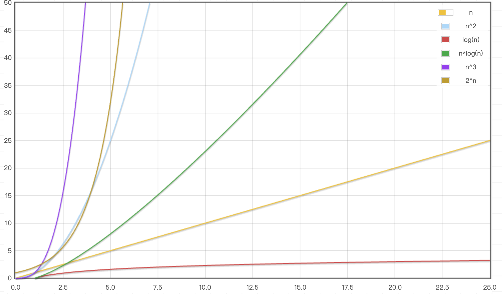
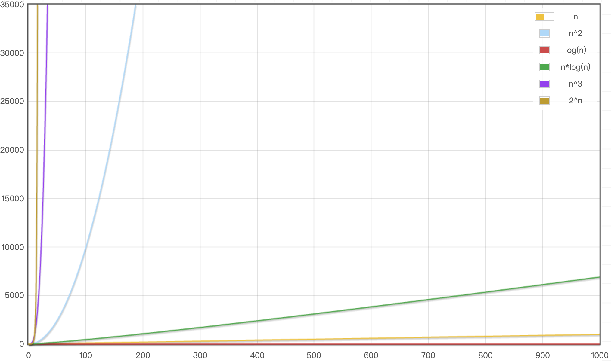

# 算法

## 1.什么是算法

算法（Algorithm）是解决特定问题的一系列步骤或规则的集合。它们通常用于数据处理、计算和自动推理等领域。算法可以用多种方式表示，如伪代码、流程图或编程语言。

比如：下面是一个简单的加法算法，它接受两个输入参数`a`和`b`，并返回它们的和。

```java
public int add(int a, int b) {
    return a + b;
}
```

使用不同算法，解决同一个问题，可能会有不同的效率，比如：求斐波那契数列的第 n 项

```java
// 递归算法
public int fibonacci(int n) {
    if (n <= 1) {
        return n;
    }
    return fibonacci(n - 1) + fibonacci(n - 2);
}

// 迭代算法
public int fibonacci(int n) {
    if (n <= 1) {
        return n;
    }
    int a = 0, b = 1, c;
    for (int i = 2; i <= n; i++) {
        c = a + b;
        a = b;
        b = c;
    }
    return b;
}
```

> 当`n`较大时，递归算法的效率会远低于迭代算法

## 2.算法的衡量标准

首先算法需要保证以下几点：

- 正确性：算法是否能正确解决问题，得到预期的结果
- 可读性：算法是否易于理解和维护
- 健壮性：算法是否能处理异常情况和边界条件

其次，算法的效率也是一个重要的衡量标准，可能会想到这么一种方案：比较不同算法对同一组输入数据的执行时间，执行时间短的算法更好，这种方法称为`实测法`，但是这种方法有几个缺点：

- 计算机的硬件配置不同，执行时间会有差异
- 操作系统和编译器不同，执行时间会有差异
- 程序设计语言不同，执行时间会有差异
- 输入数据的规模和分布不同，执行时间会有差异

有没有一种不依赖于具体计算机环境的衡量标准呢？有的，`时间复杂度`和`空间复杂度`就是两种常用的衡量标准。

- **`时间复杂度（Time Complexity）`**：估算算法的执行时间随着输入规模增长而变化的趋势，它不是精确的时间，而是对算法执行的基本操作次数的估计，通常用`大 O 表示法`表示
- **`空间复杂度（Space Complexity）`**：估算算法在执行过程中所需的内存空间随着输入规模增长而变化的趋势，它包括算法本身占用的空间和运行时所需的额外空间，通常也用`大 O 表示法`表示

### 2.1.大 O 表示法

下面通过几个简单的代码示例，我们通过统计执行语句的次数，来估算时间复杂度。

```java
// 2 + 2 + 3 * 4 = 16
public static void test1(int n) {
    // 1 + 1
    if (n > 10) {
        System.out.println("n > 10");
    } else if (n > 5) {
        System.out.println("n > 5");
    } else {
        System.out.println("n <= 5");
    }

    /*
    int i = 0;           1
    i < 4;               4
    i++;                 4
    System.out.println   4
    i < 4;               1

    总的执行次数为 1 + 4 + 4 + 4 + 1= 2 + 3 * 4
    */
    for (int i = 0; i < 4; i++) {
        System.out.println("test");
    }
}

// 2 + 3n
public static void test2(int n) {
    /*
    int i = 0;           1
    i < n;               n + 1
    i++;                 n
    System.out.println   n

    总的执行次数为 1 + (n + 1) + n + n = 2 + 3n
    */
    for (int i = 0; i < n; i++) {
        System.out.println("test");
    }
}

// 2 + 2n + 3n^2
public static void test3(int n) {
    // 1 + (n + 1) + n + n * (2 + 3n)
    for (int i = 0; i < n; i++) {
        for (int j = 0; j < n; j++) {
            System.out.println("test");
        }
    }
}

// 2 + 3logn
public static void test5(int n) {
    /*
    当 n = 1, 执行流程是
        i = 1
        i < n
    所以总的执行次数为 1 + 1 = 2
    当 n = 2, 执行 
        i = 1

        i < n
        sout
        i = i * 2
        
        i < n
    所以总的执行次数为 1 + (1 + 1 + 1) + 1 = 2 + 3 
    当 n = 4, 执行
        i = 1

        i < n
        sout
        i = i * 2

        i < n
        sout
        i = i * 2

        i < n
    所以总的执行次数为 1 + 3 + 3 + 1 = 2 + 2 * 3 
    当 n = 8, 执行
        i = 1

        i < n
        sout
        i = i * 2

        i < n
        sout
        i = i * 2

        i < n
        sout
        i = i * 2

        i < n
    所以总的执行次数为 1 + 3 + 3 + 3 + 1 =  2 + 3 * 3 
    ...
    当 n = 2^k, 总的执行次数为 2 + 3k = 2 + 3logn
    */
    for (int i = 1; i < n; i = i * 2) {
        System.out.println("test");
    }
}

// 2 + 3log5n
public static void test6(int n) {
    for (int i = 1; i < n; i = i * 5) {
        System.out.println("test");
    }
}
```

大 O 表示法（Big O Notation）是一种用于描述算法复杂度的数学符号。它表示算法在输入规模趋近于无穷大时，执行时间或空间需求的增长率。

> 输入规模通常用`n`表示，代表输入数据的数量或大小。

在大 O 表示法中，我们通常会`忽略常数项、系数、低阶项`，只关注最高阶项，因为它们在输入规模增大时对整体增长率的影响最大。

例如，假设一个算法的时间复杂度可以表示为`3n^3 + 2n^2 + 5n + 7`，其中：

- 常数项：指表达式中的常数部分，如`7`，它们在输入规模增大时对整体增长率影响较小，可以忽略。
- 系数：指表达式中变量前的常数，如`3`、`2`和`5`，它们在输入规模增大时对整体增长率影响较小，也可以忽略。
- 低阶项：指表达式中次于最高阶的项，如`2n^2和`5n`，它们在输入规模增大时对整体增长率影响较小，可以忽略。

那么对于表达式`3n^3 + 2n^2 + 5n + 7`，它的时间复杂度是`O(n^3)`。

> 注意：如果是 log 函数，忽略系数时，底数不同的 log 函数是等价的，比如`O(log2n)`和`O(log10n)`都可以简化为`O(logn)`。

### 2.2.常见的时间复杂度

| 执行次数                  | 复杂度      | 非正式术语 |
|--------------------------|-------------|------------|
| 12                       | O(1)        | 常数阶     |
| 2n + 3                   | O(n)        | 线性阶     |
| 4n² + 2n + 6             | O(n²)       | 平方阶     |
| 4log₂n + 25              | O(logn)     | 对数阶     |
| 3n + 2nlog₃n + 15        | O(nlogn)    | nlogn阶    |
| 4n³ + 3n² + 22n + 100    | O(n³)       | 立方阶     |
| 2ⁿ                       | O(2ⁿ)       | 指数阶     |

- 数据规模较小时
    
    

- 数据规模较大时

    

### 2.3.空间复杂度

在现在的计算机中，内存空间相对来说比较充足，所以空间复杂度通常不是我们关注的重点，但是在某些场景下，空间复杂度也是一个重要的衡量标准，比如：嵌入式系统、移动设备、大数据处理等。

下面通过几个简单的代码示例，来估算空间复杂度。

```java
// O(1)
public static void test1(int n) {
    int a = 10; // 1
    int b = 20; // 1
    int c = a + b; // 1
    System.out.println(c);
}
// O(n)
public static void test2(int n) {
    int[] arr = new int[n]; // n
    int i = 0; // 1
    for (; i < n; i++) {
        arr[i] = i;
    }
    System.out.println(arr);
}
// O(n^2)
public static void test3(int n) {
    int[][] arr = new int[n][n]; // n^2
    int i = 0; // 1
    for (; i < n; i++) {
        int j = 0; // 1
        for (; j < n; j++) {
            arr[i][j] = i + j; 
        }
    }
    System.out.println(arr);
}
```

### 2.4.多个数据规模

当算法中有多个数据规模时，比如下面的代码：

```java
public static void test(int n, m) {
    for (int i = 0; i < n; i++) {
        System.out.println("test");
    }
    for (int j = 0; j < m; j++) {
        System.out.println("test");
    }
}
```

那么它的时间复杂度是`O(n + m)`，空间复杂度是`O(1)`。

## 3.算法的优化方向

- 用尽量少的存储空间
- 用尽量少的执行步骤（时间）
- 根据情况可以以牺牲空间换时间，或者牺牲时间换空间

## 4.常见的递推式与复杂度

| 递推式                         | 复杂度      |
|:------------------------------:|:-----------:|
| `T(n) = T(n/2) + O(1)`         | **O(logn)** |
| `T(n) = T(n - 1) + O(1)`       | **O(n)**    |
| `T(n) = T(n/2) + O(n)`         | **O(n)**    |
| `T(n) = 2 * T(n/2) + O(1)`     | **O(n)**    |
| `T(n) = 2 * T(n/2) + O(n)`     | **O(nlogn)**|
| `T(n) = T(n - 1) + O(n)`       | **O(n²)**   |
| `T(n) = 2 * T(n - 1) + O(1)`   | **O(2ⁿ)**   |
| `T(n) = 2 * T(n - 1) + O(n)`   | **O(2ⁿ)**   | 