# 递归（Recursion）

## 1.概述

递归是用于解决`可以分解为更小的子问题的问题`的一种编程技巧 ，在实际编程中指的是`函数调用自身`，如：

```java
int sum(int n) {
    if (n == 1) {
        return 1; // 基本情况
    }
    return n + sum(n - 1); // 递归调用
}
```

## 2.函数的递归调用过程

```java
public static void main(String[] args) {
    sum(4);
}

private static int sum(int n) {
    if (n <= 1) return n;
    return n + sum(n - 1);
}
```

上面的代码运行时，分配栈空间的流程如下：

::: code-group

```md:img [<1>]
<center>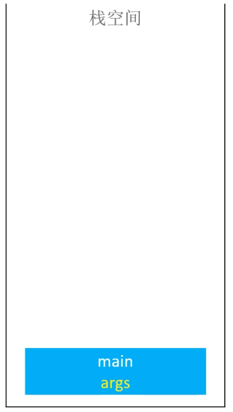</center>
```

```md:img [<2>]
<center>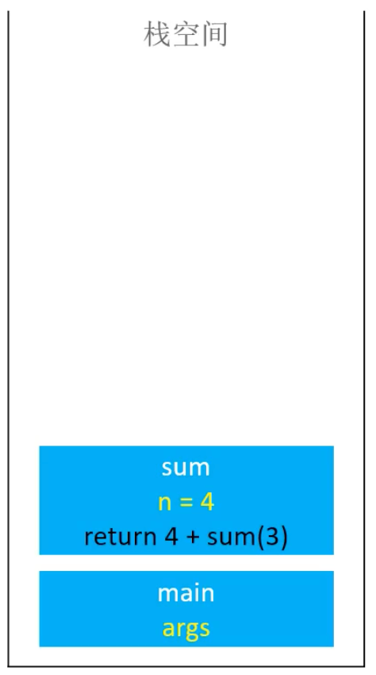</center>
```

```md:img [<3>]
<center>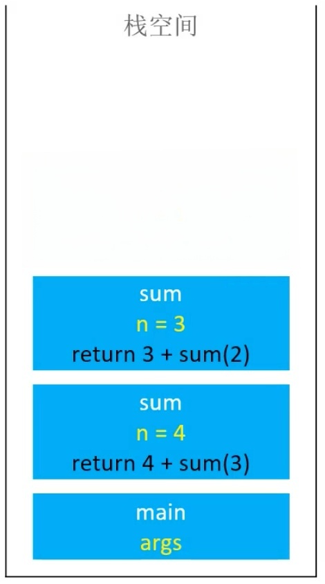</center>
```

```md:img [<4>]
<center>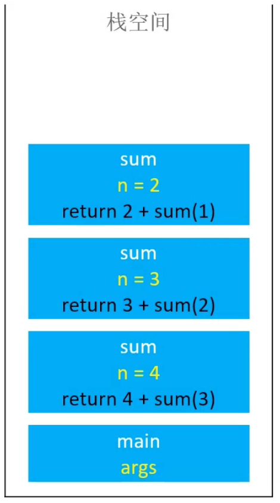</center>
```

```md:img [<5>]
<center>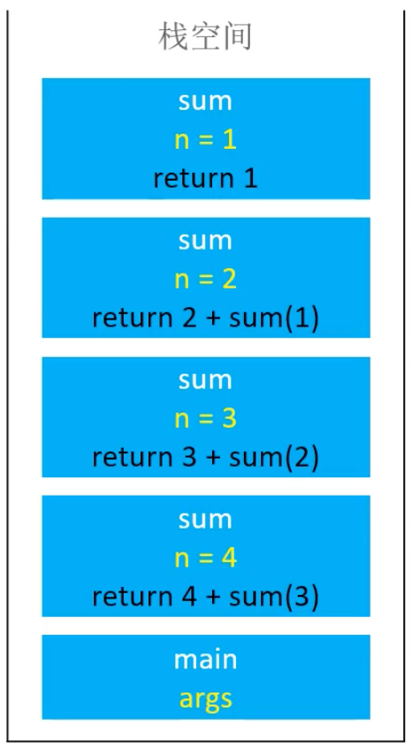</center>
```

```md:img [<6>]
<center></center>
```

```md:img [<7>]
<center></center>
```

```md:img [<8>]
<center></center>
```

```md:img [<9>]
<center></center>
```

```md:img [<10>]
<center></center>
```

:::

如果递归没有终止，将会一直消耗栈空间，从而导致栈溢出（StackOverflowError）。

所以递归必须要有一个明确的`终止条件`（边界条件、递归基）。

## 3.基本思想

1. `拆解问题`
   1. 把规模大的问题，拆解成规模较小的问题。
   2. 规模较小的问题，继续拆解成更小的问题。
   3. 直到问题足够小，可以直接解决。
2. `求解`
   1. 由最小规模问题的解，得出较大规模问题的解。
   2. 由较大规模问题的解，得出更大规模问题的解。

凡是可以利用上述思想解决的问题，都可以使用递归，比如：`链表`、`二叉树`相关的问题都可以使用递归（因为它们本身就是递归的结构）

> 注意：
> 
> 1. 使用递归有时候不是为了更高效，而是为了简化解决问题的思路，代码会更简洁。
>
> 2. 使用递归解决问题很有可能不是最高效的方式，但不是一定的，有些问题使用递归反而是最高效的方式，比如：`快速排序`、`归并排序`等。

## 4.使用套路

1. 明确函数的功能
   
   不要先思考函数里面的代码如何写，而是搞清楚这个函数是干嘛的，能实现什么功能。

2. 明确原问题与子问题的关系
   
   即寻找`f(大n)`与`f(小n)`的关系，`n`表示问题的规模。

3. 明确终止条件
   
   相当于思考：问题规模小到什么程度时，可以直接解决？

## 5.分析

假设递归深度为`d`，每次调用函数时，都会在栈空间中分配`k`大小的空间，消耗`O(n)`的时间复杂度，那么总的时间复杂度为`O(d * n)`，空间复杂度为`O(d * k)`。

## 6.练习

### 6.1.[斐波那契数列](https://leetcode.cn/problems/fei-bo-na-qi-shu-lie-lcof/description/)

斐波那契数 （通常用`F(n)`表示）形成的序列称为斐波那契数列（Fibonacci sequence），该数列由 0 和 1 开始，后面的每一项数字都是前面两项数字的和。也就是：

> F(0) = 0，F(1) = 1
> 
> F(n) = F(n - 1) + F(n - 2)，其中 n > 1

数列示例：`0, 1, 1, 2, 3, 5, 8, 13, 21, 34, ...`

```java
package recursion;

import utils.Times;

/**
 * 求斐波那契数列第 n 项
 * <a href="https://leetcode.cn/problems/fei-bo-na-qi-shu-lie-lcof/description/">...</a>
 *
 * @author yolk
 * @since 2025/10/10 21:05
 */
public class Fibonacci {

    /**
     * 递归实现
     * 时间复杂度：O(2^n)
     * 空间复杂度：O(n)  (递归栈)
     *
     * @param n 斐波那契数列的第 n 项
     * @return 第 n 项的值
     */
    public static int fib1(int n) {
        if (n < 2) {
            // 0 或 1 时，直接返回 n
            return n;
        }
        return fib1(n - 1) + fib1(n - 2);
    }

    /**
     * 优化①：递归实现（避免重复计算）
     * 时间复杂度：O(n)
     * 空间复杂度：O(2n) => O(n)  (递归栈 + 备忘录)
     */
    public static int fib2(int n) {
        return fib2(n, new int[n + 1]);
    }

    public static int fib2(int n, int[] memo) {
        // 如果缓存中有值，直接返回
        if (memo[n] != 0) return memo[n];
        if (n < 2) return n;

        memo[n] = fib2(n - 1, memo) + fib2(n - 2, memo);
        return memo[n];
    }

    /**
     * 优化②：使用循环实现
     * 时间复杂度：O(n)
     * 空间复杂度：O(n)
     */
    public static int fib3(int n) {
        if (n < 2) return n;
        int[] memo = new int[n + 1];
        memo[1] = memo[2] = 1;
        for (int i = 3; i <= n; i++) {
            memo[i] = memo[i - 1] + memo[i - 2];
        }
        return memo[n];
    }

    /**
     * 优化③：使用滚动数组，以节省空间
     * 时间复杂度：O(n)
     * 空间复杂度：O(1)
     */
    public static int fib4(int n) {
        if (n < 2) return n;
        int[] memo = new int[2];
        memo[0] = memo[1] = 1;
        for (int i = 3; i <= n; i++) {
            // `% 2` == `& 1`
            // memo[i % 2] = memo[0] + memo[1];
            memo[i & 1] = memo[0] + memo[1];
        }
        return memo[n & 1];
    }

    /**
     * 优化⑤：斐波那契数列有个线性代数解法：特征方程
     * 时间复杂度 & 空间复杂度：取决于 Math.pow 的实现
     */
    public static int fib5(int n) {
        double c = Math.sqrt(5);
        return (int) ((Math.pow((1 + c) / 2, n) - Math.pow((1 - c) / 2, n)) / c);
    }

    public static void main(String[] args) {
        Times.test("基础版", () -> {
            System.out.println(fib1(40));
        });

        Times.test("递归-避免重复计算", () -> {
            System.out.println(fib2(40));
        });

        Times.test("循环-避免重复计算", () -> {
            System.out.println(fib3(40));
        });

        Times.test("循环-滚动数组", () -> {
            System.out.println(fib4(40));
        });

        Times.test("特征方程", () -> {
            System.out.println(fib5(40));
        });
    }

}
```

> `Times`类来自[工具类](/programming/algorithm/#_5-2-times-java)

### 6.2.[爬楼梯](https://leetcode.cn/problems/climbing-stairs/)

假设你正在爬楼梯。需要 n 阶你才能到达楼顶。

每次你可以爬 1 或 2 个台阶。你有多少种不同的方法可以爬到楼顶呢？

```java
package recursion;

/**
 * 爬楼梯
 * <a href="https://leetcode.cn/problems/climbing-stairs/">...</a>
 *
 * @author yolk
 * @since 2025/10/10 21:51
 */
public class ClimStairs {

    /**
     * 假设你正在爬楼梯。需要 n 阶你才能到达楼顶。
     *
     * @param n 楼梯的总阶数
     * @return 到达楼顶的方法数
     */
    public static int clim(int n) {
        /*
        剩 2 阶时，有 2 种方法：
        1. 一次爬 2 阶
        2. 每次爬 1 阶，共爬 2 次

        剩 1 阶时，有 1 种方法：
        1. 一次爬 1 阶
         */
        if (n <= 2) return n;

        // 总结果 = 爬 1 阶的方法数 + 爬 2 阶的方法数
        return clim(n - 1) + clim(n - 2);
    }

    // 同样可以使用斐波那契数列的各种优化方法

}
```

### 6.3.[汉诺塔](https://leetcode.cn/problems/hanota-lcci/description/)（Hanoi Tower）

在经典汉诺塔问题中，有`3`根柱子及`N`个不同大小的穿孔圆盘，盘子可以滑入任意一根柱子。一开始，所有盘子`自上而下按升序`依次套在第一根柱子上(即每一个盘子只能放在更大的盘子上面)。

<center>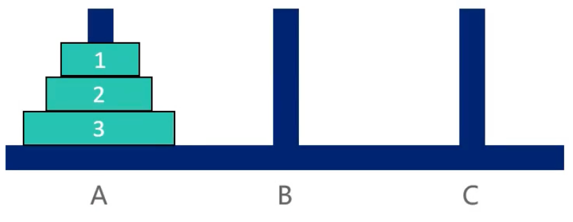</center>

移动圆盘时受到以下限制:

- 每次只能移动一个盘子;
- 盘子只能从柱子顶端滑出移到下一根柱子;
- 盘子只能叠在比它大的盘子上；

请编写程序，将所有盘子从第一根柱子移到最后一根柱子。

#### 拆解问题

- 当`N=1`时，直接将盘子从`A`移动到`C`；
  
  :::code-group
  
  ```md:img [<1>]
  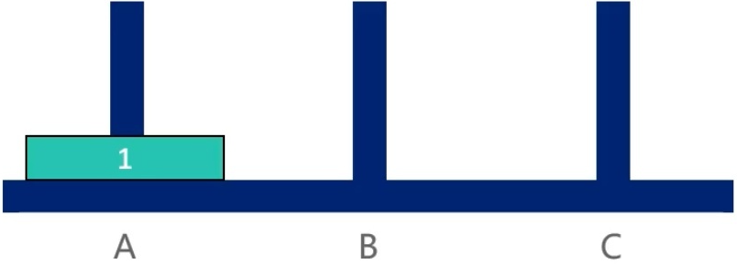
  ```
  
  ```md:img [<2>]
  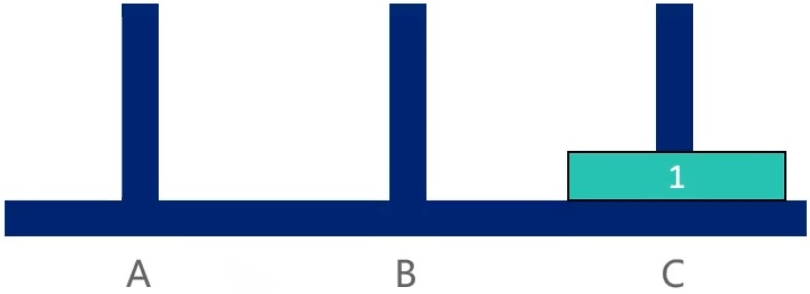
  ```
  
  :::

- 当`N=2`时，先将上面的盘子从`A`移动到`B`，再将下面的盘子从`A`移动到`C`，最后将`B`上的盘子移动到`C`；
  
  :::code-group
  
  ```md:img [<1>]
  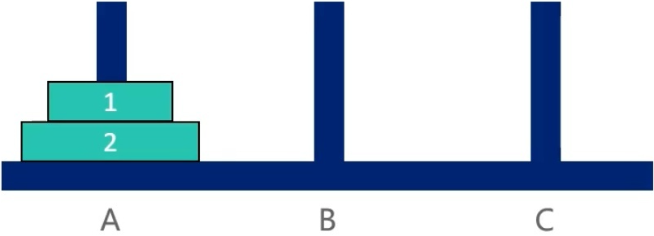
  ```
  
  ```md:img [<2>]
  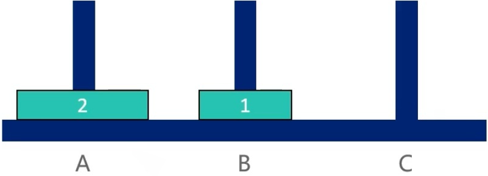
  ```

  ```md:img [<3>]
  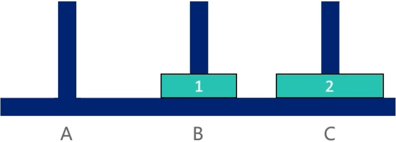
  ```
  
  ```md:img [<4>]
  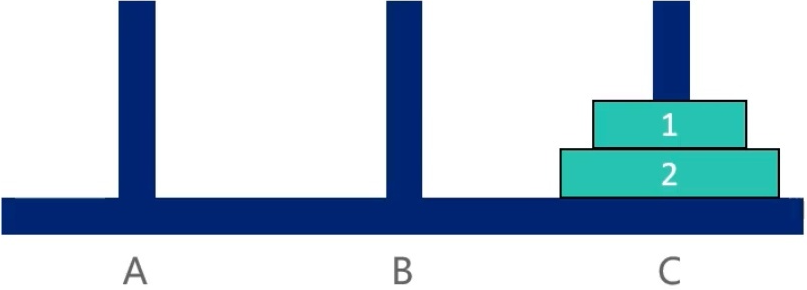
  ```
  
  :::

- 当`N=3`时，先将上面的`2`个盘子从`A`移动到`B`，再将下面的盘子从`A`移动到`C`，最后将`B`上的`2`个盘子移动到`C`；
  
  :::code-group
  
  ```md:img [<1>]
  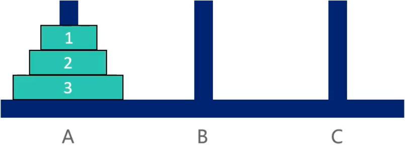
  ```
  
  ```md:img [<2>]
  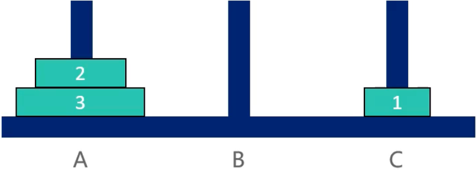
  ```

  ```md:img [<3>]
  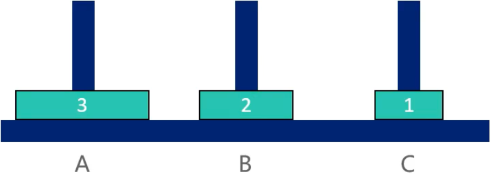
  ```

  ```md:img [<4>]
  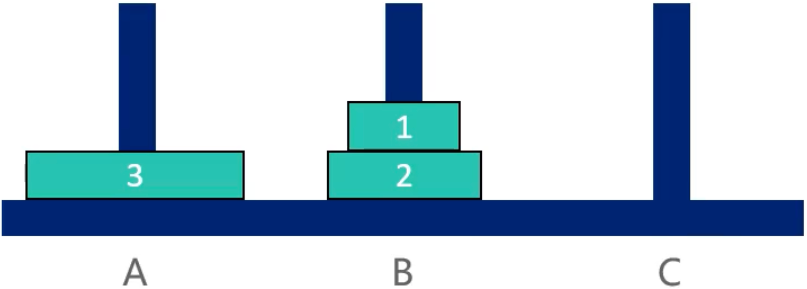
  ```

  ```md:img [<5>]
  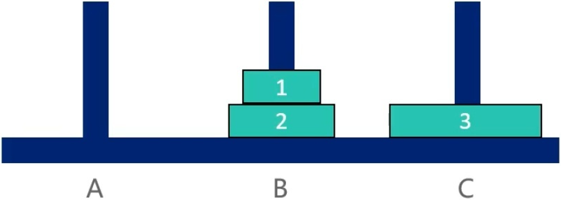
  ```

  ```md:img [<6>]
  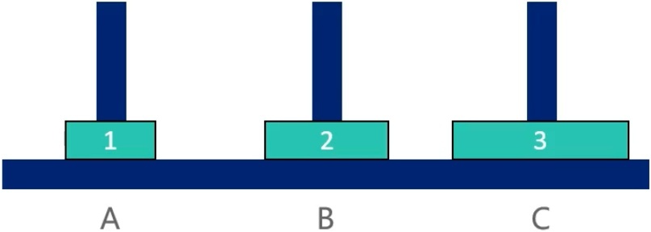
  ```

  ```md:img [<7>]
  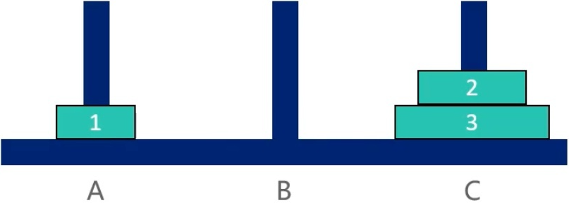
  ```

  ```md:img [<8>]
  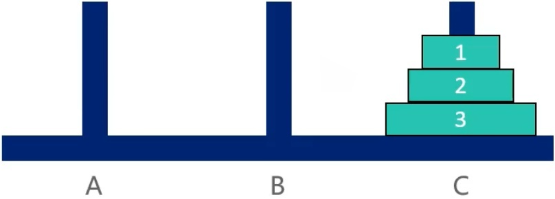
  ```

  :::

#### 思路

分析上面的过程可以发现（`n`为盘子个数）：

- 当`n = 1`时，直接将盘子从`A`移动到`C`
- 当`n > 1`时
  1. 先将上面的前`n-1`个盘子从`A`移动到`B`（借助`C`）
  2. 再将下面的第`n`个盘子从`A`移动到`C`
  3. 最后将`B`上的`n-1`个盘子移动到`C`（借助`A`）
   
   第`1`步和第`3`步明显是个递归调用，只不过是起点、终点和辅助点不同而已。


:::code-group

```md:img [<1>]
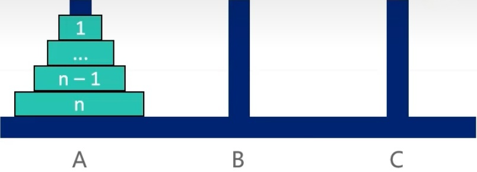
```

```md:img [<2>]
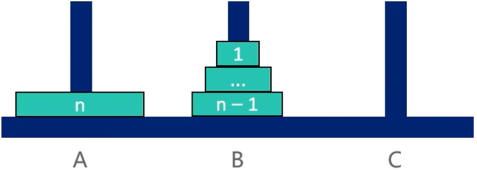
```

```md:img [<3>]
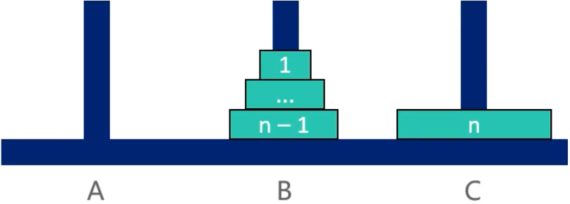
```

```md:img [<4>]
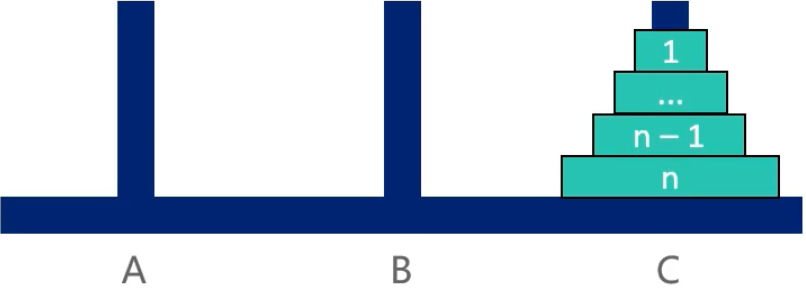
```

:::

#### 代码实现

```java
package recursion;

import java.util.List;

/**
 * 汉诺塔
 * <a href="https://leetcode.cn/problems/hanota-lcci/">...</a>
 *
 * @author yolk
 * @since 2025/10/11 03:20
 */
public class HanoTower {

    /**
     * 将 A 杆上的所有盘子移动到 C 杆上
     * A = [n, n-1, ..., 0] (n 在最底部，0 在最顶部)
     */
    public static void solution(List<Integer> A, List<Integer> B, List<Integer> C) {
        move(A.size(), A, B, C);
    }

    /**
     * 将 source 杆上的 n 个盘子移动到 target 杆上，借助 helper 杆
     *
     * @param n
     * @param source
     * @param helper
     * @param target
     */
    private static void move(int n, List<Integer> source, List<Integer> helper, List<Integer> target) {
        if (n == 1) {
            // 只用移动1个盘子，直接从 source 移动到 target
            target.add(source.remove(source.size() - 1));
            return;
        }
        // 1.先将上面的 n-1 个盘子从 source 移动到 helper，借助 target
        move(n - 1, source, target, helper);
        // 2.将 source 当前最上面的盘子移动到 target（第 n 个）
        target.add(source.remove(source.size() - 1));
        // 3.再将 helper 杆上的 n-1 个盘子移动到 target，借助 source
        move(n - 1, helper, source, target);
    }

    public static void main(String[] args) {
        List<Integer> A = List.of(3, 2, 1);
        List<Integer> B = new java.util.ArrayList<>();
        List<Integer> C = new java.util.ArrayList<>();
        solution(new java.util.ArrayList<>(A), B, C);
        System.out.println("A: " + A);
        System.out.println("B: " + B);
        System.out.println("C: " + C);
    }

}
```

## 7.递归转非递归

有些时候递归会存在大量的重复计算，性能非常差，这时候可以考虑将递归转换成迭代形式（`递归 100% 可以转换成迭代`）。

递归在调用时都会在栈空间中开辟一段空间（`栈帧`），用来存储函数的参数、局部变量、返回地址等信息。

`方法 ①`：可以使用使用数据结构中的[栈](../../data-structure/stack/)来存储这些信息，从而模拟这个过程，从而实现递归到迭代的转换，这是一个万能的方法，但是空间复杂度依然没有得到优化。

`方法 ②`：重复使用一组相同的变量来保存每个栈帧的信息，从而减少空间开销，使用迭代的方式来更新这些变量的值，直到计算出最终结果。

:::code-group

```java [使用递归实现]
/**
 * 打印从 1 + 10, 2 + 10, ..., n + 10 的数字
 */
static void log(int n) {
    if (n < 1) return;
    log(n - 1);
    int v = n + 10;
    System.out.println(v);
}
```

```java [使用栈实现]
/**
 * Frame 模拟栈帧, 保存函数调用时的参数和局部变量
 */
static class Frame {
    int n;
    int v;
    Frame(int n, int v) {
        this.n = n;
        this.v = v;
    }
}

static void log(int n) {
    // 使用栈来模拟递归调用栈
    Stack<Frame> frames = new Stack<>();

    while (n > 0) {
        // 基于 n 的值，创建对应的栈帧并压入栈中
        frames.push(new Frame(n + 10));
        n--;
    }

    while (!frames.isEmpty()) {
        // 弹出栈帧并打印结果
        Frame frame = frames.pop();
        System.out.println(frame.v);
    }
}
```

```java [使用变量实现]
static void log(int n) {
    // 使用相同的变量`i`来保存每个栈帧的信息
    for (int i = 1; i <= n; i++) {
        int v = i + 10;
        System.out.println(v);
    }
}
```

:::

## 8.尾调用（Tail Call）

`尾调用`：指一个函数的`最后一步是调用函数`，如下方代码

```java
// 尾调用
void testA() {
    int a = 10;
    int b = a + 20;

    // 调用函数
    testB(n - 1); 
}

// 不是尾调用
void testB(int n) {
    return n;
}

// 不是尾调用
void testB(int n) {
    return n * test1();
}
```

### 8.1.尾调用优化（Tail Call Optimization）

也称为`尾调用消除`，是编译器或解释器对尾调用进行的一种优化技术，以达到节省栈空间的目的，如下：

:::code-group

```md:img [<1>]
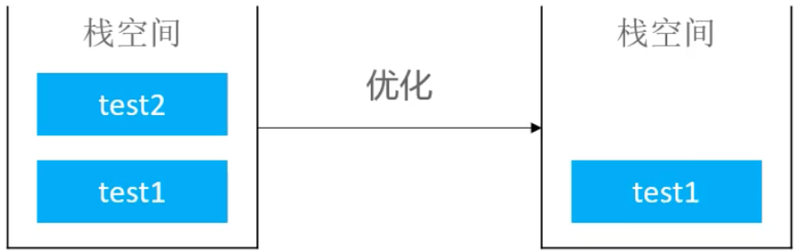
```

```md:img [<2>]
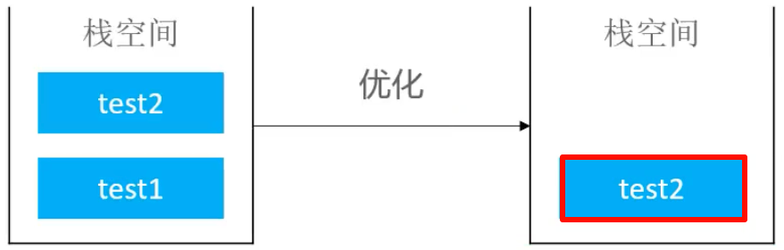
```

:::

#### 无法动态扩展栈空间的编程语言是不支持尾调用优化
   
   假设`test2`需要的空间大于`test1`时，当进行尾调用优化时，让它复用`test1`的栈空间是不够的，这时需要拉大栈空间，如果编程语言不支持，那么就无法进行尾调用优化。

   比如：`Java`、`Python`等语言不支持尾调用优化。

#### 为什么尾调用能进行优化？

因为函数最后一步调用另一个函数时，当前函数的参数、变量等信息已经不再需要，所以分配给它的栈空间没有用了，而最后调用的那个函数马上也要分配栈空间，所以可以直接复用当前函数的栈空间，从而节省栈空间。

### 8.2.尾递归（Tail Recursion）

如果一个函数`在尾调用自身`，那么这个函数就是`尾递归`

```java
// 尾递归
void testB(int n) {
    if (n == 0) return;
    return testB(n - 1);
}
```

消除尾递归中的尾调用比消除一般的尾调用更简单，因为分配的栈大小不变，不需要动态扩展栈空间，所以一般的编程语言都会消除尾递归中的尾调用（即使不支持尾调用消除）。

`平时的递归如果能改成尾递归，就能节省栈空间`，但是递归改成尾递归并不容易，思路是通过`增加参数`、`使用辅助函数`等方式来实现。

#### 示例 1 - 阶乘

求 n 的阶乘`1 * 2 * 3 * ... * n-1 * n，（n > 1）`，代码如下：

```java
int factorial(int n) {
    if (n == 1) return 1;
    return n * factorial(n - 1);
}
```

以上代码的空间复杂度是`O(n)`，因为进行`n`次调用，现在改成`w尾递归`，代码如下：

```java
int factorial(int n) {
    return factorial(n, 1);
}

int factorial(int n, int result) {
    if (n == 1) return result;
    return factorial(n - 1, n * result);
}
```

#### 示例 2 - 斐波那契数列

求斐波那契数列的第 n 项`F(n) = F(n-1) + F(n-2) (n > 1)`，代码如下：

```java
int fib(int n) {
    if (n <= 1) return n;
    return fib(n - 1) + fib(n - 2);
}
```

改成尾递归，代码如下：

```java
static int fib(int n) {
    return fib(n, 0, 1);
}

static int fib(int n, int first, int second) {
    if (n < 1) return first;
    return fib(n - 1, second, first + second);
}
```