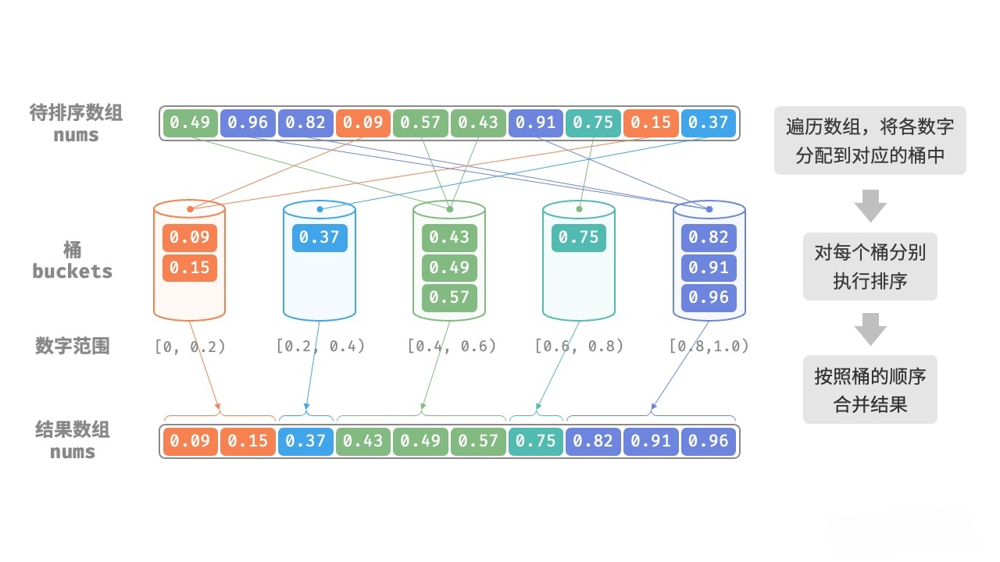

# 桶排序（Bucket Sort）

## 1.流程

1. 创建`k`个桶（数组、链表等数据结构均可），每个桶用于存储一定范围内的元素（这些桶之间是有序的）
2. 按照一定的规则（不同类型的数据，规则不同）将元素均匀分配到各个桶中
   
   均匀分配很重要，它决定了桶排序的效率。如果所有元素都分配到同一个桶中，那么桶排序就退化成了其他排序算法，失去了意义。

3. 分别对每个桶进行单独排序
4. 将所有非空桶中的元素依次合并，得到排好序的数组



上述图片中的规则是以`0.2`为一个区间划分的

## 2.实现

```java
import sort.Sort;

import java.util.Arrays;
import java.util.LinkedList;
import java.util.List;

/**
 * 桶排序
 * 创建 k 个桶，k = array.length / 2，预期每个桶内 2 个元素
 * 假设实现对 Double 类型的数组进行排序，且所有元素的值都在 [0, 1) 之间
 *
 * @author yolk
 * @since 2025/10/10 16:31
 */
public class BucketSort extends Sort<Double> {
    @Override
    protected void sort() {
        /*
        1.创建桶，桶中元素以链表形式存储
        可以利用数据的取值范围是 [0, 1) 这个特点，让每个元素 * k，
        则结果一定是小于 k 的，则可以作为桶的索引
         */
        int k = array.length >> 1;
        @SuppressWarnings("unchecked")
        List<Double>[] buckets = (List<Double>[]) new List[k];


        // 2.将元素放入对应的桶
        for (Double e : array) {
            // 分配桶的规则：元素值 * 桶的数量，向下取整
            int bucketIndex = (int) (e * k);
            // 拿到对应的桶
            List<Double> bucket = buckets[bucketIndex];

            if (bucket == null) {
                // 当前桶为空，则创建一个链表
                bucket = new LinkedList<>();
                buckets[bucketIndex] = bucket;
            }
            bucket.add(e);
        }

        // 用于记录写回原数组的索引
        int index = 0;

        // 3.对每个桶内的元素进行排序
        for (int i = 0; i < buckets.length; i++) {
            if (buckets[i] == null) continue;
            // 这里使用 java 自带的排序方法
            buckets[i].sort(null);

            // 由于每个桶之间是有序的，那么桶内元素排好序后，即可马上写回到原数组中
            for (Double e : buckets[i]) {
                array[index++] = e;
            }
        }

    }

    public static void main(String[] args) {
        Double[] arr = {0.42, 0.32, 0.24, 0.12, 0.54, 0.33, 0.25, 0.11, 0.98, 0.72};
        new BucketSort().sort(arr);
        System.out.println(Arrays.toString(arr));
    }

}
```

## 2.分析

桶排序适用于处理体量很大的数据。例如，输入数据包含 100 万个元素，由于空间限制，系统内存无法一次性加载所有数据。此时，可以将数据分成 1000 个桶，然后分别对每个桶进行排序，最后将结果合并。

桶排序的时间复杂度取决于桶的数量`k`和每个桶内排序算法的时间复杂度`O(f(n))`，因为要将`n`个元素放入到桶内，所以总体时间复杂度为`O(n + k * f(n))`，空间复杂度为`O(n + k)`，是`非 In-place`排序，**是否稳定**取决于桶内排序算法。
