# 计数排序（Counting Sort）

之前学习的排序算法，都是基于比较的排序算法，它们的平均时间复杂度目前最低也只能达到`O(nlogn)`。

计数排序不是比较排序，通过用空间换时间，在某些时候，平均时间复杂度可以比`O(nlogn)`更低。

1954年，`Harold H. Seward`提出了计数排序算法，`适合对一定范围内的整数进行排序`。

## 1.流程

1. 找出数组中的最大值`max`
2. 创建一个长度为`max + 1`的计数数组`counter`
3. 遍历原数组`nums`，将每个元素`nums[i]`出现的次数，存入计数数组`counter`的对应位置`counter[nums[i]]`
4. 遍历计数数组`counter`，将`非 0`位置的索引值`index`放回原数组

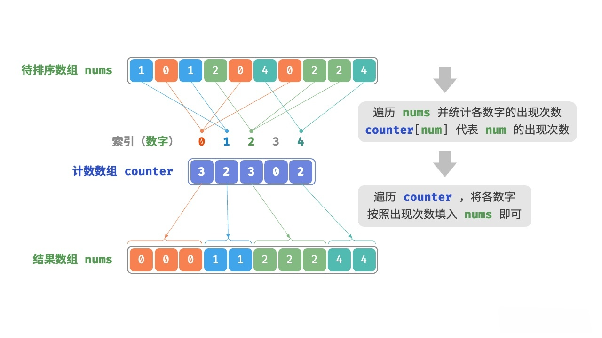

动画演示：

<video src="./imgs/2.mp4" controls="controls" style="max-width:70%;"></video>

## 2.实现

```java
package sort.counting;

import sort.Sort;
import utils.Integers;

/**
 * 计数排序
 * 对整数数组进行排序，所以泛型限定为 Integer
 *
 * @author yolk
 * @since 2025/10/10 01:04
 */
public class CountingSort1 extends Sort<Integer> {

    @Override
    protected void sort() {
        // 找出数组中的最大值
        Integer max = array[0];
        for (int i = 1; i < array.length; i++) {
            if (compare(array[i], max) > 0) {
                max = array[i];
            }
        }

        // 申请一个计数数组，长度 = max + 1
        int[] counter = new int[max + 1];
        // 统计每个整数出现的次数
        for (Integer k : array) {
            counter[k]++;
        }

        // 根据计数数组，依次将整数写回原数组
        int index = 0;
        for (int k = 0; k < counter.length; k++) {
            // if (counter[k] > 0) {
            //     // 如果当前整数 k 在数组中出现过，则写回原数组
            //     array[index++] = i;
            //     // 该整数的计数 -1
            //     counter[k]--;
            //     // 继续写回该整数，直到计数为 0
            //     k--;
            // }

            // 优化上面的代码
            while (counter[k]-- > 0) {
                array[index++] = k;
            }
        }
    }

    public static void main(String[] args) {
        Integer[] arr = Integers.random(10, 1, 10);
        Integers.println(arr);

        new CountingSort1().sort(arr);
        Integers.println(arr);
    }

}
```

## 3.优化

上面的实现中，有`3`个地方可以优化：

1. 无法对负数进行排序
2. 如果`max`很大，而数组长度`n`很小，则会浪费大量空间
3. 计数数组`counter`中，存储的只是每个整数出现的次数，无法实现稳定排序

第`2`点，其实很好解决，通过找出数组中的`最小值 min`，然后创建一个长度为`max - min + 1`的计数数组`counter`，每个整数`k`在计数数组中的位置是`k - min`，这样就能节省空间了。

另外，当解决了第`2`点，那么第`1`点自然也解决了：

1. 假设数组为`[-4, -2, 0, 2, 4, 6, 8]`，则`max = 8，min = -4`，计数数组长度为`8 - (-4) + 1 = 13`
2. 那么整数`-4`在计数数组中的位置是`-4 - (-4) = 0`
3. 依次类推，整数`0`在计数数组中的位置是`0 - (-4) = 4`
4. 整数`8`在计数数组中的位置是`8 - (-4) = 12`

是不是自然就能对负数进行排序了？

### 3.1.解决稳定性

假设数组为：`[7, 3, 5, 8, 6, 7, 4, 5]`，`max = 8, min = 3`，那么构建的`counter`数组为：

<center>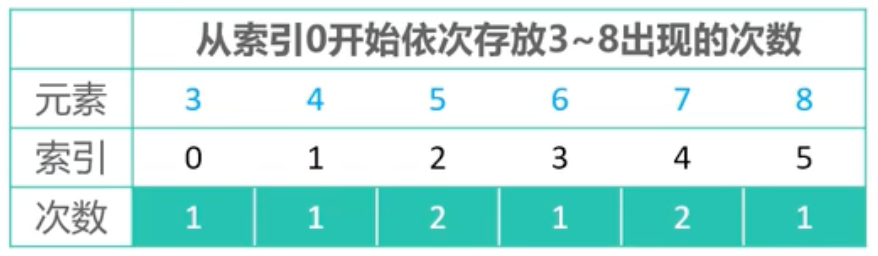</center>

现在，我们将`counter`数组改造一下，假设整数为`k`，则`counter[k - min] = 元素 k 在原数组中出现的次数 + 所有小于 k 的元素出现的次数之和`，那么`counter`数组变为：

<center>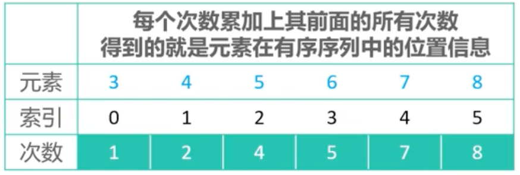</center>

现在，假设`array`中最小值为`min`，则：
  
- `array`中的元素`k`在`counter`数组中的位置是`k - min`
- `array`中元素`k`在排序后的位置是`counter[k - min] - p`，其中`p`表示是倒数的第几个`k`，例如上图中：
  - 元素`8`在排序后的位置是`counter[8 - 3] - 1 = 7`
  - 倒数第 1 个元素`7`在排序后的位置是`counter[7 - 3] - 1 = 6`
  - 倒数第 2 个元素`7`在排序后的位置是`counter[7 - 3] - 2 = 5`

得到公式`counter[k - min] - p`，我们就可以实现稳定排序了，流程如下：

1. 创建一个新的数组`newArray`，用于存储排好序的结果。
2. 原本是遍历`counter`数组，写回到`array`数组中，现在我们改为`倒序遍历 array 数组`
   1. 每遍历到一个元素`k`，则`index = --counter[k - min]`
   2. 将元素`k`放入`newArray[index]`中。

::: code-group

```md:img [<1>]
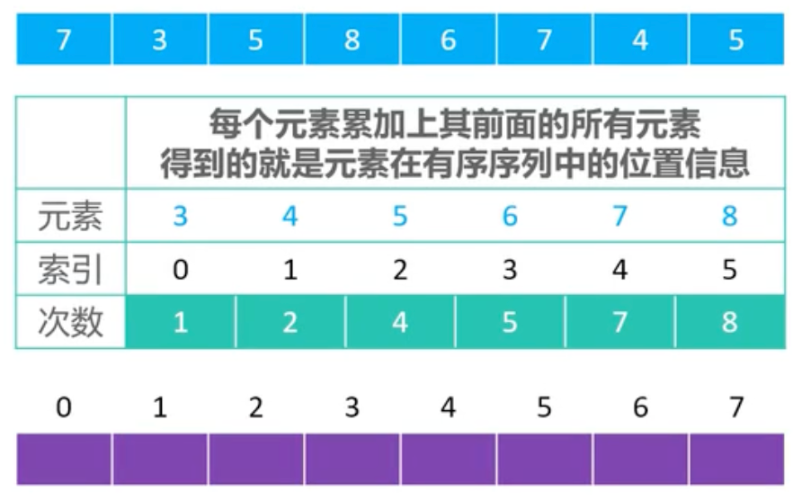
```

```md:img [<2>]
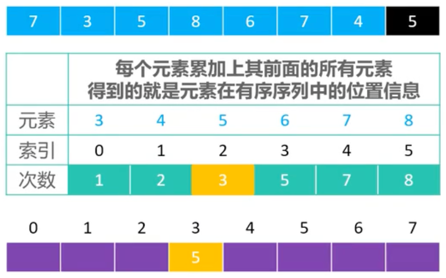
```

```md:img [<3>]
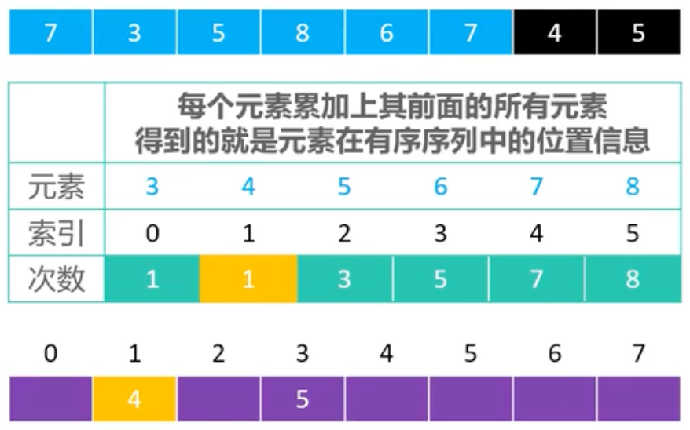
```

```md:img [<4>]
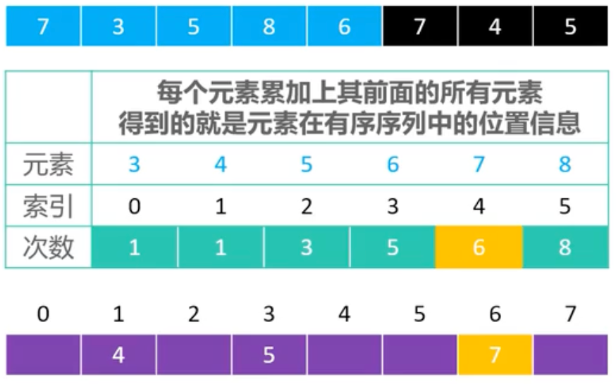
```

```md:img [<5>]
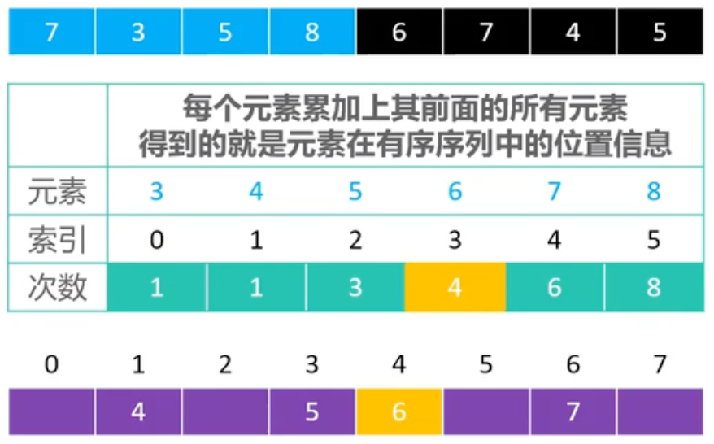
```

```md:img [<6>]
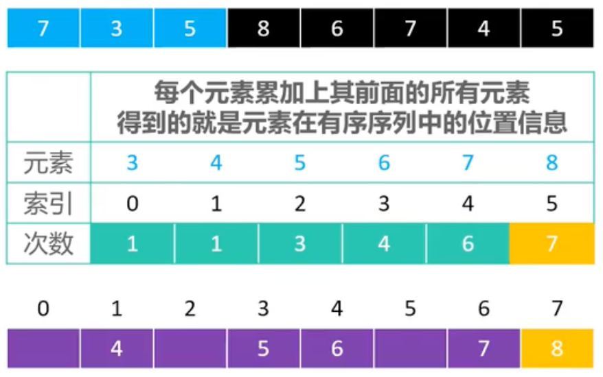
```

```md:img [<7>]
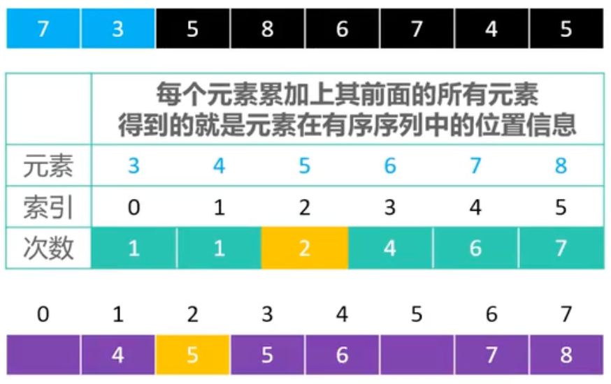
```

```md:img [<8>]
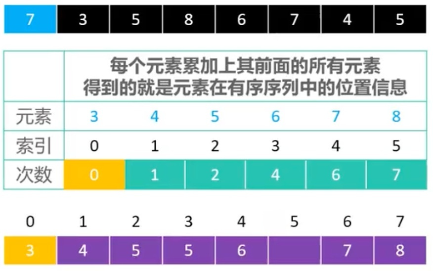
```

```md:img [<9>]
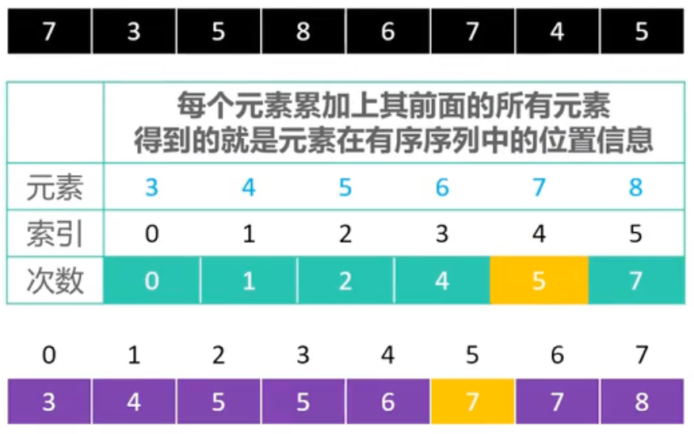
```

:::

> 为什么是倒序遍历`array`数组呢？
> 
> 因为`counter[k - min]`的值越大，`k`在排序后的位置也越靠后，由于不确定`p`的值，只能让`counter[k - min]`的值逐渐递减，从而`k`在排序后的位置逐渐靠前。

### 3.2.完整代码

```java
package sort.counting;

import sort.Sort;
import utils.Integers;

/**
 * 计数排序
 * 优化 3 个问题：
 * 1. 负数问题
 * 2. 范围过大问题
 * 3. 稳定性问题
 *
 * @author yolk
 * @since 2025/10/10 01:56
 */
public class CountingSort2 extends Sort<Integer> {

    @Override
    protected void sort() {
        // 找出数组中的最大值
        Integer max = array[0];
        // 找出数组中的最小值
        Integer min = array[0];
        for (int i = 1; i < array.length; i++) {
            if (compare(array[i], max) > 0) {
                max = array[i];
            }
            if (compare(array[i], min) < 0) {
                min = array[i];
            }
        }

        // 申请一个计数数组，长度 = max - min + 1
        int[] counter = new int[max - min + 1];

        // 统计每个整数出现的次数
        for (Integer k : array) {
            counter[k - min]++;
        }

        // 改变计数数组，令 counter[i] 存储 k 之前的元素个数 + k 自身的个数
        int prevCount = counter[0];
        for (int i = 1; i < counter.length; i++) {
            if (counter[i] == 0) continue;
            counter[i] += prevCount;
            prevCount = counter[i];
        }

        // 申请一个新的数组，存储排序后的结果
        Integer[] newArray = new Integer[array.length];

        // 逆序遍历原数组，将元素放到新数组的正确位置
        for (int i = array.length - 1; i >= 0; i--) {
            // 当前元素
            int k = array[i];

            // 计算 k 在新数组中的索引
            int index = --counter[k - min];

            // 将 k 放到新数组的正确位置
            newArray[index] = k;
        }

        for (int i = 0; i < newArray.length; i++) {
            array[i] = newArray[i];
        }
    }

    public static void main(String[] args) {
        Integer[] arr = Integers.random(10, 1, 10);
        Integers.println(arr);

        new CountingSort2().sort(arr);
        Integers.println(arr);
    }
}
```

## 4.分析

基于优化后的计数排序，它的最好、平均、最坏时间复杂度均为`O(n + k)`，空间复杂度为`O(n + k)`，其中`n`是数组长度，`k`是数组中最大值与最小值的差值，属于`稳定、非 In-place`排序。

> 是否可以实现对自定义对象的排序呢？
>
> 如果可以将自定义对象映射为整数，那么是可以的，例如：`年龄、成绩、工资`等。