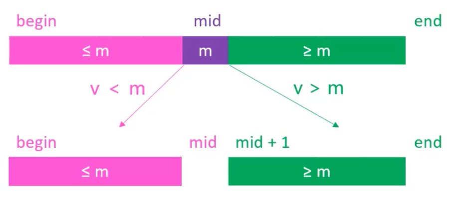

# 插入排序（Insertion Sort）

## 1.流程

插入排序非常类似于打扑克牌时整理手中的牌。开始时，手中只有一张牌，因此它是有序的。接下来，每次从桌面上拿起一张新牌，并将它插入到手中已有牌的正确位置，以保持手中牌的有序状态。这个过程重复进行，直到桌面上的牌全部被拿起并插入到手中。

插入排序在执行过程中，数组被划分为两个部分：左侧是已排序的部分，右侧是未排序的部分。每次从未排序部分取出第一个元素，将其插入到已排序部分的正确位置。

<center></center>

执行流程：

1. 从索引`1`开始，依次取出每个元素，称为**待插入元素**。
   
   `0`索引位置的元素默认在已排序部分。

2. 将**待插入元素**与**已排序**部分的元素进行比较，找到其正确位置。
3. 将已排序部分中大于**待插入元素**的元素依次向右移动一位，为**待插入元素**腾出位置。
4. 将**待插入元素**插入到正确位置。
5. 重复上述步骤，直到所有元素都被插入到已排序部分。

<video src="./imgs/1.mp4" controls></video>

## 2.实现

```java
import sort.Sort;
import utils.Integers;

/**
 * 插入排序
 *
 * @param <E> 元素类型，要求实现 Comparable 接口
 * @author yolk
 * @since 2025/10/7 15:33
 */
public class InsertionSort1<E extends Comparable<E>> extends Sort<E> {

    @Override
    protected void sort() {
        // begin 表示从第 2 个元素开始未排序的部分
        for (int begin = 1; begin < array.length; begin++) {
            // current 记录当前元素的索引位置
            int current = begin;

            /*
            与左边已经排序的部分挨个进行比较，循环条件：
            1. 前一个元素比当前元素大
            2. current > 0，防止越界
            注意:
            1. current> 0 而不是 current>=0，因为 current=0 时，前面没有元素了
            2. current> 0 必须放在前面，否则 compare(current, current - 1) 会越界
             */
            while (current > 0 && compare(current, current - 1) < 0) {
                // 交换位置
                swap(current, current - 1);
                // current 向前移动一位
                current--;
            }
        }
    }

    public static void main(String[] args) {
        Integer[] arr = Integers.random(10, 1, 100);
        Integers.println(arr);

        Sort<Integer> sort = new InsertionSort1<>();
        sort.sort(arr);

        Integers.println(arr);
    }

}
```

## 3.分析

插入排序最好时间复杂度为`O(n)`，最坏和平均时间复杂度为`O(n^2)`。空间复杂度为`O(1)`。插入排序是一种`稳定、In-place`的排序算法。

为什么是稳定的？因为在比较时，只有当前一个元素大于当前元素时才交换位置，相等时不交换，因此相等元素的相对顺序不会改变。

### 3.1.逆序对（Inversion Pair）

假设有一个数组：`[2, 3, 8, 6, 1]`，其中`(3, 1)`、`(8, 6)`、`(8, 1)`、`(6, 1)`是逆序对。逆序对的数量反映了数组的无序程度，逆序对越多，数组越无序，插入排序的交换次数也越多，所以**插入排序的时间复杂度与逆序对的数量成正比**。

最坏情况下，数组是完全逆序的，比如`[5, 4, 3, 2, 1]`，此时逆序对的数量为`n(n-1)/2`，时间复杂度为`O(n^2)`。最好情况下，数组已经是有序的，此时没有逆序对，时间复杂度为`O(n)`。

## 4.优化

### 4.1.优化 ①：将**交换**改为**移动**

将大于**待插入元素**的元素依次向右移动一位，最后将**待插入元素**插入到正确位置。这样可以减少交换操作的次数，提高效率。

```java
import sort.Sort;
import utils.Integers;

/**
 * 插入排序: 交换法
 *
 * @param <E> 元素类型，要求实现 Comparable 接口
 * @author yolk
 * @since 2025/10/7 15:33
 */
public class InsertionSort2<E extends Comparable<E>> extends Sort<E> {

    @Override
    protected void sort() {
        for (int begin = 1; begin < array.length; begin++) {
            // 记录当前元素
            E e = array[begin];

            // current 表示当前元素应该和谁进行比较
            int current = begin - 1;

            /*
            当前元素比 e 大，则继续向左比较
            current >= 0 防止越界
             */
            while (current >= 0 && compare(e, array[current]) < 0) {
                // 交换改为挪动：当前元素向后挪动一位
                array[current + 1] = array[current];
                
                // current 向前移动一位
                current--;
            }

            // e 比 current 大，或者 current 已经越界，那么 current+1 就是 e 应该插入的位置
            array[current + 1] = e;
        }
    }

    public static void main(String[] args) {
        Integer[] arr1 = Integers.random(10000, 1, 10000);
        Integer[] arr2 = Integers.copy(arr1);

        Sort<Integer> sort1 = new InsertionSort1<>();
        sort1.sort(arr1);

        Sort<Integer> sort2 = new InsertionSort2<>();
        sort2.sort(arr2);

        System.out.println(sort1);
        System.out.println(sort2);
    }

}
```

> 注意：`current`变量的含义和`InsertionSort1`中有所不同。
> 
> 在`InsertionSort1`中，`current`记录的是当前元素的索引位置。
> 
> 在`InsertionSort2`中，`current`记录的是当前元素应该和谁进行比较，因此初始值为`begin - 1`。

上述代码执行结果：

```text
【InsertionSort1】
数据规模：1.00万	 耗时：0.1s(100ms) 	比较：2509.97万	 交换：2508.98万
------------------------------------------------------------------
【InsertionSort2】
数据规模：1.00万	 耗时：0.071s(71ms) 	比较：2509.97万	 交换：0
------------------------------------------------------------------
```

### 4.2.二分搜索

如何确定一个整数在数组中的正确位置？
 
- 如果是无序数组，则需要遍历数组，时间复杂度为`O(n)`。
- 如果是有序数组，则可以使用二分搜索（`Binary Search`），**最坏**时间复杂度为`O(logn)`。
  
  - 假设有一个有序数组：`[1, 3, 5, 7, 9]`，要插入元素`6`。
  - 使用二分搜索，首先将数组分为两半，取中间元素`5`，`6`大于`5`，则继续在右半部分`[7, 9]`中搜索。
  - 取中间元素`7`，`6`小于`7`，则继续在左半部分搜索，但左半部分只有一个元素`7`，因此`6`应该插入在`5`和`7`之间。

#### 两者效率的对比如下


#### 公式推导

假设在`[begin, end)`范围内搜索元素`v`，`mid = (begin + end) / 2`是中间位置的索引：

- 如果`v < array[mid]`，则继续在左半部分`[begin, mid)`中搜索。
- 如果`v > array[mid]`，则继续在右半部分`[mid + 1, end)`中搜索。
- 如果`v == array[mid]`，则找到元素，返回`mid`。



#### 代码实现

```java
/**
 * 二分搜索
 *
 * @author yolk
 * @since 2025/10/7 17:18
 */
public class BinarySearch {

    /**
     * 使用二分搜索查找元素 v 在有序数组 array 中的索引
     * 如果没有找到，返回 -1
     *
     * @param array 有序数组
     * @param v     待查找的元素
     * @return 元素 v 在数组中的索引，找不到则返回 -1
     */
    public static int indexOf(int[] array, int v) {
        if (array == null || array.length == 0) {
            // 数组为空，直接返回 -1
            return -1;
        }

        int begin = 0;
        /*
        注意 end = array.length 而不是 array.length - 1，有以下几点好处：
        1. 区间长度（元素数量）容易计算
           如果是 end = array.length，则 length = end - begin;
           如果是 end = array.length - 1，则 length = end - begin + 1
        2. 更新区间逻辑更清晰
           当我们发现目标在左侧时：end = mid;
           如果是 [begin, end]（闭区间），就必须写成：end = mid - 1;
        像需要设置范围的这种场景，最好设置成 [begin, end) 这种左闭右开的区间，更加符合直觉
         */
        int end = array.length;

        while (begin < end) {
            /*
            mid = (begin + end) / 2，是中间位置的索引
            如果元素个数是偶数，则 mid 偏左
            如果元素个数是奇数，则 mid 正中间
             */
            int mid = (begin + end) >> 1;
            if (v < array[mid]) {
                /*
                v 在左边，begin 不变，end 变成 mid
                注意 end = mid 而不是 mid - 1，还是保持左闭右开的区间
                 */
                end = mid;
            } else if (v > array[mid]) {
                // v 在右边，end 不变，begin 变成 mid + 1
                begin = mid + 1;
            } else {
                // v == array[mid]
                return mid;
            }
        }
    }

    public static void main(String[] args) {
        int[] arr = {1, 3, 5, 7, 9, 11, 13, 15, 17, 19};
        System.out.println(indexOf(arr, 7));
        System.out.println(indexOf(arr, 1));
        System.out.println(indexOf(arr, 19));
        System.out.println(indexOf(arr, 8));
        System.out.println(indexOf(arr, 20));
    }

}
```

#### 思考

如果数组中有多个相同元素，`Binary Search`返回的是哪个元素的索引？
> `Binary Search`返回的是任意一个与目标值相等的元素的索引，具体是哪个元素取决于数组的分布和搜索过程中的选择。是**无规律**的。

### 4.3.优化 ②：使用二分搜索

在插入排序中，左边是已排序的部分，可以使用二分搜索来找到**待插入元素**的正确位置，从而减少比较次数。

但是和上文的`Binary Search`不同的是，这里我们需要找到**待插入元素**应该插入的位置，而不是找到一个与其相等的元素。

这里的正确的位置应该是：**第一个大于等于待插入元素的位置**。

#### 公式推导

假设在`[begin, end)`范围内搜索元素`v`，`mid = (begin + end) / 2`是中间位置的索引：

- 如果`v < array[mid]`，则继续在左半部分`[begin, mid)`中搜索。
- 如果`v >= array[mid]`，则继续在右半部分`[mid + 1, end)`中搜索。
- 当`begin == end`时，`begin`就是`v`应该插入的位置。


#### 代码实现

1. 先实现二分搜索，找到**待插入元素**的正确位置
   
    ```java
    /**
     * 使用二分搜索查找元素 v 应该插入的位置
     * 保证有序数组的稳定性：如果有多个相同元素，插入到最后一个相同元素的后面
     *
     * @param array 有序数组
     * @param v     待插入的元素
     * @return 第 1 个比 v 大的元素的索引
     */
    public static int search(int[] array, int v) {
        int begin = 0;
        int end = array.length;

        while (begin < end) {
            int mid = (begin + end) >> 1;

            if (v < array[mid]) {
                // v < mid，继续在左半部分查找
                end = mid;
            } else {
                // v >= mid，继续在右半部分查找
                begin = mid + 1;
            }
        }

        /*
        退出时，begin == end
        begin 会大于 end 吗？
        不会，因为每次缩小范围时，都是将 end 移动到 mid，或者将 begin 移动到 mid+1，向内收缩
         */
        return begin;
    }
    ```

2. 完整实现
   
    ```java
    import sort.Sort;
    import utils.Integers;

    /**
    * 插入排序
    * 优化②：二分搜索
    *
    * @param <E> 元素类型，要求实现 Comparable 接口
    * @author yolk
    * @since 2025/10/7 15:33
    */
    public class InsertionSort3<E extends Comparable<E>> extends Sort<E> {

        @Override
        protected void sort() {
            for (int begin = 1; begin < array.length; begin++) {
                // 记录当前元素
                E e = array[begin];

                // 使用二分搜索，查找 e 应该插入的位置
                int insertIndex = search(begin, e);

                // 将 [insertIndex, begin) 区间的元素都向后移动一位

                // for (int moveIndex = begin - 1; moveIndex >= insertIndex; moveIndex--) {
                //     // 向后移动一位
                //     array[moveIndex +1] = array[moveIndex];
                // }
                for (int i = begin; i > insertIndex; i--) {
                    // 向后移动一位
                    array[i] = array[i - 1];
                }

                // 将 e 插入到正确的位置
                array[insertIndex] = e;
            }
        }

        /**
        * 使用二分搜索查找元素 v 应该插入的位置
        * 保证有序数组的稳定性：如果有多个相同元素，插入到最后一个相同元素的后面
        *
        * @param end 有序数组的结束位置（不包含）
        * @param v   待插入的元素
        * @return 第 1 个比 v 大的元素的索引
        */
        private int search(int end, E v) {
            int begin = 0;
            while (begin < end) {
                int mid = (begin + end) >> 1;
                if (compare(v, array[mid]) < 0) {
                    end = mid;
                } else {
                    begin = mid + 1;
                }
            }
            return begin;
        }


        public static void main(String[] args) {
            // Integer[] arr = Integers.random(10, 1, 100);
            // Integers.println(arr);
            //
            // Sort<Integer> sort = new InsertionSort3<>();
            // sort.sort(arr);
            //
            // Integers.println(arr);

            Integer[] arr1 = Integers.random(10000, 1, 10000);
            Integer[] arr2 = Integers.copy(arr1);

            Sort<Integer> sort1 = new InsertionSort2<>();
            sort1.sort(arr1);

            Sort<Integer> sort2 = new InsertionSort3<>();
            sort2.sort(arr2);

            System.out.println(sort1);
            System.out.println(sort2);
        }

    }
    ```

> 注意：使用了二分搜索后，只是减少了**比较次数**，挪动元素还要花费 O(n) 的时间，所以插入排序的平均时间复杂度依然是`O(n)`。