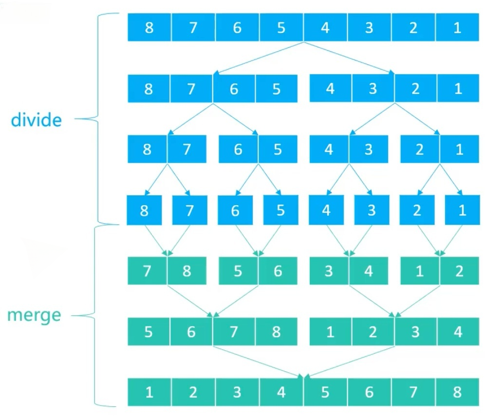
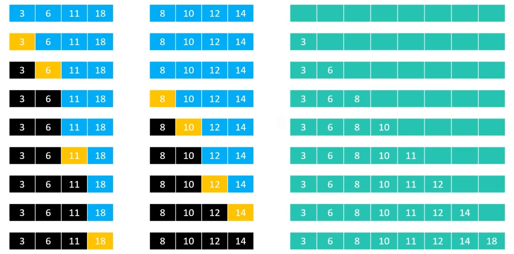
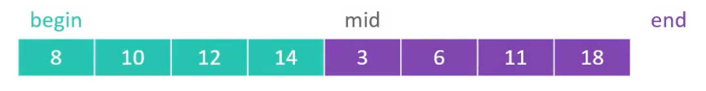
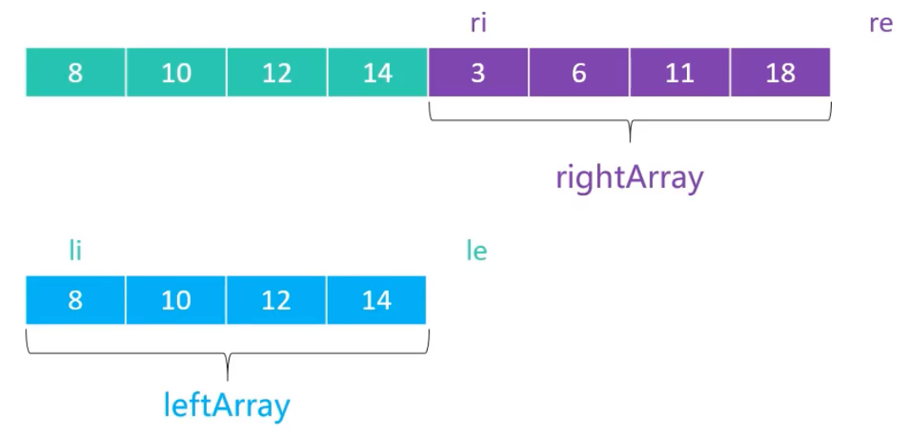
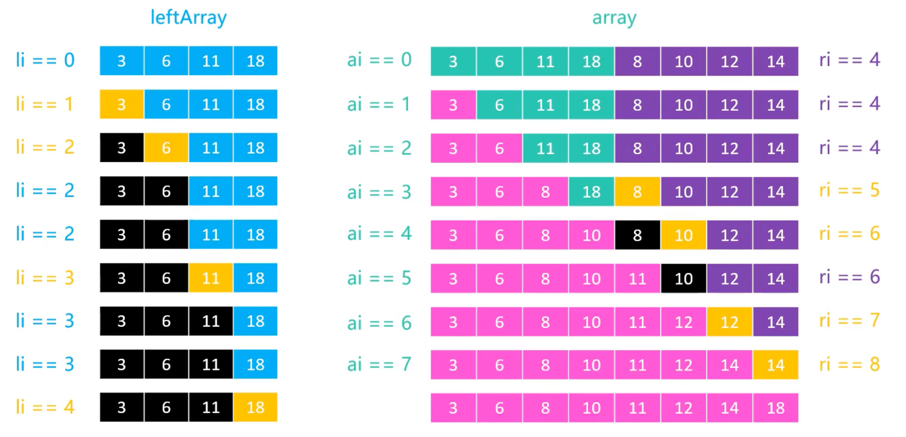
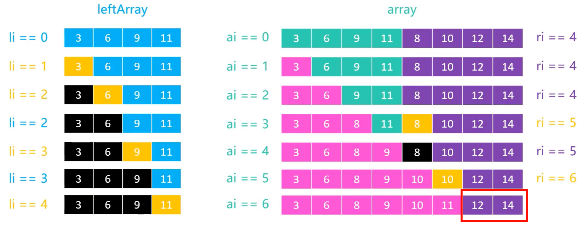
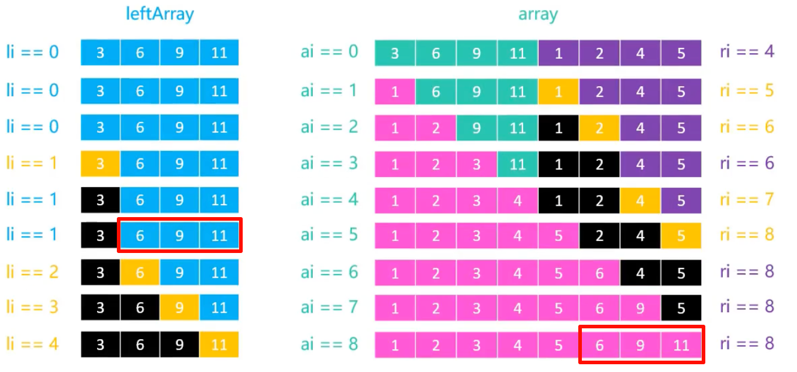

# 归并排序（Merge Sort）

1945 年由`约翰·冯·诺依曼（John von Neumann）`提出的一种基于[分治法](../../divide-conquer/)的排序算法。

## 1.流程

1. 不断的将数组从中间划分成两个子数组
   
   直到不能再划分为止（子数组只剩`1`个元素）

   这个过程称为`Divide`（划分）
   
2. 不断的将两个子数组合并成一个有序的数组
   
   直到合并成一个完整的有序数组

   这个过程称为`Merge、Conquer`（合并）

<center></center>

## 2.实现

### 2.1.Divide 实现

```java
/**
 * 对 [begin, end) 范围进行归并排序
 *
 * @param begin 数组开始位置（包含）
 * @param end   数组结束位置（不包含）
 */
private void sort(int begin, int end) {
    // end - begin 是元素个数，如果元素个数为 1，则不需要排序
    if (end - begin < 2) {
        return;
    }
    // 将 begin 到 end 平分成两部分，mid 是中间位置的索引
    int mid = (begin + end) >> 1;

    // 对左边部分进行排序
    sort(begin, mid);

    // 对右边部分进行排序
    sort(mid, end);

    // 将排好序的两部分进行合并
    merge(begin, mid, end);
}
```

### 2.2.Merge 实现



上图中，`merge`操作看似是两个`独立`的数组合并成一个新的，但实际上这两个数组存在于同一个数组中，并且是挨在一起的。

<center></center>

为了更好的完成`merge`操作，我们需要将其中一个数组的元素`复制`到一个临时数组中。

<center></center>

- `li = begin`，`le = mid - begin`，表示左边数组的范围
- `ri = mid`，`re = end`，表示右边数组的范围

#### 示例

假设要对：`[3, 6, 11, 18, 8, 10, 12, 14]` 进行 merge 操作，`3, 6, 11, 18` 是左边数组，`8, 10, 12, 14` 是右边数组，它们已经是有序的。



#### 两种特殊情况

1. 左边先结束：
   
   

   `已完成合并，直接退出循环`

2. 右边先结束
   
   

    `将左边剩余的元素复制到数组剩余位置中`

### 3.完整代码

```java
package sort.cmparemerge;

import sort.Sort;
import utils.Integers;

/**
 * 归并排序
 *
 * @param <E> 元素类型，要求实现 Comparable 接口
 * @author yolk
 * @since 2025/10/8 12:12
 */
public class MergeSort<E extends Comparable<E>> extends Sort<E> {

    /**
     * 左边的临时数组
     * 在归并排序中，合并两个有序区间时，需要一个临时数组来存储左边的元素
     * 这里为了避免频繁创建和销毁临时数组，我们将其作为成员变量
     * 只在需要时创建，且只创建一次
     * <p>
     * 如果不想使用成员变量，也可以在 `merge` 方法中创建临时数组
     */
    private E[] leftArray;

    @Override
    @SuppressWarnings("unchecked")
    protected void sort() {
        /*
        创建左边的临时数组，大小为 array.length/2
        右边的临时数组不需要创建，因为可以直接在原数组中使用

        这里 new 的是 Comparable[]，而不是 Object[]，是因为使用 Object[] 虽然在编译时不会报错，但是在运行时会报错
        这是因为 Java 的泛型是通过类型擦除实现的，运行时泛型 E 已经被擦除为 Comparable（E extends Comparable<E>）
        那么 leftArray 的实际类型就是 Comparable[]，而不是 Object[]
        leftArray 指向 Comparable[] 是可以的，但是指向 Object[] 就会报错
         */
        this.leftArray = (E[]) new Comparable[array.length >> 1];

        // 对整个数组进行归并排序
        sort(0, array.length);
    }

    /**
     * 对 [begin, end) 范围进行归并排序
     *
     * @param begin 数组开始位置（包含）
     * @param end   数组结束位置（不包含）
     */
    private void sort(int begin, int end) {
        // end - begin 是元素个数，如果元素个数为 1，则不需要排序
        if (end - begin < 2) {
            return;
        }
        // 将 begin 到 end 平分成两部分，mid 是中间位置的索引
        int mid = (begin + end) >> 1;

        // 对左边部分进行排序
        sort(begin, mid);

        // 对右边部分进行排序
        sort(mid, end);

        // 将排好序的两部分进行合并
        merge(begin, mid, end);
    }

    /**
     * 对 [begin, mid) 和 [mid, end) 两个有序区间进行归并
     *
     * @param begin 数组开始位置（包含）
     * @param mid   中间位置 （包含）
     * @param end   数组结束位置（不包含）
     */
    private void merge(int begin, int mid, int end) {
        /*
        li: 左边区间的开始索引
            li = 0, 是因为要将左边区间的元素复制到 leftArray 中，是从 0 开始存储的
        le: 左边区间的结束位置（不包含）
            le = mid - begin, 是因为左边区间的元素个数是 (mid - begin)
         */
        int li = 0, le = mid - begin;

        /*
        ri: 右边区间的开始索引
        re: 右边区间的结束位置（不包含）
         */
        int ri = mid, re = end;

        // ai: 原数组的开始索引
        int ai = begin;

        // 1.将左边区间的元素复制到 leftArray 中
        for (int i = li; i < le; i++) {
            /*
            array[ai + i]，而不是 array[i]
            因为 leftArray 是从 0 开始存储的，而左边区间在 array 中的起始位置是 ai
             */
            leftArray[i] = array[ai + i];
        }

        /*
        2.归并
        循环条件是：li < le，因为如果左边区间的元素全部归并完毕后，右边区间的元素已经有序，直接退出即可
         */
        while (li < le) {
            if (ri >= re || compare(leftArray[li], array[ri]) <= 0) {
                /*
                如果`右边先结束`，则将`左边剩余元素`依次放入原数组
                又或者`左边元素 <= 右边元素`，则也需要将`左边元素`放入原数组
                
                另外这里使用 <=，保证排序的稳定性
                 */
                array[ai++] = leftArray[li++];
            } else {
                // 否则就是 左边元素 > 右边元素，则将`右边元素`放入原数组
                array[ai++] = array[ri++];
            }
        }
    }

    public static void main(String[] args) {
        Integer[] array = Integers.random(10, 1, 100);
        Integers.println(array);

        Sort<Integer> sort = new MergeSort<>();
        sort.sort(array);

        Integers.println(array);
    }

}
```

### 4.分析

假设数组长度为`n`，归并排序所需的时间为`T(n)`，则：

- `T(n) = 2 * T(n/2) + O(n)`
  
  ```java
  /*
  已知归并排序的所需时间为 T(n)
  划分成两个子数组，分别对两个子数组进行归并排序
  那么每个子数组的长度为 n/2
  对每个子数组进行归并排序所需的时间为 T(n/2)
  */
  
  // 对左半部分进行归并排序：T(n/2)
  sort(begin, mid);
  // 对右半部分进行归并排序：T(n/2)
  sort(mid, end);
  
  // 合并需要遍历两个子数组，元素个数为 n，时间复杂度为 O(n)
  merge(begin, mid, end);
  ```

- `T(1) = O(1)`
  
  ```java
  // 如果子数组只有一个元素，则不需要排序，时间复杂度为 O(1)
  if (end - begin < 2) {
      return;
  }
  ```

- `T(n) / n = 2 * T(n/2) / n + O(1)` => `T(n) / n = T(n/2) / (n/2) + O(1)`
- 令 `S(n) = T(n) / n`，则：
  - `S(1) = O(1)`
  - `S(n) = S(n/2) + O(1) = S(n/4) + O(2) = S(n/8) + O(3) = ... = S(n/2^k) + O(k) = S(1) + O(logn) = O(1) + O(logn) = O(logn)`
   
    这里`S(n/2^k) + O(k) = S(1) + O(logn)`是因为`S(x)`中`x`一直在变小，当`x`变到`1`时，`n = 2^k`，所以`k = logn`

- `T(n) = n * S(n) = n * O(logn) = O(nlogn)`
  
所以归并排序的最好、最坏、平均时间复杂度均为`O(nlogn)`，空间复杂度为`O(n/2 + logn) = O(n)`（`n/2`是开辟了新数组，`logn`是因为递归调用），它属于`稳定、In-place`排序。