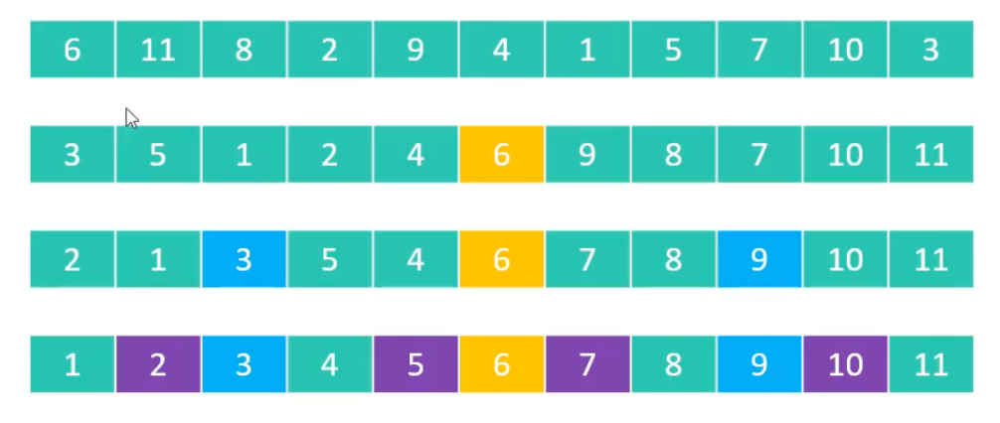
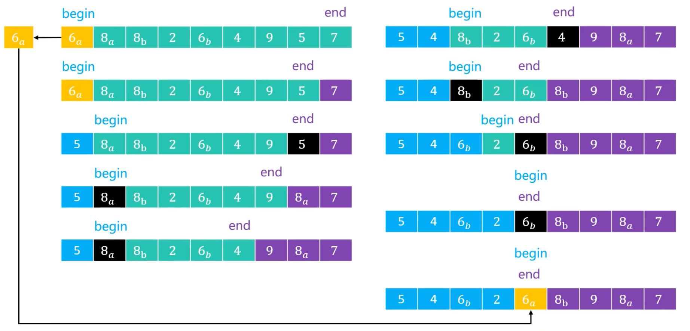
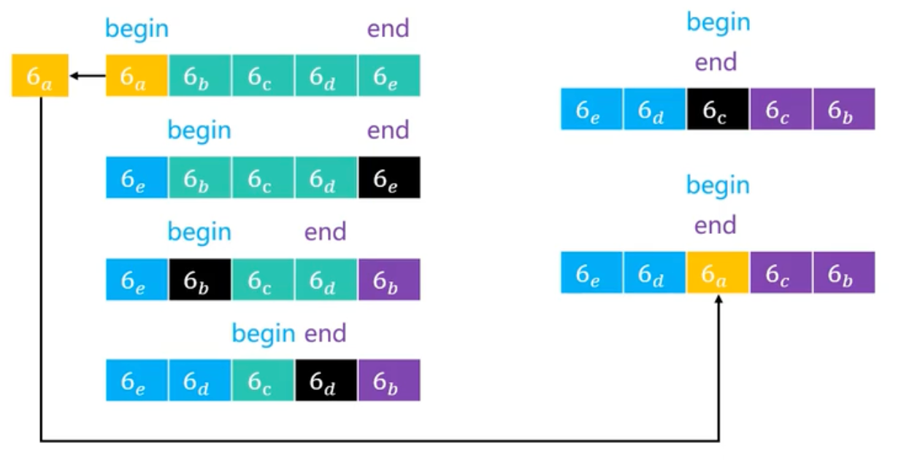
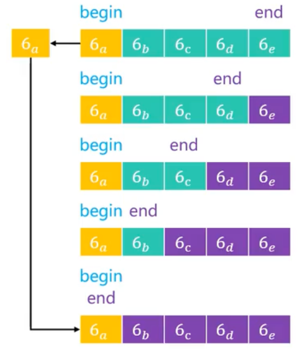

# 快速排序（Quick Sort）

1960 年由`查尔斯·安东尼·理查德·霍尔`（Charles Antony Richard Hoare，昵称为`东尼·霍尔`，Tony Hoare）发明的一种排序算法。也是[分治法](../../divide-conquer/)的典型应用。

## 1.流程

1. 从数组中挑出一个元素，称为“轴点”（pivot）
   
   > 注意：假设每次都选择`第一个`元素作为轴点，也可以选择`最后一个`元素，或者`随机`选择一个元素作为轴点

2. 利用`pivot`将数组分成两部分
   
   - `比 pivot 小`的元素放到 pivot 的`左边`
   - `比 pivot 大`的元素放到 pivot 的`右边`
   - `等于 pivot`的元素可以放在任意一边

3. 对`pivot`左边和右边的两个子数组，重复步骤 1 和 2，直到每个子数组只有一个元素为止



快速排序的本质：`逐渐将每一个元素都转换成 pivot，并将其放到正确的位置上`。

## 2.实现

### 2.1.轴点构造



> 注意：这里 `end` 这里是包含的，不像前面哪些算法那样是`不包含`的。

> 上图中，`6a`和`6b`是相等的，为什么要将`6b`放到左边呢？这样不就丢失了`稳定性`吗？
> 见后文的[解释](./##4.与轴点相等的元素)。
> 
> 注意：快速排序的稳定性不仅仅取决于这一点，比如`8a`和`8b`，它们的位置发生了改变。

```java

### 2.2.完整实现

```java
package sort.quick;

import sort.Sort;
import utils.Integers;

/**
 * 快速排序
 *
 * @author yolk
 * @since 2025/10/9 14:12
 */
public class QuickSort<E extends Comparable<E>> extends Sort<E> {

    @Override
    protected void sort() {
        sort(0, array.length);
    }

    /**
     * 对 [begin, end) 范围进行快速排序
     *
     * @param begin 数组开始位置（包含）
     * @param end   数组结束位置（不包含）
     */
    private void sort(int begin, int end) {
        // 如果区间内只有一个元素，则不需要排序
        if (end - begin < 2) {
            return;
        }

        // 确定轴点位置
        int mid = pivotIndex(begin, end);

        // 基于轴点元素对数组进行分割，并对分割出来的两部分继续进行快速排序
        sort(begin, mid);
        sort(mid + 1, end);
    }

    /**
     * 确定 [begin, end) 范围内轴点元素的正确索引，需要满足：
     * 1. 轴点元素左边的元素都小于等于它
     * 2. 轴点元素右边的元素都大于等于它
     *
     * @param begin 数组开始位置（包含）
     * @param end   数组结束位置（不包含）
     * @return 轴点元素的正确索引
     */
    private int pivotIndex(int begin, int end) {
        /*
        假设以区间内的第一个元素作为轴点元素（此时非正确位置）
        最好的做法是随机选择一个元素作为轴点元素，这样可以避免在某些特殊情况下退化成 O(n^2) 的时间复杂度
        如果想随机选择一个元素作为轴点元素，可以放开`swap`这行代码的注释
         */
        // swap(begin, begin + (int) (Math.random() * (end - begin)));
        E pivot = array[begin];

        // end 需要指向最后一个元素
        end--;

        /*
        记录移动方向
        true：从右向左移动
        false：从左向右移动

        这里默认是从右向左移动，因为轴点元素是第一个元素，且被复制了，所以它的位置可以被覆盖
        可以先从右边开始找比轴点元素小的元素，放到轴点元素的位置
        */
        boolean moveDirection = true;

        // 只有 begin 和 end 指针没有相遇，才需要继续排序
        while (begin < end) {
            if (moveDirection) {
                // 从右向左移动，那么比较 pivot 和 end 位置的元素
                if (compare(pivot, array[end]) < 0) {
                    // 如果 pivot < end 位置的元素，则继续向左移动 end 指针
                    end--;
                } else {
                    // pivot >= end 位置的元素
                    // 将 end 位置的元素移动到 begin 位置
                    array[begin] = array[end];

                    // 改变移动方向，因为 end 位置的元素已经被移动走了，现在它的位置可以被覆盖
                    moveDirection = false;
                    // begin 指针向右移动一位
                    begin++;
                }
            } else {
                // 从左向右移动，那么比较 pivot 和 begin 位置的元素
                if (compare(pivot, array[begin]) > 0) {
                    // 如果 pivot > begin 位置的元素，则继续向右移动 begin 指针
                    begin++;
                } else {
                    // pivot <= begin 位置的元素
                    // 将 begin 位置的元素移动到 end 位置
                    array[end] = array[begin];
                    // 改变移动方向，因为 begin 位置的元素已经被移动走了，现在它的位置是空的
                    moveDirection = true;
                    // end 指针向左移动一位
                    end--;
                }
            }
        }

        // 将轴点元素放到正确的位置
        array[begin] = pivot;
        return begin;
    }

    public static void main(String[] args) {
        Integer[] arr = Integers.random(10, 1, 100);
        Integers.println(arr);

        Sort<Integer> sort = new QuickSort<>();
        sort.sort(arr);
        Integers.println(arr);
    }

}
```

## 3.分析

快速排序是`不稳定、In-place`算法，由于使用递归，所以空间复杂度是`O(logn)`。

它的时间复杂度取决于轴点的选择情况：

- 在轴点左右元素数量比较均匀的情况下，同时也是最好情况。

    ```java
    // T(n) = 2 * T(n/2) + O(n)
    private void sort(int begin, int end) {
        if (end - begin < 2) {
            return;
        }
        
        // O(n)
        int mid = pivotIndex(begin, end);

        // T(n/2)
        sort(begin, mid);
        // T(n/2)
        sort(mid + 1, end);
    }
    ```

    在[归并排序](../merge/#_4-分析)中推导过`T(n) = 2 * T(n/2) + O(n)`的递推式，所以快速排序的最好、平均时间复杂度也是`O(nlogn)`。

- 如果轴点左右元素数量极不均匀，比如每次都选择了`最大`或`最小`的元素作为轴点，那么时间复杂度退化为`O(n²)`。
  
  `T(n) = T(n - 1) + O(n) = T(n - 2) + O(n - 1) + O(n) = ... = O(1) + O(2) + ... + O(n - 1) + O(n) = O(n²)`

所以为了避免最坏情况的发生，通常会对轴点的选择进行优化，比如：随机选择轴点、三数取中法等。

### 3.1.随机选择轴点

只需要在`pivotIndex`方法最前面增加一行代码

```java
private int pivotIndex(int begin, int end) {
    // 随机选择一个元素，并将其与第一个元素交换
    swap(begin, begin + (int) (Math.random() * (end - begin)));
    
    // 原本的代码...
    ...
}
```

为什么这样可以避免最坏情况的发生呢？

因为每次选择轴点都是随机的，所以极端情况（数组已经有序或逆序，我们又选择第一个或者最后一个元素作为轴点）发生的概率非常低，从而大大降低了时间复杂度退化为`O(n²)`的可能性。

### 3.2.与轴点相等的元素

在上面的实现中，与`轴点`相等的元素会基于`移动方向`被分到`左边`或者`右边`，是不确定的，那么它的稳定性就被破坏了。



如果序列中的所有元素都相等，利用目前的算法实现，轴点元素可以将序列分割成 2 个均匀的子序列，避免了最坏情况的发生。

思考：如果将`compare`位置的判断分别改为`<=`和`>=`，那么会怎么样呢？

```java
if (moveDirection) {
    // `<0` => `<=0`
    if (compare(pivot, array[end]) <= 0) {
        end--;
    } else {
        array[begin] = array[end];
        moveDirection = false;
        begin++;
    }
} else {
    // `>0` => `>=0`
    if (compare(pivot, array[begin]) >= 0) {
        begin++;
    } else {
        array[end] = array[begin];
        moveDirection = true;
        end--;
    }
}
```

<center></center>
