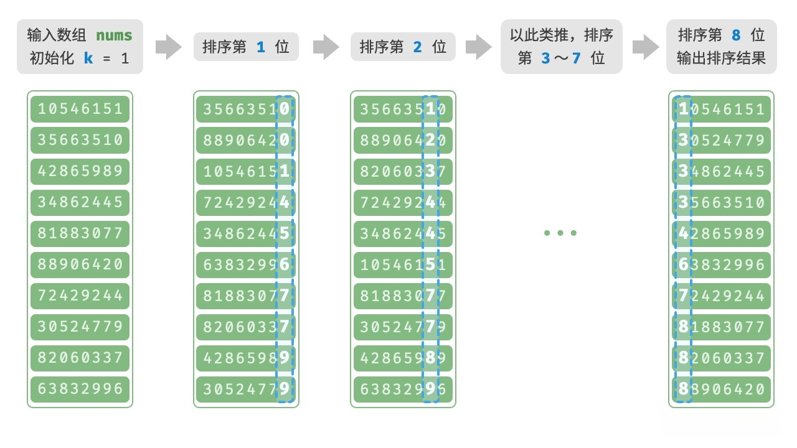

# 基数排序（Radix Sort）

基数排序也是一种非比较排序算法，非常适用于对整数进行排序（尤其是非负整数或者是大范围的整数），下文只介绍对非负整数的基数排序。

## 1.流程

1. 对每个元素依次按位进行排序，从最低位（个位）开始，到最高位结束
2. 由于每个位的取值范围是`0-9`，所以可以使用`计数排序`对每个位进行排序。

<!-- <video src="./imgs/1.mp4" controls></video> -->



> 能否先按最高位排序，再按次高位排序，依次类推？
>
> 不能，比较大的元素的最低位可能比小的元素小，这样排序结果就不正确了。比如两个数`120`和`29`，如果先按最高位排序，`30`会排在`129`前面，但是到最低位时，`120`的最低位`0`比`29`的最低位`9`小，那么`120`就会排到`29`前面，结果就错了。

## 2.实现

```java
package sort.radix;

import sort.Sort;
import utils.Integers;

/**
 * 基数排序
 * 对整数数组进行排序，所以泛型限定为 Integer
 *
 * @author yolk
 * @since 2025/10/10 04:05
 */
public class RadixSort extends Sort<Integer> {

    @Override
    protected void sort() {
        // 找出数组中的最大值
        Integer max = array[0];
        for (int i = 1; i < array.length; i++) {
            if (compare(array[i], max) > 0) {
                max = array[i];
            }
        }

        /*
        divider 表示当前是基于哪一位进行排序
        它的初始值是 1，每次乘以 10，直到 divider > max
        例如，max = 1234
        divider = 1，表示基于个位进行排序
        divider = 10，表示基于十位进行排序
        divider = 100，表示基于百位进行排序
        divider = 1000，表示基于千位进行排序
        divider = 10000，循环结束
         */
        for (int divider = 1; divider < max; divider *= 10) {
            countingSort(divider);
        }
    }

    /**
     * 拷贝计数排序，要实现对所有元素基于某一位数进行排序，那么计数排序的范围就是 0 ~ 9
     * 且需要一个 divider 来表示当前是基于哪一位进行排序
     * 如果 divider = 1，表示基于个位进行排序
     * 如果 divider = 10，表示基于十位进行排序
     * 如果 divider = 100，表示基于百位进行排序
     * 获取元素 k 的某一位的值，可以使用 (k / divider) % 10
     *
     * @param divider 除数，表示当前是基于哪一位进行排序
     */
    private void countingSort(int divider) {
        // 改造1：计数数组的长度是 10
        int[] counter = new int[10];
        for (Integer k : array) {
            // 改造2：统计每个整数出现的次数，基于某一位进行统计
            counter[k / divider % 10]++;
        }
        int prevCount = counter[0];
        for (int i = 1; i < counter.length; i++) {
            if (counter[i] == 0) continue;
            counter[i] += prevCount;
            prevCount = counter[i];
        }
        Integer[] newArray = new Integer[array.length];
        for (int i = array.length - 1; i >= 0; i--) {
            int k = array[i];
            // 改造3：计算 k 在新数组中的索引，基于某一位进行计算
            int index = --counter[k / divider % 10];
            newArray[index] = k;
        }

        for (int i = 0; i < newArray.length; i++) {
            array[i] = newArray[i];
        }
    }

    public static void main(String[] args) {
        Integer[] arr = Integers.random(10, 1, 100000);
        Integers.println(arr);

        new RadixSort().sort(arr);
        Integers.println(arr);
    }
}
```

## 3.分析

计数排序的最好、最坏、平均时间复杂度都是`O(d * (n + k))`，空间复杂度是`O(n + k)`，其中`d`是最大值的位数，`n`是数组长度，`k`是进制，属于`稳定、非 In-place`排序。

## 4.另一种思路（仅了解）

定义一个数组`buckets[10]`，表示`0-9`这`10`个桶，每个桶是一个链表，相同的位数的元素放在同一个桶中，如果桶中已经有元素，则将其插入到链表的尾部，进行排序时，遍历`buckets`数组，将桶中的元素依次放回原数组中。

<video src="./imgs/2.mp4" controls></video>

那么上述思路的空间复杂度是`O(n + k)`，其中`n`是数组长度，`k`是进制，时间复杂度是`O(d * n)`，其中`d`是最大值的位数。