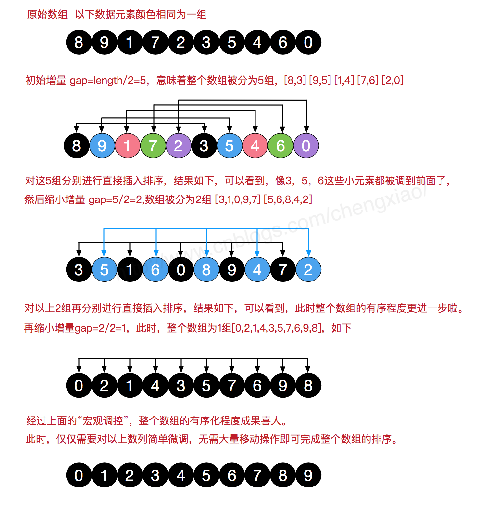

# 希尔排序（Shell Sort）

1959年由`唐纳德·希尔（Donald Shell）`提出，是插入排序的一种更高效的改进版本，先`大步`粗略调整，再`小步`精细调整。

## 1.流程

1. 将数组分成`gap`个子序列，子序列中的元素间隔为`gap`，对每个子序列进行插入排序
   
   如数组：`[8, 9, 1, 7, 2, 3, 5, 4, 6, 0]`，假设`gap=5`，则分成的子序列为：
    - `[8, 3]`（索引：`0, 5`）
    - `[9, 5]`（索引：`1, 6`）
    - `[1, 4]`（索引：`2, 7`）
    - `[7, 6]`（索引：`3, 8`）
    - `[2, 0]`（索引：`4, 9`）
  
   > 注意：示例的每个子序列元素个数相等，但实际不一定相等，取决于数组长度和`gap`的取值。

2. 缩小`gap`，重复步骤`1`
3. 当`gap`为`1`时，整个数组被分成一个子序列，进行最后一次插入排序，排序完成

> 为什么要使用插入排序？
>
> 因为希尔排序在每次缩小`gap`时，数组逐渐变得有序，[逆序对](../insertion/#_3-1-逆序对-inversion-pair)在减少，插入排序在这种情况下效率很高。

演示：



## 2.gap 取值

假设`n`是数组长度，`gap`的取值有很多种方式（为了更好理解，下文将`gap`从小到小的顺序列出，本应该是从大到小），如下：

- `Shell 原始序列`
  
  `gap = 1, 2, 4, 8, ..., n/2`
  
  由希尔本人提出，每次缩小一半，这种方式简单，但是时间复杂度为`O(n²)`，并不是很理想。

- `Hibbard 序列`
  
  `gap = 1, 3, 7, 15, ..., 2^k - 1`
  
  由`Hibbard`在1963年提出，每次缩小一半再减一，时间复杂度为`O(n^(3/2))`。

- `Knuth 序列`
  
  `gap = 1, 4, 13, 40, ..., (3^k - 1) / 2`
  
  由`Donald Knuth`在 1973 年提出，时间复杂度为`O(n^(3/2))`。

- `Sedgewick 序列`
  
  `gap = 1, 5, 19, 41, 109, ..., 4^k + 3*2^(k-1) + 1`或者`gap = 1, 8, 23, 77, 281, ..., 9*4^(k-1) - 9*2^(k-1) + 1`
  
  由`Robert Sedgewick`在 1986 年提出，时间复杂度为`O(n^(4/3))`。
  这是目前已知的、在中等大小的 n 下表现最好的序列之一。

- ....

所以希尔排序的时间复杂度并不是一个确定的值，它取决于`gap`的取值方式，科学家们至今还在研究更优的`gap`序列。

## 3.代码实现

```java
package sort.shell;

import sort.Sort;
import utils.Integers;

import java.util.ArrayList;
import java.util.List;

/**
 * 希尔排序
 *
 * @author yolk
 * @since 2025/10/9 22:32
 */
public class ShellSort<E extends Comparable<E>> extends Sort<E> {
    @Override
    protected void sort() {
        // 使用希尔原始序列
        List<Integer> gaps = shellGaps(array.length);
        // 基于不断缩小的 gap，对数组进行多次插入排序
        for (Integer gap : gaps) {
            sort(gap);
        }
    }

    /**
     * 将数组分成 gap 个子序列，并进行插入排序
     *
     * @param gap 步长
     */
    private void sort(int gap) {
        for (int i = 0; i < gap; i++) {
            /*
            对第 i 个子序列进行插入排序，为了降低复杂度，这里选择简单的 InsertionSort1 的实现
            for (int begin = 1; begin < array.length; begin++) {
                int current = begin;
                while (current > 0 && compare(current, current - 1) < 0) {
                    swap(current, current - 1);
                    current--;
                }
            }
            上面的插入排序是对 [0, array.length) 范围的元素进行排序
            现在我们要对第 i 个子序列进行排序，第 i 个子序列中的元素索引分别是：
            i, i + gap, i + gap + gap, i + gap + gap + gap, ...
            直到 i + n * gap >= array.length

            那么我们需要对上面的插入排序进行修改：
            1.begin = 1 改成 begin = i + gap，即第 i 个子序列的第二个元素
            2.begin 每次增加 gap，而不是 1
            3.前一个元素的索引 = 当前元素的索引 - gap
            4.交换的循环条件中： current > 0 应该改成 current > i
            5.current 每次向前移动 gap，而不是 1
             */
            for (int begin = i + gap; begin < array.length; begin += gap) {
                int current = begin;
                // 前一个元素的索引
                int prevIndex = current - gap;
                while (current > i && compare(current, prevIndex) < 0) {
                    swap(current, prevIndex);
                    current -= gap;
                }
            }
        }
    }

    /**
     * 希尔原始序列
     *
     * @param length 数组长度
     * @return 步长序列（递减）
     */
    private List<Integer> shellGaps(int length) {
        List<Integer> gaps = new ArrayList<>();
        while (length > 1) {
            // 每次缩减一半
            length >>= 1;
            gaps.add(length);
        }
        return gaps;
    }

    public static void main(String[] args) {
        Integer[] arr = Integers.random(10, 1, 100);
        Integers.println(arr);

        Sort<Integer> sort = new ShellSort<>();
        sort.sort(arr);
        Integers.println(arr);
    }
}
```

## 4.分析

希尔排序：最好时间复杂度`O(nlogn)`，最坏时间复杂度`O(n^(4/3)) ~ O(n²)`，平均时间复杂度取决于`gap`的取值，空间复杂度`O(1)`，属于`不稳定、In-place`排序。

为什么是不稳定排序？

例如数组`[4₁, 3, 4₂, 2, 1]`，假设`gap=3`，则分成的子序列为：

- `[4₁, 2]`（索引：`0, 3`）
- `[3, 1]`（索引：`1, 4`）
- `[4₂]`（索引：`2`）
  
对第一个子序列进行插入排序后，数组变为`[2, 3, 4₂, 4₁, 1]`，两个`4`的相对位置发生了变化。