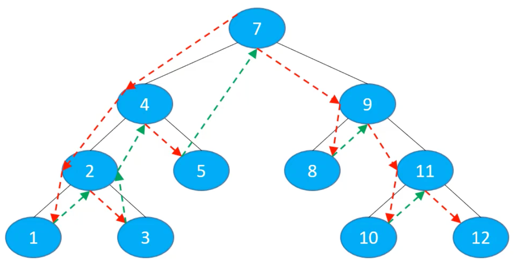
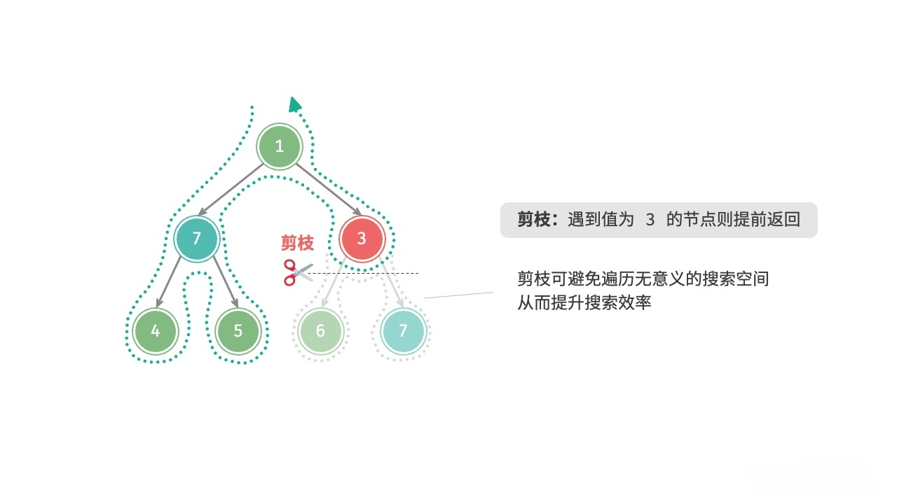
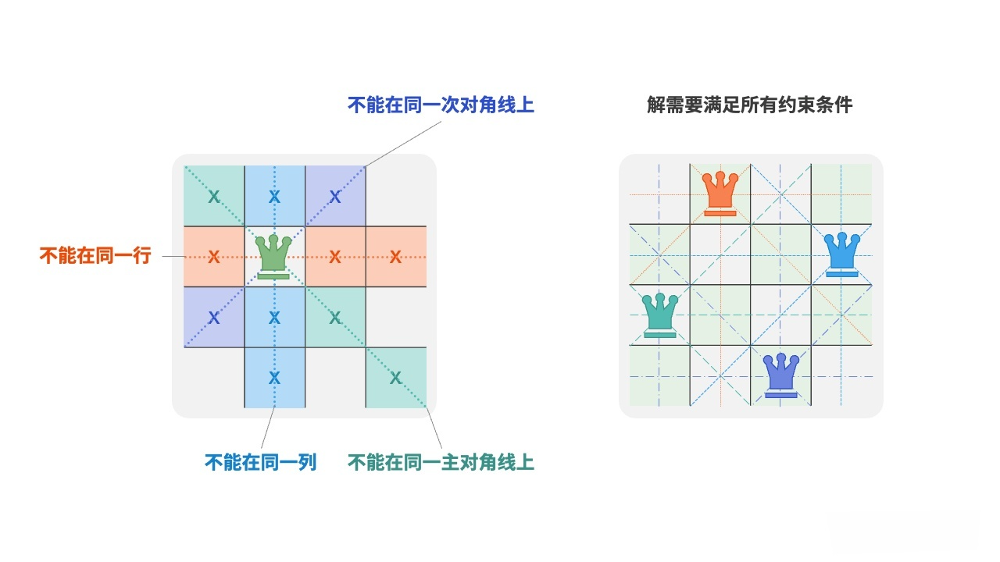
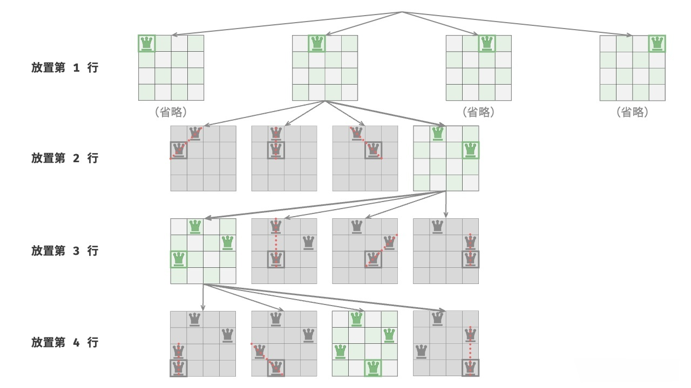

# 回溯（Backtracking）

## 1.概述

回溯可以理解为：通过选择不同的岔路口来通往目的地。它是一种通过穷举所有可能的情况来解决问题的算法策略。

每一步都选择一个方向走下去，如果走到某一步发现走不通了，就回到上一步重新选择一个方向继续走，直到走到目的地。

树、图的深度优先遍历（DFS）就是回溯算法的典型应用。



不难看出，回溯很适合使用**递归**来实现。

## 2.剪枝

当在进行回溯时，如果发现当前路径不可能通往目的地（即无法满足问题的某些**约束条件**），那么就可以停止继续探索这条路径，这个过程称为`剪枝`。

如问题：在二叉树中搜索所有值为`7`的节点，请返回根节点到这些节点的路径，并且要求路径上不能有值为`3`的节点。



## 3.[N 皇后问题](https://leetcode.cn/problems/n-queens/description/)

在`n x n`的棋盘上放置`n`个皇后，使得它们彼此之间不能相互攻击。即：任意两个皇后都不能处于同一行、同一列、同一斜线上，一共有多少种摆法？



### 3.1.思路

1. 暴力法
   
   从`n * n`个格子中选出任意`n`个格子放置皇后，然后判断这`n`个皇后是否符合要求。
   
   那么一共有`C(n * n, n)`种选法，`n = 8`时就有`C(64, 8) ≈ 44 亿`种选法，这种思路显然不可取。

2. 根据题意减少暴力程度
   
   很显然，每一行只能放置一个皇后，所以我们可以从`n`行中选出`n`个格子放置皇后，这样就减少为`n ^ n`种选法，`n = 8`时就有`8 ^ 8 = 16777216`种选法，这种思路虽然比暴力法好很多，但依然不可取。

3. 回溯法
   
   以`n = 4`为例来看下回溯法的流程：
   
   

### 3.2.实现

```java
import java.util.*;

/**
 * N 皇后问题
 * <a href="https://leetcode.cn/problems/n-queens/">...</a>
 */
public class NQueens1 {

    /**
     * 求解 n 皇后问题
     */
    public static List<List<String>> solve(int n) {
        // 存储正确的解
        List<List<String>> result = new ArrayList<>();
        // cols[i] = j 表示第 i 行的皇后放在了第 j 列
        int[] cols = new int[n];
        // 因为需要打印皇后的具体位置，避免数组元素默认值`0`与合法值冲突，所以初始化为`-1`
        Arrays.fill(cols, -1);
        place(result, cols, 0);
        return result;
    }

    /**
     * 从第 row 行开始放置皇后
     *
     * @param result 存储正确解
     * @param cols   cols[i] = j 表示第 i 行的皇后放在了第 j 列
     * @param row    当前正在放置第 row 行的皇后
     */
    private static void place(List<List<String>> result, int[] cols, int row) {
        /*
        这里的判断不是用来做终止条件的，而只是用来存储一种正确的解
        递归的终止是自然结束的，即方法体执行完毕后，方法就会结束

        假设没有这段代码，那么当 row == cols.length 时，for 循环里面的 isValid 方法都会返回 false
        因为没有剩余的行可以放置皇后了，那么 for 循环也就结束了，place 方法也就结束了，也就回溯到上一级
         */
        if (row == cols.length) {
            // 所有行的皇后都放置好了，说明找到了一种正确解
            List<String> board = createChessBoard(cols);
            result.add(board);
            return;
        }

        // 在第 row 行的所有列尝试放置皇后
        for (int col = 0; col < cols.length; col++) {
            // 检查 (row, col) 位置能否放置皇后
            if (!isValid(cols, row, col)) {
                // 剪枝：不可以放置皇后，尝试当前行的下一列
                continue;
            }
            // 放置皇后
            cols[row] = col;
            /*
            下一行放置皇后
            这里使用了递归，但是不需要终止条件，
            因为：当剩余的所有格子无法放置皇后时，那么 for 循环也会结束，
            那么此时的 place 方法就会结束，也就回溯到上一级调用了

            row + 1，不能使用++row，因为 ++row 会改变 row 的值，导致回溯时 row 变大了
             */
            place(result, cols, row + 1);

            // 回溯，撤销皇后
            // cols[row] = -1;
            // 这里不撤销也可以，因为下一次放置皇后时，会覆盖当前行的值
        }
    }

    /**
     * 检查 (row, col) 位置能否放置皇后
     * 只需检查是否在同一列，同一斜线，
     * 同一行无需检测，因为当某一行放置了一个元素，直接进入下一行
     *
     * @param cols cols[i] = j 表示第 i 行的皇后放在了第 j 列
     * @param row  当前正在放置第 row 行的皇后
     * @param col  当前正在放置第 col 列的皇后
     * @return true 可以放置，false 不能放置
     */
    private static boolean isValid(int[] cols, int row, int col) {
        // 检查前面已经放置好的行
        for (int i = 0; i < row; i++) {
            // 前面已经放置好的皇后的位置 (i, j)
            int j = cols[i];

            // 检查是否在同一列
            if (j == col) return false;

            // 检查是否在同一斜线
            if (row - i == Math.abs(j - col)) {
                return false;
            }
        }
        return true;
    }

    /**
     * 根据 cols 数组创建棋盘
     *
     * @param cols cols[i] = j 表示第 i 行的皇后放在了第 j 列
     * @return 棋盘，示例：[".Q..", "...Q", "Q...", "..Q."]
     */
    private static List<String> createChessBoard(int[] cols) {
        List<String> board = new ArrayList<>();

        // 遍历 cols 每一个元素，即得到每一行的皇后位置
        for (int row = 0; row < cols.length; row++) {

            // 第 row 行的皇后放在了第 col 列
            int col = cols[row];

            StringBuilder sb = new StringBuilder();

            // 一共有 n 列，如果 col == k 列，那么放置皇后 'Q'，否则放置空格 '.'
            for (int k = 0; k < cols.length; k++) {
                if (k == col) {
                    sb.append('Q');
                } else {
                    sb.append('.');
                }
            }

            board.add(sb.toString());
        }
        return board;
    }

    public static void main(String[] args) {
        System.out.println("四皇后一共有以下解法：");
        List<List<String>> four = solve(4);
        for (List<String> board : four) {
            for (String line : board) {
                System.out.println(line);
            }
            System.out.println();
        }
        List<List<String>> eight = solve(8);
        System.out.println("八皇后一共有 " + eight.size() + " 种解法");
    }

}
```

### 3.3.优化 ①：移除`isValid`方法中的循环

在上述实现中，每次调用`isValid`方法都要进行一次循环，是否可以避免？

用空间换时间：增加额外的数组来记录哪些列、哪些对角线已经有皇后。

```java
import java.util.ArrayList;
import java.util.List;

/**
 * N 皇后问题
 * 优化 ①：移除 isValid 方法中的循环
 */
public class NQueens2 {

    public static List<List<String>> solve(int n) {
        List<List<String>> result = new ArrayList<>();

        /*
        标记某一列是否有皇后
        cols[i] = false 表示第 i 列没有皇后
        cols[i] = true 表示第 i 列有皇后
         */
        boolean[] cols = new boolean[n];

        int diagonalCount = (n << 1) - 1;

        /*
        标记某一行的左上到右下的对角线是否有皇后
        对角线的数量 = 2n - 1
               0   1    2    3
            +----+----+----+----+
          0 | \3 | \2 | \1 | \0 |
            +----+----+----+----+
          1 | \4 | \3 | \2 | \1 |
            +----+----+----+----+
          2 | \5 | \4 | \3 | \2 |
            +----+----+----+----+
          3 | \6 | \5 | \4 | \3 |
            +----+----+----+----+
         计算(row, col)位置的左斜线索引 = row - col + n - 1
         上图中每个格子所出的斜线索引已经标记好了
         */
        boolean[] leftTop = new boolean[diagonalCount];

        /*
        标记某一行的右上到左下的对角线是否有皇后
               0   1    2    3
            +----+----+----+----+
          0 | 0/ | 1/ | 2/ | 3/ |
            +----+----+----+----+
          1 | 1/ | 2/ | 3/ | 4/ |
            +----+----+----+----+
          2 | 2/ | 3/ | 4/ | 5/ |
            +----+----+----+----+
          3 | 3/ | 4/ | 5/ | 6/ |
            +----+----+----+----+
         计算(row, col)位置的右斜线索引 = row + col
         */
        boolean[] rightTop = new boolean[diagonalCount];

        /*
        上面 3 个数组只是为了优化 isValid 方法，但是当求得某一解时，是无法得出每个皇后的具体位置
        cols 的值全部都是 true，而 leftTop 和 rightTop 的值每种解都是一样的
        所以还需要一个数组来记录皇后的具体位置，locations[i] = j 表示第 i 行的皇后放在了第 j 列
         */
        int[] locations = new int[n];

        place(0, locations, cols, leftTop, rightTop, result);
        return result;
    }

    private static void place(int row,
                              int[] locations,
                              boolean[] cols, boolean[] leftTop, boolean[] rightTop,
                              List<List<String>> result) {
        if (row == cols.length) {
            List<String> board = createChessBoard(locations);
            result.add(board);
            return;
        }

        for (int col = 0; col < cols.length; col++) {
            if (cols[col]) {
                // 如果当前列已经有皇后了，尝试下一列
                continue;
            }

            int ltIndex = row - col + cols.length - 1;
            if (leftTop[ltIndex]) {
                // 如果当前所处左斜线已经有皇后了，尝试下一列
                continue;
            }

            int rtIndex = row + col;
            if (rightTop[rtIndex]) {
                // 如果当前所处右斜线已经有皇后了，尝试下一列
                continue;
            }

            // 当前列标记已经有皇后
            cols[col] = true;
            // 当前左斜线标记已经有皇后
            leftTop[ltIndex] = true;
            // 当前右斜线标记已经有皇后
            rightTop[rtIndex] = true;

            // 记录皇后位置
            locations[row] = col;

            place(row + 1, locations, cols, leftTop, rightTop, result);

            // 撤销皇后
            cols[col] = false;
            leftTop[ltIndex] = false;
            rightTop[rtIndex] = false;
        }
    }

    private static List<String> createChessBoard(int[] locations) {
        List<String> board = new ArrayList<>();
        for (int row = 0; row < locations.length; row++) {
            int col = locations[row];
            StringBuilder sb = new StringBuilder();
            for (int k = 0; k < locations.length; k++) {
                if (k == col) {
                    sb.append('Q');
                } else {
                    sb.append('.');
                }
            }

            board.add(sb.toString());
        }
        return board;
    }

    public static void main(String[] args) {
        System.out.println("四皇后一共有以下解法：");
        List<List<String>> four = solve(4);
        for (List<String> board : four) {
            for (String line : board) {
                System.out.println(line);
            }
            System.out.println();
        }
        List<List<String>> eight = solve(8);
        System.out.println("八皇后一共有 " + eight.size() + " 种解法");
    }

}
```

### 3.4.优化 ②：使用位运算压缩空间

在优化 ① 中，**标记某一列是否有皇后**，使用了长度为`N`的布尔数组，元素的值只有`true || false`两种，那么也就可以用`1 || 0`来表示。

假设现在`n = 8`，某一时刻的数据为：`[true, false, false, true, false, false, false, true]`，则表示第`0、3、7`列有皇后，我们可以使用`1`个字节来存储：`10001001`，低位为第`0`列，这样就节省了空间，同理，**标记对角线是否有皇后**，数组长度是`2*8-1 = 15`，则使用`2`个字节来存储。

> 思考：
> 
> 1. 如何判断第某一列是否有皇后？（对角线同理）
>
>    可以将`1`左移`col`位，结果为`00000100`，然后与`cols`（表示列的字节）做`&`运算，如果结果不为`0`，则表示该列有皇后，即`(cols & (1 << col)) != 0`
>
> 2. 如何标记第`col`列有皇后？（对角线同理）
> 
>    可以将`1`左移`col`位，然后与`cols`（表示列的字节）做`|`运算，结果赋值给`cols`，即`cols |= (1 << col)`
>
> 3. 如何撤销第`col`列的皇后？（对角线同理）
>
>    可以将`1`左移`col`位，然后**取反**，再与`cols`（表示列的字节）做`&`运算，结果赋值给`cols`，即`cols &= ~(1 << col)`

为了简化代码，这里以`8`皇后为例，使用`byte`类型来表示列，使用`short`类型来表示对角线。

```java
import java.util.ArrayList;
import java.util.List;

/**
 * N 皇后问题
 * 优化：使用位运算来压缩空间，以八皇后为例
 */
public class NQueens3 {

    public static List<List<String>> solve() {
        List<List<String>> result = new ArrayList<>();
        byte cols = 0;
        short leftTop = 0;
        short rightTop = 0;

        int[] locations = new int[8];
        place(0, locations, cols, leftTop, rightTop, result);
        return result;
    }

    private static void place(int row,
                              int[] locations,
                              byte cols, short leftTop, short rightTop,
                              List<List<String>> result) {
        if (row == 8) {
            List<String> board = createChessBoard(locations);
            result.add(board);
            return;
        }

        for (int col = 0; col < 8; col++) {
            // 使用位运算判断当前列、左斜线、右斜线是否有皇后

            // 因为 1 是 int 类型，位运算后的结果也是 int 类型
            int cv = 1 << col;
            if ((cols & cv) != 0) {
                continue;
            }
            int lv = 1 << (row - col + 7);
            if ((leftTop & lv) != 0) {
                continue;
            }
            int rv = 1 << (row + col);
            if ((rightTop & rv) != 0) {
                continue;
            }

            cols |= (byte) cv;
            leftTop |= (short) lv;
            rightTop |= (short) rv;

            locations[row] = col;

            place(row + 1, locations, cols, leftTop, rightTop, result);

            /*
            撤销皇后
            假设 cols 是 01110110
            刚刚是将第 3 列设置为 1，现在要还原为 0
                                      01110110
            则需要将 cols 做 & 运算: & 11111011 = 01110010
            而 11111011 = 对 00000100 取反 = ~ 00000100 = ~cv
            这样就将第 3 列还原为 0 了
             */
            cols &= (byte) ~cv;
            leftTop &= (short) ~lv;
            rightTop &= (short) ~rv;
        }
    }

    private static List<String> createChessBoard(int[] locations) {
        List<String> board = new ArrayList<>();
        for (int row = 0; row < 8; row++) {
            int col = locations[row];
            StringBuilder sb = new StringBuilder();
            for (int k = 0; k < 8; k++) {
                if (k == col) {
                    sb.append('Q');
                } else {
                    sb.append('.');
                }
            }

            board.add(sb.toString());
        }
        return board;
    }

    public static void main(String[] args) {
        List<List<String>> eight = solve();
        System.out.println("八皇后一共有 " + eight.size() + " 种解法");
    }

}
```


