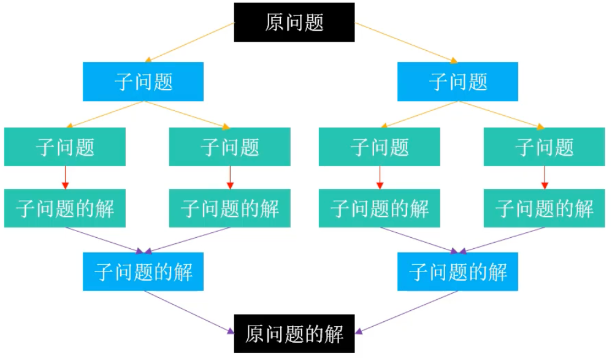
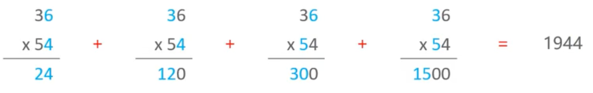
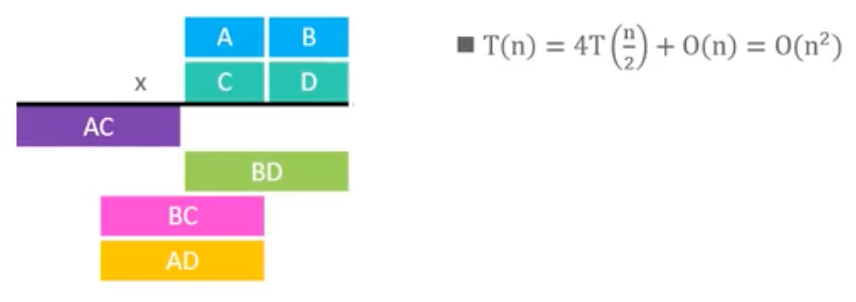
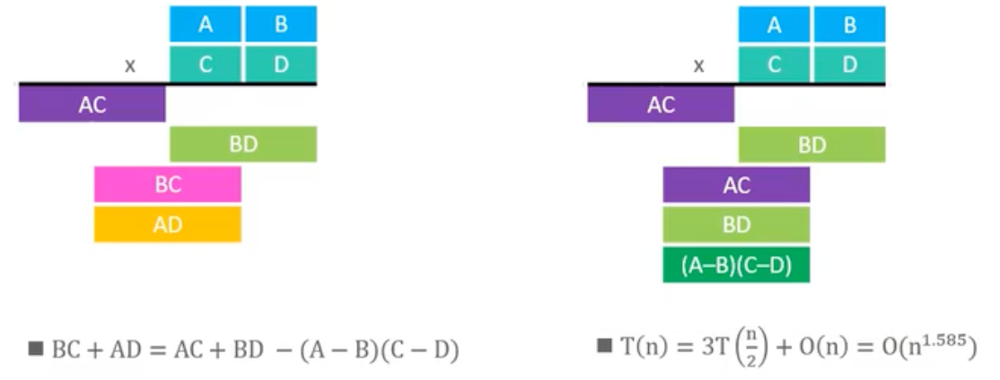

# 分治（Divide and Conquer）  

## 1.概述

分治，也就是分而治之，是一种将复杂问题分解为更小的子问题，直到能够简单解决，然后将子问题的解合并以解决原始问题的策略。

因此，分治策略非常适合使用[递归](../../recursion)来实现。

注意：**子问题之间必须是独立的**，也就是说一个子问题的解不会影响另一个子问题的解。



## 2.定理

分治策略通常遵循一种通用模式：

分解规模为`n`的问题为`a`个规模为`n/b`的子问题，然后在`O(n^d)`时间内将它们的解合并成原问题的解。 

那么算法的运行时间`T(n)`可以表示为以下递推关系：

`T(n) = a * T(n/b) + O(n^d), 其中 a > 0, b > 1, d >= 0`

此公式能推导出有如下规律：

- 当`d > logb(a)`时，`T(n) = O(n^d)`；
- 当`d = logb(a)`时，`T(n) = O(n^d * log n)`；
- 当`d < logb(a)`时，`T(n) = O(n^(logb(a)))`;

比如[归并排序](/programming/algorithm/sort/merge/#_4-分析)的运行时间`T(n) = 2 * T(n/2) + O(n)`，其中`a = 2, b = 2, d = 1`，满足`d = logb(a)`，所以归并排序的时间复杂度是`O(nlogn)`。

## 3.分治为什么可以提升效率

### 3.1.操作数量优化

在排序算法中，快速排序、归并排序相较于选择、冒泡、插入排序更快，就是因为它们应用了分治策略，这是为什么呢？

假设有`n`个元素需要排序，正常情况下时间复杂度如果为`O(n^2)`，现在采用分治策略，就以一轮划分为例：

1. 将`n`个元素划分成`2`个子数组，每个子数组有`n/2`个元素，则这两个子数组排序的时间复杂度为`O((n/2)^2) + O((n/2)^2) = O(n^2/2)`
2. 然后将它们合并成一个有序数组，假设时间复杂度为`O(merge)`
   
所以它们的总时间复杂度为`O(n^2/2) + O(merge)`，如果`O(merge)`的时间复杂度小于`O(n^2/2)`，那么总时间复杂度就会小于`O(n^2)`。

像归并和快速排序的`O(merge) = O(n)`，都满足这个条件，所以它们的时间复杂度都小于`O(n^2)`。

> 其实可以通过数学方程的角度来理解，`y=x^2`，当`x`变为`x/2`时，`y`变为`y/4`，减少了`3/4`，这就是分治的威力。

### 3.2.并行计算

分治生成的子问题是独立的，因此可以并行计算。通过将子问题分配给不同的处理器或线程，可以显著减少整体计算时间。这种并行性是分治策略的一个重要优势，尤其在处理大规模数据时。

## 4.练习

### 4.1.[最大子序列和](https://leetcode.cn/problems/maximum-subarray/description/)

给你一个整数数组`nums`，请你找出一个具有最大和的**连续**子序列（子序列最少包含一个元素），返回其最大和。

比如：`nums = [-2,1,-3,4,-1,2,1,-5,4]`，连续子序列`[4,-1,2,1]`的和最大，为`6`。

> 子序列可以是不连续的，不过题目要求是连续的。
> 同类概念中：子串、子数组、子区间，则是必须连续的。

#### 1.穷举法

暴力法，使用`3`个指针扫描所有的子数组，然后计算它们的和，取最大值。

```java
public static int sum1(int[] nums) {
    if (nums == null || nums.length == 0) return 0;
    if (nums.length < 2) return nums[0];

    int maxSum = Integer.MIN_VALUE;
    for (int begin = 0; begin < nums.length; begin++) {
        for (int end = begin; end < nums.length; end++) {
            // [begin, end] 是 nums 所有的子数组

            // 计算子数组的和
            int sum = 0;
            for (int i = begin; i <= end; i++) {
                sum += nums[i];
            }

            // 每得出一个子数组的和，就和最大值比较
            maxSum = Math.max(maxSum, sum);
        }
    }

    return maxSum;
}
```

空间复杂度：`O(1)`，时间复杂度：`O(n^3)`，可以优化到`O(n^2)`：

```java
/**
 * 暴力解法，去掉重复遍历
 */
public static int sum2(int[] nums) {
    if (nums == null || nums.length == 0) return 0;
    if (nums.length < 2) return nums[0];

    int maxSum = Integer.MIN_VALUE;
    for (int begin = 0; begin < nums.length; begin++) {
        int sum = 0;
        for (int end = begin; end < nums.length; end++) {
            // [begin, end] 是 nums 所有的子数组

            // end 在向后移动时，sum一直在累加，从而得到每个子数组的和
            sum += nums[end];

            // 与当前值相比较
            maxSum = Math.max(maxSum, sum);
        }
    }

    return maxSum;
}
```

#### 2.分治法

将序列均匀分割成`2`个子序列：

`[begin, end) = [begin, mid) + [mid, end)，其中 mid = (begin + end) >> 1`

假设最大的子序列区间是`[i, j)`，那么它有`3`种可能：

1. 在左半部分：`[i, j) ⊆ [begin, mid)`
   
   实际上`[i, j)`也就是`[begin, mid)`的最大子序列

2. 在右半部分：`[i, j) ⊆ [mid, end)`
   
3. 跨越中点：`begin<= i < mid, mid <= j < end`
   
   因为子序列是连续的，那么这种情况不难推理出两个规律：
   - `[i, mid)`是`[begin, mid)`中以索引`mid-1`为结尾的最大子序列
   - `[mid, j)`是`[mid, end)`中以索引`mid`为起点的最大子序列。


```java
public static int sum3(int[] nums) {
    if (nums == null || nums.length == 0) return 0;
    if (nums.length < 2) return nums[0];
    return sum3(nums, 0, nums.length);
}

private static int sum3(int[] nums, int begin, int end) {
    if (end - begin < 2) {
        // 只有一个元素
        return nums[begin];
    }
    int mid = (begin + end) >> 1;

    // 1.如果子序列在左边，则求出左边的最大子序列和
    int leftMaxSum = sum3(nums, begin, mid);

    // 2.如果子序列在右边，则求出右边的最大子序列和
    int rightMaxSum = sum3(nums, mid, end);

    // 取左边和右边的最大值
    int max = Math.max(leftMaxSum, rightMaxSum);

    // 如果子序列在中间，即左右两边都有
    int leftMax = Integer.MIN_VALUE;
    int leftSum = 0;
    for (int i = mid - 1; i >= begin; i--) {
        leftSum += nums[i];
        leftMax = Math.max(leftMax, leftSum);
    }

    int rightMax = Integer.MIN_VALUE;
    int rightSum = 0;
    for (int j = mid; j < end; j++) {
        rightSum += nums[j];
        rightMax = Math.max(rightMax, rightSum);
    }

    // 取三者的最大值
    return Math.max(max, leftMax + rightMax);
}
```

时间复杂度：`O(nlogn)`，空间复杂度：`O(logn)`（递归栈空间）。

### 4.2.[大数乘法](https://leetcode.cn/problems/multiply-strings/description/)

给定两个以字符串形式表示的非负整数（非常大）`num1`和`num2`，返回它们的的乘积，它们的乘积也表示为字符串形式。

按照乘法运算，在进行`n`位数之间的乘法时，需要大约`n^2`次的基本乘法运算，比如：`36 x 54`



假设`n`位数的乘法需要消耗时间为`T(n)`，如果将`n`位数划分成`2`个`n/2`位数，那么：`T(n) = 4 * T(n/2) + O(n)`，其中`O(n)`是将`4`个`n/2`位数的乘积相加得到结果的时间。



根据分治定理，`a = 4, b = 2, d = 1`，满足`d < logb(a)`，所以`T(n) = O(n^(log2(4))) = O(n^2)`，并没有提升效率。

在`1960`年，`Anatolii Alexe evitch Karatsuba`提出了一种更快的乘法算法，称为`Karatsuba 乘法`，它将乘法运算的时间复杂度降低到了`O(n^(log2(3))) ≈ O(n^1.585)`。



> `A、B、C、D`分别是`n/2`位数，那么`A-C`和`B-D`的结果最多也是`n/2`位数，所以`(A-C)*(B-D)`的乘积也需要`T(n/2)`时间。`AC`和`BD`的乘积算过一次了，所以总共是`3`次`T(n/2)`。


