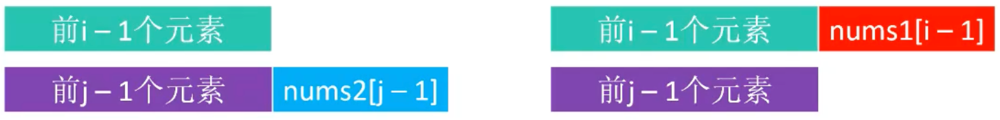

# 动态规划（Dynamic Programming）

## 1.概述

动态规划，简称`DP`，它是求解具有`最优子结构`、`重叠子问题`、`无后效性`性质问题的一种常用策略。通过将问题分解为更小的子问题来解决复杂问题，并且通过存储子问题的结果来避免重复计算，从而提高效率。

> `重叠子问题`：问题可以分解为多个子问题，这些子问题在求解过程中会被多次计算。
> 
> `最优子结构`：问题的最优解可以由其子问题的最优解构造出来。
>
> [无后效性](./#_4-无后效性)：一旦当前的状态确定了，此后的过程发展就不再受过去（即到达当前状态的具体路径）的影响。简单来说：未来与过去无关，只取决于现在

## 2.示例-[零钱兑换](https://leetcode.cn/problems/coin-change/)

在[贪心策略](../greedy/#_2-2-零钱兑换)中已经解决过该问题，但是结果不一定是最优解，现在使用动态规划就可以得到最优解。

假设`coins = [25, 20, 5, 1], n = 41`，用贪心得到的结果是`25 + 5 + 5 + 5 + 1 = 41`，共`5`个硬币，最优解是`20 + 20 + 1 = 41`，共`3`个硬币。

假设方法`change(n)`表示兑换`n`分所需的最少硬币数，那么：

- 如果第`1`次选择了`25`分硬币，那么`change(n) = change(n - 25) + 1`，
- 如果第`1`次选择了`20`分硬币，那么`change(n) = change(n - 20) + 1`，
- 如果第`1`次选择了`5`分硬币，那么`change(n) = change(n - 5) + 1`，
- 如果第`1`次选择了`1`分硬币，那么`change(n) = change(n - 1) + 1`。

只有上述`4`种情况，所以最优解一定是上面最小的那一种，即：

```java
change(n) = min(
    change(n - 25) + 1,
    change(n - 20) + 1,
    change(n - 5) + 1,
    change(n - 1) + 1
)
```

### 2.1.方法一：暴力递归

```java
package dp;

/**
 * 零钱兑换：暴力递归（自顶向下）
 * <a href="https://leetcode.cn/problems/coin-change/">...</a>
 *
 * @author yolk
 * @since 2025/10/14 00:51
 */
public class CoinChange1 {

    public static int change(int[] coins, int n) {
        /*
        当 n 小于某一面值时，也会进行 change(n - 面值) 的计算
        这时 n - 面值 会小于 1，无法找零，返回一个最大值
        那么就可以在`Math.min()`方法中选择其他项
         */
        if (n < 1) return Integer.MAX_VALUE;

        // 遍历硬币，模拟每一种选择
        int min = Integer.MAX_VALUE;
        for (int coin : coins) {
            // 如果 n 恰好等于某一种硬币面值，直接返回 1
            if (n == coin) return 1;

            // 选择每一种硬币面值，找出最小的硬币数
            min = Math.min(min, change(coins, n - coin));
        }

        return min + 1;
    }

    public static void main(String[] args) {
        int[] coins = {25, 20, 5, 1};
        int n = 41;
        System.out.println(change(coins, n));
    }

}
```

上述代码，有很多重复计算的子问题，比如`change(41)`会计算`change(16)`，而`change(36)`（`41-5=36`，选择了`5`分硬币）也会计算`change(16)`，这就是重叠子问题。

### 2.2.方法二：记忆化搜索

对于重叠子问题，我们可以使用一个数组`dp`来存储已经计算过的子问题结果，避免重复计算，这就是`记忆化搜索`。

假设`dp[i]`表示兑换`i`分所需的最少硬币数，那么`dp`数组长度为`n + 1`。

```java
package dp;

/**
 * 零钱兑换：记忆化搜索（自顶向下）
 * <a href="https://leetcode.cn/problems/coin-change/">...</a>
 *
 * @author yolk
 * @since 2025/10/14 00:51
 */
public class CoinChange2 {

    public static int change(int[] coins, int n) {
        // 存储计算过的 n 对应的最小硬币数
        int[] dp = new int[n + 1];

        // 初始化默认值：如果 n 恰好等于某一种硬币面值，直接返回 1
        for (int coin : coins) {
            if (n < coin) continue;
            dp[coin] = 1;
        }

        return change(n, coins, dp);
    }

    /**
     * 记忆化搜索
     *
     * @param n  当前需要找零的金额
     * @param dp dp[i] 表示金额 i 对应的最小硬币数
     * @return 金额 n 对应的最小硬币数
     */
    public static int change(int n, int[] coins, int[] dp) {
        if (n < 1) return Integer.MAX_VALUE;

        // 如果当前金额 n 已经计算过，直接返回结果
        if (dp[n] != 0) return dp[n];

        // 遍历硬币，模拟每一种选择
        int min = Integer.MAX_VALUE;
        for (int coin : coins) {
            min = Math.min(min, change(n - coin, coins, dp));
        }

        // 将计算结果存储到 dp 数组中
        dp[n] = min + 1;

        return dp[n];
    }

    public static void main(String[] args) {
        int[] coins = {25, 20, 5};
        int n = 19;
        System.out.println(change(coins, n));
    }

}
```

### 2.3.方法三：动态规划

前面两种都是将大规模问题递归地分解为小规模问题进行解决（`自顶向下`），那么能否`自底向上`（从子问题推出原问题的解）地解决问题呢？这样就可以免去递归，从而提高效率。

答案是肯定的，这就是动态规划。

```java
package dp;

/**
 * 零钱兑换：动态规划（自底向上）
 * <a href="https://leetcode.cn/problems/coin-change/">...</a>
 *
 * @author yolk
 * @since 2025/10/14 00:51
 */
public class CoinChange3 {

    public static int change(int[] coins, int n) {
        int[] dp = new int[n + 1];

        // 从 1 开始计算 dp[i]
        for (int i = 1; i <= n; i++) {
            int min = Integer.MAX_VALUE;
            for (int coin : coins) {
                // i 小于 coin，无法找零，跳过
                if (i < coin) continue;

                min = Math.min(min, dp[i - coin]);
            }
            dp[i] = min + 1;
        }
        return dp[n];
    }

    public static void main(String[] args) {
        int[] coins = {25, 20, 5, 1};
        int n = 19;
        System.out.println(change(coins, n));
    }

}
```

上述代码的空间复杂度是`O(n)`，时间复杂度是`O(n * m)`，其中`m`是硬币面值的种类数。

### 2.4.如何获取具体的硬币组合？

```java
package dp;

import java.util.Arrays;

/**
 * 零钱兑换：打印硬币具体组合
 * <a href="https://leetcode.cn/problems/coin-change/">...</a>
 *
 * @author yolk
 * @since 2025/10/14 00:51
 */
public class CoinChange4 {

    public static int change(int[] coins, int n) {
        Arrays.sort(coins);
        int[] dp = new int[n + 1];

        // 记录金额 i 在进行 dp[i] = Math.min(xxx,xxx) + 1 时，选择的硬币面值
        int[] faces = new int[dp.length];

        for (int i = 1; i <= n; i++) {
            if (dp[i] != 0) continue;
            int min = Integer.MAX_VALUE;
            int face = -1;
            for (int coin : coins) {
                if (i < coin) break;

                if (dp[i - coin] < min) {
                    // 最小值更新时，记录选择的硬币面值
                    min = dp[i - coin];
                    face = coin;
                }
            }
            dp[i] = min + 1;

            // 记录i选择的硬币面值
            faces[i] = face;

            // 打印当前金额 i 的硬币组合
            print(faces, i);
        }

        return dp[n];
    }

    private static void print(int[] faces, int n) {
        System.out.print("[" + n + "] = ");
        int i = n;
        while (i > 0) {
            int face = faces[i];
            System.out.print(face + " ");
            i = i - face;
        }
        System.out.println();
    }

    public static void main(String[] args) {
        int[] coins = {25, 20, 5, 1};
        int n = 100;
        System.out.println(change(coins, n));
    }

}
```

### 2.5.如果凑不齐，能返回`-1`吗？

假如`coins = [25, 20, 5]`，`n = 19`，无法凑齐`19`分，前面的代码会返回`Integer.MAX_VALUE + 1`，这是不对的。

```java
package dp;

/**
 * 零钱兑换：动态规划（自底向上）
 * <a href="https://leetcode.cn/problems/coin-change/">...</a>
 *
 * @author yolk
 * @since 2025/10/14 00:51
 */
public class CoinChange5 {

    public static int change(int[] coins, int n) {
        int[] dp = new int[n + 1];

        for (int i = 1; i <= n; i++) {
            int min = Integer.MAX_VALUE;
            for (int coin : coins) {
                // i < coin，无法找零，跳过
                if (i < coin) continue;

                int v = dp[i - coin];
                // dp[i - coin] < 0，说明 i - coin 无法找零，那么 i 也无法找零，跳过
                if (v < 0) continue;

                min = Math.min(min, dp[i - coin]);
            }

            if (min == Integer.MAX_VALUE) {
                // 无法找零，则设置为-1
                dp[i] = -1;
            } else {
                dp[i] = min + 1;
            }
        }
        return dp[n];
    }

    public static void main(String[] args) {
        int[] coins = {25, 20, 5};
        int n = 19;
        System.out.println(change(coins, n));
    }

}
```

## 3.使用套路

示例中的三个方法，是一步步优化的过程，这也是在使用动态规划时常用的套路：

- 暴力递归：将大问题分解为小问题，递归地解决。
- 记忆化搜索：在暴力递归的基础上，使用数组存储已经计算过的子问题结果，避免重复计算。
- 动态规划：`自底向上`地计算每一个子问题的结果，最终得到原问题的解。

以上是初学者常用的套路，如果你已经可以确定问题能使用动态规划来解决时，可以按照以下步骤来实现：

1. `定义状态`：状态是原问题、子问题的解，比如定义`dp[i]`的含义。
2. `设置初始值`：根据状态的定义，设置初始值，比如`dp[0]`的值，跟递归的终止条件类似。
3. `确定状态转移方程`：找出状态之间的关系，写出状态转移方程，如确定`dp[i]`和`dp[i-1]`之间的关系。

## 4.无后效性

从起点`(0,0)`到终点`(4,4)`，每次只能向右或者向下走，问有多少种走法？

<center></center>

假设`dp[i][j]`表示从起点`(0,0)`走到`(i,j)`的走法数，那么：

- `dp[0][0] = 1`
- `dp[i][0] = 1`，只能一直向下走
- `dp[0][j] = 1`，只能一直向右走
- `dp[i][j] = dp[i-1][j] + dp[i][j-1]`

`无后效性`体现在推导`dp[i][j]`时，只需要`dp[i-1][j]`和`dp[i][j-1]`，而不需要知道是怎么走到`(i-1,j)`和`(i,j-1)`的。

如果题目要求可以向左、向右、向上、向下走，但是同一个格子不能走两次，那么就出现了`有后效性`。因为推导`dp[i][j]`依赖上下左右四个格子，而每个格子又依赖它的上下左右四个格子，又因为不能走两次，所以需要知道是怎么走到这些格子的，才能确定`dp[i][j]`的值，这样就不能使用动态规划了。

## 5.练习 ①：[最大子序列和](https://leetcode.cn/problems/maximum-subarray/description/)

这道题在[分治策略](../divide-conquer/#_4-1-最大子序列和)中已经解决过了，现在使用动态规划来解决。

假设`nums = [-2,1,-3,4,-1,2,1,-5,4]`，使用动态规划来解决该问题：

1. 定义状态
   
   因为是连续子序列，那么每个元素都有可能是最大子序列的结尾，所以求出以每个元素为结尾的最大子序列和，再选择最大值，即是问题的答案。

   所以假设`dp[i]`表示以`nums[i]`结尾的`连续`子序列的最大和。
   
   - 以`nums[0] = -2`结尾的最大子序列为`[-2]`，所以`dp[0] = -2`；
   - 以`nums[1] = 1`结尾的的最大子序列为`[1]`，所以`dp[1] = 1`；
   - 以`nums[2] = -3`结尾的的最大子序列为`[1,-3]`，所以`dp[2] = -2`；
   - 以`nums[3] = 4`结尾的的最大子序列为`[4]`，所以`dp[3] = 4`；
   - .....
  
   > 为什么不关心开头？因为只需要求解`和`，不需要知道具体的子序列，这也就是`无后效性`。

2. 设置初始值：`dp[0] = nums[0]`。
3. 确定状态转移方程
   - 如果`dp[i-1] < 0`，那么`dp[i-1] + nums[i] < nums[i]`，所以`dp[i] = + nums[i]`；
   - 如果`dp[i-1] >= 0`，那么`dp[i-1] + nums[i] >= nums[i]`，所以`dp[i] = dp[i-1] + nums[i]`。

   所以`dp[i] = Math.max(dp[i-1] + nums[i], nums[i])`。 

### 5.1.代码实现

```java
package dp;

/**
 * 最大连续子序列：使用动态规划求解
 * <a href="https://leetcode.cn/problems/maximum-subarray/">...</a>
 *
 * @author yolk
 * @since 2025/10/13 17:16
 */
public class MaxSubSequence {

    public static int sum(int[] nums) {
        // 1.定义状态：dp[i] 表示以 nums[i] 结尾的最大子数组和
        int[] dp = new int[nums.length];

        // 2.设置初始值
        dp[0] = nums[0];

        int maxSum = dp[0];

        for (int i = 1; i < nums.length; i++) {
            // 3.状态转移方程
            dp[i] = Math.max(dp[i - 1] + nums[i], nums[i]);

            // 4.遍历过程中顺便计算最大值
            maxSum = Math.max(maxSum, dp[i]);
        }

        return maxSum;
    }

    public static void main(String[] args) {
        int[] nums = {-2, 1, -3, 4, -1, 2, 1, -5, 4};
        System.out.println(sum(nums));
    }

}
```

上述实现的时间复杂度是`O(n)`，空间复杂度为`O(n)`，相较于分治策略的`O(nlogn)`实现，效率更高。

### 5.2.优化空间复杂度

因为状态转移方程只和前一个状态有关，所以可以使用变量代替数组，节省空间。

```java
public static int sum(int[] nums) {
    // 使用变量代替数组，空间复杂度优化至 O(1)
    int dp = nums[0];
    int maxSum = dp;

    for (int i = 1; i < nums.length; i++) {
        dp = Math.max(dp + nums[i], nums[i]);
        maxSum = Math.max(maxSum, dp);
    }

    return maxSum;
}
```

## 6.练习 ②：[最长上升子序列](https://leetcode.cn/problems/longest-increasing-subsequence/)

也称最长递增子序列（Longest Increasing Subsequence，`LIS`），给你一个整数数组`nums`（无序），找到其中最长严格递增子序列的长度。

> 严格递增：`a1 < a2 < a3 < ... < ak`，不能出现相等元素。

比如：`nums = [10, 9, 2, 5, 3, 7, 101, 18]`，它的最长递增子序列是`[2, 3, 7, 101]`，长度为`4`。

1. 定义状态：假设`dp[i]`表示以`nums[i]`结尾的最长递增子序列的长度。
   
   - 以`nums[0] = 10`结尾的最长递增子序列为`[10]`，所以`dp[0] = 1`；
   - 以`nums[1] = 9`结尾的最长递增子序列为`[9]`，所以`dp[1] = 1`；
   - 以`nums[2] = 2`结尾的最长递增子序列为`[2]`，所以`dp[2] = 1`；
   - 以`nums[3] = 5`结尾的最长递增子序列为`[2,5]`，所以`dp[3] = 2`；
   - 以`nums[4] = 3`结尾的最长递增子序列为`[2,3]`，所以`dp[4] = 2`；
   - 以`nums[5] = 7`结尾的最长递增子序列为`[2,3,7]`，所以`dp[5] = 3`；
   - .....
2. 设置初始值：`dp[i] = 1`（每个元素本身就是一个长度为`1`的递增子序列）。
3. 状态转移方程
   - 如果`nums[i] > nums[i - 1]`，那么`dp[i] = dp[i - 1] + 1`；
   - 如果`nums[i] <= nums[i - 1]`，那么`dp[i] = 1`。
  
   只有这两种情况吗？不是的，因为是子序列，可以不连续，那么`nums[i]`可以和前面的任意一个或多个元素组成递增子序列，所以这里需要和之前的所有元素进行比较。假设`j = 0, 1, 2, ..., i-1`，每比较一个元素表示：索引`i`的元素是否可以接到索引`j`的元素后面，形成更长的递增子序列。那么状态转移方程变为：

   - 如果`nums[i] > nums[j]`，那么`dp[i] = Math.max(dp[i], dp[j] + 1)`。每与前面一个元素进行比较，`dp[i]`都有可能变得更大，所以需要取最大值。
   - 如果`nums[i] <= nums[j]`，即`nums[i]`不能接在`nums[j]`后面，跳过。

```java
package dp;

/**
 * 最长上升子序列
 * <a href="https://leetcode.cn/problems/longest-increasing-subsequence/">...</a>
 *
 * @author yolk
 * @since 2025/10/15 02:35
 */
public class LengthOfLIS {

    public static int length(int[] nums) {
        // 1.定义状态：dp[i] 表示以 nums[i] 结尾的最长上升子序列的长度
        int[] dp = new int[nums.length];
        // 2.设置初始值
        int maxLen = dp[0] = 1;

        for (int i = 1; i < nums.length; i++) {
            // dp[i] 最小值为 1，即元素本身
            dp[i] = 1;

            // 和前面的所有元素进行比较
            for (int j = 0; j < i; j++) {
                // 如果 nums[i] > nums[j]，说明可以接在 nums[j] 之后，形成更长的上升子序列
                if (nums[i] > nums[j]) {
                    // 和你当前的 dp[i] 比较，取最大值
                    dp[i] = Math.max(dp[i], dp[j] + 1);
                }
            }
            // 计算最大值
            maxLen = Math.max(maxLen, dp[i]);
        }

        return maxLen;
    }

    public static void main(String[] args) {
        int[] nums = {10, 9, 2, 5, 3, 7, 101, 18};
        System.out.println(length(nums));
    }

}
```

上述代码的时间复杂度是`O(n^2)`，空间复杂度是`O(n)`。

### 6.2.使用二分搜索（思路）


把每个数字看作是一张扑克牌，从左到右依次处理这些扑克牌。

假设`nums[i]`是当前处理的扑克牌，需要执行以下两步：

1. 将它放在第一个`牌顶 >= nums[i]`的牌堆上面
2. 如果找不到这样的牌堆，新建一堆，牌顶就是`nums[i]`

执行完后，如图：

<center></center>

那么最长上升子序列为：`[2, 5, 7, 101]`或者`[2, 5, 7, 18]`，长度为`4`，其实`牌堆的数量`就是最长上升子序列的长度。

```java
public static int length(int[] nums) {
    // 存储每个牌堆的牌顶，即 top[i] 表示第 i 堆牌的牌顶元素
    int[] top = new int[nums.length];
    // 牌堆数组
    int len = 0;

    for (int num : nums) {
        int i = 0;
        while (i < len) {
            if (top[i] >= num) {
                // 找到合适的牌堆，放在牌顶
                top[i] = num;
                break;
            }
            i++;
        }
        if (i == len) {
            // 所有牌堆都比 num 小，创建新牌堆
            top[len++] = num;
        }
    }
    return len;
}
```

上述代码的时间复杂度是`O(n^2)`，空间复杂度是`O(n)`，这跟二分搜索也没有关系啊，而且对比动态规划的实现，效率并没有提升。

其实观察牌顶元素，发现是一个递增序列，那么可以使用二分搜索来优化查找牌堆的过程。

```java
public static int length(int[] nums) {
    // 存储每个牌堆的牌顶，即 top[i] 表示第 i 堆牌的牌顶元素
    int[] top = new int[nums.length];
    // 牌堆数组
    int len = 0;

    for (int num : nums) {
        // 构建[0, len)范围的有序数组
        int begin = 0, end = len;
        while (begin < end) {
            // 中间元素的索引
            int mid = (end + begin) >> 1;
            // 找到第一个大于等于 num 的牌堆
            if (top[mid] >= num) {
                end = mid;
            } else {
                begin = mid + 1;
            }
        }

        if (begin < len) {
            // begin == end，找到合适的牌堆，放在牌顶
            top[begin] = num;
        } else {
            // begin == len，所有牌堆都比 num 小，创建新牌堆
            top[len++] = num;
        }
    }
    return len;
}
```

上述二分搜索的实现，时间复杂度是`O(nlogn)`，空间复杂度是`O(n)`。

## 7.练习 ③：[最长公共子序列](https://leetcode.cn/problems/longest-common-subsequence/)

Longest Common Subsequence，简称`LCS`，给你两个字符串`text1`和`text2`，返回这两个字符串的最长公共子序列的长度。如果不存在公共子序列，返回`0`。例如：

- `text1 = "abcde", text2 = "dacbe"` ，它们的最长公共子序列是`"ace"`，长度为`3`。
- `text1 = "abc", text2 = "def"` ，它们没有最长公共子序列是，长度为`0`。

假设`char[] chars1 = text1.toCharArray(), chars2 = text2.toCharArray()`，使用动态规划来解决该问题：

1. 定义状态：假设`dp[i][j]`表示`chars1 前 i 个元素`和`chars2 前 j 个元素`的最长公共子序列的长度。
   
   注意`i`和`j`是从`1`开始的，对应元素的索引是`i-1`和`j-1`。
   
   那么`text1`和`text2`的最长公共子序列长度就是`dp[chars1.length][chars2.length]`。

 
2. 设置初始值：`dp[0][j] = 0, dp[i][0] = 0`（有一个字符串为空串，公共子序列长度为`0`）。

3. 状态转移方程
   
   <center></center>
   
   - 如果`chars1[i-1] == chars2[j-1]`，说明两个字符串的最后一个字符相同，那么`dp[i][j] = dp[i-1][j-1] + 1`；

   

   - 如果`chars1[i-1] != chars2[j-1]`，那么`dp[i][j] = Math.max(dp[i-1][j], dp[i][j-1])`。

   > 思考：`dp[i-1][j]`和`dp[i][j-1]`在计算`dp[i][j]`时需要计算吗？
   >
   > 是不需要的，已经计算过了，因为`i`和`j`虽然都会递增到最大值，但是不是同时递增的，它们的变化有如下两种情况：
   > 
   > 可以发现`dp[i-1][j]`和`dp[i][j-1]`都是已经计算过了，
   > 如果还是不理解，可以试着从`i=1,j=1`开始，手动计算`dp`数组的值。

### 7.1.代码实现

```java
package dp;

/**
 * 最长公共子序列
 * <a href="https://leetcode.cn/problems/longest-common-subsequence/">...</a
 *
 * @author yolk
 * @since 2025/10/15 16:04
 */
public class LengthOfLCS {

    public static int length(String text1, String text2) {
        char[] chars1 = text1.toCharArray(), chars2 = text2.toCharArray();
        // 1.定义状态：dp[i][j] 表示 chars1[0..i-1] 和 chars2[0..j-1] 的最长公共子序列的长度
        int[][] dp = new int[chars1.length + 1][chars2.length + 1];

        /*
        2.设置初始值，dp[0][j] = 0, dp[i][0] = 0，表示有一个字符串为空串，公共子序列长度为 0
        数组元素本身默认值为 0，无需显式设置
         */

        for (int i = 1; i <= chars1.length; i++) {
            for (int j = 1; j <= chars2.length; j++) {
                /*
                3.状态转移方程
                如果 chars1[i-1] == chars2[j-1]，说明找到一个公共字符，公共子序列长度加 1
                否则，取 dp[i-1][j] 和 dp[i][j-1] 的最大值
                 */
                if (chars1[i - 1] == chars2[j - 1]) {
                    dp[i][j] = dp[i - 1][j - 1] + 1;
                } else {
                    dp[i][j] = Math.max(dp[i - 1][j], dp[i][j - 1]);
                }
            }
        }

        return dp[chars1.length][chars2.length];
    }

    public static void main(String[] args) {
        System.out.println(length("abcde", "ace"));
    }

}
```

### 7.2.优化空间复杂度

因为`dp[i][j]`只和`dp[i-1][j-1]`, `dp[i-1][j]`, `dp[i][j-1]`有关，这`3`个值都在上一行或者当前行，所以可以使用滚动数组优化空间复杂度。

那么`dp=new int[2][chars2.length + 1]`，`i`行和`i-1`行交替使用，空间复杂度优化到`O(n)`，`n`是较短字符串的长度。

```java
public static int length(String text1, String text2) {
    char[] chars1 = text1.toCharArray(), chars2 = text2.toCharArray();
    // 滚动数组：只保留当前行和上一行
    int[][] dp = new int[2][chars2.length + 1];

    for (int i = 1; i <= chars1.length; i++) {
        for (int j = 1; j <= chars2.length; j++) {
            /*
            当前行和上一行的索引
            int row = i % 2, prevRow = (i - 1) % 2;
            `% 2` 运算可以用 `& 1` 代替，效率更高 
             */
            int row = i & 1, prevRow = (i - 1) & 1;

            if (chars1[i - 1] == chars2[j - 1]) {
                dp[row][j] = dp[prevRow][j - 1] + 1;
            } else {
                dp[row][j] = Math.max(dp[prevRow][j], dp[row][j - 1]);
            }
        }
    }
    return dp[chars1.length & 1][chars2.length];
}
```

### 7.3.使用一维数组优化空间复杂度

对于当前行其实只需要`dp[i][j-1]`，所以可以新增一个变量记录`dp[i][j-1]`的值，这样就可以将空间复杂度优化到`O(n)`。

> 是否可以使用`3`个变量来记录`dp[i-1][j-1]`, `dp[i-1][j]`, `dp[i][j-1]`的值，从而将空间复杂度优化到`O(1)`？
>
> 不能，看似是可以的，因为只是计算某一个格只用到了`3`个值，实际上要计算某一行，上一行的数据均需要用到，所以无法将空间复杂度优化到`O(1)`。

```java
public static int length3(String text1, String text2) {
    char[] chars1 = text1.toCharArray(), chars2 = text2.toCharArray();
    int[] dp = new int[chars2.length + 1];

    for (int i = 1; i <= chars1.length; i++) {
        // 记录当前行前一列的元素：dp[i][j-1]，初始值为 dp[i][0] = 0
        int prev = 0;
        for (int j = 1; j <= chars2.length; j++) {
            if (chars1[i - 1] == chars2[j - 1]) {
                // 先保存 dp[i-1][j] 的值，后面需要用到
                int temp = prev;
                // 计算 dp[i][j]，它将是下一列的 prev
                prev = dp[j - 1] + 1;
                // 更新 dp[i-1][j] 的值为 dp[i][j-1]
                dp[j - 1] = temp;
            } else {
                // 更新 dp[i][j-1] 的值为 dp[i][j]
                dp[j - 1] = prev;
                // 更新 prev 为 dp[i-1][j] 和 dp[i][j] 的最大值
                prev = Math.max(dp[j], prev);
            }
        }
        /*
        因为前面的 j 循环结束后，prev 是最后一列的 dp[i][j] 的值
        所以需要将它赋值给 dp[chars2.length]，表示 dp[i][chars2.length]
        */
        dp[chars2.length] = prev;
    }

    return dp[chars2.length];
}
```

### 7.4.选择较短字符串的长度作为 dp 数组的长度

```java
public static int length(String text1, String text2) {
    char[] chars1 = text1.toCharArray(), chars2 = text2.toCharArray();

    if (chars1.length < chars2.length) {
        // 保证 chars1 是较长的字符串
        return length(text2, text1);
    }

    // dp 默认以 text2 的长度来定义
    int[] dp = new int[chars2.length + 1];

    for (int i = 1; i <= chars1.length; i++) {
        int prev = 0;
        for (int j = 1; j <= chars2.length; j++) {
            if (chars1[i - 1] == chars2[j - 1]) {
                int temp = prev;
                prev = dp[j - 1] + 1;
                dp[j - 1] = temp;
            } else {
                dp[j - 1] = prev;
                prev = Math.max(dp[j], prev);
            }
        }
        dp[chars2.length] = prev;
    }

    return dp[chars2.length];
}
```

## 8.练习 ④：最长公共子串

Longest Common Substring，子串是连续的子序列，给你两个字符串`text1`和`text2`，返回这两个字符串的最长公共子串的长度。如果不存在公共子串，返回`0`。例如：`ABCXYZAY`和`XYZABDAY`的最长公共子串是`XYZ`，长度为`3`。

假设两个字符串是`str1`和`str2`，使用动态规划来解决该问题：

1. 定义状态：假设`dp[i][j]`表示以`str1[i-1]`和`str2[j-1]`元素为**结尾**的最长公共子串的长度。
   
   那么`str1`和`str2`的最长公共子串长度就是`max(dp[i][j])`，`0 < i <= str1.length, 0 < j <= str2.length`。

2. 设置初始值：`dp[0][j] = 0, dp[i][0] = 0`（有一个字符串为空串，公共子串长度为`0`）。
3. 状态转移方程
    - 如果`str1[i-1] == str2[j-1]`，说明两个字符串的最后一个字符相同，那么`dp[i][j] = dp[i-1][j-1] + 1`；
    - 如果`str1[i-1] != str2[j-1]`，那么`dp[i][j] = 0`

### 8.1.代码实现
    
```java
package dp;

/**
 * 最长公共子串
 *
 * @author yolk
 * @since 2025/10/16 21:32
 */
public class LongestCommonSubstring {

    public static int length(String text1, String text2) {
        char[] chars1 = text1.toCharArray();
        char[] chars2 = text2.toCharArray();

        // 定义状态，dp[i][j] 表示以 chars1[i-1] 和 chars2[j-1] 结尾的最长公共子串的长度
        int[][] dp = new int[chars1.length + 1][chars2.length + 1];

        // 无需显式设置初始值，数组元素默认值为 0

        // 记录最大值  
        int max = 0;

        for (int i = 1; i <= chars1.length; i++) {
            for (int j = 1; j <= chars2.length; j++) {
                // 不等于时，dp[i][j] = 0，数组元素默认值为 0，无需显式设置
                if (chars1[i - 1] == chars2[j - 1]) {
                    dp[i][j] = dp[i - 1][j - 1] + 1;
                    max = Math.max(max, dp[i][j]);
                }
            }
        }
        return max;
    }

    public static void main(String[] args) {
        System.out.println(length("ABCBA", "BABCA"));
    }

}
```

### 8.2.使用滚动数组优化空间复杂度

```java
public static int length(String text1, String text2) {
    char[] chars1 = text1.toCharArray();
    char[] chars2 = text2.toCharArray();

    int[][] dp = new int[2][chars2.length + 1];
    int max = 0;
    for (int i = 1; i <= chars1.length; i++) {
        for (int j = 1; j <= chars2.length; j++) {
            if (chars1[i - 1] == chars2[j - 1]) {
                int row = i & 1, prevRow = (i - 1) & 1;
                dp[row][j] = dp[prevRow][j - 1] + 1;
                max = Math.max(max, dp[row][j]);
            }
        }
    }
    return max;
}
```

### 8.3.使用一维数组优化空间复杂度

因为`dp[i][j]`只和`dp[i-1][j-1]`有关，所以可以使用一个变量来记录计算`dp[i][j]`时需要的`dp[i-1][j-1]`的值，而`dp`数组则存储用计算当前行用到的上一行数据。

```java
public static int length3(String text1, String text2) {
    char[] chars1 = text1.toCharArray();
    char[] chars2 = text2.toCharArray();

    int[] dp = new int[chars2.length + 1];
    int max = 0;
    for (int i = 1; i <= chars1.length; i++) {
        // 记录 dp[i-1][j-1] 的值，初始值是 dp[i][0] = 0
        int nextLeftTop = 0;
        for (int j = 1; j <= chars2.length; j++) {
            // leftTop 表示 dp[i-1][j-1]
            int leftTop = nextLeftTop;
            // 更新 nextLeftTop 为 dp[i-1][j] 的值，下一次循环需要用到
            nextLeftTop = dp[j];
            if (chars1[i - 1] == chars2[j - 1]) {
                dp[j] = leftTop + 1;
                max = Math.max(max, dp[j]);
            } else {
                // 这里需要显式将 dp[j] 置为 0，因为现在的 dp[j] 相当于下一行 dp[j] 的 dp[i-1][j]
                dp[j] = 0;
            }
        }
    }
    return max;
}
```

### 8.4.选择较短字符串的长度作为 dp 数组的长度

```java
public static int length(String text1, String text2) {
    char[] chars1 = text1.toCharArray();
    char[] chars2 = text2.toCharArray();

    if (chars1.length < chars2.length) {
        return length(text2, text1);
    }

    int[] dp = new int[chars2.length + 1];
    int max = 0;
    for (int i = 1; i <= chars1.length; i++) {
        int nextLeftTop = 0;
        for (int j = 1; j <= chars2.length; j++) {
            int leftTop = nextLeftTop;
            nextLeftTop = dp[j];
            if (chars1[i - 1] == chars2[j - 1]) {
                dp[j] = leftTop + 1;
                max = Math.max(max, dp[j]);
            } else {
                dp[j] = 0;
            }
        }
    }
    return max;
}
```

## 9.练习 ⑤：0-1 背包问题

在[贪心策略](../greedy/#_2-3-0-1-背包)中已经解决过，但是不靠谱，现在使用动态规划来解决，不过这里不需要知道具体装入哪些物品，只需要知道最大价值。

假设有`n`件物品，`values[i]`表示第`i`件物品的价值，`weights[i]`表示第`i`件物品的重量，背包的最大承重是`W`，求解在不超过最大承重的前提下，背包能装入的最大价值。

1. 定义状态：假设`dp[i][j]`表示在前`i`件物品中选择，放入最大承重为`j`的背包中，能装入的最大价值。

   那么问题的答案就是`dp[n][W]`。

2. 设置初始值：`dp[0][j] = 0, dp[i][0] = 0`（没有物品或者背包承重为`0`，最大价值为`0`）。
3. 状态转移方程
   
   - 如果`j < weights[i-1]`，说明第`i`件物品放不下，那么`dp[i][j] = dp[i-1][j]`；
   - 如果`j >= weights[i-1]`，说明第`i`件物品可以放下，但是就要考虑放不放的问题：
     - 如果放第`i`件物品，那么背包剩余的承重是`k = j - weights[i-1]`，所以`dp[i][j] = dp[i-1][k] + values[i-1]`；
     - 如果不放第`i`件物品，那么`dp[i][j] = dp[i-1][j]`；
     
     取两者中的最大值：`dp[i][j] = Math.max(dp[i-1][j - weights[i-1]] + values[i-1], dp[i-1][j])`；

### 9.1.代码实现

```java
package dp;

/**
 * 0-1背包问题
 *
 * @author yolk
 * @since 2025/10/16 22:29
 */
public class Backpack {

    public static int maxPrice(int W, int[] weights, int[] values) {
        // 定义状态：dp[i][j] 表示前 i 件物品，放入承重为 j 的背包，可以获得的最大价值
        int[][] dp = new int[weights.length + 1][W + 1];

        for (int i = 1; i <= weights.length; i++) {
            for (int j = 1; j <= W; j++) {
                if (j < weights[i - 1]) {
                    // 装不下，则继续沿用前 i-1 件物品的结果
                    dp[i][j] = dp[i - 1][j];
                } else {
                    // 装得下，分两种情况

                    // 1.选择当前物品 i-1，则剩余承重为
                    int remaining = j - weights[i - 1];
                    // 最大价值为
                    int select = dp[i - 1][remaining] + values[i - 1];

                    // 2.不选择，则最大价值为继续沿用前 i-1 件物品的结果
                    int notSelect = dp[i - 1][j];
                    dp[i][j] = Math.max(select, notSelect);
                }
            }
        }
        return dp[weights.length][W];
    }

    public static void main(String[] args) {
        int[] weights = {2, 2, 6, 5, 4};
        int[] values = {6, 3, 5, 4, 6};
        int W = 10;
        System.out.println(maxPrice(W, weights, values));
    }

}
```

### 9.2.使用滚动数组优化空间复杂度

```java
public static int maxPrice(int W, int[] weights, int[] values) {
    int[][] dp = new int[2][W + 1];
    for (int i = 1; i <= weights.length; i++) {
        for (int j = 1; j <= W; j++) {
            int row = i & 1, prevRow = (i - 1) & 1;
            if (j < weights[i - 1]) {
                dp[row][j] = dp[prevRow][j];
            } else {
                int remaining = j - weights[i - 1];
                int select = dp[prevRow][remaining] + values[i - 1];
                int notSelect = dp[prevRow][j];
                dp[row][j] = Math.max(select, notSelect);
            }
        }
    }
    return dp[weights.length & 1][W];
}
```

### 9.3.使用一维数组优化空间复杂度

和前面的题目一样，能想到使用一位数组继续优化空间复杂度，但是有一个问题，`dp[i][j]`依赖`dp[i-1][remaining]`，`remaining`是个不确定值，如果直接使用一维数组，那么原本的`dp[remaining]`表示上一行的结果，当`remaining -> j`时，`dp[remaining]`就变成了当前行的结果。

既然不希望在计算`dp[j]`时，`dp[remaining]`被更新，因为`remaining < j`，那么只要`j`从大到小遍历即可，即当计算`dp[j]`时，`dp[remaining]`一定还是上一行的结果，没有被更新过。

```java
public static int maxPrice(int W, int[] weights, int[] values) {
    int[] dp = new int[W + 1];
    for (int i = 1; i <= weights.length; i++) {
        // for (int j = W; j >= 1; j--) {
        //     if (j >= weights[i - 1]) {
        //         int remaining = j - weights[i - 1];
        //         int select = dp[remaining] + values[i - 1];
        //         int notSelect = dp[j];
        //         dp[j] = Math.max(select, notSelect);
        //     }

        //     // 可以省略 j < weights[i - 1] 的判断，dp[j] = dp[j] 本身就表示沿用上一行结果
        // }

        for (int j = W; j >= 1 && j >= weights[i - 1]; j--) {
            int remaining = j - weights[i - 1];
            int select = dp[remaining] + values[i - 1];
            int notSelect = dp[j];
            dp[j] = Math.max(select, notSelect);
        }
    }
    return dp[W];
}
```

> 根据`从大到小遍历`的思路尝试修改[练习 ④](./#_8-3-使用一维数组优化空间复杂度)的代码，去掉遍历
>
> 思考[练习 ③](./#_7-3-使用一维数组优化空间复杂度) 能否使用`从大到小遍历`的思路进行优化？

### 9.4.恰好装满

如果将题目要求改成：在保证总重量恰好为`W`的前提下，背包能装入的最大价值，该如何解决？

将`dp(i,j)`的定义改为：在前`i`件物品中选择，放入总重量恰好为`j`的背包中，能装入的最大价值。

那么初始值需要改为：

- `dp[i][0] = 0`，总重量恰好为`0`，最大价值必然也为`0`；
- `dp[0][j] = -∞, j > 0`，没有物品，负无穷表示无法达到该重量
  
  为什么选择负无穷？因为当选择某一物品时，会进行`dp[remaining] + values[i - 1`，如果`dp[remaining]`为负无穷，即使加上了新物品的价值，还是保持负数，避免了相加后变成正数的情况。


```java
/**
 * @return -1 表示无法恰好装满
 */
public static int maxPriceExactly(int W, int[] weights, int[] values) {
    int[] dp = new int[W + 1];
    // 除了 dp[0] = 0，其他都初始化为最小值，表示无法达到该重量
    for (int i = 1; i < dp.length; i++) {
        dp[i] = Integer.MIN_VALUE;
    }

    for (int i = 1; i <= weights.length; i++) {
        for (int j = W; j >= 1 && j >= weights[i - 1]; j--) {
            int remaining = j - weights[i - 1];
            int select = dp[remaining] + values[i - 1];
            int notSelect = dp[j];
            dp[j] = Math.max(select, notSelect);
        }
    }
    return dp[W] < 0 ? -1 : dp[W];
}

public static void main(String[] args) {
    int[] weights = {2, 2, 6, 5, 4};
    int[] values = {6, 3, 5, 4, 6};
    int W = 10;
    System.out.println(maxPriceExactly(W, weights, values));
}

```