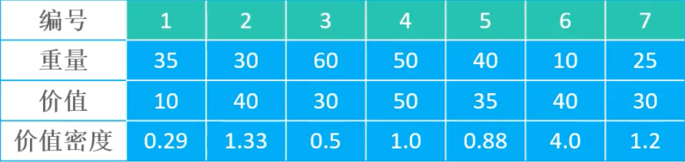

# 贪心（Greedy）

## 1.概述

贪心是一种在每一步都采取当前状态下最优的选择（局部最优解），从而希望推导出全局最优解的策略。

但是，贪心策略并不总是能得到全局最优解，因为一般没有测试所有可能的选择，容易过早地做出决定，所以不一定能得到最优解。**鼠目寸光**是贪心策略的一个形象比喻。

它的优点是实现简单，计算速度快，通常用于辅助决策。

## 2.应用

- [哈夫曼树]()
- [最小生成树算法]()
- [最短路径算法]()

## 2.练习

### 2.1.最优装载问题

问题描述：有一天，海盗们抢到了一艘装了一批古董货船，海盗船的重量为`W`，每件古董的重量为`w[i]`，海盗们怎么把尽可能多的物品装到海盗船上？

比如，`W = 30, w = [3, 5, 4, 10, 7, 14, 2, 11]`

贪心策略：每次都选择**最轻**的物品装入海盗船，直到装不下为止，如下：

1. 选择重量为`2`的古董，剩余重量`28`
2. 选择重量为`3`的古董，剩余重量`25`
3. 选择重量为`4`的古董，剩余重量`21`
4. 选择重量为`5`的古董，剩余重量`16`
5. 选择重量为`7`的古董，剩余重量`9`

最多能装`5`件古董，分别是`[2, 3, 4, 5, 7]`。

```java
import java.util.Arrays;

/**
 * 加勒比海盗
 *
 * @author yolk
 * @since 2025/10/13 00:48
 */
public class Caribbean {

    public static void load(int W, int[] w) {
        // 排序
        Arrays.sort(w);

        // 已装载的古董重量
        int weightSum = 0;
        for (int i = 0; i < w.length; i++) {
            if (w[i] > W - weightSum) {
                System.out.println("不能装载古董，重量：" + w[i]);
                break;
            }

            System.out.println("装载古董，重量：" + w[i]);
            weightSum += w[i];
        }
    }

    public static void main(String[] args) {
        int W = 30;
        int[] w = {3, 5, 4, 10, 7, 14, 2, 11};
        load(W, w);
    }

}
```

### 2.2.[零钱兑换](https://leetcode.cn/problems/coin-change/description/)

给定不同面额的硬币`coins`（数量是无限的）和一个总金额 `n`，编写一个函数来计算可以凑成总金额所需的最少的硬币个数，如果没有任何一种硬币组合能组成总金额，返回`-1`。

比如：`coins = [25, 10, 5, 1], n = 41`

贪心策略：每次都选择**面额最大的**硬币，直到凑成总金额为止，如下：

1. 选择`25`，剩余金额`16`
2. 选择`10`，剩余金额`6`
3. 选择`5`，剩余金额`1`
4. 选择`1`，剩余金额`0`

最少需要`4`枚硬币，分别是`[25, 10, 5, 1]`。

```java
import java.util.Arrays;

/**
 * 零钱兑换问题
 * <a href="https://leetcode.cn/problems/coin-change/">...</a>
 * 
 * @author yolk
 * @since 2025/10/13 01:00
 */
public class CoinChange {

    public static int change(int[] coins, int n) {
        Arrays.sort(coins);
        int count = 0;

        for (int i = coins.length - 1; i >= 0; i--) {
            if (n < coins[i]) {
                // 面值过大，无法使用
                continue;
            }
            n -= coins[i];
            count++;
            System.out.println("选择面值为 " + coins[i] + " 的硬币");
            // 继续尝试使用当前面值的硬币
            i++;
        }

        if (n > 0) {
            return -1;
        }

        return count;
    }

    public static void main(String[] args) {
        int[] coins = {1, 25, 5, 10};
        int n = 41;
        System.out.println(change(coins, n));
    }

}
```

上述实现是正确的吗？假如输入的数据是：`coins = [25, 20, 5, 1], n = 41`，还是按照上述贪心策略，则：

1. 选择`25`，剩余金额`16`
2. 选择`5`，剩余金额`11`
3. 选择`5`，剩余金额`6`
4. 选择`5`，剩余金额`1`
5. 选择`1`，剩余金额`0`

那么最少需要`5`枚硬币，分别是`[25, 5, 5, 5, 1]`，但是最优解是`3`枚硬币，分别是`[20, 20, 1]`，这也验证了`贪心策略并不一定能得到全局最优解`。

### 2.3.0-1 背包

有一个最大承重为`W`的背包和`n`件物品，每件物品有重量`w[i]`和价值`v[i]`，问如何选择装入背包的物品（每件物品只能选择一次），使得在不超过背包承量的前提下，背包内物品的总价值最大。

采用贪心策略，有`3`种方案：

1. 每次选择**价值最高**的物品
2. 每次选择**最轻**的物品
3. 每次选择**单位重量价值最高**的物品（`v[i] / w[i]`）

假设背包最大承重`W = 150`，共有`7`件物品，如下：



1. 价值主导：放入背包的物品编号`4, 2, 6, 5`，总重量`130`, 总价值`165`。
2. 重量主导：放入背包的物品编号`6, 7, 2, 1, 5`，总重量`140`, 总价值`155`。
3. 单位重量价值主导：放入背包的物品编号`6, 2, 7, 4, 1`，总重量`150`, 总价值`170`。

```java
import java.util.Arrays;
import java.util.Comparator;
import java.util.LinkedList;
import java.util.List;

/**
 * 0-1 背包
 *
 * @author yolk
 * @since 2025/10/13 01:56
 */
public class Backpack {

    /**
     * 物品对象
     */
    public static class Item {
        // 重量
        int weight;
        // 价值
        int price;
        // 价值密度 = 价值 / 重量
        double priceDensity;

        public Item(int weight, int price) {
            this.weight = weight;
            this.price = price;
            this.priceDensity = (double) price / weight;
        }

        @Override
        public String toString() {
            return "Item{" +
                    "weight=" + weight +
                    ", price=" + price +
                    ", priceDensity=" + priceDensity +
                    '}';
        }
    }

    /**
     * 使用贪心策略选择物品
     *
     * @param W          背包承量
     * @param items      物品列表
     * @param comparator 物品比较器
     */
    public static void select(int W, Item[] items, Comparator<Item> comparator) {
        Arrays.sort(items, comparator);
        int weightSum = 0, priceSum = 0;

        List<Item> selectItems = new LinkedList<>();
        for (int i = 0; i < items.length; i++) {
            Item item = items[i];

            if (item.weight > W) {
                // 如果该物品重量就超过背包承量，则跳过
                continue;
            }

            // 尝试选择第 i 个物品
            int nextWeightSum = weightSum + item.weight;
            if (nextWeightSum <= W) {
                // 如果选择该物品不会超重，则选择该物品
                selectItems.add(item);

                // 更新已选物品的总重量和总价值
                weightSum = nextWeightSum;
                priceSum += item.price;

            }
        }

        System.out.println("总重量：" + weightSum);
        System.out.println("总价值：" + priceSum);
        System.out.println("选择的物品有：");
        for (Item selectItem : selectItems) {
            System.out.println(selectItem);
        }

    }

    public static void main(String[] args) {
        Item[] items = new Item[]{
                new Item(35, 10),
                new Item(30, 40),
                new Item(60, 30),
                new Item(50, 50),
                new Item(40, 35),
                new Item(10, 40),
                new Item(25, 30)
        };

        // 背包承量
        int W = 150;

        // 价值主导
        // select(W, items, (a, b) -> b.price - a.price);

        // 重量主导
        // select(W, items, Comparator.comparingInt(a -> a.weight));
        
        select(W, items, (a, b) -> Double.compare(b.priceDensity, a.priceDensity));
    }

}
```