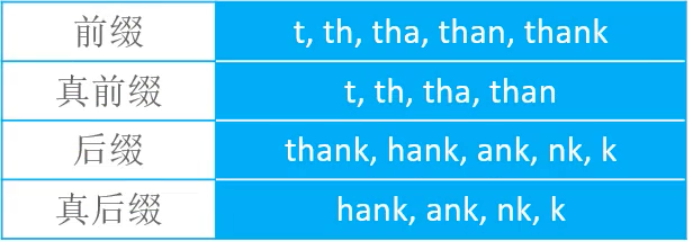

# 字符串匹配

## 1.概述


字符串是`由若干个字符组成`的有限序列，它有很多经典的算法，本文将介绍其中的`串匹配算法`。

字符串的匹配问题是指查找一个模式串`Pattern`在文本串`Text`中的位置，如下面代码所示：

```java
String text = "ababcabcacbab"; // length = 13

String pattern = "abcac";
int index = text.indexOf(pattern); // index = 5

pattern = "ab";
index = text.lastIndexOf(pattern); // index = 11
```
 
上面代码中，`indexOf`和`lastIndexOf`方法分别返回模式串`P`在主串`S`中第一次和最后一次出现的位置，它们底层实现了字符串匹配算法，下面介绍几种经典的字符串匹配算法：

- 蛮力匹配（Brute Force）
- KMP（Knuth-Morris-Pratt）
- BM（Boyer-Moore）
- Rabin-Karp
- Sunday

在讲解之前，先了解几个概念（假设字符串为`thank`）：`前缀（prefix）、真前缀（proper prefix）、后缀（suffix）、真后缀（proper suffix）`。
  
  

**注意**：在后文中使用`tlen`表示文本串`Text`的长度，`plen`表示模式串`Pattern`的长度。

## 2.蛮力匹配（Brute Force）

