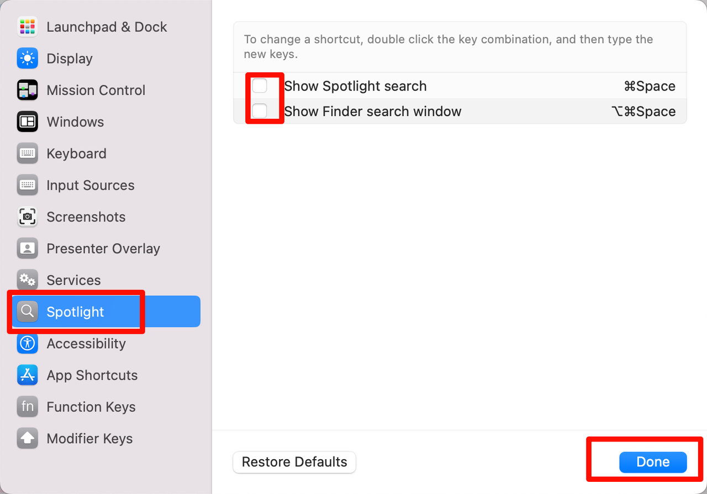
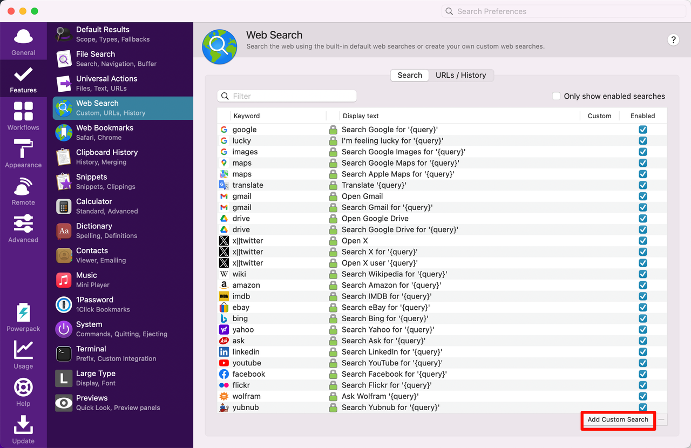
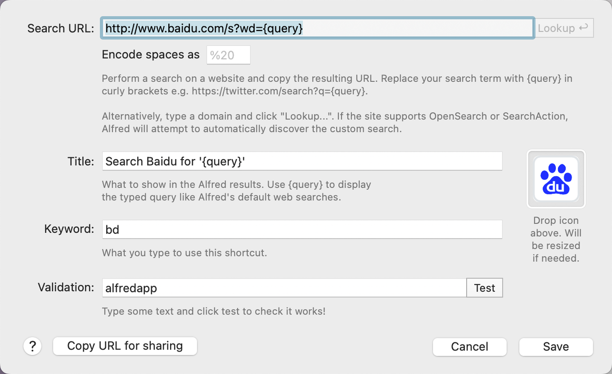
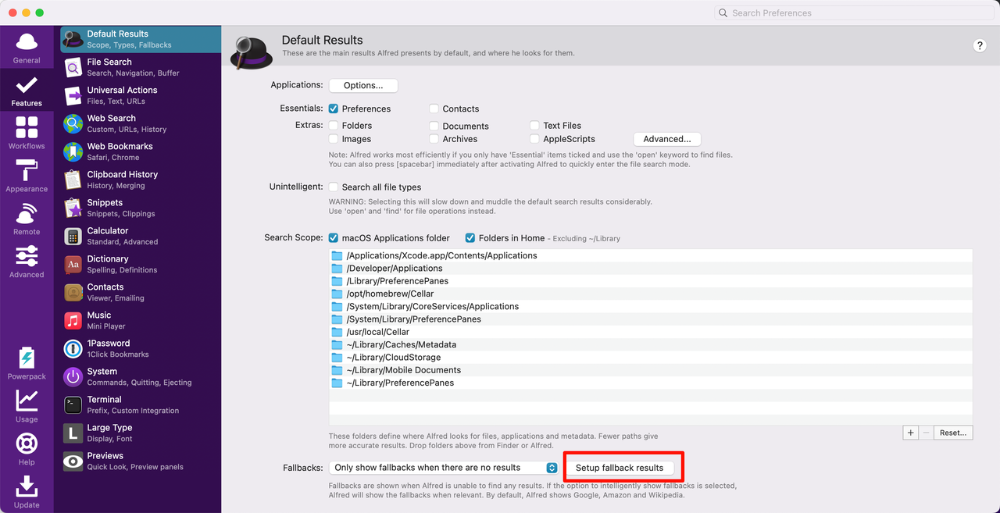
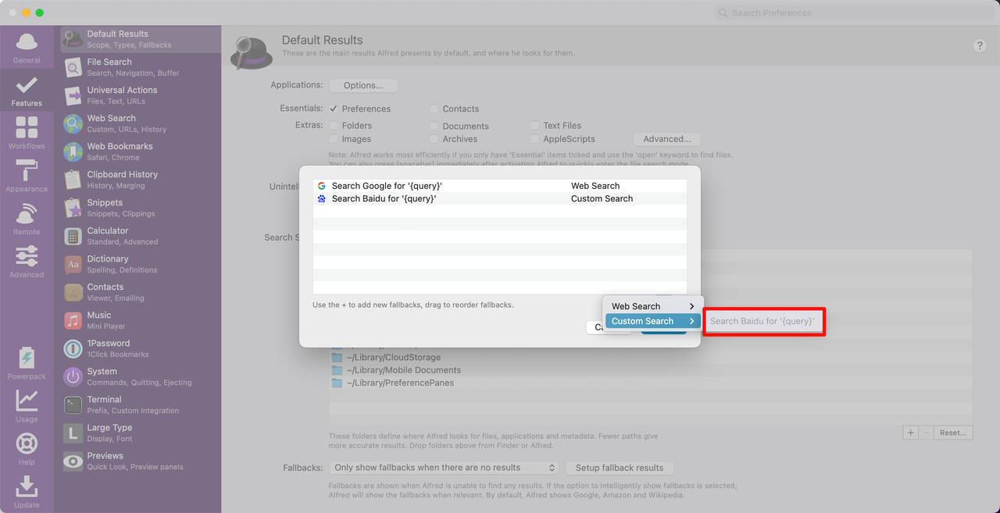
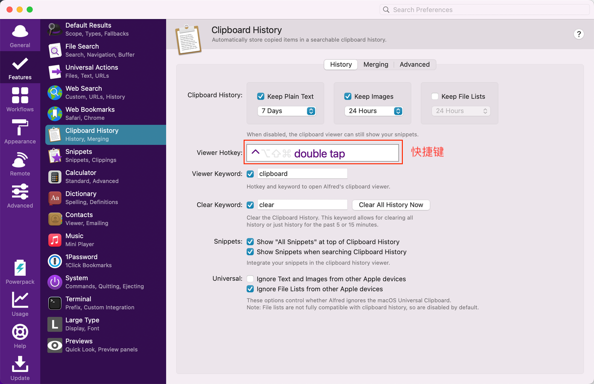
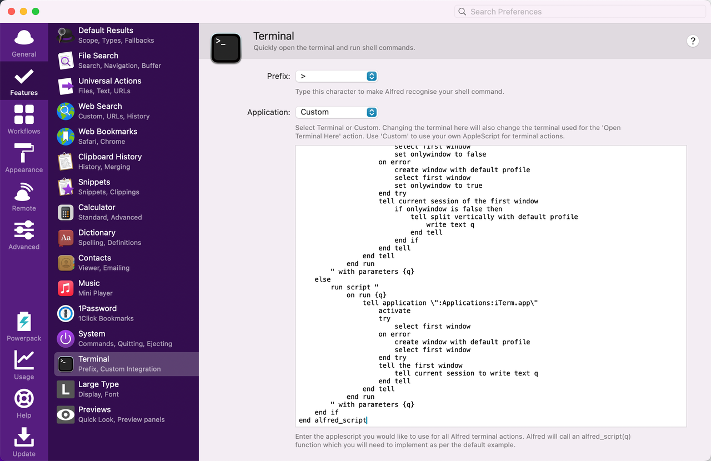
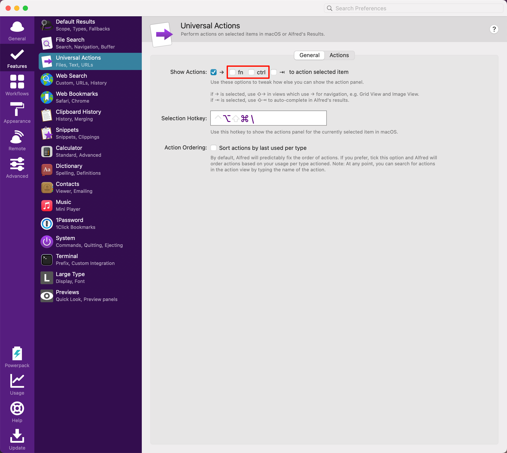
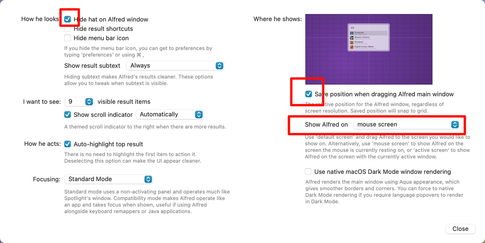

# Alfred

Alfred 是 macOS 上一款强大的生产力工具，允许用户通过快捷键快速启动应用程序、搜索文件、执行系统命令等。它可以极大地提高工作效率，尤其适合开发者和需要频繁切换任务的用户。

安装不做赘述，这里介绍下让 Alfred 更好用的配置以及工作流。

## 1.配置

1. 关闭 mac 自带的聚焦搜索：设置->键盘->键盘快捷键
   
   

2. Alfred 热键设置为 `Command + Space`，并启用 `Launch Alfred at login`。
   
   

3. 添加自定义搜索引擎，这里以百度为例：
   
   

   

   ```plaintext
   http://www.baidu.com/s?wd={query}
   Search Baidu for '{query}'
   https://www.iconfont.cn/search/index?searchType=icon&q=%E7%99%BE%E5%BA%A6&page=1&fills=1
   ```

   > logo 可以在[阿里巴巴矢量图标库](https://www.iconfont.cn/?spm=a313x.7781069.1998910419.d4d0a486a)搜索下载。

   设置搜索无结果时，追加使用使用百度搜索：

   

   

4. 关闭其他不必要的搜索源
   
   

5. 修改剪贴板快捷键以及历史记录保存时间

   

6. 设置终端命令为`iTerm2`。
   
   

   ```shell
   on alfred_script(q)  
    if application "iTerm2" is running or application "iTerm" is running then  
        run script "  
            on run {q}  
                tell application \":Applications:iTerm.app\"  
                    activate  
                    try  
                        select first window  
                        set onlywindow to false  
                    on error  
                        create window with default profile  
                        select first window  
                        set onlywindow to true  
                    end try  
                    tell current session of the first window  
                        if onlywindow is false then  
                            tell split vertically with default profile  
                                write text q  
                            end tell  
                        end if  
                    end tell  
                end tell  
            end run  
        " with parameters {q}  
    else  
        run script "  
            on run {q}  
                tell application \":Applications:iTerm.app\"  
                    activate  
                    try  
                        select first window  
                    on error  
                        create window with default profile  
                        select first window  
                    end try  
                    tell the first window  
                        tell current session to write text q  
                    end tell  
                end tell  
            end run  
        " with parameters {q}  
    end if  
   end alfred_script
   ```

6. 关闭多余的显示动作快捷键：
    
    

7. 从[官网](https://www.packal.org/theme-list)下载主题，双击打开即可导入，并根据个人喜好调整其余设置。
   
   

   
   

## 2.工作流

可以访问[此仓库](https://github.com/yolk23321/alfred-workflows)下载我整理的一些常用工作流，直接双击打开即可导入 Alfred。

注意：

- 网易云音乐插件需要配置快捷键：
  
  

- JetBrains 插件需要各个 IDE 创建好终端命令。
