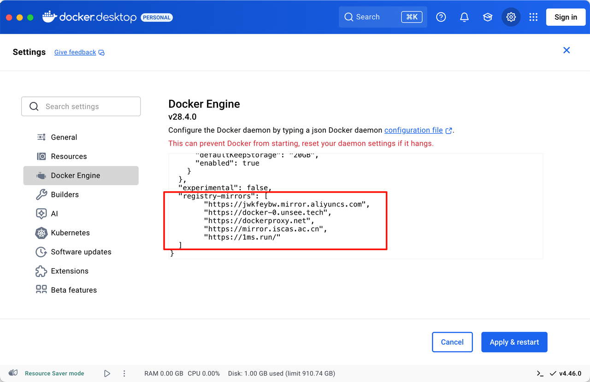
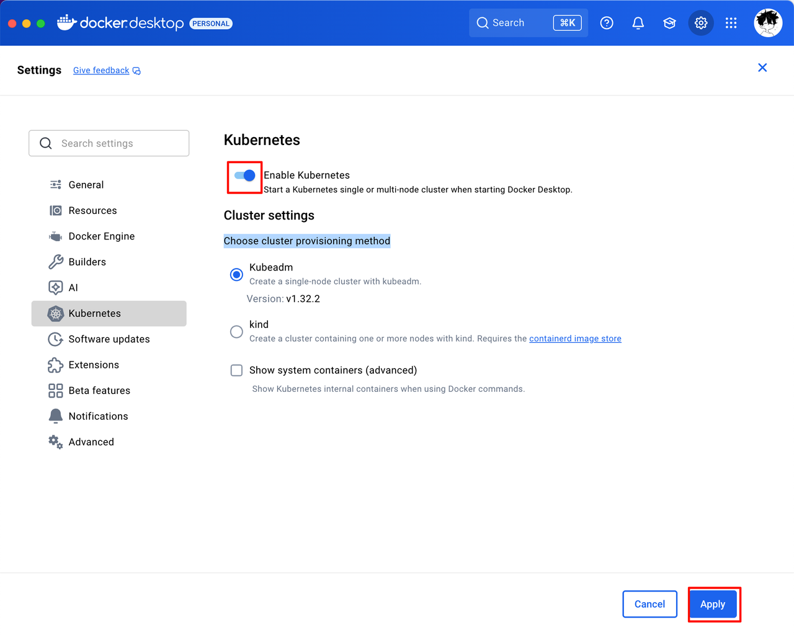

# 安装 Docker & Kubernetes

## 1.安装 Docker
   
从[官网](https://www.docker.com/) 下载并安装 Docker Desktop，它包含了 Docker 引擎和 Docker CLI 工具，安装完成后可以通过命令行使用 Docker。

打开设置， 修改以下几处：

1. 关闭当 Docker Desktop 启动时自动打开 Dashboard：

   

2. 修改镜像源为国内源（可选）：
   
   
   
   > 镜像源可以查看[此仓库](https://gist.github.com/y0ngb1n/7e8f16af3242c7815e7ca2f0833d3ea6)

3. 配置资源限制（可选）：
   
   

   ```plaintext
   CPU Limit: 总CPU核数的一半
   Memory Limit: 总内存的 1/3 ~ 1/2
   Swap: 1~2 倍内存上限(Memory Limit /2)
   Disk Image Size: 60~100 GB
   ```

4. 关闭自动更新（可选）：

   

5. 保存并重启 Docker Desktop。

6. 安装常用的中间件镜像，可以访问[此仓库](https://github.com/yolk23321/docker-compose-collection)

## 2.安装 Kubernetes

Docker Desktop 自带了 Kubernetes 集群，可以直接启用。



等待 Kubernetes 启动完成后，可以通过命令行使用 kubectl 工具来管理 Kubernetes 集群。

1. 打开`~/.kube/config`文件，查看 Kubernetes 集群的配置信息：
   
   

   > `docker-desktop`是默认的集群名称。如果需要连接其他 Kubernetes 集群，直接同理追加配置即可。

2. 安装[krew](https://krew.sigs.k8s.io/docs/user-guide/setup/install/)，它是 kubectl 的插件管理工具：
   
    ```shell
    (set -x; cd "$(mktemp -d)" &&OS="$(uname | tr '[:upper:]' '[:lower:]')" &&ARCH="$(uname -m | sed -e 's/x86_64/amd64/' -e 's/\(arm\)\(64\)\?.*/\1\2/' -e 's/aarch64$/arm64/')" &&KREW="krew-${OS}_${ARCH}" &&
    curl -fsSLO "https://github.com/kubernetes-sigs/krew/releases/latest/download/${KREW}.tar.gz" &&
    tar zxvf "${KREW}.tar.gz" &&
    ./"${KREW}" install krew
    )
    ```

    复制到终端执行即可：

    

    在`~/.zshrc`中追加如下内容：

    ```shell
    # 顺便加个别名
    alias k=kubectl
    # 为别名 k 启用 kubectl 的自动补全功能。__start_kubectl 是 kubectl 自带的补全函数。
    complete -o default -F __start_kubectl k
    # 检查 kubectl 是否在系统里 ($commands[kubectl] 表示是否能找到命令)。
    [[ $commands[kubectl] ]] && source <(kubectl completion zsh)
    export PATH="${KREW_ROOT:-$HOME/.krew}/bin:$PATH"
    ```

    保存并执行`source ~/.zshrc`使配置生效。

3. 使用 krew 安装几个插件：
   
    ```shell
    k krew install ctx        # 用于快速切换 Kubernetes 上下文
    k krew install ns         # 用于快速切换命名空间
    k krew install neat       # 用于清理冗余的 Kubernetes 资源
    k krew install tree       # 以树状图形式显示 Kubernetes 资源的层级关系
    ```

    > `k` 是在上一步中为 `kubectl` 创建的别名。

