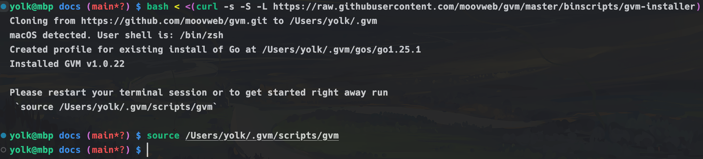

# 安装 Go

## 1.下载并安装 Gvm

它是一个 Go 版本管理工具，可以让你轻松地在不同的 Go 版本之间切换，[官网地址](https://github.com/moovweb/gvm)

```bash
bash < <(curl -s -S -L https://raw.githubusercontent.com/moovweb/gvm/master/binscripts/gvm-installer)
source ~/.gvm/scripts/gvm
```



## 2.配置环境变量

编辑`~/.zshrc`文件，追加以下内容：

```bash
# 设置 Go Modules 的下载代理为国内镜像
export GOPROXY=https://goproxy.io,direct
# 使用 Gvm 进行 Go 的预编译二进制安装包进行安装时，则会使用下面的镜像地址
export GO_BINARY_BASE_URL=https://golang.google.cn/dl/ 
```

Go 镜像地址:

- 官网地址: https://go.dev/dl/
- 国内镜像: https://golang.google.cn/dl/
- 阿里云镜像: https://mirrors.aliyun.com/golang/
- 中科大镜像: http://mirrors.ustc.edu.cn/golang/

## 3.安装 Go

```bash
gvm install go1.21.1 -B
gvm use go1.21.1 --default
go version
```

## 4.Gvm 常用命令

```bash
# 查看已经安装的版本
gvm list

# 查看所有可用版本
gvm listall

# 安装指定版本，-B 表示从预编译的二进制文件安装
gvm install go1.16.5 -B

# 使用指定版本，并设置为默认版本
gvm use go1.16.5 --default

# 卸载指定版本
gvm uninstall go1.21.2
```

## 5.编译安装（一般不用）

Go 编译器是用 Go 语言写的（先有鸡还是先有蛋的问题），所以需要一个已经安装好的 Go 版本来编译安装新的 Go 版本。
如果没有安装过 Go，可以先安装一个旧版本的 Go，然后再用它来编译安装新版本的 Go。

```bash
gvm install go1.20 -B
gvm use go1.20 --default
```

由于需要下载源码，Gvm 使用的镜像地址是从 github 上下载的，我们需要把它改成国内的镜像地址。
编辑`~/.gvm/scripts/instal`文件，搜索`GO_SOURCE_URL`，换成下面的地址：

```bash
GO_SOURCE_URL=https://golang.google.cn/dl/
```

假设我们要安装`1.25.2`版本，我们先安装并使用一个低版本`1.20.1`，然后可以用它来编译安装`1.25.2`。

```bash
# 安装低版本（预编二进制安装，加上 -B 参数）
gvm install go1.20.1 -B
gvm use go1.20.1 --default
go version

# 安装目标版本（源码编译安装，不加 -B 参数）
gvm install go1.25.2
gvm use go1.25.2 --default
go version
```

## 6.如何卸载 Gvm 

将`~/.gvm`目录删除即可，然后清理掉前文中在 ~/.zshrc 中添加的内容即可，然后重启终端。

如果遇到下载二进制文件出现问题，可以尝试进行缓存清理：

```bash
rm -rf ~/.gvm/archives
```


