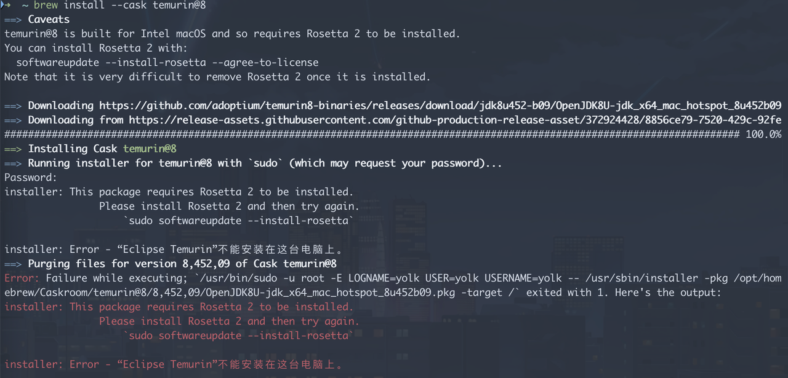
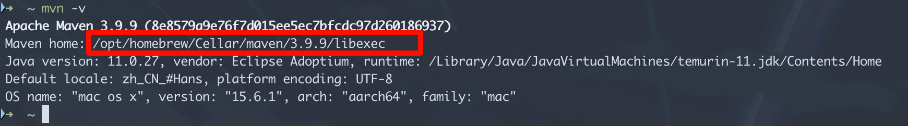
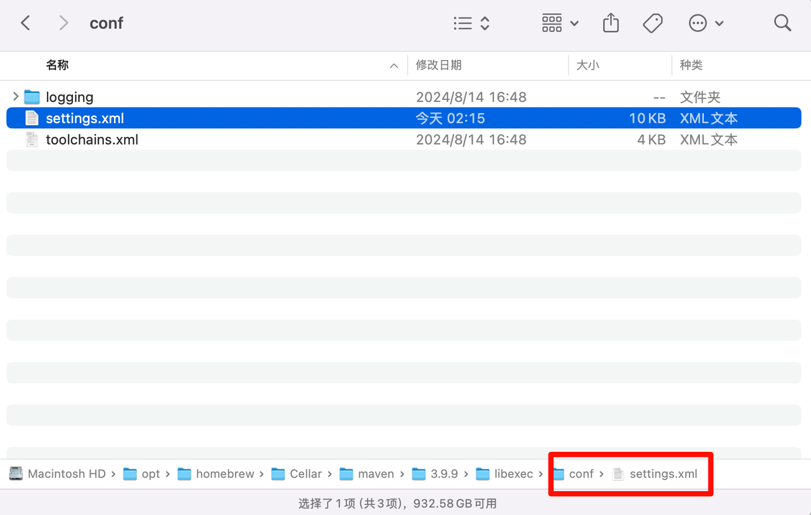
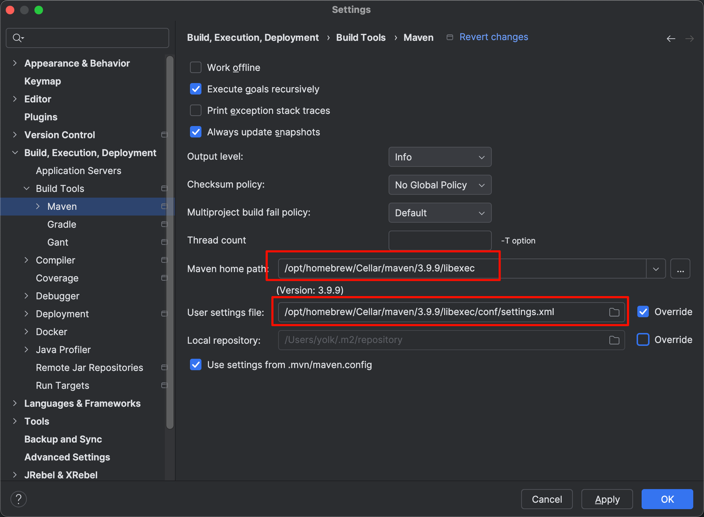
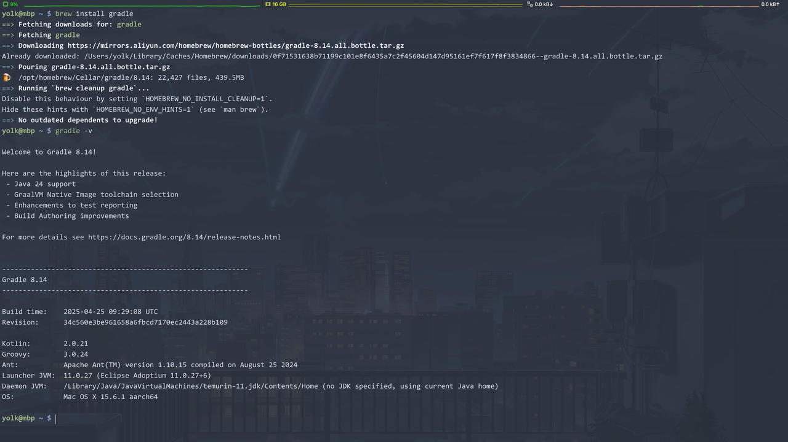
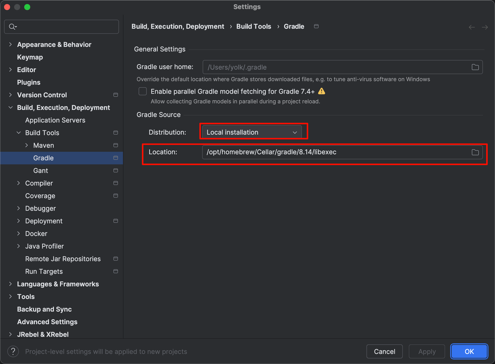

# 搭建 Java 开发环境

众所周知，OpenJDK 是 Java 的开源版本，众多厂商和社区也基于 OpenJDK 提供了自己的下游发行版，其中`Eclipse Temurin`是目前最受欢迎的一个发行版，这里就以此版本进行安装说明。

## 1.安装 JDK

Jenv 是一个 Java 版本管理工具，可以方便地在多个 Java 版本之间切换。

1. 执行命令安装 Jenv：

    ```shell
    brew install jenv
    (echo; echo 'export PATH="$HOME/.jenv/bin:$PATH"'; echo 'eval "$(jenv init -)"') >> ~/.zshrc
    source ./zhsrc
    ```

2. 安装多个版本 JDK

    ```shell
    brew install --cask temurin@21
    brew install --cask temurin@17
    brew install --cask temurin@11
    brew install --cask temurin@8
    ```

    如果安装 jdk8 出现如下错误：

    

    则需要安装`rosetta`，这是因为 JDK8 仅支持 x86 架构：

    ```shell
    # 执行后，需要输入 A
    sudo softwareupdate --install-rosetta
    ```

3. 将 JDK 添加到 Jenv

    ```shell
    jenv add /Library/Java/JavaVirtualMachines/temurin-8.jdk/Contents/Home
    jenv add /Library/Java/JavaVirtualMachines/temurin-11.jdk/Contents/Home
    jenv add /Library/Java/JavaVirtualMachines/temurin-17.jdk/Contents/Home
    jenv add /Library/Java/JavaVirtualMachines/temurin-21.jdk/Contents/Home
    ```

4. Jenv 常用命令

    ```shell
    --查看可用版本
    jenv versions

    --全局切换版本
    jenv global 1.8

    --设置当前目录下的版本，会生成一个 .java-version 文件，里面是版本号
    jenv local 1.8

    --设置当前shell会话的版本
    jenv shell 1.8
    ```

5. Jenv 启用插件

    现在可以通过 jenv 实现在不同环境下使用不同的 jdk 版本，但是`maven`和`gradle`这类工具还是使用的全局默认版本的`jdk`，如果希望它们使用当前环境设置的jdk版本，则需要启用插件

    ```shell
    jenv enable-plugin export
    jenv enable-plugin maven
    jenv enable-plugin gradle
    ```

6. Jenv 支持使用`.java-version`文件来指定项目的 JDK 版本，只需要在项目根目录下创建该文件，内容为所需的 JDK 版本号即可，例如：

    ```plaintext
    17.0
    ```

   在该项目目录下打开终端，Jenv 会自动切换到指定的 JDK 版本。

## 2.安装 Maven

1. 执行命令
   
    ```shell
    brew install maven
    ```

2. 修改 maven 镜像源为阿里云

    查找 maven 的安装路径：

    ```shell
    mvn -v
    ```

    

    进入`conf`目录，编辑`settings.xml`文件

    

   在`<mirrors></mirrors>`标签里面增加红色部分：

    ```xml
    <mirrors>
        <mirror>
        <id>aliyun</id>
        <mirrorOf>central</mirrorOf>
        <name>aliyun maven</name>
        <url>https://maven.aliyun.com/repository/central</url>
        </mirror>
        <mirror>
        <id>central</id>
        <mirrorOf>central</mirrorOf>
        <name>central repo</name>
        <url>https://repo1.maven.org/maven2/</url>
        </mirror>
    </mirrors>
    ```

3. IDEA 配置安装的 maven（IDEA 其实自带 maven），注意不要打开任何项目，在选择项目的界面打开设置进行更改：
   
   

## 4.安装 Gradle

1. 执行命令
   
    ```shell
    brew install gradle

    gradle -v
    ```

    

2. 修改 gradle 镜像源为阿里云，进入`~/.gradle`目录下，新建`init.gradle`文件，内容如下：

    ```groovy
    allprojects {
        // 项目所需的 jar 包会从 repositories 中的地址进行拉取
        repositories {
            // maven 本地仓库
            mavenLocal()
            maven { name "Authing"; url "https://nexus.authing-inc.co/repository/maven-public/" }
            maven { name "Aliyun"; url "https://maven.aliyun.com/repository/public" }
            mavenCentral()
        }
        
        //  项目的build.gradle如果本身需要某些 jar 包，则从此配置中的地址拉取镜像
        buildscript {
            repositories {
                maven { name "Authing"; url "https://nexus.authing-inc.co/repository/maven-public/" }
                maven { name "Aliyun"; url "https://maven.aliyun.com/repository/public" }
            }
        }
    }
    ```

3. IDEA 配置安装的 gradle（IDEA 其实自带 gradle），注意不要打开任何项目，在选择项目的界面打开设置进行更改：
   
   

