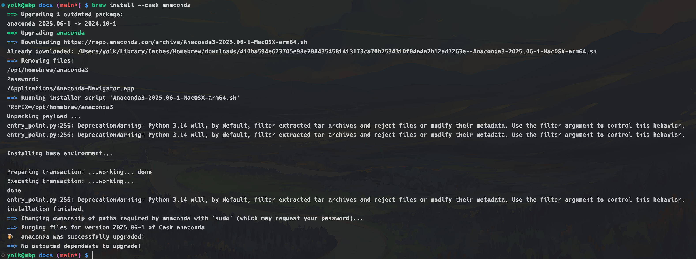
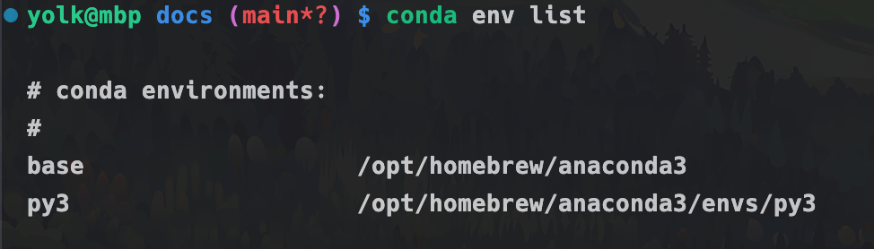
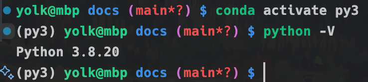
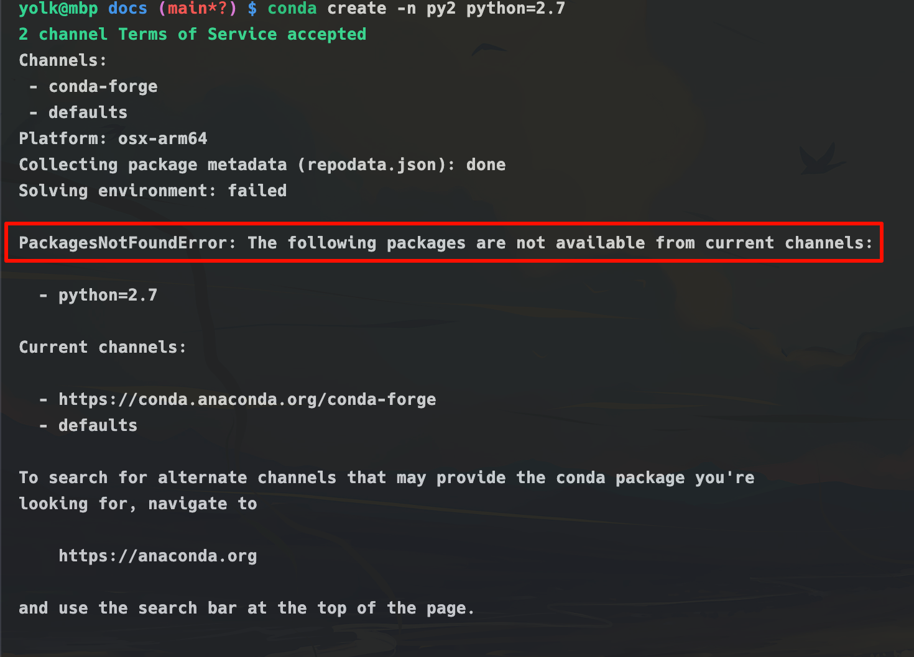
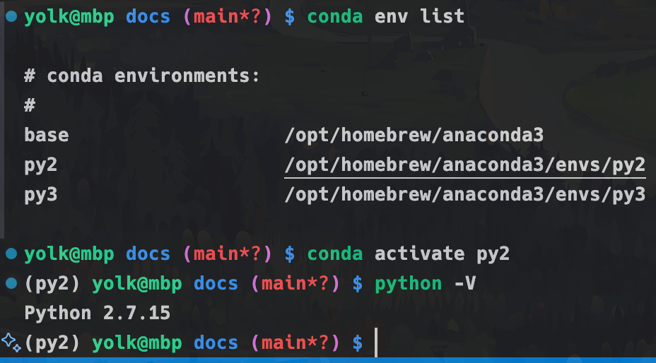
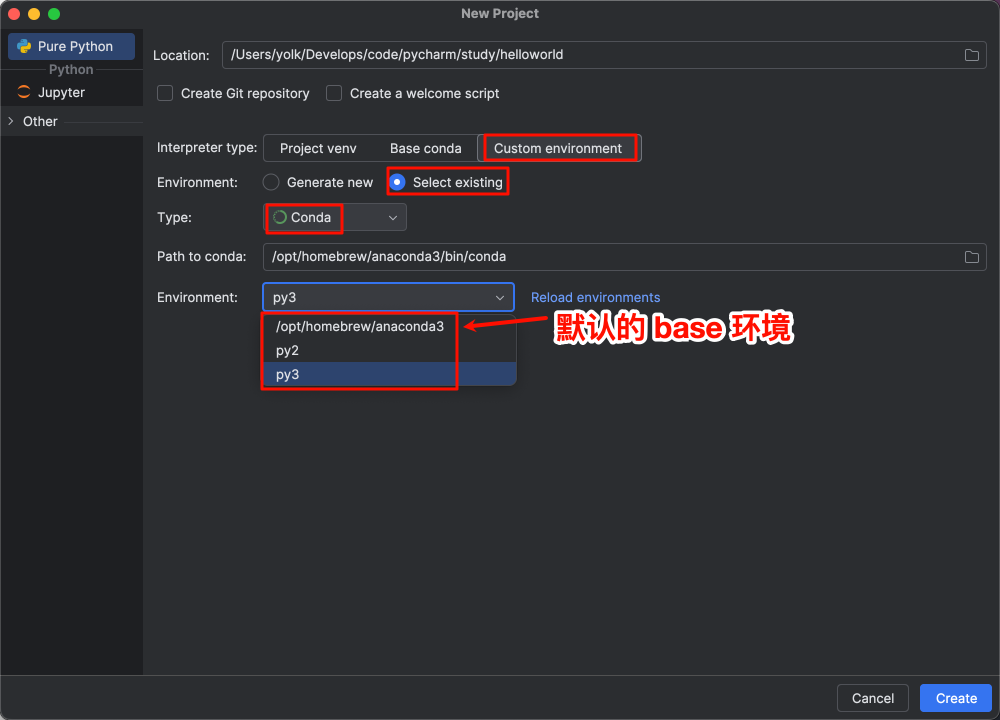
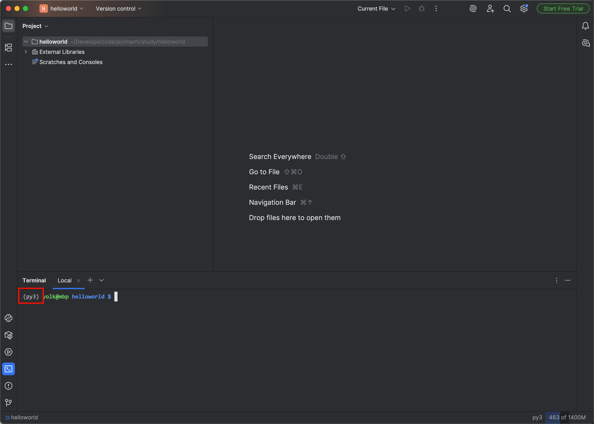

# 安装 Python

MacOS 通常预装了 Python 2.x 版本，甚至现在新系统预装了 Python 3.x 版本。
这里说下使用`anaconda`来管理 Python 版本和包。类似的工具还有`pyenv`和`virtualenv`等

## 1.下载并安装 Anaconda

```bash
brew install --cask anaconda
```



配置环境变量

```bash
echo 'export PATH="/opt/homebrew/anaconda3/bin:$PATH"' >> ~/.zshrc
source ~/.zshrc
```

## 2.激活 anaconda

```bash
# zsh 是终端类型，如果是 bash 则改成 bash
conda init zsh
```

如果激活后自动进入 base 环境（终端命令行前多了`base`，它是anaconda默认的一个环境），如


现在退出`base`环境，执行命令

```bash
conda deactivate
```

如果不想每次打开终端都进入 base 环境，可以执行下面的命令

```bash
conda config --set auto_activate_base false
```

## 3.配置镜像源

```bash
#添加conda-forge国内源
conda config --add channels conda-forge
```

## 4.创建 python3 环境

```bash
conda create -n py3 python=3.8
conda env list
```



进入python3环境

```bash
conda activate py3
python -V
```



退出环境

```bash
conda deactivate
```

## 5.安装 python2 环境

```bash
conda create -n py2 python=2.7
```



这是因为我的 mac 系统是 osx-arm64 架构，Python 2.7 在 osx-arm64 平台发布之前就已停用了，所以需要指定在 osx-64 平台安装

```bash
# 指定平台是 osx-64
CONDA_SUBDIR=osx-64 conda create -n py2 python=2.7
conda activate py2
# 为当前环境锁定平台是 osx-64
conda config --env --set subdir osx-64
python -V
```

> Apple 提供了一个 x86_64 模拟器 Rosetta，它可以运行 x86_64 二进制文件，例如在 Conda 环境中使用 osx-64 子目录安装的二进制文件



## 6.anaconda 常用命令

```bash
# 查询 anaconda 版本
conda --version

# 查看 anaconda 环境
conda info

# 查看镜像源
conda config --show channels

# 删除所有的镜像源，即恢复官方源
conda config --remove-key channels

# 配置安装包时显示镜像源地址
conda config --set show_channel_urls yes

# 查看当前有哪些虚拟环境
conda env list
# 或者
conda info --envs

# 创建一个新的虚拟环境，指定 Python 版本
# -n 或者 --name 指定环境名称
conda create -n xxx python=3.8

# 激活虚拟环境，xxx 是上面创建的环境名称
conda activate xxx

# 退出虚拟环境
conda deactivate

# 删除虚拟环境
conda remove -n xxx --all

# 复制虚拟环境
conda create --name new_env_name --clone old_env_name

# 安装包
conda install package_name

# 安装指定版本的包
conda install package_name=version_number

# 删除包
conda remove package_name

# 删除没有用的包
conda clean -p

# 升级包
conda update package_name

# 升级所有包
conda update --all
```

## 7.Pycharm 创建新项目时选择 anaconda 环境



创建好后，进入项目，打开终端，发现自动进入了 py3 环境

