# SSH & Git

公司一般会有自己的 Git 服务器，我们通过创建 SSH Key 并将公钥上传到服务器来实现免密登录，从而方便我们进行代码的拉取和推送操作，不过我们也会使用 GitHub、GitLab 等第三方代码托管平台，同样也是通过 SSH Key 来实现免密登录。

现在我想实现在不同的项目中，能够自动切换不同的 SSH Key，从而使用不同的身份进行代码的拉取和推送操作。

## 1.生成 SSH Key

SSH Key 的类型有很多种，其中`ed25519`是目前最安全、加解密速度最快的类型，由于其数学特性，它的 key 长度比 rsa 小很多，优先推荐使用。这里我们使用`ed25519`类型来生成 SSH Key。

命令：`ssh-keygen -t xxx -f xxx -C "xxx"`：

- `-t`：指定生成的密钥类型，如 rsa、ed25519...。
- `-f`：指定生成的密钥文件存放路径和名称。
- `-C`：为生成的密钥添加注释，通常使用邮箱地址。

生成两对 SSH Key，分别用于 GitHub 和工作环境（假设我的公司是 Authing）：

```shell
# 为 github 生成一对密钥
ssh-keygen -t ed25519 -f ~/.ssh/id_ed25519_github -C "yolk23321@163.com"

# 为工作环境生成一对密钥，（邮箱换成工作邮箱）
ssh-keygen -t ed25519 -f ~/.ssh/id_ed25519_authing -C "huangqiang@authing.com" 
```

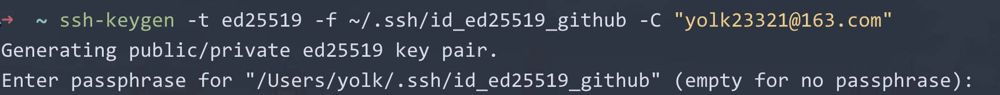

这里是确认是否需要给私钥再加一层"密码保护"，直接回车，表示不设置密码，否则输入一个密码，表示以后每次用这个私钥连接服务器时，系统都会要求输入这段密码，所以这里回车即可。

::: code-group

```md:img [<1>]
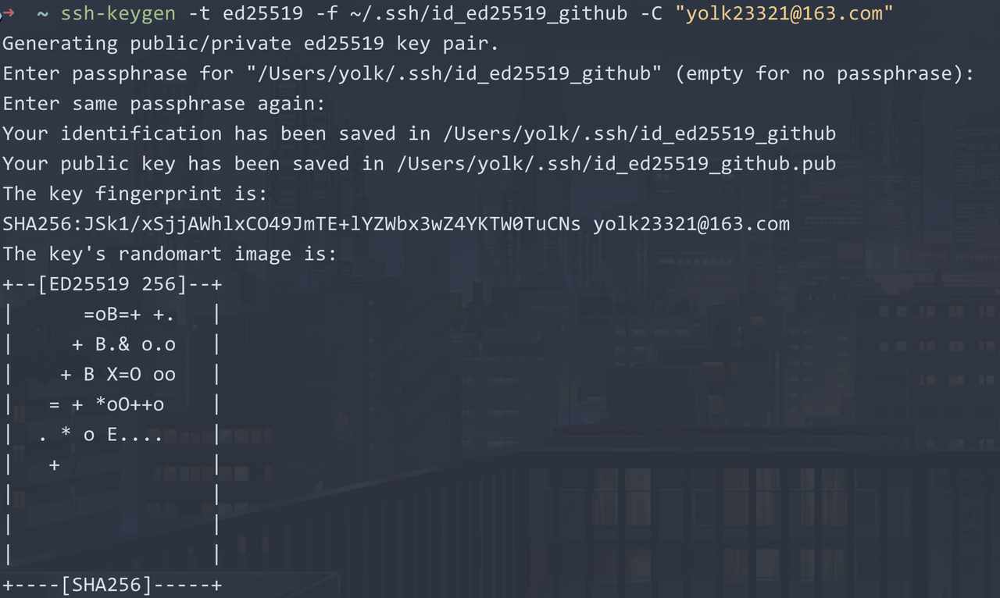
```

```md:img [<2>]
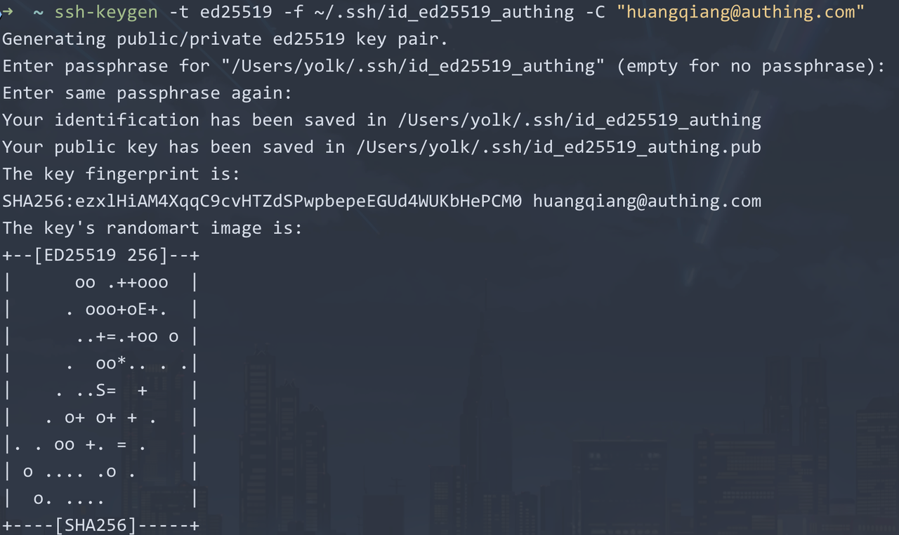
```

:::

查看`~/.ssh/`目录下生成的密钥文件（4 个文件）：

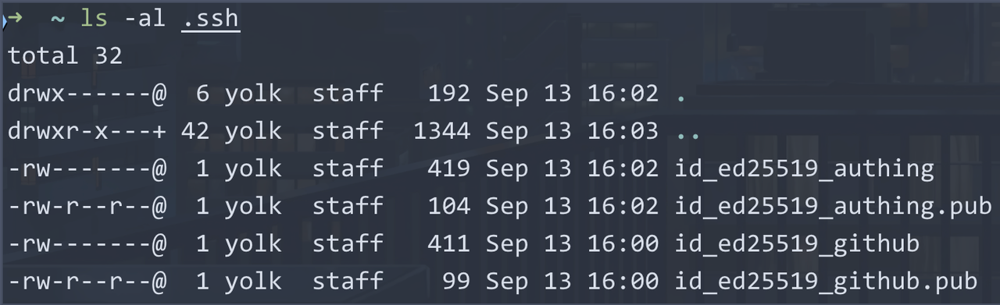

## 2.添加公钥到对应的 Git 服务器

下文以 github 为例，公司的 Git 服务器操作类似。

1. 复制id_ed25519_github.pub文件内容：

    ```shell
    pbcopy < ~/.ssh/id_ed25519_github.pub
    ```

    > 解释下为什么是公钥，因为我们是要向 git 仓库拉取和推送代码，那么我们是发送消息方，而 git 仓库需要确认此请求是来自我们。

2. 在平台上粘贴公钥：
   
   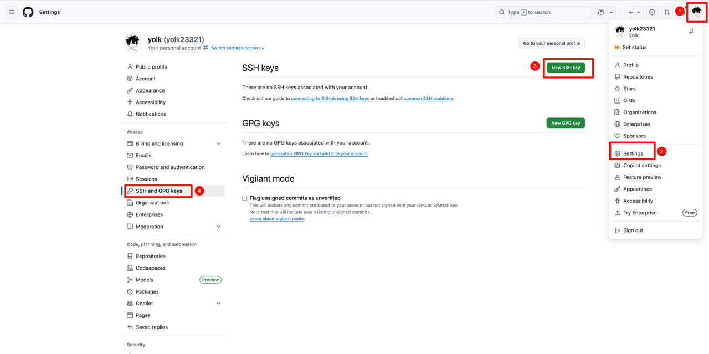

## 3.将多个私钥添加到 SSH Agent

`ssh-agent`是一个在后台运行的**钥匙串服务**，可以把私钥（和它的解锁密码，如果设置了`passphrase`）加载进去，之后任何需要用这个私钥的程序（例如 ssh 或 git）都会去问 ssh-agent 拿，而不用你每次手动输入。

```shell
ssh-add ~/.ssh/id_ed25519_github
ssh-add -K ~/.ssh/id_ed25519_authing
```

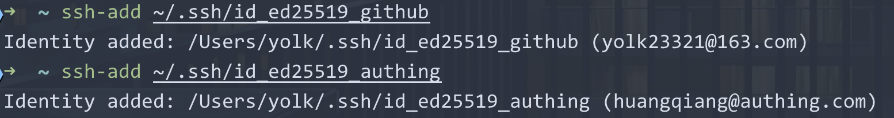

不过 ssh-agent 有一个缺点，就是在系统重启后，之前添加的**私钥会丢失**，需要**重新添加**，这里使用一个脚本来实现自动添加私钥，编辑`~/.zshrc`文件，添加如下内容：

```shell
# 加入密钥到 ssh-agent 中
if [ -z "$SSH_AUTH_SOCK" ] ; then
    eval "$(ssh-agent -s)"
fi
for key in ~/.ssh/id_*; do
    # 只加入存在且可读的文件，并排除公钥
    if [[ -f "$key" && "$key" != *.pub ]]; then
        ssh-add -q "$key" 2>/dev/null
    fi
done
```

## 4.配置 SSH 客户端

SSH 客户端的配置文件是`~/.ssh/config`，这个文件可以用来为不同的主机配置不同的连接选项，比如指定不同的端口、用户名、使用的私钥文件等。

执行命令：

```shell
# 如果不存在则创建文件
touch ~/.ssh/config
vim ~/.ssh/config
```

添加如下内容：

```text
Host github
  HostName github.com
  IdentityFile ~/.ssh/id_ed25519_github
  User git

Host authing
  HostName gitlab.authing-inc.co
  IdentityFile ~/.ssh/id_ed25519_authing
  User git
```

- `Host`：这是一个别名，可以是任意名称，用于在连接时引用该主机配置。
- `HostName`：这是实际的主机名或 IP 地址，用于连接到远程服务器。
- `IdentityFile`：指定用于该主机的私钥文件路径。
- `User`：指定连接到远程服务器时使用的用户名，如果是 Git 服务器，通常是`git`。

## 5.测试链接

```shell
ssh -T github
```

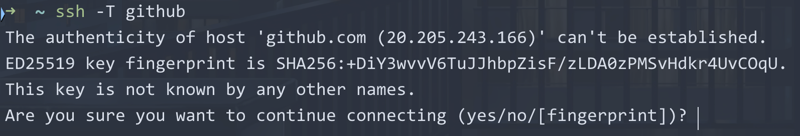

当你第一次连接到一个新主机时，你的电脑里没有它的记录，所以它无法自动验证对方的真实身份。因此，它必须停下来向你确认，输入`yes`即可：

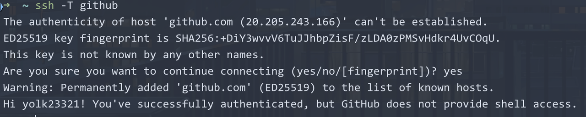

公司的 Git 服务器测试同理：

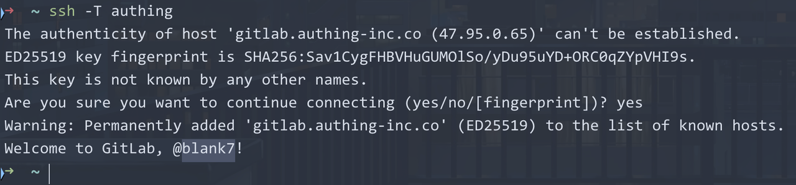

## 6.为不同的 Git 服务器添加对应的配置文件

1. 删除 Git 已经配置的用户名和邮箱

    ```shell
    git config --global --unset user.email
    git config --global --unset user.name
    ```

2. 为 GitHub 添加配置文件`~/.gitconfig_github`，内容如下：
   
    ```ini
    [user]
        name = yolk
        email = yolk23321@163.com
    ```

3. 为公司的 Git 服务器添加配置文件`~/.gitconfig_authing`，内容如下：
   
    ```ini
    [user]
        name = huangqiang
        email = huangqiang@authing.com
    ```

4. 打开 Git 全局配置文件`~/.gitconfig`，添加如下内容：

    ```ini
    [user]
        name = test
        email = test@gmail.com

    [includeIf "gitdir:/Users/yolk/Develops/code/vscode/authing/"]
        path = ~/.gitconfig_authing
        
    [includeIf "gitdir:/Users/yolk/Develops/code/idea/authing/"]
        path = ~/.gitconfig_authing
        
    [includeIf "gitdir:/Users/yolk/Develops/code/vscode/github/"]
        path = ~/.gitconfig_github
    ```

    第一个`[user]`配置是一个默认的用户信息，当你在不匹配任何`includeIf`条件的仓库中提交代码时，会使用这个默认的用户信息。

    后面的三个`[includeIf]`是我按照自己的风格放到不同的文件夹下进行分类而定义的，所以可以按照自己的情况自行追加多个`[includeIf]`。
    
    `path`配置项是指使用哪个`gitconfig`，这样就能在不同项目中实现 git 配置区分。

    > **注意**：`gitdir`后面的路径需要以斜杠`/`结尾，表示这是一个目录。

5. 进入不同的项目目录，进行测试
   1. 进入`/Users/yolk/Develops/code/vscode/authing/`目录下，执行如下命令：
   
        ```shell
        -- 创建一个项目
        mkdir test-authing
        cd test-test 
        git init

        -- 查看配置是否符合预期（输出的用户名应该是`~/.gitconfig_authing`文件中配置的）
        git config --get user.name
        ```

        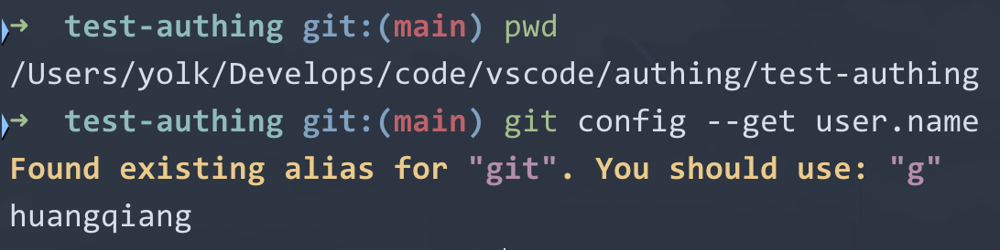

   2. 进入`/Users/yolk/Develops/code/vscode/github/`目录下，依旧同上，输出的用户名应该是`yolk`：
   
        

   3. 进入不是上面 3 个配置的路径中一个项目，输出的用户名应该是默认的配置`test`：
    
        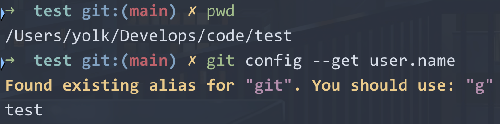

6. 至此已经完成 Git 多账户配置，最后给一份我的`~/.gitconfig`配置：

    ```ini
    [user]
        name = yolk
        email = yolk23321@163.com

    [includeIf "gitdir:/Users/yolk/Develops/code/vscode/authing/"]
        path = ~/.gitconfig_authing
    [includeIf "gitdir:/Users/yolk/Develops/code/idea/authing/"]
        path = ~/.gitconfig_authing


    [core]
        pager = delta
        autocrlf = input
        excludesfile = ~/.gitignore_global

    [pull]
        rebase = true
        
    [push]
        default = current

    [fetch]
        prune = true

    [color]
        ui = auto
    ```

    `~/.gitignore_global`内容：

    ```gitignore
    ### macOS ###
    .DS_Store
    .AppleDouble
    .LSOverride
    __MACOSX/

    # Icon must end with two \r
    Icon


    ### JetBrains IDEs (IntelliJ IDEA, GoLand, PyCharm, etc.) ###
    .idea/
    *.iml
    *.ipr
    *.iws
    out/
    # Plugin-specific
    .idea_modules/
    .idea/**/workspace.xml
    .idea/**/tasks.xml
    .idea/**/dictionaries
    .idea/**/shelf


    ### VSCode ###
    .vscode/
    .history/
    *.code-workspace


    ### Java ###
    *.class
    *.log
    *.ctxt
    *.jar
    *.war
    *.ear
    hs_err_pid*
    replay_pid*
    # Gradle
    .gradle/
    build/
    .java-version
    # Maven
    target/
    dependency-reduced-pom.xml
    # Eclipse leftovers
    .project
    .classpath
    .settings/
    bin/


    ### JavaScript / Node.js ###
    node_modules/
    npm-debug.log*
    yarn-debug.log*
    yarn-error.log*
    .pnpm-debug.log*
    .next/
    dist/
    coverage/
    .cache/
    .parcel-cache/
    .nyc_output/
    storybook-static/
    .babel-cache/

    ### Python ###
    __pycache__/
    *.py[cod]
    *.pyo
    *.pyd
    *.so
    *.egg
    *.egg-info/
    .eggs/
    build/
    develop-eggs/
    dist/
    pip-wheel-metadata/
    .tox/
    .coverage
    htmlcov/
    .mypy_cache/
    .pytest_cache/
    .pyre/
    .dmypy.json
    .pytype/
    .ipynb_checkpoints/


    ### Go ###
    # Binaries
    *.exe
    *.exe~
    *.dll
    *.so
    *.dylib
    *.test
    *.out
    # Go workspace
    bin/
    pkg/

    ### other ###
    .hushlogin
    ```