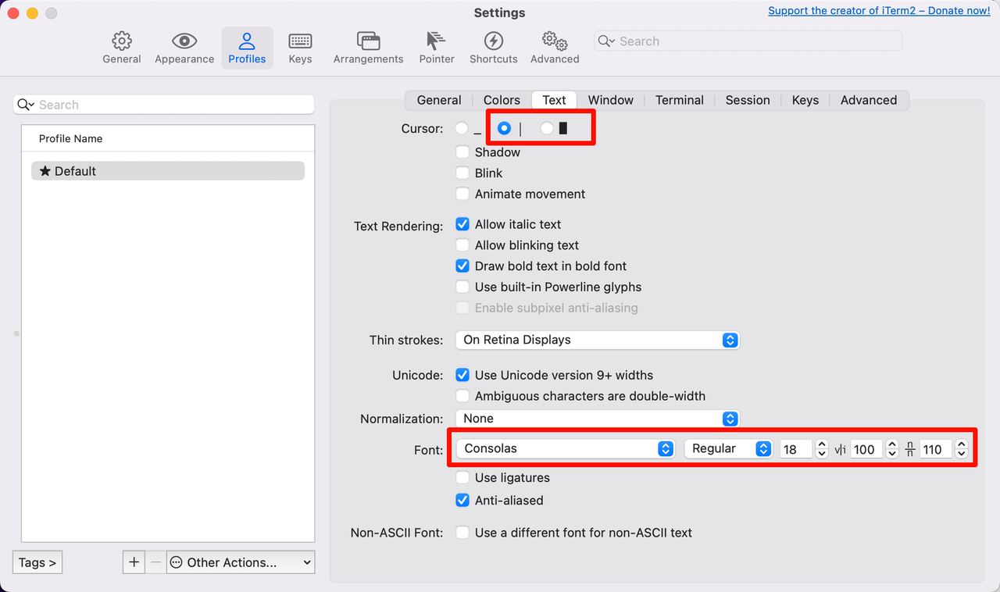

# 让终端更好用

macOS 自带的终端应用功能较为基础，推荐使用 iTerm2 作为替代，并配合 Oh My Zsh 来提升终端的使用体验。

## 1.安装 Homebrew

Homebrew 是 macOS 上非常流行的包管理工具，可以方便地安装和管理各种软件包，执行如下命令，并根据每一步提示操作：

```bash
/bin/zsh -c "$(curl -fsSL https://gitee.com/cunkai/HomebrewCN/raw/master/Homebrew.sh)"
```

## 2.安装 iTerm2

1. 打开默认的终端应用`Terminal`，安装包含各种 icon 字符的字体：
   
   ```bash
   git clone https://github.com/ryanoasis/nerd-fonts.git --depth 1
   cd nerd-fonts
   ./install.sh
   ```

   

2. 安装`iTerm`：
   
   ```bash
   brew install --cask iterm2
   ```

   

3. 为 iTerm 设置完全磁盘访问权限，打开`系统偏好设置 -> 安全性与隐私 -> 隐私 -> 完全磁盘访问权限`，点击左下角的锁图标解锁后，添加`iTerm2`应用。

   

   > 后续命令即可在 iTerm 中执行。

4. 安装 iTerm 主题`Nord`（一款冷色调的主题）：
   
   ```bash
   wget https://raw.sevencdn.com/arcticicestudio/nord-iterm2/develop/src/xml/Nord.itermcolors
   
   // 如果没有 wget 命令，则执行命令安装即可
   brew install wget
   ```

    打开 iTerm，进入`settings → profiles → colors → color preset → import`，选择刚才下载的`Nord.itermcolors`文件导入，然后再选择`Nord`主题。

    

    效果展示：

    
   
5. 设置光标跳转（可以使用`option + ←`和`option + →`来实现光标按单词快速移动），进入`settings → profiles → Keys → Key Bindings → Natural Text Editing`：
   
   

6. 自定义背景，进入`settings → profiles → Window → Background Image`，选择一张喜欢的图片作为背景，并调整透明度：

   


7. 添加会话状态栏，进入`settings → profiles → Session`，勾选`Status bar enabled`，并进行配置：
   
   ::: code-group

   ```md:img [<1>]
   
   ```

   ```md:img [<2>]
   
   ```

   ```md:img [<3>]
   
   ```

   :::

   配置每个组件的背景颜色、字体颜色：

   ```plaintext
   CPU
   Backgroud Color->sRGB: 2e3440
   Text Color->sRGB: 11de00

   RAM
   Backgroud Color->sRGB: 2e3440
   Text Color->sRGB: f6ff04

   网络
   Backgroud Color->sRGB: 2e3440
   Text Color->sRGB: feffff
   Download Color->sRGB: fa0000
   Upload Color->sRGB: 11de00
   ```

8. 更改字体大小和光标样式，进入`settings → profiles → Text`：
    
   
    
9. 剩余配置保持一致即可。
    
    :::code-group

    ```md:img [<1>]
    
    ```

    ```md:img [<2>]
    
    ```

    ```md:img [<3>]
    
    ```

    ```md:img [<4>]
    
    ```

    :::

10. iterm2 配置 `rz、sz`（与服务器传输文件）：
    
    1. 新建文件iterm2-recv-zmodem.sh，内容如下：

        ```bash
        #!/bin/bash
        # Author: Matt Mastracci (matthew@mastracci.com)
        # AppleScript from http://stackoverflow.com/questions/4309087/cancel-button-on-osascript-in-a-bash-script
        # licensed under cc-wiki with attribution required 
        # Remainder of script public domain

        osascript -e 'tell application "iTerm2" to version' > /dev/null 2>&1 && NAME=iTerm2 || NAME=iTerm
        if [[ $NAME = "iTerm" ]]; then
            FILE=`osascript -e 'tell application "iTerm" to activate' -e 'tell application "iTerm" to set thefile to choose folder with prompt "Choose a folder to place received files in"' -e "do shell script (\"echo \"&(quoted form of POSIX path of thefile as Unicode text)&\"\")"`
        else
            FILE=`osascript -e 'tell application "iTerm2" to activate' -e 'tell application "iTerm2" to set thefile to choose folder with prompt "Choose a folder to place received files in"' -e "do shell script (\"echo \"&(quoted form of POSIX path of thefile as Unicode text)&\"\")"`
        fi

        if [[ $FILE = "" ]]; then
            echo Cancelled.
            # Send ZModem cancel
            echo -e \\x18\\x18\\x18\\x18\\x18
            sleep 1
            echo
            echo \# Cancelled transfer
        else
            cd "$FILE"
            # 使用 which rz 查看位置
            /opt/homebrew/bin/rz -E -e -b
            sleep 1
            echo
            echo
            echo \# Sent \-\> $FILE
        fi
        ```

    2. 新建文件iterm2-send-zmodem.sh，内容如下：

        ```bash
        #!/bin/bash
        # Author: Matt Mastracci (matthew@mastracci.com)
        # AppleScript from http://stackoverflow.com/questions/4309087/cancel-button-on-osascript-in-a-bash-script
        # licensed under cc-wiki with attribution required 
        # Remainder of script public domain

        osascript -e 'tell application "iTerm2" to version' > /dev/null 2>&1 && NAME=iTerm2 || NAME=iTerm
        if [[ $NAME = "iTerm" ]]; then
            FILE=`osascript -e 'tell application "iTerm" to activate' -e 'tell application "iTerm" to set thefile to choose file with prompt "Choose a file to send"' -e "do shell script (\"echo \"&(quoted form of POSIX path of thefile as Unicode text)&\"\")"`
        else
            FILE=`osascript -e 'tell application "iTerm2" to activate' -e 'tell application "iTerm2" to set thefile to choose file with prompt "Choose a file to send"' -e "do shell script (\"echo \"&(quoted form of POSIX path of thefile as Unicode text)&\"\")"`
        fi
        if [[ $FILE = "" ]]; then
            echo Cancelled.
            # Send ZModem cancel
            echo -e \\x18\\x18\\x18\\x18\\x18
            sleep 1
            echo
            echo \# Cancelled transfer
        else
                # 使用 which sz 查看位置
            /opt/homebrew/bin/sz "$FILE" -e -b
            sleep 1
            echo
            echo \# Received $FILE
        fi 
        ```
    
    3. 赋予脚本可执行权限：

        ```bash
        chmod +x iterm2-recv-zmodem.sh
        chmod +x iterm2-send-zmodem.sh
        ```
    
    4. 打开 iTerm，进入`Settings ->  Perference-> Profiles -> Default -> Advanced -> Triggers`，添加如下两条 Trigger：
       
       

       

       ```plaintext
       Regular expression: rz waiting to receive.\*\*B0100
       Action: Run Silent Coprocess
       Parameters: iterm2-send-zmodem.sh 脚本位置

       Regular expression: \*\*B00000000000000
       Action: Run Silent Coprocess
       Parameters: iterm2-recv-zmodem.sh 脚本位置
       ```

## 2.安装 Oh My Zsh

1. 安装`Oh My Zsh`：
   
   ```bash
   sh -c "$(curl -fsSL https://raw.githubusercontent.com/ohmyzsh/ohmyzsh/master/tools/install.sh)"
   ```

   

2. 安装插件：
   
    ```bash
    // 命令补全
    git clone https://github.com/zsh-users/zsh-autosuggestions ${ZSH_CUSTOM:-~/.oh-my-zsh/custom}/plugins/zsh-autosuggestions
    // 高亮
    git clone https://github.com/zsh-users/zsh-syntax-highlighting.git ${ZSH_CUSTOM:-~/.oh-my-zsh/custom}/plugins/zsh-syntax-highlighting
    // 在git项目文件夹里面使用 git open 命令即可在浏览器打开仓库
    git clone https://github.com/paulirish/git-open.git ${ZSH_CUSTOM:-~/.oh-my-zsh/custom}/plugins/git-open
    // 如果执行的命令存在别名，会自动提示推荐使用的别名；
    git clone https://github.com/MichaelAquilina/zsh-you-should-use.git ${ZSH_CUSTOM:-~/.oh-my-zsh/custom}/plugins/you-should-use 
    ```

3. 配置插件，执行命令`vim ~/.zshrc`，找到`plugins=(git)`，修改为：
   
   ```bash
   # 除上述下载的，也包含自带的
   plugins=(
     git
     gitignore
     zsh-autosuggestions
     zsh-syntax-highlighting
     git-open
     you-should-use
     extract
     themes
     copypath
     copyfile
     z
   )
   # git: git各种操作设置了别名，更方便使用
   # gitignore: 提供一条 gi 命令，用来查询 gitignore 模板，用法： gi python，可以接着跟"> .gitignore"输出到文件
   # extract: 使用 x 命令即可解压文件
   # copypath: 用来 copy 路径的，命令格式 copypath <文件或目录>
   # copyfile: 用于 copy 文件内容，命令格式 copyfile <文件路径>
   # z: 此记住了你在命令行中跳转过的每个路径，并且记录了每个路径的访问次数，命令格式 z xxx
   # themes: 提供一条 theme 命令，用来随时手动切换主题。不需要一直改 .zshrc
   ```

   编辑保存后，执行命令`source ~/.zshrc`使配置生效。

4. 配置主题，可以修改`~/.zshrc`中的`ZSH_THEME`变量，主题清单可以访问[此仓库](https://github.com/ohmyzsh/ohmyzsh/wiki/themes)
   
   编辑保存后，执行命令`source ~/.zshrc`使配置生效。

5. 如果 iTerm 启动时出现的`Last Login`信息，想要去掉，可以在`~/.zshrc`文件末尾添加如下配置：
   
   ```bash
   # 去掉 Last login 信息
   touch ~/.hushlogin
   ```

   编辑保存后，执行命令`source ~/.zshrc`使配置生效。

6. 上面安装了`git-open`插件，也可以在`~/.zshrc`文件中为其添加`gop`别名，方便使用：
   
   ```bash
   alias gop='git open'
   ```

   编辑保存后，执行命令`source ~/.zshrc`使配置生效。


   