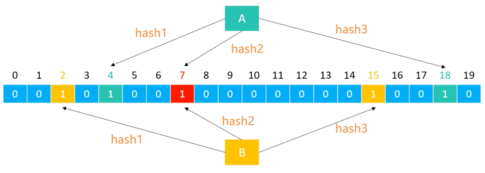
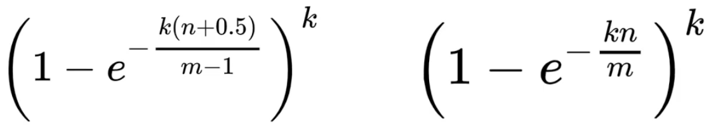
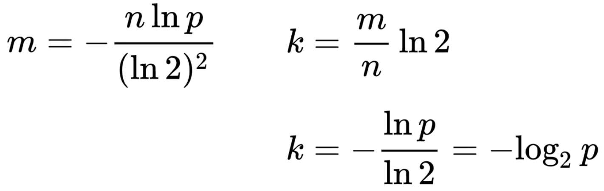

# 布隆过滤器（Bloom Filter）

思考：如果要经常判断`1`个元素是否存在，如何高效地进行判断？

很容易想到使用**哈希表**（HashSet、HashMap），将元素作为`key`存储，判断时直接查询`key`是否存在。时间复杂度为`O(1)`，非常高效，但是空间利用率不高，在存储大量数据时，需要消耗大量内存。

如果需要编写一个网络爬虫去爬`10亿`个网页，如何高效地判断某个网页是否已经爬取过？使用哈希表存储 10 亿个 URL，可能会消耗数十`GB`的内存，显然不够高效。

是否存在时间复杂度低、占用内存少的数据结构呢？

## 2.概述

布隆过滤器是在 1970 年由 `Burton H. Bloom` 提出的**空间效率极高的概率型数据结构**。它可以用来**判断一个元素一定不存在或者可能存在**。

优点：空间效率和查询时间都远超过一般的算法。

缺点：存在一定的误判率（元素可能存在）、**删除困难**。

常见应用场景：

- 黑名单过滤：判断某个用户是否在黑名单中。
- 网络爬虫：判断 URL 是否已经爬取过。
- 垃圾邮件过滤：判断邮件是否为垃圾邮件。
- 解决缓存穿透：防止查询不存在的数据时频繁访问数据库。

## 3.原理

它的实质是使用一个很长的二进制向量和一系列随机映射函数（Hash 函数）来实现的。

> **二进制向量**（bit array）是一个由`0`和`1`组成的数组，初始时，所有位都为`0`。

假设布隆过滤器由`20`位的二进制向量和`3`个不同的哈希函数组成，每个元素经过哈希函数映射后，会得到`3`个不同的位置。

- **添加元素**：将每一个哈希函数生成的索引位置都设置为`1`。
  
  

- **查询元素**：判断每一个哈希函数生成的索引位置是否都为`1`。
  
  - 如果有任意一个位置为`0`，则该元素`一定不存在`。
  - 如果所有位置都为`1`，则该元素**可能存在**（存在误判的可能性）。
  
添加、查询的时间复杂度都是：`O(k)`，其中`k`是哈希函数的数量。空间复杂度为：`O(m)`，其中`m`是二进制向量的长度。

## 4.误判率

假设误判率为`p`，二进制向量的长度为`m`，哈希函数的数量为`k`，数据规模为`n`，则误判率可以通过以下公式计算：



> 右边是忽略常数项的近似公式。
> 
> `e`是自然常数（自然底数、欧拉数），约等于`2.71828`。

已知误判率`p`，数据规模`n`，可以计算出所需的二进制向量长度`m`和哈希函数数量`k`：



> `ln`表示自然对数，即以 e（≈2.71828）为底的对数。

## 5.完整实现

> Google Guava 提供了布隆过滤器的实现，可以访问此地址：[Guava BloomFilter](https://github.com/google/guava/blob/master/guava/src/com/google/common/hash/BloomFilter.java)。

定义类`BloomFilter`，包含添加元素和查询元素的方法：

```java
/**
 * 布隆过滤器
 *
 * @param <T> 元素类型
 * @author yolk
 * @since 2025/10/17 17:41
 */
public class BloomFilter<T> {

    /**
     * 添加元素到布隆过滤器
     *
     * @param value 要添加的元素
     * @return 
     */
    public boolean put(T value) {
    }

    /**
     * 检查布隆过滤器是否包含指定元素
     *
     * @param value 要检查的元素
     * @return 不包含返回 false，包含返回 true（可能存在误判）
     */
    public boolean contains(T value) {
        return false;
    }

}
```

> 因为**删除困难**，所以不实现删除方法。

### 5.1.定义属性和构造函数

```java
/**
 * 二进制向量的长度 m（一共有多少个二进制位）
 */
private int bitSize;

/**
 * 二进制向量
 * <p>
 * 每个 long 类型有 8 个字节，共 64 位
 * 使用 long 数组，那么 bits.length * 64 就是二进制向量的总长度，这样能存储更多的数据
 * bits.length = bitSize / 64 + 1 || Math.ceil(bitSize / 64.0)
 */
private long[] bits;

/**
 * 哈希函数的数量 k
 */
private int hashSize;

/**
 * 构造布隆过滤器
 * 基于数据规模 n 和误判率 p 计算所需的位数组大小 m 和哈希函数数量 k
 *
 * @param n 数据规模
 * @param p 误判率
 */
public BloomFilter(int n, double p) {
    if (n <= 0 || p <= 0 || p >= 1) {
        throw new IllegalArgumentException("n or p is invalid");
    }

    // 计算 m 和 k 的公式均需要用到 ln2
    double ln2 = Math.log(2);

    // 基于工具计算 m 和 k
    this.bitSize = (int) (-(n * Math.log(p)) / (ln2 * ln2));
    this.hashSize = (int) (this.bitSize * ln2 / n);

    // 初始化 bits 数组
    // int length = (int) Math.ceil((double) this.bitSize / Long.SIZE);
    // 下面计算 length 等同于上面的写法
    int length = (this.bitSize + Long.SIZE - 1) / Long.SIZE;
    this.bits = new long[length];
}
```

### 5.2.添加元素实现

添加元素方法最关键的是进行哈希计算，在 GooGle Guava 中，它有两种策略来实现哈希函数：`MURMUR128_MITZ_32`和`MURMUR128_MITZ_64`（[查看源码](https://github.com/google/guava/blob/master/guava/src/com/google/common/hash/BloomFilterStrategies.java)），这两种的区别是前者相较于后者更快但误判率略高，后者则相反，它们最核心的代码：

::: code-group

```java [MURMUR128_MITZ_32]
long bitSize = bits.bitSize();
long hash64 = Hashing.murmur3_128().hashObject(object, funnel).asLong();
int hash1 = (int) hash64;
int hash2 = (int) (hash64 >>> 32);

boolean bitsChanged = false;
for (int i = 1; i <= numHashFunctions; i++) {
    int combinedHash = hash1 + (i * hash2);
    // Flip all the bits if it's negative (guaranteed positive number)
    if (combinedHash < 0) {
        combinedHash = ~combinedHash;
    }
    bitsChanged |= bits.set(combinedHash % bitSize);
}
```

```java [MURMUR128_MITZ_64]
long bitSize = bits.bitSize();
long hash64 = Hashing.murmur3_128().hashObject(object, funnel).asLong();
long hash1 = lowerEight(bytes);
long hash2 = upperEight(bytes);

boolean bitsChanged = false;
long combinedHash = hash1;
for (int i = 0; i < numHashFunctions; i++) {
    // Make the combined hash positive and indexable
    bitsChanged |= bits.set((combinedHash & Long.MAX_VALUE) % bitSize);
    combinedHash += hash2;
}
```

:::

我们这里参考`MURMUR128_MITZ_32`的实现，为了方便理解再进行一些简化，代码如下：

```java
/**
 * 添加元素到布隆过滤器
 *
 * @param value 要添加的元素
 * @return 如果二进位有改动返回 true，否则返回 false
 */
public boolean put(T value) {
    nullCheck(value);

    // 利用 value 生成 2 个整数
    int hash1 = value.hashCode();
    int hash2 = hash1 >>> 16;

    boolean bitsChanged = false;
    for (int i = 1; i <= hashSize; i++) {
        int combinedHash = hash1 + (i * hash2);
        if (combinedHash < 0) {
            combinedHash = ~combinedHash;
        }

        // 生成 bitSize 范围内的索引
        int index = combinedHash % bitSize;
        // 设置 bits 中 index 位为 1
        if(set(index)) {
            bitsChanged = true;
        }
    }
    return bitsChanged;
}

/**
 * 设置 bits 中指定索引的位为 1
 * 假设 bits 数组此时元素为：[101..01.., 1..0..11.., xxx, xxx]，每个元素都是 64 位
 * 设置 index 位为 1，可以使用｜位运算，比如：
 * 
 *   101010101001010101 (所有 long 元素拼接起来的二进制表示)
 * | 000000000010000000 (1 << ?)
 * --------------------
 *   101010101011010101
 * 
 * 那么 1 << ? 中的 ? 怎么计算呢？这里是将所有 long 元素拼接起来看待的，实际中需要分开计算
 *
 * @param index 要设置的索引
 * @return 如果该位原本就是 1，返回 false，否则返回 true
 */
private boolean set(int index) {
    // 找到 index 需要将哪个 long 元素中某一位置为 1，整除向下取整，刚好是对应的 long 元素索引
    int arrayIndex = index / Long.SIZE;
    long value = bits[arrayIndex];
    // 计算该 long 元素中的哪一位需要设置为 1
    int innerIndex = Long.SIZE - index % Long.SIZE;
    int bitValue = 1 << innerIndex;
    // 使用 & 位运算检查该位原本是否为 0，如果是 0 则说明有改动
    boolean result = (value & bitValue) == 0;
    // 使用｜位运算将该位置设置为 1，并覆盖原有的 long 元素
    bits[arrayIndex] = value | bitValue;
    return result;
}
```

### 5.3.查询元素实现

```java
/**
 * 检查布隆过滤器是否包含指定元素
 *
 * @param value 要检查的元素
 * @return 不包含返回 false，包含返回 true（可能存在误判）
 */
public boolean contains(T value) {
    int hash1 = value.hashCode();
    int hash2 = hash1 >>> 16;

    for (int i = 1; i <= hashSize; i++) {
        int combinedHash = hash1 + (i * hash2);
        if (combinedHash < 0) {
            combinedHash = ~combinedHash;
        }
        int index = combinedHash % bitSize;

        if (!get(index)) {
            // 如果有任意一位为 0，则说明一定不包含该元素
            return false;
        }
    }
    return true;
}

/**
 * 查看 bits 中指定索引的位是否为 1
 * 同理，设置某一位为 1 时，是用｜位运算，那么查看某一位是否为 1，可以使用 & 位运算，比如：
 *
 *   101010101011010101 (所有 long 元素拼接起来的二进制表示)
 * & 000000000010000000 (1 << ?)
 * --------------------
 *   000000000010000000
 *
 * @param index 要查看的索引
 * @return 位为 1 返回 true，否则返回 false
 */
private boolean get(int index) {
    int arrayIndex = index / Long.SIZE;
    long value = bits[arrayIndex];
    int innerIndex = Long.SIZE - index % Long.SIZE;
    int bitValue = 1 << innerIndex;
    return (value & bitValue) != 0;
}
```

