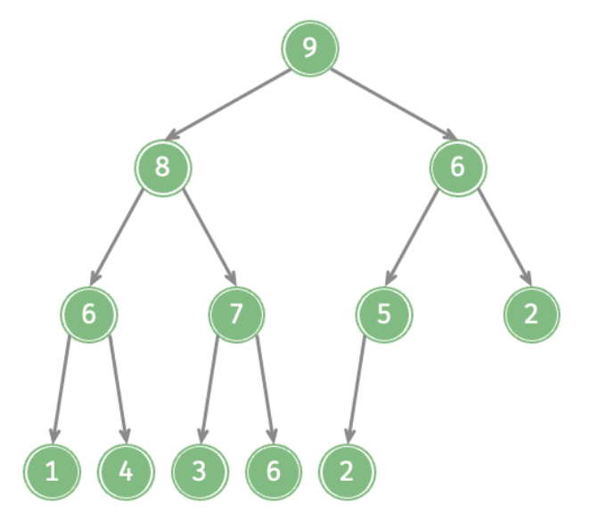
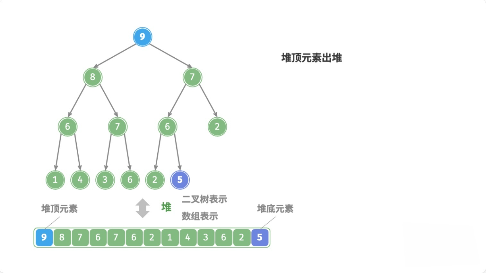

# 堆（Heap）

设计一种数据结构，用来存放整数，要求提供 3 个操作：

- 添加元素
- 获取最大值
- 删除最大值

有以下几种实现方法：

<table>
  <tr style="background:#ff8000; color:#fff; font-weight:bold; text-align:center;">
    <td>实现方式</td>
    <td>获取最大值</td>
    <td>删除最大值</td>
    <td>添加元素</td>
    <td></td>
  </tr>
  <tr style="background:#fff7cc;">
    <td>动态数组 \ 双向链表</td>
    <td>O(n)</td>
    <td>O(n)</td>
    <td>O(1)</td>
    <td></td>
  </tr>
  <tr style="background:#eaffea;">
    <td><span style="color:green;font-weight:bold;">有序</span> 动态数组 \ 双向链表</td>
    <td>O(1)</td>
    <td>O(1)</td>
    <td>O(n)</td>
    <td style="color:#666;">全排序有点浪费</td>
  </tr>
  <tr style="background:#fff7cc;">
    <td><b>BBST</b></td>
    <td>O(logn)</td>
    <td>O(logn)</td>
    <td>O(logn)</td>
    <td style="color:#666;">杀鸡用牛刀</td>
  </tr>
</table>

有没有更优的数据结构？

**堆：获取最大值 O(1)，删除最大值 O(logn)，添加元素 O(logn)**


著名的`Top K`问题，就是使用**堆**来高效解决的。

> `Top K`问题：在一个海量数据流中，如何高效地获取最大的前 K 个的元素？

## 1.概述

**堆（Heap）**也是一种**树状**的数据结构（不要和内存模型中的**堆空间**混淆）。常见的堆实现有：

- **二叉堆**（Binary Heap，**完全二叉堆**）
- **多叉堆**（D-ary Heap）
- **索引堆**（Indexed Heap）
- **二项堆**（Binomial Heap）
- **斐波那契堆**（Fibonacci Heap） 
- **左倾堆**（Leftist Heap，**左式堆**）
- **斜堆**（Skew Heap） 

堆的一个重要性质：任意节点的值总是`>=`（或`<=`）其子节点的值。基于此，堆分为两类：

- 任意节点的值总是`<=`其子节点的值，称为**小顶堆**（Min Heap，**最小堆、小根堆**）。
  
<center></center>

- 任意节点的值总是`>=`其子节点的值，称为**大顶堆**（Max Heap，**最大堆、大根堆**）。

<center></center>

由此可见，堆顶元素总是堆中的最大值（大顶堆）或最小值（小顶堆），且堆中的元素**必须具备可比较性**（跟二叉搜索树类似）

## 2.接口设计

```java
public interface Heap<E> {

    /**
     * 返回堆中元素的数量。
     * @return 堆中元素的数量
     */
    int size();

    /**
     * 判断堆是否为空。
     * @return 如果堆为空返回 true，否则返回 false
     */
    boolean isEmpty();

    /**
     * 清空堆中的所有元素。
     */
    void clear();

    /**
     * 向堆中添加一个元素。
     * @param element 要添加的元素
     */
    void add(E element);

    /**
     * 获取堆顶元素，但不移除。
     * @return 堆顶元素
     */
    E get();

    /**
     * 获取并移除堆顶元素。
     * @return 堆顶元素
     */
    E remove();

    /**
     * 用指定元素替换堆顶元素，并返回原来的堆顶。
     * @param element 要替换堆顶的元素
     * @return 原来的堆顶元素
     */
    E replace(E element);

}
```

## 3.公共父类

```java
import java.util.Comparator;

/**
 * 堆的抽象类
 *
 * @author yolk
 * @since 2025/10/5 14:05
 */
public abstract class AbstractHeap<E> implements Heap<E> {

    // 元素数量
    protected int size;
    // 堆中的元素是可比较的
    protected Comparator<E> comparator;

    public AbstractHeap(Comparator<E> comparator) {
        this.comparator = comparator;
    }

    @Override
    public int size() {
        return this.size;
    }

    @Override
    public boolean isEmpty() {
        return this.size == 0;
    }

    /**
     * 比较两个元素的大小
     *
     * @param e1
     * @param e2
     * @return 如果 e1 大于 e2，返回正数；如果 e1 小于 e2，返回负数；如果相等，返回 0
     */
    @SuppressWarnings("unchecked")
    protected int compare(E e1, E e2) {
        // 优先使用比较器
        if (this.comparator != null) {
            return this.comparator.compare(e1, e2);
        }

        // 如果没有比较器，则要求元素实现 Comparable 接口
        return ((Comparable<E>) e1).compareTo(e2);
    }

    /**
     * 如果堆中没有元素，则抛出异常
     *
     * @throws IndexOutOfBoundsException 如果堆为空
     */
    protected void emptyCheck() {
        if (this.size == 0) {
            throw new IndexOutOfBoundsException("Heap is empty");
        }
    }


    /**
     * 检查元素是否为 null
     *
     * @param element 元素
     * @throws IllegalArgumentException 如果元素为 null，则抛出异常
     */
    protected void elementNotNullCheck(E element) {
        if (element == null) {
            throw new IllegalArgumentException("Element must not be null");
        }
    }
}
```

## 4.二叉堆

> 注意：实现方式以**最大堆**为例

**二叉堆**的逻辑结构是一棵[完全二叉树](../tree/binary-tree)，所以也叫**完全二叉堆**。

鉴于完全二叉树的一个重要性质：可以使用数组来存储，所以**二叉堆**的物理结构通常使用数组来实现。


`n`是元素数量，`n - 1`是最后一个元素的索引，那么索引`i`的规律：

- 如果`i = 0`，则该节点为根节点
- 如果`i > 0`，则该节点的父节点索引为`floor((i - 1) / 2)`
- 如果`2i + 1 <= n - 1`，则该节点的左子节点索引为`2i + 1`
- 如果`2i + 1 > n - 1`，则该节点没有左子节点
- 如果`2i + 2 <= n - 1`，则该节点的右子节点索引为`2i + 2`
- 如果`2i + 2 > n - 1`，则该节点没有右子节点

> 以上规律可以在[完全二叉树](../tree/binary-tree)中找到

### 4.1.类定义 & 简单方法实现

> 注意：为了打印树形结构，这里重写了 toString 方法，使用了[BinaryTreePrinter](../tree/#_1-1-binarytreeprinter-java)来打印

```java
import com.yolk.datastructure.heap.AbstractHeap;
import com.yolk.datastructure.heap.Heap;
import com.yolk.datastructure.tree.BinaryTreePrinter;

import java.util.Comparator;

/**
 * 二叉堆，以最大堆为例
 * 
 * @author yolk
 * @since 2025/10/4 02:01
 */
public class BinaryHeap<E> extends AbstractHeap<E> implements Heap<E> {

    public static final int DEFAULT_CAPACITY = 10;
    private E[] elements;

    public BinaryHeap() {
        this(null);
    }

    @SuppressWarnings("unchecked")
    public BinaryHeap(Comparator<E> comparator) {
        super(comparator);
        this.elements = (E[]) new Object[DEFAULT_CAPACITY];
    }

    @Override
    public void clear() {
        for (int i = 0; i < this.size; i++) {
            this.elements[i] = null;
        }
        this.size = 0;
    }
    
    @Override
    public void add(E element) {
    }

    @Override
    public E get() {
        emptyCheck();
        return this.elements[0];
    }

    @Override
    public E remove() {
        return null;
    }
    
    @Override
    public E replace(E element) {
        return null;
    }

    /**
     * 扩容
     *
     * @param capacity 新容量
     */
    @SuppressWarnings("unchecked")
    private void ensureCapacity(int capacity) {
        int oldCapacity = this.elements.length;
        if (oldCapacity >= capacity) return;

        // 新容量为旧容量的1.5倍
        int newCapacity = oldCapacity + (oldCapacity >> 1);
        E[] newElements = (E[]) new Object[newCapacity];
        if (this.size >= 0) {
            System.arraycopy(this.elements, 0, newElements, 0, size);
        }
        this.elements = newElements;
    }
    
    @Override
    public String toString() {
        if (size == 0) {
            return "Empty Heap";
        }

        return BinaryTreePrinter.TreePrintBuilder.<String>create()
                .withRoot(() -> {
                    // 在这里返回 0，表示根节点的索引
                    return 0;
                })
                .withChildren((node, isLeft) -> {
                    if (node == null) return null;

                    // node 实际上是元素的索引
                    int index = (Integer) node;

                    // 左子节点索引 = 2 * i + 1, 右子节点索引 = 2 * i + 2
                    // 根据 isLeft 决定返回左子节点还是右子节点
                    int childIndex = isLeft ? (index << 1) + 1 : (index << 1) + 2;

                    return childIndex >= this.size ? null : childIndex;
                })
                .withValues(node -> {
                    if (node == null) return null;
                    int index = (Integer) node;

                    return this.elements[index].toString();
                })
                .build();
    }

}
```

### 4.2.元素入堆

::: code-group

```md:img [<1>]

```

```md:img [<2>]

```

```md:img [<3>]

```

```md:img [<4>]

```

```md:img [<5>]

```

```md:img [<6>]

```

```md:img [<7>]

```

```md:img [<8>]

```

```md:img [<9>]

```

:::

#### 总结

注：`node`表示新元素

1. 如果`node > 父节点`，则交换`node`和父节点
2. 如果`node <= 父节点`，或者`node`没有父节点，则停止

这个过程，叫做**上滤**（Sift Up），时间复杂度为`O(logn)`。

#### 代码实现

```java
/**
 * 添加元素
 *
 * @param element 新元素
 */
@Override
public void add(E element) {
    // 元素不能为空
    elementNotNullCheck(element);

    // 扩容
    ensureCapacity(this.size + 1);

    // 将新元素添加到数组末尾
    this.elements[size++] = element;

    // 上滤
    siftUp(size - 1);
}

/**
 * 将指定索引位置的元素上滤
 *
 * @param index 元素的索引
 */
private void siftUp(int index) {
    // 获取要上滤的元素
    E e = this.elements[index];

    // index > 0: 如果是根节点就不需要上滤了
    while (index > 0) {
        // 父节点索引 = floor((i - 1) / 2)，在 java 中默认向下取整
        int parentIndex = (index - 1) >> 1;
        // 获取父节点
        E parent = this.elements[parentIndex];

        // 如果 e 比 parent 大，就交换位置
        if (compare(e, parent) <= 0) {
            return;
        }

        // 交换位置
        this.elements[index] = parent;
        this.elements[parentIndex] = e;

        // 继续向上比较
        index = parentIndex;
    }
}
```

#### 测试

```java
public class Test {
    public static void main(String[] args) {
        BinaryHeap<Integer> heap = new BinaryHeap<>();
        heap.add(68);
        heap.add(72);
        heap.add(43);
        heap.add(50);
        heap.add(38);
        System.out.println(heap);
    }
}
```

执行结果:

```text
			|
			72
	________|____
	|			|
	68			43
____|____
|		|
50		38
```

#### 优化：交换位置

每次比较后就交换位置，效率不高。可以先保存要上滤的元素`e`，然后不断将父节点往下移动，最后再把`e`放到合适的位置。

```java
private void siftUp(int index) {
    E e = this.elements[index];
    while (index > 0) {
        int parentIndex = (index - 1) >> 1;
        E parent = this.elements[parentIndex];
        if (compare(e, parent) <= 0) {
            // 不能 return，因为最后还要把 e 放到 index 位置
            break;
        }

        // 将父节点存储到当前位置
        this.elements[index] = parent;

        index = parentIndex;
    }
    // 将 e 存储到最终位置
    this.elements[index] = e;
}
```

### 4.3.元素出堆

::: code-group

```md:img [<1>]

```

```md:img [<2>]

```

```md:img [<3>]

```

```md:img [<4>]

```

```md:img [<5>]

```

```md:img [<6>]

```

```md:img [<7>]

```

```md:img [<8>]

```

```md:img [<9>]

```

```md:img [<10>]

```

:::

#### 总结

1. 用数组末尾的元素覆盖堆顶元素
2. 删除数组末尾的元素
3. 循环执行以下操作（`node`表示当前堆顶元素）
    1. 如果`node < 左子节点 || node < 右子节点`，则将`node`与较大的子节点交换位置
    2. 否则，退出循环（`node >= 左子节点 && node >= 右子节点`，或者`node`没有子节点）

这个过程，叫做**下滤**（Sift Down），时间复杂度为`O(logn)`。

同样的，交换位置的操作也可以和上滤时一样进行[优化](./#优化-交换位置)。

> 当使用数组实现完全二叉树时，遍历到第一个叶子节点时，后面的节点都是叶子节点，不需要再继续下滤。
> 
> `第一个叶子节点的索引 = 非叶子节点的数量 = floor(n / 2)`

#### 代码实现

```java
@Override
public E remove() {
    emptyCheck();

    // 堆顶元素
    E root = get();

    // 最后一个元素的索引
    int lastIndex = --this.size;

    // 将最后一个元素放到堆顶并删除掉
    this.elements[0] = this.elements[lastIndex];
    this.elements[lastIndex] = null;

    siftDown(0);
    return root;
}

/**
 * 将指定索引位置的元素下滤
 *
 * @param index 元素的索引
 */
private void siftDown(int index) {
    // 获取要下滤的元素
    E e = this.elements[index];

    // 第一个叶子节点的索引 = 非叶子节点的数量 = size >> 1
    int half = size >> 1;
    while (index < half) {
        /*
        index 的节点有两种情况：
        1. 只有左子节点
        2. 同时有左子节点和右子节点
            */

        // 左子节点索引 = 2 * i + 1
        int childIndex = (index << 1) + 1;

        // 获取左子节点
        E child = this.elements[childIndex];

        // 右子节点索引 = 2 * i + 2 = 左子节点索引 + 1
        int rightChildIndex = childIndex + 1;

        // 如果有右子节点，并且右子 节点比左子节点大
        if (rightChildIndex < size && compare(this.elements[rightChildIndex], child) > 0) {
            child = this.elements[rightChildIndex];
            childIndex = rightChildIndex;
        }

        // child 现在是左右子节点中最大的

        // e 比左右子节点都大，不需要下滤了
        if (compare(e, child) >= 0) {
            break;
        }

        // e 比左右子节点都小，将子节点存储到当前位置
        this.elements[index] = child;

        // 继续向下比较
        index = childIndex;
    }

    // 将 e 存储到最终位置
    this.elements[index] = e;
}
```

#### 测试

```java
public class Test {
    public static void main(String[] args) {
        BinaryHeap<Integer> heap = new BinaryHeap<>();

        heap.add(68);
        heap.add(72);
        heap.add(43);
        heap.add(50);
        heap.add(38);
        heap.add(90);
        heap.add(10);
        heap.add(65);

        System.out.println(heap);
        heap.remove();

        System.out.println(heap);
        heap.remove();

        System.out.println(heap);
        heap.remove();
    }
}
```

执行结果：

```text
				|
				90
		________|________
		|				|
		68				72
	____|____		____|____
	|		|		|		|
	65		38		43		10
____|
|
50


			|
			72
	________|________
	|				|
	68				50
____|____		____|____
|		|		|		|
65		38		43		10


			|
			68
	________|________
	|				|
	65				50
____|____		____|
|		|		|
10		38		43
```


### 4.4.替换堆顶元素

最直接的思路是先删除堆顶元素，再添加新元素，如下：

```java
@Override
public E replace(E element) {
    elementNotNullCheck(element);

    E oldRoot = remove();
    add(element);

    return oldRoot;
}
```

但是这样做效率不高，因为删除和添加同时进行了**上滤**和**下滤**操作，时间复杂度为`O(logn + logn) = O(2logn)`。可以优化为：

```java
@Override
public E replace(E element) {
    // 如果堆为空，就直接添加
    if (size == 0) {
        this.elements[0] = element;
        size++;
        return null;
    }

    elementNotNullCheck(element);

    // 获取当前堆顶元素
    E root = get();

    // 将添加的新元素放到堆顶
    this.elements[0] = element;
    // 让新元素下滤
    siftDown(0);
    return root;
}
```

#### 测试

```java
public class Test {
    public static void main(String[] args) {
        BinaryHeap<Integer> heap = new BinaryHeap<>();

        heap.add(68);
        heap.add(72);
        heap.add(43);
        heap.add(50);
        heap.add(38);
        System.out.println(heap);

        heap.replace(40);
        System.out.println(heap);

        heap.replace(80);
        System.out.println(heap);
    }
}
```

执行结果：

```text
			|
			72
	________|____
	|			|
	68			43
____|____
|		|
50		38


			|
			68
	________|____
	|			|
	50			43
____|____
|		|
40		38


			|
			80
	________|____
	|			|
	50			43
____|____
|		|
40		38
```


### 4.5.堆化

**堆化**（Heapify）是指将一个无序数组调整为堆的过程。

最直接的思路是：从头到尾依次将每个元素添加到堆中，这样时间复杂度为`O(nlogn)`。代码如下：

```java
BinaryHeap<Integer> heap = new BinaryHeap<>();
int[] arr = {68, 72, 43, 50, 38, 17, 10, 85, 61, 35, 26, 90, 14, 55, 49};
for (int i : arr) {
    heap.add(i);
}
System.out.println(heap);
```

实际上，还有两种方式来实现堆化：

- **自上而下的上滤**（Top Down Sift Up）
- **自下而上的下滤**（Bottom Up Sift Down）

这两种都是先将数组元素放入堆中，然后再调整堆。**自上而下**和**自下而上**是两种遍历数组的方式：从第一个元素开始，依次遍历到最后一个元素，或者从最后一个元素开始，依次遍历到第一个元素。

#### 自上而下的上滤

**每次上滤都能保证当前节点"之前"的所有节点都是堆**。这种方式和直接添加元素是差不多的。时间复杂度为`O(nlogn)`。


#### 自下而上的下滤（推荐）

`每次下滤都能保证当前节点"之后"的所有节点都是堆`。另外`index`只需要从最后一个非叶子节点开始。时间复杂度是`O(n)`（有推导公式，可以查阅下相关资料，这里不展开了）。


#### 效率对比


不从时间复杂度上看，其实可以也可以这样理解：

- **自上而下的上滤**：大量的叶子节点需要上滤
- **自下而上的下滤**：少量的非叶子节点需要下滤

#### 为什么没有**自上而下的下滤**和**自下而上的上滤**呢？

- **自上而下的下滤**：当你对根节点执行下滤时，它需要和它的子节点比较。但此时，它的子节点所在的子树还完全不是堆（你还没处理它们），所以这次下滤的结果是不可靠的。等你遍历到子节点时，可能根节点又需要再次调整。
  
  **根本原因**：下滤操作要求节点的子树已经是堆，但“自上而下”的遍历顺序无法在处理父节点之前，先保证其子树是堆。

- **自下而上的上滤**：当你对一个叶子节点执行上滤时，它需要和父节点比较。但它的父节点可能还没有被处理，父节点之上可能还有更乱的祖先节点。这次上滤可能完全是徒劳的。
  
  **根本矛盾**：上滤操作要求节点到根节点的路径上的结构基本是堆，但“自下而上”的遍历顺序无法在处理一个节点之前，先保证其祖先路径是堆。

#### 代码实现

注意：**需要重新设计构造方法**

```java
public BinaryHeap() {
    this(null, null);
}

@SuppressWarnings("unchecked")
public BinaryHeap(Comparator<E> comparator) {
    super(comparator);
    this.elements = (E[]) new Object[DEFAULT_CAPACITY];
}

public BinaryHeap(E[] elements) {
    this(elements, null);
}

@SuppressWarnings("unchecked")
public BinaryHeap(E[] elements, Comparator<E> comparator) {
    super(comparator);

    if (elements == null || elements.length == 0) {
        this.elements = (E[]) new Object[DEFAULT_CAPACITY];
        return;
    }

    // 直接将传入的数组复制过来
    this.elements = (E[]) new Object[Math.max(elements.length, DEFAULT_CAPACITY)];
    System.arraycopy(elements, 0, this.elements, 0, elements.length);

    // 将传入的数组元素个数赋值给 size
    this.size = elements.length;

    // 堆化
    heapify();
}

/**
 * 堆化
 */
private void heapify() {
    // 自上而下的上滤
    // for (int i = 1; i < size; i++) {
    //     siftUp(i);
    // }

    // 自下而上的下滤
    for (int i = (size >> 1) - 1; i >= 0; i--) {
        siftDown(i);
    }
}
```

#### 测试

```java
public class Test {
    public static void main(String[] args) {
        Integer[] array = { 3, 1, 2, 8, 7, 4, 6, 5 };
        BinaryHeap<Integer> heap = new BinaryHeap<>(array);
        System.out.println(heap);
    }
}
```

执行结果：

```text
				|
				8
		________|________
		|				|
		7				6
	____|____		____|____
	|		|		|		|
	5		3		4		2
____|
|
1
```


### 4.6.最小堆

**最小堆**（小顶堆）和**最大堆**（大顶堆）的实现几乎完全一样，只需要将比较大小的逻辑反过来即可。

```java
public class Test {
    public static void main(String[] args) {
        Integer[] array = {3, 1, 2, 8, 7, 4, 6, 5};
        /*
        通过传入自定义比较器实现最小堆
        默认 o1 - o2 是最大堆，这里反过来，就是最小堆
        */
        BinaryHeap<Integer> heap = new BinaryHeap<>(array, (o1, o2) -> o2 - o1);
        System.out.println(heap);
    }
}
```

执行结果：

```text
				|
				1
		________|________
		|				|
		3				2
	____|____		____|____
	|		|		|		|
	5		7		4		6
____|
|
8
```

### 4.7.Top K 问题

问题：从 n 个整数中，找出最大的 k 个数（k 远小于 n）。

- 如果使用排序算法进行排序，需要`O(nlogn)`的时间复杂度，然后取前 k 个数。

- 如果使用二叉堆来解决，可以使用`O(nlogk)`的时间复杂度。

思路：维护一个大小为 k 的小顶堆，遍历所有元素，如果当前元素大于堆顶元素，则替换堆顶元素，并进行下滤操作。这样，最终堆中的元素就是最大的 k 个数。

> 为什么是小顶堆？
> 
> 如果是**大顶堆**，堆顶元素是最大的元素，无法有效地淘汰较小的元素。即新元素虽然比堆定元素小，但可能比堆中的其他元素大，无法进行替换。
> 
> 如果是**小顶堆**，堆顶元素是最小的元素，新元素比堆顶元素大时，才进行替换，这样可以确保堆中始终保留最大的 k 个元素。👍

```java
public class TopK {
    public static void main(String[] args) {
        // mock 数据，代表海量数据
        int[] array = {3, 1, 2, 8, 7, 4, 6, 5, 10, 9, 12, 11, 15, 14, 13};

        // 从中找出最大的 5 个数
        int k = 5;

        // 构建小顶堆
        BinaryHeap<Integer> heap = new BinaryHeap<>((o1, o2) -> o2 - o1);

        for (int e : array) { // O(n)
            if (heap.size() < k) {
                // 还没满 k 个，直接添加，O(logk)
                heap.add(e);
            } else if (e > heap.get()) {
                // 堆满了，且当前元素比堆顶元素大，替换堆顶元素，O(logk)
                heap.replace(e);
            }
        }
        System.out.println(heap);
    }
}
```

执行结果：

```text
                |
                11
        ________|________
        |				|
        12				14
    ____|____
    |		|
    13		15
```

## 5.源码

:::code-group

```java [Heap.java]
public interface Heap<E> {

    /**
     * 返回堆中元素的数量。
     * @return 堆中元素的数量
     */
    int size();

    /**
     * 判断堆是否为空。
     * @return 如果堆为空返回 true，否则返回 false
     */
    boolean isEmpty();

    /**
     * 清空堆中的所有元素。
     */
    void clear();

    /**
     * 向堆中添加一个元素。
     * @param element 要添加的元素
     */
    void add(E element);

    /**
     * 获取堆顶元素，但不移除。
     * @return 堆顶元素
     */
    E get();

    /**
     * 获取并移除堆顶元素。
     * @return 堆顶元素
     */
    E remove();

    /**
     * 用指定元素替换堆顶元素，并返回原来的堆顶。
     * @param element 要替换堆顶的元素
     * @return 原来的堆顶元素
     */
    E replace(E element);

}
```

```java [AbstractHeap.java]
import java.util.Comparator;

/**
 * 堆的抽象类
 *
 * @author yolk
 * @since 2025/10/5 14:05
 */
public abstract class AbstractHeap<E> implements Heap<E> {

    // 元素数量
    protected int size;
    // 堆中的元素是可比较的
    protected Comparator<E> comparator;

    public AbstractHeap(Comparator<E> comparator) {
        this.comparator = comparator;
    }

    @Override
    public int size() {
        return this.size;
    }

    @Override
    public boolean isEmpty() {
        return this.size == 0;
    }

    /**
     * 比较两个元素的大小
     *
     * @param e1
     * @param e2
     * @return 如果 e1 大于 e2，返回正数；如果 e1 小于 e2，返回负数；如果相等，返回 0
     */
    @SuppressWarnings("unchecked")
    protected int compare(E e1, E e2) {
        // 优先使用比较器
        if (this.comparator != null) {
            return this.comparator.compare(e1, e2);
        }

        // 如果没有比较器，则要求元素实现 Comparable 接口
        return ((Comparable<E>) e1).compareTo(e2);
    }

    /**
     * 如果堆中没有元素，则抛出异常
     *
     * @throws IndexOutOfBoundsException 如果堆为空
     */
    protected void emptyCheck() {
        if (this.size == 0) {
            throw new IndexOutOfBoundsException("Heap is empty");
        }
    }


    /**
     * 检查元素是否为 null
     *
     * @param element 元素
     * @throws IllegalArgumentException 如果元素为 null，则抛出异常
     */
    protected void elementNotNullCheck(E element) {
        if (element == null) {
            throw new IllegalArgumentException("Element must not be null");
        }
    }
}
```

```java [BinaryHeap.java]
import com.yolk.datastructure.heap.AbstractHeap;
import com.yolk.datastructure.heap.Heap;
import com.yolk.datastructure.tree.BinaryTreePrinter;

import java.util.Comparator;

/**
 * 二叉堆，以最大堆为例
 *
 * @author yolk
 * @since 2025/10/4 02:01
 */
public class BinaryHeap<E> extends AbstractHeap<E> implements Heap<E> {

    public static final int DEFAULT_CAPACITY = 10;
    private E[] elements;

    public BinaryHeap() {
        this(null, null);
    }

    @SuppressWarnings("unchecked")
    public BinaryHeap(Comparator<E> comparator) {
        super(comparator);
        this.elements = (E[]) new Object[DEFAULT_CAPACITY];
    }

    public BinaryHeap(E[] elements) {
        this(elements, null);
    }

    @SuppressWarnings("unchecked")
    public BinaryHeap(E[] elements, Comparator<E> comparator) {
        super(comparator);

        if (elements == null || elements.length == 0) {
            this.elements = (E[]) new Object[DEFAULT_CAPACITY];
            return;
        }

        // 直接将传入的数组复制过来
        this.elements = (E[]) new Object[Math.max(elements.length, DEFAULT_CAPACITY)];
        System.arraycopy(elements, 0, this.elements, 0, elements.length);

        // 将传入的数组元素个数赋值给 size
        this.size = elements.length;

        // 堆化
        heapify();
    }

    /**
     * 堆化
     */
    private void heapify() {
        // 自上而下的上滤
        // for (int i = 1; i < size; i++) {
        //     siftUp(i);
        // }

        // 自下而上的下滤
        for (int i = (size >> 1) - 1; i >= 0; i--) {
            siftDown(i);
        }
    }

    @Override
    public void clear() {
        for (int i = 0; i < this.size; i++) {
            this.elements[i] = null;
        }
        this.size = 0;
    }

    @Override
    public void add(E element) {
        // 元素不能为空
        elementNotNullCheck(element);

        // 扩容
        ensureCapacity(this.size + 1);

        // 将新元素添加到数组末尾
        this.elements[size++] = element;

        // 上滤
        siftUp(size - 1);
    }

    /**
     * 将指定索引位置的元素上滤
     *
     * @param index 元素的索引
     */
    private void siftUp(int index) {
        // // 获取要上滤的元素
        // E e = this.elements[index];
        // // index > 0: 如果是根节点就不需要上滤了
        // while (index > 0) {
        //     // 父节点索引 = floor((i - 1) / 2)，在 java 中默认向下取整
        //     int parentIndex = (index - 1) >> 1;
        //     // 获取父节点
        //     E parent = this.elements[parentIndex];
        //
        //     // 如果 e 比 parent 大，就交换位置
        //     if (compare(e, parent) <= 0) {
        //         return;
        //     }
        //
        //     // 交换位置
        //     this.elements[index] = parent;
        //     this.elements[parentIndex] = e;
        //
        //     // 继续向上比较
        //     index = parentIndex;
        // }
        E e = this.elements[index];
        while (index > 0) {
            int parentIndex = (index - 1) >> 1;
            E parent = this.elements[parentIndex];
            if (compare(e, parent) <= 0) {
                // 不能 return，因为最后还要把 e 放到 index 位置
                break;
            }

            // 将父节点存储到当前位置
            this.elements[index] = parent;

            index = parentIndex;
        }
        // 将 e 存储到最终位置
        this.elements[index] = e;
    }

    @Override
    public E get() {
        emptyCheck();
        return this.elements[0];
    }

    @Override
    public E remove() {
        emptyCheck();

        // 堆顶元素
        E root = get();

        // 最后一个元素的索引
        int lastIndex = --this.size;

        // 将最后一个元素放到堆顶并删除掉
        this.elements[0] = this.elements[lastIndex];
        this.elements[lastIndex] = null;

        siftDown(0);
        return root;
    }

    /**
     * 将指定索引位置的元素下滤
     *
     * @param index 元素的索引
     */
    private void siftDown(int index) {
        // 获取要下滤的元素
        E e = this.elements[index];

        // 第一个叶子节点的索引 = 非叶子节点的数量 = size >> 1
        int half = size >> 1;
        while (index < half) {
            /*
            index 的节点有两种情况：
            1. 只有左子节点
            2. 同时有左子节点和右子节点
             */

            // 左子节点索引 = 2 * i + 1
            int childIndex = (index << 1) + 1;

            // 获取左子节点
            E child = this.elements[childIndex];

            // 右子节点索引 = 2 * i + 2 = 左子节点索引 + 1
            int rightChildIndex = childIndex + 1;

            // 如果有右子节点，并且右子 节点比左子节点大
            if (rightChildIndex < size && compare(this.elements[rightChildIndex], child) > 0) {
                child = this.elements[rightChildIndex];
                childIndex = rightChildIndex;
            }

            // child 现在是左右子节点中最大的

            // e 比左右子节点都大，不需要下滤了
            if (compare(e, child) >= 0) {
                break;
            }

            // e 比左右子节点都小，将子节点存储到当前位置
            this.elements[index] = child;

            // 继续向下比较
            index = childIndex;
        }

        // 将 e 存储到最终位置
        this.elements[index] = e;
    }

    @Override
    public E replace(E element) {
        // 如果堆为空，就直接添加
        if (size == 0) {
            this.elements[0] = element;
            size++;
            return null;
        }

        elementNotNullCheck(element);

        // 获取当前堆顶元素
        E root = get();

        // 将添加的新元素放到堆顶
        this.elements[0] = element;
        // 让新元素下滤
        siftDown(0);
        return root;
    }

    /**
     * 扩容
     *
     * @param capacity 新容量
     */
    @SuppressWarnings("unchecked")
    private void ensureCapacity(int capacity) {
        int oldCapacity = this.elements.length;
        if (oldCapacity >= capacity) return;

        // 新容量为旧容量的1.5倍
        int newCapacity = oldCapacity + (oldCapacity >> 1);
        E[] newElements = (E[]) new Object[newCapacity];
        if (this.size >= 0) {
            System.arraycopy(this.elements, 0, newElements, 0, size);
        }
        this.elements = newElements;
    }


    @Override
    public String toString() {
        if (size == 0) {
            return "Empty Heap";
        }

        return BinaryTreePrinter.TreePrintBuilder.<String>create()
                .withRoot(() -> {
                    // 在这里返回 0，表示根节点的索引
                    return 0;
                })
                .withChildren((node, isLeft) -> {
                    if (node == null) return null;

                    // node 实际上是元素的索引
                    int index = (Integer) node;

                    // 左子节点索引 = 2 * i + 1, 右子节点索引 = 2 * i + 2
                    // 根据 isLeft 决定返回左子节点还是右子节点
                    int childIndex = isLeft ? (index << 1) + 1 : (index << 1) + 2;

                    return childIndex >= this.size ? null : childIndex;
                })
                .withValues(node -> {
                    if (node == null) return null;
                    int index = (Integer) node;

                    return this.elements[index].toString();
                })
                .build();
    }

}
```

```java [Test.java]
import com.yolk.datastructure.heap.BinaryHeap;

/**
 * 测试二叉堆
 *
 * @author yolk
 * @since 2025/10/5 11:40
 */
public class Test {
    public static void main(String[] args) {
        // testAdd();

        // testRemove();

        // testReplace();

        // testHeapify();

        // testMinHeap();

        testTopK();
    }

    public static void testTopK() {
        // mock 数据，代表海量数据
        int[] array = {3, 1, 2, 8, 7, 4, 6, 5, 10, 9, 12, 11, 15, 14, 13};

        // 从中找出最大的 5 个数
        int k = 5;

        // 构建小顶堆
        BinaryHeap<Integer> heap = new BinaryHeap<>((o1, o2) -> o2 - o1);

        for (int e : array) { // O(n)
            if (heap.size() < k) {
                // 还没满 k 个，直接添加，O(logk)
                heap.add(e);
            } else if (e > heap.get()) {
                // 堆满了，且当前元素比堆顶元素大，替换堆顶元素，O(logk)
                heap.replace(e);
            }
        }
        System.out.println(heap);
    }

    public static void testAdd() {
        BinaryHeap<Integer> heap = new BinaryHeap<>();

        heap.add(50);
        heap.add(30);
        heap.add(70);
        heap.add(20);

        System.out.println(heap);
    }

    public static void testRemove() {
        BinaryHeap<Integer> heap = new BinaryHeap<>();

        heap.add(50);
        heap.add(30);
        heap.add(70);
        heap.add(20);
        heap.add(80);

        System.out.println(heap);

        heap.remove();
        System.out.println(heap);

        heap.remove();
        System.out.println(heap);
    }

    public static void testReplace() {
        BinaryHeap<Integer> heap = new BinaryHeap<>();

        heap.add(50);
        heap.add(30);
        heap.add(70);
        heap.add(20);
        heap.add(80);

        System.out.println(heap);

        heap.replace(60);
        System.out.println(heap);

        heap.replace(10);
        System.out.println(heap);
    }

    public static void testHeapify() {
        Integer[] array = {3, 1, 2, 8, 7, 4, 6, 5};
        BinaryHeap<Integer> heap = new BinaryHeap<>(array);
        System.out.println(heap);
    }

    public static void testMinHeap() {
        Integer[] array = {3, 1, 2, 8, 7, 4, 6, 5};
        BinaryHeap<Integer> heap = new BinaryHeap<>(array, (o1, o2) -> o2 - o1);
        System.out.println(heap);
    }

}
```

:::