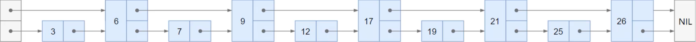
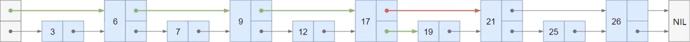
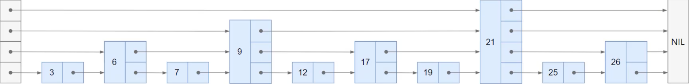

# 跳表（Skip List）

一个有序链表搜索、添加、删除元素的时间复杂度都是`O(n)`，既然是有序，能否够使用**二分查找**将时间复杂度降低到`O(logn)`呢？

答案是不行，因为链表不支持**随机访问**，无法通过**索引**直接定位到中间位置。

那么有没有办法在链表上实现`O(logn)`的搜索、添加、删除操作呢？跳表（Skip List）就是这样一种数据结构。

## 1.概述

> 想象一个场景：在旅行中，你开车走国道时，可能会经过很多小镇，需要花费大量的时间，但是如果你走高速公路，可以直接跳过这些小镇，快速到达目的地。跳表的工作原理类似于这种**跳跃**方式。

跳表（跳跃表），是在有序链表的基础上，增加了**多级索引**，使得在搜索元素时，可以**跳过大量不必要的节点**，从而大大提高了搜索效率。它是由`William Pugh`在 1989 年提出，设计的初衷是为了替代平衡树（如 AVL 树、红黑树等），以实现高效的搜索、插入和删除操作。

Redis 中的 SortedSet、LevelDB 中的 MemTable 都使用了跳表作为底层数据结构。

相比于平衡树，跳表具有以下优点：

- 实现简单：跳表的实现相对简单，不需要复杂的旋转操作，代码更易于理解和维护。
- 动态调整：跳表可以通过随机化的方式动态调整索引层数，适应不同的数据分布。
- 空间效率：跳表通常比平衡树占用更少的内存空间。
  
## 2.使用跳表优化有序链表

假设有一个有序链表，包含以下节点：

为了加快搜索速度，我们可以在链表上方添加一层索引层：

当搜索元素`19`时，先走索引层，走到元素`20`，发现`19`比它小，然后回到元素`17`，继续在底层链表中搜索，最终找到`19`，如图所示：

能不能更快呢？我们可以再添加两层索引层：

