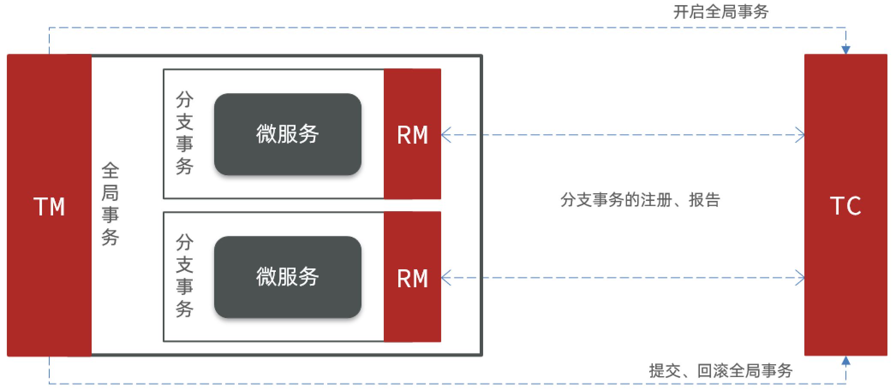
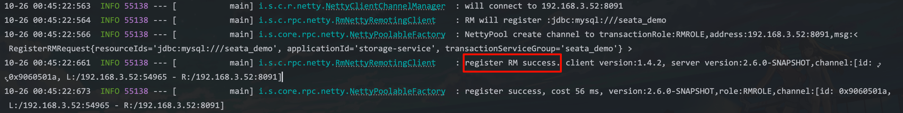
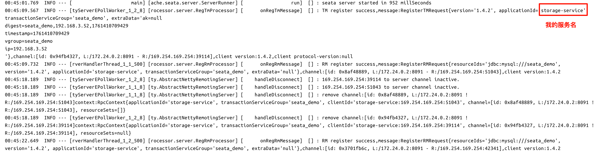
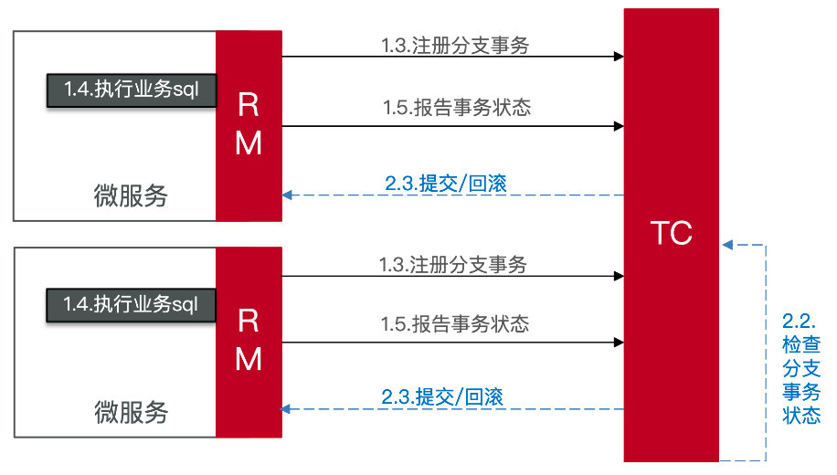
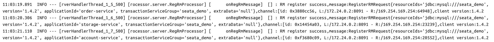
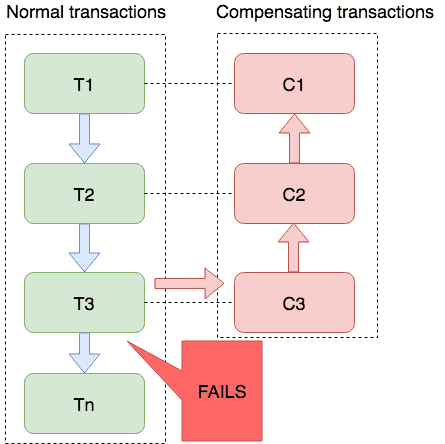
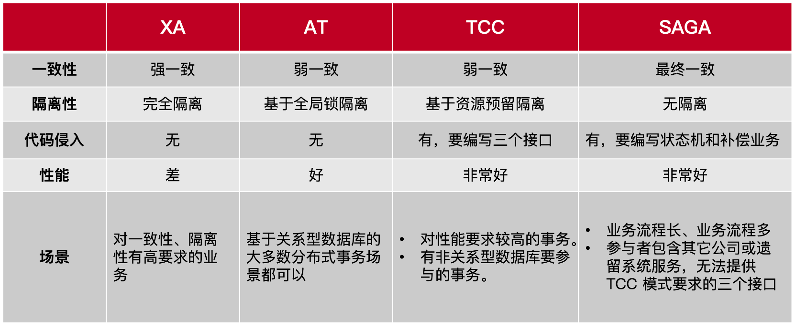
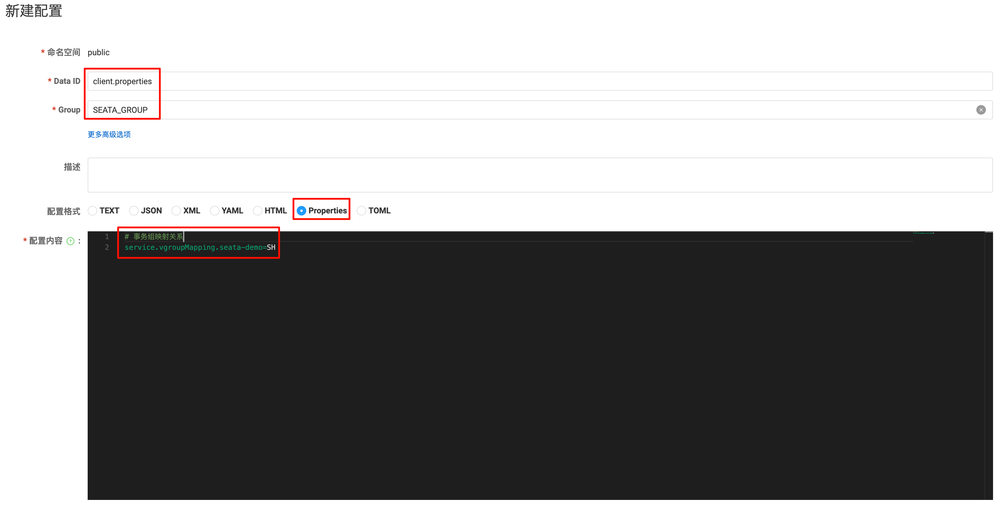

# Seata

[Seata](https://seata.apache.org/zh-cn/) 是 2019 年由阿里巴巴开源的分布式事务解决方案，旨在为微服务架构下的分布式系统提供高性能、高可用的分布式事务管理能力。

## 1.核心概念

### 1.1.三个角色

- **TC（Transaction Coordinator）- 事务协调者**：维护全局和分支事务的状态，协调全局事务提交或回滚。
- **TM（Transaction Manager）- 事务管理器**：定义全局事务的边界，负责开启、提交和回滚全局事务。
- **RM（Resource Manager）- 资源管理器**：负责管理分支事务处理的资源，与`TC`进行通信：注册分支事务、报告分支事务的状态，并执行分支事务的提交或回滚操作。



### 1.2.四种模式

Seata 提供了四种模式来解决分布式事务问题：

- **XA 模式**：强一致性分阶段事务模式，业务侵入较小，但性能较低。
- **AT 模式（Automatic Transaction）**：最终一致的分阶段事务模式，无业务侵入，也是 Seata 默认的模式。
- **TCC 模式（Try Confirm Cancel）**：最终一致的分阶段事务模式，业务侵入较大。
- **SAGA 模式**：长事务模式，通过一系列补偿操作实现最终一致性，业务侵入较大。

注意：每种模式都有其适用场景和优缺点，选择合适的模式需要根据具体业务需求和系统架构来决定，**Seata 支持多种模式的混合使用**，以满足不同的分布式事务需求。

## 2.安装

参考[Seata 部署指南](https://seata.apache.org/zh-cn/docs/ops/deploy-guide-beginner)进行安装。

注意：

- Seata 会存储全局事务和各个分支事务的信息，因此需要配置存储方式，目前支持`file`、`db`、`redis`、`raft`等多种存储方式，默认是`file`模式，适合学习和测试环境。在生产环境中，推荐使用`db`或`redis`等存储方式，以提高可靠性。
  
  > `file`模式为单机模式，全局事务会话信息内存中读写并异步持久化本地文件`root.data`，性能较高;
  > 如果使用`db`模式，

- Seata 需要一个[注册中心](https://seata.apache.org/zh-cn/docs/user/registry/)和[配置中心](https://seata.apache.org/zh-cn/docs/user/configuration/)来管理 TC 服务的注册和配置。默认都是使用`file`模式，即本地文件存储，但在生产环境中，推荐使用`Nacos`、`Eureka`、`Zookeeper`等作为注册中心，使用`Nacos`、`Apollo`等作为配置中心。
  
  > 在较新的版本中，Seata 也提供了一个自己开发的注册中心[NameServer](https://seata.apache.org/zh-cn/docs/user/registry/namingserver)。

## 3.微服务集成

在[分布式事务](../transaction/#_1-1-演示)介绍的案例中，我们已经导入了项目`seata-demo`，下面就以这个项目为例，介绍如何将 Seata 集成到微服务中。

### 3.1.添加依赖

在每个服务的`pom.xml`中，添加 Seata 相关依赖：

```xml
<dependency>
    <groupId>com.alibaba.cloud</groupId>
    <artifactId>spring-cloud-starter-alibaba-seata</artifactId>
    <exclusions>
        <!--版本较低，1.3.0，因此排除-->
        <exclusion>
            <artifactId>seata-spring-boot-starter</artifactId>
            <groupId>io.seata</groupId>
        </exclusion>
    </exclusions>
</dependency>
<!--seata starter 采用1.4.2版本-->
<dependency>
    <groupId>io.seata</groupId>
    <artifactId>seata-spring-boot-starter</artifactId>
    <version>1.4.2</version>
</dependency>
```

### 3.2.修改配置

修改各个微服务的配置文件`application.yml`，由于我部署的 Seata 使用的是`Nacos`作为注册中心和配置中心，那么 Seata 的地址信息也是从`Nacos`中获取的，具体配置实际上和 Seata 服务器的配置是类似的，示例如下：

```yaml
seata:
  registry:
    # 微服务根据如下信息去注册中心获取 TC 服务地址，这部分和 TC 服务的 application.yml 中的 registry 配置保持一致
    type: nacos
    nacos:
      server-addr: localhost:8848
      namespace: ""
      group: DEFAULT_GROUP
      application: seata-server
      username: nacos
      password: admin
  # 事务组，根据这个获取 TC 服务的 cluster 名称
  tx-service-group: seata_demo
  service:
    vgroup-mapping:
      # default 是我在 Nacos 中为 TC 服务配置的 cluster 名称，seata_demo 是事务组名称
      seata_demo: default
```

> Seata 所有的配置参数可以参考[官方文档](https://seata.apache.org/zh-cn/docs/user/configurations/)。
> 
> `tx-service-group`用于标识一个分支事务所属的事务组，不同的应用或服务可以使用不同的事务组，从而进行数据隔离。
>
> `vgroup-mapping`用于将事务组映射到具体的 TC 服务集群，这样设计是为了业务应用只关心事务组名，不关心 TC 实际部署的集群名。

### 3.3.启动验证

启动服务，查看日志，发现各个微服务都成功连接到了 Seata 的 TC 服务：



并且在 Seata 的 TC 服务日志中，也看到了微服务注册的信息：



## 4.XA 模式

### 4.1.XA 规范

**XA 规范**是 X/Open 组织制定的分布式事务处理（DTP，Distributed Transaction Processing）标准，XA 规范描述了全局的 TM（Transaction Manager）和各个 RM（Resource Manager）之间的接口和交互方式。

几乎所有主流的数据库都对 XA 规范提供了支持，换言之，只要数据库支持 XA 规范，就可以基于此解决对分布式事务的管理。

<video src="./imgs/6.mp4" controls></video>

上面视频中介绍了 XA 规范的两个阶段：

1. **准备阶段**（Prepare Phase）：TC（事务协调者）向所有参与的 RM（资源管理器）发送准备请求，RM 执行本地事务并锁定相关资源，然后返回准备结果给 TC。
2. **提交阶段**（Commit Phase）：如果所有 RM 都返回准备成功，TC 向所有 RM 发送提交请求，RM 提交本地事务；如果有任何一个 RM 返回准备失败，TC 向所有 RM 发送回滚请求，RM 回滚本地事务。
   
这就是**两阶段提交协议**（2PC，Two-Phase Commit Protocol），它是 XA 规范的核心机制，确保了分布式事务的**原子性**，即所有参与的 RM 要么全部提交，要么全部回滚，。

### 4.2.XA 规范的优缺点

- 优点：
  - 提供了**强一致性**的分布式事务解决方案，确保所有参与的 RM 要么全部提交，要么全部回滚。
  - 常用数据库都支持 XA 规范，易于集成和使用，**没有业务侵入**。

- 缺点：
  - 由于 RM 在等待 TC 的通知期间，会保持分支事务的锁定状态，直到收到 TC 的指令，如果某个分支事务长时间没有收到 TC 的通知，可能会导致**资源被长时间锁定**，从而影响系统的性能和可用性。
  - 某些 NoSQL 数据库，如 MongoDB、Cassandra 等，并**不支持 XA 规范**，限制了 XA 规范的应用范围。

### 4.3.Seata XA 模式

Seata 的 XA 模式是基于 XA 规范实现的分布式事务管理方案，并对 XA 规范进行了扩展和优化，以提高性能和可用性。

<video src="./imgs/7.mp4" controls></video>

在上面的视频中，如果忽略`TM`和`RM`之间的通信细节，Seata 的 XA 模式实际上和传统的 XA 规范是类似的，都是通过两阶段提交协议来保证分布式事务的一致性。



**第一阶段工作**：

1. RM 注册分支事务到 TC。
2. RM 执行分支事务，但不提交。
3. RM 向 TC 报告分支事务的执行结果。

**第二阶段工作**：

1. TC 检测所有分支事务的状态。
   - 如果所有分支事务都成功，TC 通知所有 RM 提交分支事务。
   - 如果有任何一个分支事务失败，TC 通知所有 RM 回滚分支事务。
2. RM 根据 TC 的通知，提交或回滚分支事务。

### 4.4.实现 XA 模式

1. 在微服务的配置文件中，添加如下配置：

```yaml
seata: 
  data-source-proxy-mode: XA
```

2. 给发起全局事务的入口方法上添加`@GlobalTransactional`注解，本案例中是在订单服务的`create`方法上添加：

```java
import io.seata.spring.annotation.GlobalTransactional;

// @Transactional // 注释本地事务注解，改为分布式事务注解
@GlobalTransactional
public Long create(Order order) {
    // 1.创建订单
    orderMapper.insert(order);
    // 2.扣用户余额
    accountClient.deduct(order.getUserId(), order.getMoney());
    // 3.扣库存
    storageClient.deduct(order.getCommodityCode(), order.getCount());
    return order.getId();
}
```

3. 重启微服务，可以在 Seata 的 TC 服务日志中看到 XA 事务的相关日志：
   
   

4. 继续演示[分布式事务案例](../transaction/#_1-1-演示)中的操作，可以看到即使异常发生，数据依然保持一致性。

## 5.AT 模式

### 5.1.原理

**Seata 默认使用的是 AT 模式**。

AT 模式同样是基于两阶段提交协议实现的分布式事务管理方案，但它采用了**数据补偿**机制来解决 XA 模式中资源长时间锁定的问题，并且增加了**全局锁定**机制防止脏写问题，从而提高了系统的性能和可用性。

<video src="./imgs/10.mp4" controls></video>

**第一阶段工作**：

1. RM 注册分支事务到 TC。
2. RM 记录分支事务**执行前后**的数据状态（快照，`undo log`）。
3. RM **执行分支事务并提交**
4. RM 向 TC 报告分支事务的执行结果。

**第二阶段工作**：

- TC 检测所有分支事务的状态，并通知 RM 提交或回滚分支事务。
- 如果所有分支事务都成功，RM 删除`undo log`。
- 如果有任何一个分支事务失败，RM 根据`undo log`进行数据补偿，回滚分支事务。

### 5.2.AT vs XA

| 特性               | XA 模式                          | AT 模式                          |
|------------------|--------------------------------|--------------------------------|
| 一致性             | 强一致性                         | 最终一致性                       |
| 资源锁定           | 可能长时间锁定                     | 通过数据补偿**减少锁定时间**               |
| 性能               | 较低                             | 较高                             |
| 业务侵入           | 无                               | 需要记录`undo log`，但对业务代码影响较小        |
| 数据库支持         | 需要数据库支持 XA 规范               | 支持大多数关系型数据库                   |

### 5.3.脏写问题

假如现在对一张表进行更新数据，并且有两个事务同时进行更新操作：

<video src="./imgs/12.mp4" controls></video>

为了解决此问题，Seata 在 AT 模式中引入了**全局锁定**机制：由`TC`记录当前正在操作某行数据的事务`ID`，当其他事务尝试更新同一行数据时，会检查`TC`中的锁定信息，如果发现该行数据已经被其他事务锁定，则会阻塞当前事务，直到锁定被释放。

<video src="./imgs/13.mp4" controls></video>

> 思考一个问题：如果另外一个事务不是 Seata 管理的事务，而是直接操作数据库的事务，会发生什么情况？
> 
> 正常情况下，直接操作数据库的事务不会受到 Seata 的全局锁定机制的影响，因为它们不与`TC`进行通信，也不会检查`TC`中的锁定信息，所以还是会发生脏写问题，那么 Seata 如何解决这个问题呢？

Seata 在保存`undo log`时，会保存两份数据状态：**事务执行前**的数据状态和**事务执行后**的数据状态，当需要回滚事务时，如果发现数据已经被其他事务修改过，Seata 记录异常，发送警告，提示用户手动处理数据不一致的问题。

<video src="./imgs/14.mp4" controls></video>

### 5.4.优缺点

- 优点：
  - 通过数据补偿机制减少了资源锁定时间，提高了系统的吞吐量。
  - 使用全局锁定机制防止脏写问题，保证了数据的一致性。
  - 没有业务侵入，框架自动处理`undo log`的记录和数据补偿。
- 缺点：
  - 两阶段之间属于软状态，可能会出现短暂的数据不一致。
  - 需要额外的存储空间来保存`undo log`，增加了系统的复杂性。

### 5.5.实现 AT 模式

1. 创建`undo_log`表

使用 AT 模式需要创建`undo_log`表，用于存储事务的`undo log`信息，这张表需要在每个使用 AT 模式的微服务数据库中创建，脚本如下：

```sql
-- 注意此处0.7.0+ 增加字段 context
CREATE TABLE `undo_log` (
  `id` bigint(20) NOT NULL AUTO_INCREMENT,
  `branch_id` bigint(20) NOT NULL,
  `xid` varchar(100) NOT NULL,
  `context` varchar(128) NOT NULL,
  `rollback_info` longblob NOT NULL,
  `log_status` int(11) NOT NULL,
  `log_created` datetime NOT NULL,
  `log_modified` datetime NOT NULL,
  PRIMARY KEY (`id`),
  UNIQUE KEY `ux_undo_log` (`xid`,`branch_id`)
) ENGINE=InnoDB AUTO_INCREMENT=1 DEFAULT CHARSET=utf8;
```

> 详情请参考[Seata 官方说明](https://seata.apache.org/zh-cn/docs/dev/mode/at-mode#%E5%9B%9E%E6%BB%9A%E6%97%A5%E5%BF%97%E8%A1%A8)。

2. 在微服务的配置文件中，添加如下配置：

```yaml
seata: 
  data-source-proxy-mode: AT
```

3. 给发起全局事务的入口方法上添加`@GlobalTransactional`注解，同上面 XA 模式一样。

4. 重启服务，继续演示[分布式事务案例](../transaction/#_1-1-演示)中的操作，可以看到即使异常发生，数据依然保持一致性。

## 6.TCC 模式

### 6.1.介绍

**TCC 模式**与 AT 模式非常类似，每阶段也是独立事务，不同的是 TCC 通过业务代码来实现每个阶段的逻辑，**需要实现三个方法**：

- **Try**：尝试执行业务操作，预留资源。
- **Confirm**：确认执行业务操作，提交资源。
- **Cancel**：取消执行业务操作，释放资源，可以理解为 Try 的反向操作。

这样解释很抽象，举个例子：一个扣减用户余额的业务，假设账户 A 余额 100 元，现在要扣减 30 元：

- **阶段一（Try）**：检查账户 A 是否有足够余额，如果有，则冻结 30 元，余额变为 70 元，冻结金额为 30 元。
  
  ::: code-group

  ```md:img [<1>]
  
  ```
  
  ```md:img [<1>]
  
  ```

  :::

- **阶段二（假如要 Confirm）**：确认扣减操作，真正扣减冻结的 30 元，余额变为 70 元，冻结金额变为 0 元。
  
  ::: code-group

  ```md:img [<1>]
  
  ```
  
  ```md:img [<1>]
  
  ```

  :::

- **阶段二（假如要 Cancel）**：取消扣减操作，释放冻结的 30 元，余额变为 100 元，冻结金额变为 0 元。
  
  ::: code-group

  ```md:img [<1>]
  
  ```
  
  ```md:img [<1>]
  
  ```

  :::

根据此案例，我们可以发现，在`Try`阶段对资源进行了预留操作，而在`Confirm`和`Cancel`中就不在操作原始资源，而是操作自身预留的资源，即使有并发操作，也不会互相影响，这样就避免了脏写问题，所以 TCC 模式**不需要全局锁定机制**。

### 6.2.原理

<video src="./imgs/19.mp4" controls></video>

### 6.3.优缺点

- 优点：
  - 一阶段事务执行后立即提交，资源锁定时间最短，性能好。
  - 相比 AT 模式，无需生成`undo log`，无需全局锁定机制，系统复杂度最低。性能最强。
  - 不依赖数据库事务，而是依赖补偿操作，可以支持更多类型的数据源。
- 缺点：
  - 需要业务代码实现`Try`、`Confirm`、`Cancel`三个方法，业务侵入较大。
  - 软状态时间较长，可能会出现较长时间的数据不一致。
  - 需要处理**幂等性、空回滚、业务悬挂**问题，增加了实现复杂度。

### 6.4.幂等性、空回滚和业务悬挂

#### 1.幂等性

**定义**：指的是无论执行多少次，结果都是一样的。`Confirm`和`Cancel`方法可能执行失败后被重试，因此需要确保它们是幂等的。

**思路**：Seata 会为每个分支事务生成一个唯一的`branchId`，可以利用这个`branchId`来实现幂等性。

#### 2.空回滚

**定义**：当某分支事务的`Try`阶段阻塞或失败时，导致触发二阶段的`Cancel`操作，由于没有成功预留资源，`Cancel`操作实际上不需要执行任何业务逻辑，这就是**空回滚**。

<video src="./imgs/20.mp4" controls></video>

**思路**：可以在`Cancel`方法中，先检查是否有预留资源，如果没有，则直接返回成功。

#### 3.业务悬挂

**定义**：由于进行`Try`阶段某分支阻塞，导致 TC 超时未能收到所有分支的`Try`结果，从而触发了`Cancel`操作，而此时该分支的`Try`却执行成功了，导致该分支永远无法完成`Confirm`或`Cancel`操作，这就是**业务悬挂**。

<video src="./imgs/21.mp4" controls></video>

**思路**：可以在`Try`方法中，判断是否已经执行`Confirm`或`Cancel`，如果已经执行，则直接返回成功。

#### 4.具体实现

1. 我们可以通过**创建一张表**来记录 TCC 事务的状态，表结构如下：
   
    ```sql
    CREATE TABLE `tcc_transaction_log` (
        `id` BIGINT PRIMARY KEY AUTO_INCREMENT,
        `xid` varchar(100) NOT NULL COMMENT '全局事务ID',
        `branch_id` bigint (20) NOT NULL COMMENT '分支事务ID',
        `status` tinyint (1) NOT NULL COMMENT '事务状态：0-TRYING、1-CONFIRMED、2-CANCELLED',
        `gmt_created` datetime NOT NULL COMMENT '创建时间',
        `gmt_modified` datetime NOT NULL COMMENT '修改时间',
        KEY `idx_xid_branch_id` (`xid`, `branch_id`),
        KEY `idx_status` (`status`)
    ) ENGINE = InnoDB AUTO_INCREMENT = 1 DEFAULT CHARSET = utf8;
    ```

2. 在`Try`方法中，基于索引（`xid`和`branch_id`）检查是否已经存在该分支事务的记录：

   - 如果存在，说明该分支事务已经执行过`Try`，直接返回即可；
   - 如果不存在，则插入一条新记录，状态为`TRYING`，然后执行预留资源的逻辑。

3. 在`Confirm`方法中，先检查该分支事务的状态是否为`TRYING`，如果是，则执行确认逻辑，并将状态更新为`CONFIRMED`，否则直接返回成功。

4. 在`Cancel`方法中，先检查该分支事务的状态是否为`TRYING`，如果是，则执行取消逻辑，并将状态更新为`CANCELLED`，否则直接返回成功。

### 6.4.实现 TCC 模式

在本案例中，订单创建是一个简单的数据库插入操作，使用 AT 模式最合适，账户余额和库存扣减操作则可以使用 TCC 模式来实现，**Seata 支持多种模式混合使用**，所以下面就对账户服务进行改造，介绍如何实现 TCC 模式：

1. 因为要冻结余额，所以需要在`account`表中增加一个`frozenMoney`字段：

   ```sql
   ALTER TABLE account_tbl ADD COLUMN frozenMoney int(11) UNSIGNED NULL DEFAULT 0;
   ```

2. 表`tcc_transaction_log`对应的 Entity、Mapper 以及`account`表新增`freeze_money`字段已经在项目中定义好了，可以直接使用。

3. 声明 TCC 接口：

   TCC 的三个方法需要通过接口来声明，示例如下：

    ```java
    import io.seata.rm.tcc.api.BusinessActionContext;
    import io.seata.rm.tcc.api.BusinessActionContextParameter;
    import io.seata.rm.tcc.api.LocalTCC;
    import io.seata.rm.tcc.api.TwoPhaseBusinessAction;

    /**
     * 如果 TCC 参与者是本地 bean（非远程RPC服务），本地 TCC bean 还需要在接口定义中添加 @LocalTCC 注解
     */
    @LocalTCC
    public interface AccountTCCService {

        /**
         * 使用 @TwoPhaseBusinessAction 注解声明 TCC 的 Try 方法
         * name：分支事务名称，唯一标识，Seata 会根据此名称来标识和匹配三个方法的逻辑关系
         * commitMethod：二阶段的 Confirm 方法名称
         * rollbackMethod：二阶段的 Cancel 方法名称
         *
         * @param context BusinessActionContext 上下文对象，包含分支事务的相关信息:
         *                1. xid: 全局事务 id
         *                2. branchId: 分支事务 id
         *                3. actionName: 分支资源 id，即 @TwoPhaseBusinessAction 注解中的 name 属性值
         *                3. actionContext: 业务传递的参数，可以通过 @BusinessActionContextParameter 来标注需要传递的参数
         * @BusinessActionContextParameter 注解用于指定参数在 BusinessActionContext 中的名称，以便在 Confirm 和 Cancel 方法中获取这些参数
         * 如果方法抛出异常，Seata 会认为 Try 方法执行失败，从而触发 Cancel 方法
         */
        @TwoPhaseBusinessAction(name = "deduct", commitMethod = "confirm", rollbackMethod = "cancel")
        void deduct(BusinessActionContext ctx,
                @BusinessActionContextParameter(paramName = "userId") String userId,
                @BusinessActionContextParameter(paramName = "money") int money);

        /**
         * @return boolean 返回值表示 Confirm 方法是否执行成功，如果返回 false，则会触发重试机制
         */
        boolean confirm(BusinessActionContext context);

        /**
         * @return boolean 返回值表示 Cancel 方法是否执行成功，如果返回 false，则会触发重试机制
         */
        boolean cancel(BusinessActionContext context);
    }
    ```

    为了降低耦合度，建议新增一个 TCC 接口`AccountTCCService`，不要直接在`AccountService`中定义 TCC 方法。

4. 创建`AccountTCCServiceImpl`实现类，实现 TCC 的三个方法：

    ```java
    import cn.itcast.account.entity.TccTransactionLog;
    import cn.itcast.account.mapper.TccTransactionLogMapper;
    import cn.itcast.account.service.AccountService;
    import cn.itcast.account.service.AccountTCCService;
    import com.baomidou.mybatisplus.core.conditions.query.LambdaQueryWrapper;
    import io.seata.rm.tcc.api.BusinessActionContext;
    import lombok.extern.slf4j.Slf4j;
    import org.springframework.stereotype.Service;
    import org.springframework.transaction.annotation.Transactional;

    import javax.annotation.Resource;
    import java.time.LocalDateTime;
    import java.util.Map;

    @Slf4j
    @Service
    public class AccountTCCServiceImpl implements AccountTCCService {

        @Resource
        private AccountService accountService;
        @Resource
        private TccTransactionLogMapper tccTransactionLogMapper;

        @Override
        @Transactional(rollbackFor = Exception.class) // TCC 的 Try 阶段需要开启本地事务，保证「冻结金额 + 插入日志」的原子性
        public void deduct(BusinessActionContext ctx, String userId, int money) {
            log.info("Account TCC try called. xid={}, branchId={}", ctx.getXid(), ctx.getBranchId());
            // 1.查询 TCC 事务日志，做防悬挂处理
            TccTransactionLog tccTransactionLog = get(ctx.getXid(), ctx.getBranchId());
            if (tccTransactionLog != null) {
                //  防悬挂：说明 Cancel 先执行了，直接返回即可
                return;
            }

            /*
            * 2.检测余额是否足够
            * 由于account表中`money`字段没有设置为非负数，
            * 如果余额不足，直接扣款数据库会报错，从而导致 TCC 事务回滚
            * 所以这里无需额外检测余额是否足够
            */

            // 3.扣减可用余额，并记录冻结金额
            accountService.deductTCC(userId, money, money);

            // 4.记录TCC事务日志
            tccTransactionLog = TccTransactionLog.create(ctx.getXid(), ctx.getBranchId());
            tccTransactionLogMapper.insert(tccTransactionLog);
        }

        @Override
        @Transactional(rollbackFor = Exception.class) // 保证「扣减冻结 + 更新日志」的原子性
        public boolean confirm(BusinessActionContext ctx) {
            log.info("Account TCC confirm called. xid={}, branchId={}", ctx.getXid(), ctx.getBranchId());
            // 1.查询 TCC 事务日志，做幂等处理
            TccTransactionLog tccTransactionLog = get(ctx.getXid(), ctx.getBranchId());
            if (tccTransactionLog == null || TccTransactionLog.Status.TRYING != tccTransactionLog.getStatus()) {
                // 幂等：不存在或者已经不是 TRYING 状态，幂等返回成功
                return true;
            }

            // 2.将冻结金额置为 0
            Map<String, Object> actionContext = ctx.getActionContext();
            String userId = (String) actionContext.get("userId");
            Integer money = (Integer) actionContext.get("money");
            accountService.deductTCC(userId, 0, -money);

            // 3.更新 TCC 事务日志状态为 CONFIRMED
            tccTransactionLog.setStatus(TccTransactionLog.Status.CONFIRMED);
            tccTransactionLog.setGmtModified(LocalDateTime.now());
            return tccTransactionLogMapper.updateById(tccTransactionLog) == 1;
        }

        @Override
        @Transactional(rollbackFor = Exception.class) // 保证「恢复金额 + 更新日志」的原子性
        public boolean cancel(BusinessActionContext ctx) {
            log.info("Account TCC cancel called. xid={}, branchId={}", ctx.getXid(), ctx.getBranchId());
            // 1.查询 TCC 事务日志，做幂等、空回滚处理
            TccTransactionLog tccTransactionLog = get(ctx.getXid(), ctx.getBranchId());
            if (tccTransactionLog == null) {
                // 空回滚：不存在，则表示 Try 阶段未执行，直接记录 CANCELLED 状态的日志并返回成功
                TccTransactionLog newLog = TccTransactionLog.create(ctx.getXid(), ctx.getBranchId(), TccTransactionLog.Status.CANCELLED);
                tccTransactionLogMapper.insert(newLog);
                return true;
            }
            if (TccTransactionLog.Status.CANCELLED == tccTransactionLog.getStatus()) {
                // 幂等：如果已经是 CANCELLED 状态，幂等返回成功
                return true;
            }

            Map<String, Object> actionContext = ctx.getActionContext();
            // 2.将金额加回可用余额，冻结金额置为 0
            String userId = (String) actionContext.get("userId");
            Integer money = (Integer) actionContext.get("money");
            accountService.deductTCC(userId, -money, -money);

            // 4.更新 TCC 事务日志状态为 CANCELLED
            tccTransactionLog.setStatus(TccTransactionLog.Status.CANCELLED);
            tccTransactionLog.setGmtModified(LocalDateTime.now());
            return tccTransactionLogMapper.updateById(tccTransactionLog) == 1;
        }

        private TccTransactionLog get(String xid, long branchId) {
            LambdaQueryWrapper<TccTransactionLog> query = new LambdaQueryWrapper<TccTransactionLog>()
                    .eq(TccTransactionLog::getXid, xid)
                    .eq(TccTransactionLog::getBranchId, branchId);
            return tccTransactionLogMapper.selectOne(query);
        }

    }
    ```

    > **注意：TCC 的三个方法都需要开启本地事务，保证各自的原子性**。

5. 修改`AccountController`，将`AccountService`改为`AccountTCCService`：

    ```java
    @RestController
    @RequestMapping("account")
    public class AccountController {

        // @Autowired
        // private AccountService accountService;

        // 使用 TCC 模式的服务
        @Resource
        private AccountTCCService accountTCCService;

        @PutMapping("/{userId}/{money}")
        public ResponseEntity<Void> deduct(@PathVariable("userId") String userId, @PathVariable("money") Integer money){
            // accountService.deduct(userId, money);

            // 使用 TCC 模式进行扣款
            accountTCCService.deduct(null, userId, money);

            return ResponseEntity.noContent().build();
        }
    }
    ```

    > 订单服务调用账户服务时，是基于 HTTP 的远程调用，所以需要修改的地方只有`AccountController`，不需要修改订单服务。
    >
    > 订单服务依然使用`@GlobalTransactional`注解来开启全局事务，至于账户服务配置文件中的`data-source-proxy-mode`配置可以删除掉，因为它的 TCC 逻辑是通过`AccountTCCService`来实现的，和数据源代理模式无关。

6. 重启服务，继续演示正常情况和异常情况，可以发现数据依然保持一致性。

## 7.Saga 模式

**这种模式只做介绍，不做实现演示**，实际开发中使用上面三种模式即可。

### 7.1.介绍

**Saga 模式**是 Seata 提供的长事务解决方案，适用于需要跨越较长时间的业务操作场景。也分为两个阶段：

- **第一阶段（Saga Execution）**：执行一系列的本地事务，每个本地事务完成后，都会记录一个补偿操作，用于在需要回滚时执行。
- **第二阶段（Saga Compensation）**：如果某个本地事务失败，Saga 会按照补偿操作的顺序，依次执行补偿操作，回滚已经完成的本地事务。



### 7.2.优缺点

- 优点：
  - 适用于长时间运行的业务操作，能够处理复杂的业务流程。
  - 每个本地事务独立提交，减少了资源锁定时间，性能好。
  - 事务参与者可以基于**事件驱动**实现异步调用，吞吐高。
- 缺点：
  - 软状态持续时间不确定，时效性差。
  - 没有全局锁，没有事务隔离，会有**脏写**问题。
  - 需要业务代码实现补偿操作，业务侵入较大。

## 8.四种模式对比



## 9.高可用

TC 服务作为 Seata 的核心组件，一定要保证高可用和异地容灾。

> **高可用**：指的是通过部署多个 TC 服务实例，组成一个集群，当某个实例发生故障时，其他实例可以继续提供服务，从而保证系统的可用性和稳定性。
> 
> **异地容灾**：指的是在不同地理位置部署 TC 服务实例，以防止单点故障和自然灾害等因素导致的服务中断。

<video src="./imgs/24.mp4" controls></video>

在前文中，提到使用`tx-service-group`和`vgroup-mapping`这两个配置，微服务可以找到对应的 TC 服务集群。但当时是写死到`application.yml`配置文件中的，那么要实现高可用和异地容灾，则可以将`vgroup-mapping`配置放到配置中心中，这样如果某个集群发生故障，只需要修改配置中心中的`vgroup-mapping`配置，指向其他可用的 TC 服务集群即可，无需对微服务进行修改和重启。这也是为什么要使用`tx-service-group`和`vgroup-mapping`这两个配置进行映射的原因。

Seata 服务高可用部署具体操作请参考[Seata 官方文档](https://seata.apache.org/zh-cn/docs/ops/deploy-ha)。

下面说明下，如何将`vgroup-mapping`配置放到`Nacos`配置中心中：

1. 登录`Nacos`控制台，进入`配置管理`页面，点击`+ 新增配置`按钮。
   
   

2. 修改每一个微服务的`application.yml`文件中`seata`配置，让其从`Nacos`配置中心获取，完整配置如下：
   
    ```yaml
    seata:
    registry:
        type: nacos
        nacos:
        server-addr: localhost:8848
        namespace: ""
        group: DEFAULT_GROUP
        application: seata-server
        username: nacos
        password: admin
    tx-service-group: seata_demo
    data-source-proxy-mode: AT
    config:
        type: nacos
        nacos:
        server-addr: localhost:8848
        group: SEATA_GROUP
        username: nacos
        password: admin
        data-id: client.properties
    ```

3. 重启各个微服务，观察 Seata TC 服务日志，发现各个微服务都成功连接到了 Seata 的 TC 服务，如果有多个集群，则可以尝试修改`Nacos`配置中心中的`vgroup-mapping`配置，验证高可用和异地容灾功能是否生效。

   

