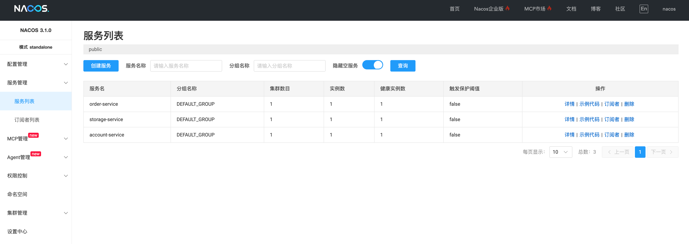
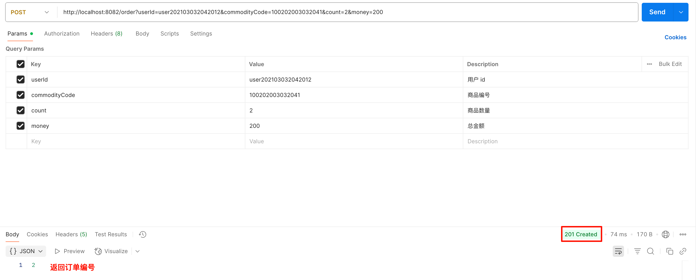
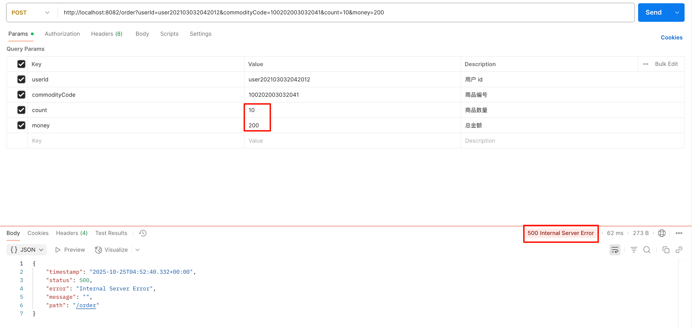
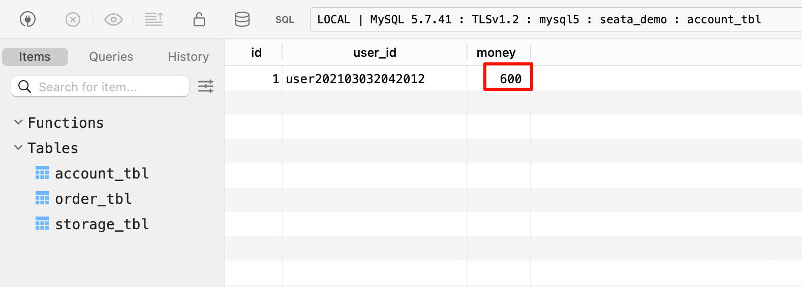
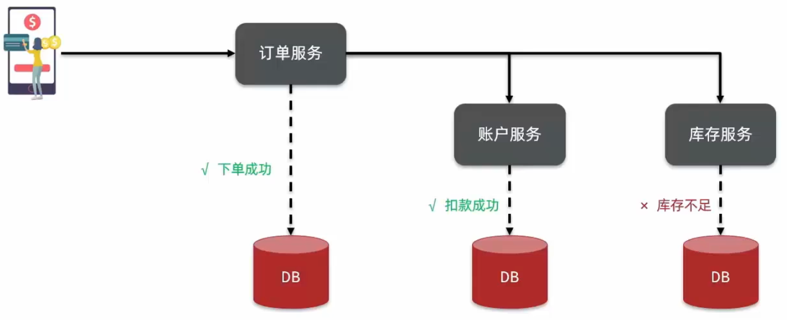
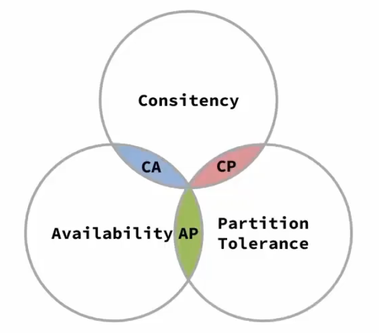
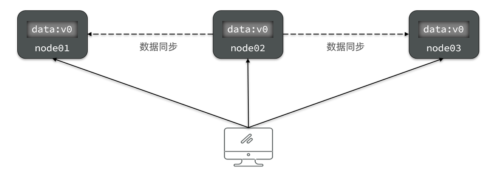
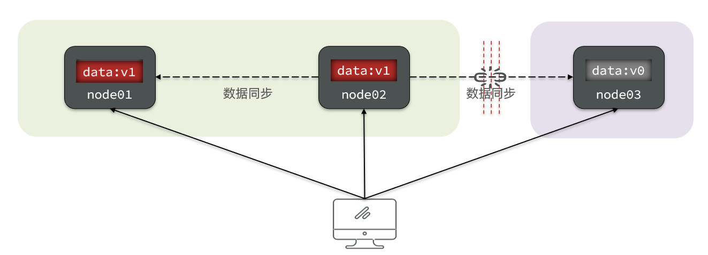
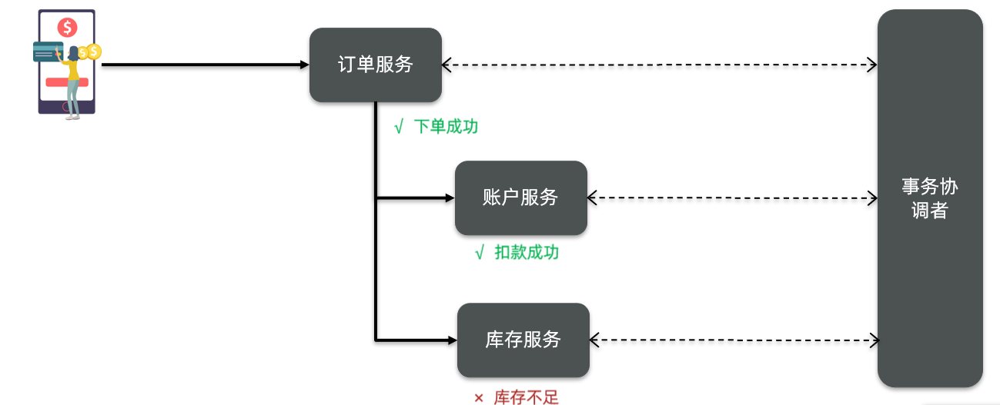

# 分布式事务

说起事务，大家第一反应可能是数据库事务，数据库事务是指一组操作要么全部成功，要么全部失败，是数据库管理系统（DBMS）用来保证**数据一致性和完整性**的重要机制。

**一致性**指的是数据库在事务执行前后都必须处于一个合法的状态，不能出现数据不一致的情况。而**完整性**则是指数据库中的数据必须满足预定义的规则和约束条件。

事务有四个基本特性，通常称为`ACID`特性：

- **原子性（Atomicity）**：事务中所有操作要么全部完成，要么全部不完成。
- **一致性（Consistency）**：事务执行的前后，数据库必须保持一致的状态。
- **隔离性（Isolation）**：多个事务并发执行时，一个事务的执行不应影响其他事务的执行。
- **持久性（Durability）**：一旦事务提交，其结果应该永久保存在数据库中，即使系统崩溃也不会丢失。

在分布式系统中，因为涉及到多个服务，它们可能使用不同的数据库和存储系统，事务管理变得更加复杂。**分布式事务**需要协调多个独立的资源，以确保它们在一个**全局事务中保持一致性**。

## 1.案例

假设有一个电商系统，用户在下单时会调用订单服务，创建订单并写入数据库，然后订单服务调用账户服务和库存服务：

- 账户服务负责扣减用户余额
- 库存服务负责扣减商品库存

 

## 1.1.演示

1. [点击下载资料](/attachments/transcation-demo.zip)
2. 创建数据库：`seata_demo`，并导入`seata_demo.sql`脚本，数据库版本是`MySQL 5.0+`。

3. 导入项目`seata-demo`到IDE中。
4. 启动 [Nacos](https://nacos.io/docs/latest/quickstart/quick-start/?spm=5238cd80.6a33be36.0.0.52a31e5dv8eTH9)，以及所有服务
   
   

5. 测试下单功能，发出请求

   ```bash
   curl -X POST "http://localhost:8082/order?userId=user202103032042012&commodityCode=100202003032041&count=2&money=200"
   ```

   

   查询数据库，发现订单创建成功，余额和库存也扣减成功。

6. 模拟异常情况，当在请求中只修改`count=10`，但总金额不变，即数量和总金额不匹配时，发出请求
   
   

   查询数据库，发现订单创建失败，余额竟然扣减成功：

   
   
### 1.2.分析

上面异常情况原因是因为库存服务抛出了异常，它的事务进行回滚，但是订单服务和账户服务的事务已经提交，导致数据不一致。


   
## 2.简介

在分布式系统下，一个业务跨越多个服务或数据源时，每个服务都是一个分支事务，要保证所有分支事务最终状态一致，这样的事务就是分布式事务。

### 2.1.CAP 定理

1998 年，`Eric Brewer`提出了**CAP 定理**，指出在分布式系统中，不可能同时满足以下三个条件：

- **一致性（Consistency）**
- **可用性（Avaliability）**
- **分区容错性（Partition Tolerance）**

<center></center>

#### 一致性（Consistency）

指的是所有节点在同一时间看到的数据是一致的。也就是说，当一个节点对数据进行修改后，其他节点应该立即“看到”这个修改。

::: code-group

```md:img [<1>]

```

```md:img [<2>]

```

```md:img [<3>]

```

:::

#### 可用性（Availability）

指的是系统在任何时候都能响应用户的请求，无论请求是成功还是失败。即使部分节点出现故障，系统仍然能够继续提供服务。


上图中，`node03`出现故障，无法进行数据同步，当请求进来只能阻塞或者拒绝，不过还有`node01`和`node02`能够提供服务，因此系统仍然可以响应用户请求，保证了**可用性**，但是无法保证**一致性**。

#### 分区容错性（Partition Tolerance）

指的是系统能够容忍网络分区的发生，即使网络中的某些节点无法通信，系统仍然能够继续运行。

> 网络分区是指在分布式系统中，由于网络故障或延迟，导致系统中的某些节点与其他节点无法通信，从而形成独立的子系统。

::: code-group

```md:img [<1>]

```

```md:img [<2>]

```

```md:img [<3>]

```

:::

上图中，如果要保证**分区容错性**，那么可以让`node03`停止提供服务，当请求进来时，阻塞或者拒绝请求，等待网络恢复后数据同步完成再继续提供服务，但是这样就无法保证**可用性**。

在分布式系统中，**分区容错性是必须要保证的**，因为网络故障是不可避免的，因此在设计分布式系统时，通常需要在**一致性**和**可用性**之间进行取舍，根据具体的应用场景选择合适的策略，即，**CP**（一致性和分区容错性）或**AP**（可用性和分区容错性）。

> 思考：Elasticsearch 集群是 AP 还是 CP？
>
> Elasticsearch 集群通常被视为`CP`系统（一致性和分区容错性）。因为它优先保证数据一致性，并在网络分区时，会剔除掉无法通信的节点，通过副本分片重新分配来确保一致性，这可能导致短暂的不可用性，但最终数据是一致的。

### 2.2.BASE 理论

**BASE 理论**是对 CAP 定理的一种解决思路，包括三个思想：

- **基本可用（Basically Available）**：分布式系统在出现故障时，**允许损失部分可用性**，即保证核心可用。
- **软状态（Soft State）**：在一定时间内，允许出现中间状态，比如临时的数据不一致。
- **最终一致性（Eventual Consistency）**：虽然无法保证强一致性，但是在软状态结束后，**最终会达到数据一致**。

### 2.3.解决方案

分布式事务最大的问题就是各个子事务的一致性问题，因此可以借鉴 CAP 定理和 BASE 理论的思想，来设计分布式事务解决方案，比如：

- **AP 方案**：各个子事务分别执行和提交，允许出现结果不一致，然后采用**补偿机制**来修正不一致的数据，实现**最终一致性**。
  
  > 补偿机制：比如在电商系统中，如果订单服务创建订单成功，但账户服务扣减余额失败，可以通过补偿机制，创建一个退款订单，退还用户的余额，从而修正数据不一致的问题。

- **CP 方案**：各个子事务执行后，不立即提交，而是通过**协调者**来统一管理各个子事务的提交或回滚，确保所有子事务**同时提交或回滚**，实现**强一致性**。但在事务执行过程中，可能会出现阻塞或不可用的情况。
  
  

