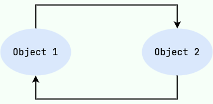
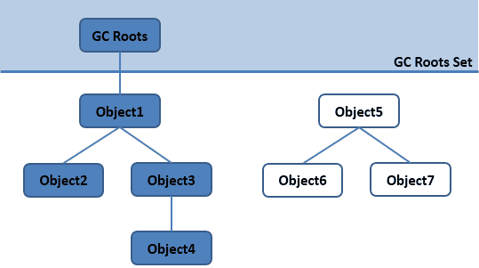
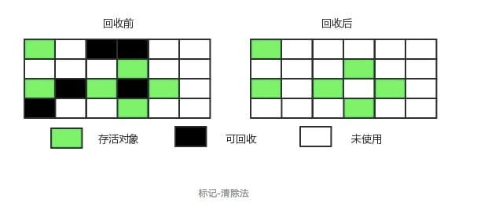
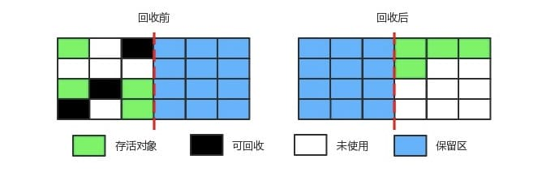
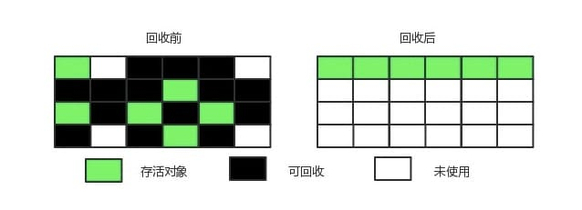
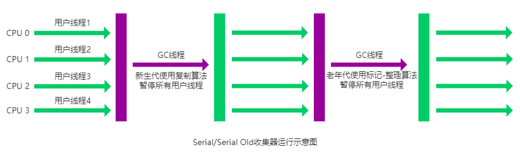
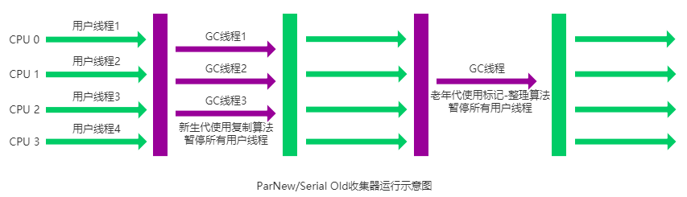
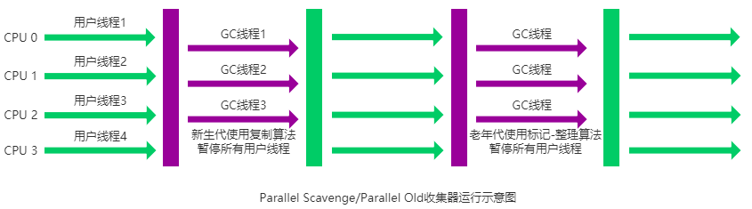
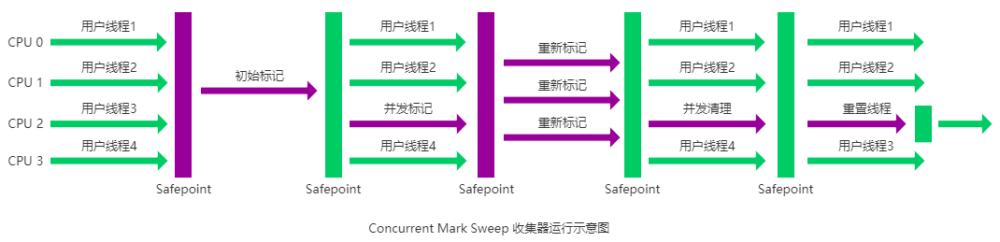
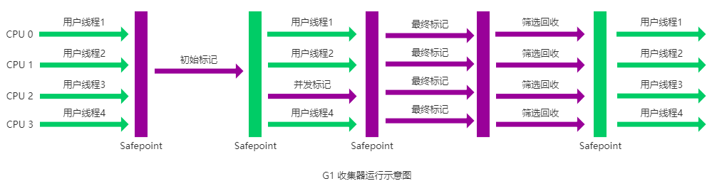

# GC 垃圾回收

刚认识 Java 时，都会听过“有垃圾回收机制，不需要手动释放内存”的说法。那垃圾回收机制到底是什么？它是如何工作的？本文将带你了解 Java 的垃圾回收机制。

## 1.定义

在[JVM](../jvm/)介绍中，提到使用`new`关键字创建的对象会存储在堆内存中，而堆内存是有限的，当堆内存不足时，JVM 会启动垃圾回收机制，回收不再使用的对象所占用的内存空间，以便为新对象腾出空间。

**垃圾回收（Garbage Collection，简称 GC）**是指自动识别和回收不再使用的对象所占用的内存空间的过程。GC 的主要目的是释放内存，防止内存泄漏和内存溢出，从而提高程序的性能和稳定性。

## 2.工作原理

既然要回收，首先要知道哪些对象是不再使用的，我们可能想到**计数**方法，即为每个对象维护一个引用计数器，当对象被引用时，计数器加一；当对象不再被引用时，计数器减一；当计数器为零时，说明该对象不再使用，可以被回收。这就是**引用计数法**。

然而，Java 并没有使用这种方法，因为它**无法处理循环引用**的问题。例如，两个对象互相引用，但它们都不再被其他对象引用，这种情况下计数器都不会为零，导致内存泄漏。



### 2.1.可达性分析算法

Java 使用的是**可达性分析算法（Reachability Analysis）**。该算法通过一组称为**GC Roots**的对象作为起点，遍历所有可达的对象。任何无法从 GC Roots 访问到的对象都被认为是不可达的，可以被回收。



那么这些 GC Roots 对象到底是什么呢？

- **虚拟机栈（栈帧中的本地变量表）**中引用的对象
- **方法区中的类静态属性**引用的对象
- **方法区中的常量引用**的对象
- **本地方法栈中 JNI（即一般说的 Native 方法）引用的对象**

即使在可达性分析法中，一个对象被判定为不可达，也不一定会立即被回收。Java 还引入了**finalize()**方法，允许对象在被回收前进行一些清理操作。当一个对象被判定为不可达时，JVM 会先检查该对象是否重写了 finalize() 方法（或者是否已经调用过 finalize() 方法），如果是，则会调用该方法，否则，该对象将被回收。

> 注意：如果 finalize() 方法中重新建立了对该对象的引用，那么该对象将变为可达（**自救**），从而逃过了回收，所以从 Java 9 开始，finalize() 方法被标记为**已弃用**，引入了`java.lang.ref.Cleaner` 作为替代方案。

## 3.引用

不管是引用计数法，还是可达性分析法，都是通过**引用**来判断对象是否被使用，Java 中有四种引用类型：

1. **强引用（Strong Reference）**：使用`new`关键字创建的对象，默认情况下都是强引用。只要强引用存在，垃圾回收器就不会回收该对象。
   
   ```java
   Object obj = new Object(); // 强引用
   obj = null; // 解除强引用，对象可以被回收
   ```

2. **软引用（Soft Reference）**：使用`java.lang.ref.SoftReference`类创建的引用。**软引用对象在内存不足时才会被回收**，适用于**缓存**等场景。
   
   ```java
   Object obj = new Object();
   SoftReference<Object> softRef = new SoftReference<>(obj);
   obj = null; // 解除强引用
   ```

3. **弱引用（Weak Reference）**：使用`java.lang.ref.WeakReference`类创建的引用。**弱引用对象在下一次垃圾回收时就会被回收**，适用于**监听器**等场景。
   
   ```java
   Object obj = new Object();
   WeakReference<Object> weakRef = new WeakReference<>(obj);
   obj = null; // 解除强引用
   ```

4. **虚引用（Phantom Reference）**：使用`java.lang.ref.PhantomReference`类创建的引用。和前面几种不同，它并不会决定对象的生命周期，如果一个对象只有虚引用，那么它随时都可能被回收。虚引用主要用于**在对象被回收时收到一个系统通知**，适用于**资源清理**等场景。
   
   ```java
   Object obj = new Object();
   ReferenceQueue<Object> refQueue = new ReferenceQueue<>();
   // 创建虚引用，要求必须与一个引用队列关联
   PhantomReference<Object> phantomRef = new PhantomReference<>(obj, refQueue);
   obj = null; // 解除强引用
   ```

## 4.垃圾收集算法

GC 如何回收内存呢？以及回收后如何整理内存空间？Java 主要使用以下几种垃圾收集算法：

### 4.1.标记-清除算法（Mark-Sweep）

标记-清除算法分为两个阶段：**标记**和**清除**。在标记阶段，GC 会遍历所有可达的对象，并标记它们为“存活”。在清除阶段，GC 会扫描堆内存，回收所有未被标记为“存活”的对象所占用的内存空间。



它是最基础的收集算法，后续的算法都是对其不足进行改进得到，那么它有哪些不足呢？

- 效率问题： 标记和清除两个阶段都需要遍历堆内存，效率较低。
- 内存碎片问题： 清除阶段可能会留下大量的内存碎片，导致无法为新对象分配**连续**的内存空间。

### 4.2.复制算法（Copying）

既然标记-清除算法会产生内存碎片，那直接将存活的对象复制到另一块内存区域，然后清理掉原来的内存区域不就行了吗？这就是**复制算法**。

它将内存分为两块区域，每次只使用其中一块，当这一块内存使用完时，GC 会将存活的对象复制到另一块内存区域，然后清理掉当前内存区域。



在[JVM-堆内存划分](../jvm/#对象的分配与回收流程)中提到，新生代被分为 Eden 区和两个 Survivor 区（S0 和 S1），新创建的对象如果在经历回收后仍然存活，就会被复制到其他区域，正是这种算法促使了新生代的划分。

这种算法还是有些不足：

- 内存利用率低： 由于每次只使用一块内存区域，导致内存利用率降低。
- 复制开销大： 复制存活对象需要额外的时间和空间，像老年代这种存活对象较多的区域，复制开销会很大。

### 4.3.标记-整理算法（Mark-Compact）

既然复制算法存在内存利用率低的问题，那么改成**移动**不就行了吗？这就是**标记-整理算法**。

将存活的对象移动到内存的一端，然后直接清理掉内存的另一端，从而避免了内存碎片的问题。



虽然解决了内存碎片的问题，但移动对象也会带来额外的开销，尤其是当存活对象较多时，移动操作会比较耗时，也还是有一定的效率问题。

### 4.4.分代收集算法（Generational Collection）

既然每个对象的生命周期不同，比如刚创建的对象更容易被回收，而存活时间较长的对象则不容易被回收，那么我们可以根据对象的生命周期将内存划分为不同的区域，分别采用不同的垃圾收集算法进行回收，这就是**分代收集算法**。大多数 JVM 都采用分代收集算法。

**是不是也就可以理解了为什么 JVM 会将堆内存划分为新生代和老年代？**

那么如何划分呢？

- 新生代：使用复制算法，简单高效，虽然内存利用率低，但新生代对象存活时间短，可以避免产生大量碎片。
- 老年代：由于存活对象较多，使用标记-整理或者标记-清除算法都可以，避免了内存利用率低的问题。

## 5.垃圾收集器

如果说垃圾收集算法是方法论，那么垃圾收集器就是具体的实现了，不同的垃圾收集器采用了不同的算法和策略，并没有一种垃圾收集器是最好的，只有最适合特定应用场景的垃圾收集器。

### 5.1.修改垃圾收集器

JVM 默认的垃圾收集器可以通过`java -XX:+PrintCommandLineFlags -version`命令查看：

- 在 Java 8 及之前版本，默认垃圾收集器是**并行垃圾收集器（Parallel GC）**
- 在 Java 9 及之后版本，默认垃圾收集器是**G1 垃圾收集器（G1 GC）**

可以通过`-XX:+Use<垃圾收集器名称>`参数来指定使用的垃圾收集器，例如：

```bash
java -XX:+UseG1GC -jar myapp.jar
```

### 5.2.如何选择垃圾收集器

垃圾回收是一个耗时的操作，会暂停应用线程（`Stop-The-World`），那么我们该如何选择呢：

- **响应时间优先**：减少 GC 垃圾回收的停顿时间，从而提高应用的响应速度。
  
- **吞吐量优先**： 最大化应用程序执行用户代码的时间比例，则需要降低垃圾回收的频率，因为过多调用，除了会增加停顿时间外，还会消耗 CPU 资源。
  
  > 吞吐量 = CPU 执行用户代码的时间 / 总时间

由于堆内存被划分为新生代和老年代，JVM 允许我们为新生代和老年代分别指定不同的垃圾收集器，以满足不同的需求。

### 5.2.Serial 垃圾收集器

Serial（串行）GC 是最简单、历史最悠久的垃圾收集器，它采用**单线程**的方式进行垃圾回收，在垃圾回收期间，应用线程会被暂停（`Stop-The-World`），适用于单核处理器或者对响应时间要求不高的场景。

使用的算法策略：**新生代采用复制算法，老年代采用标记-整理算法**，使用方式`-XX:+UseSerialGC`。



简单高效是它的优点，但单线程的方式也限制了它的性能，尤其是在多核处理器上。

其实，Serial GC 还有一个变种，叫做 Serial Old GC，专门用于老年代的垃圾回收，使用方式为`-XX:+UseSerialOldGC`，它同样是单线程的，适用于老年代对象存活率较高的场景。

### 5.2.ParNew 垃圾收集器

**ParNew GC 是 Serial 垃圾收集器的多线程版本**，它也会在垃圾回收期间暂停应用线程，但它使用**多线程**来进行垃圾回收（老年代仍然是单线程），适用于多核处理器，并且通常与`CMS 垃圾收集器`配合使用（垃圾收集器是可以组合使用的，后面会提到），以提高老年代的回收效率。

使用的算法策略：**新生代采用复制算法，老年代采用标记-整理算法**，使用方式`-XX:+UseParNewGC`。



### 5.3.Parallel 垃圾收集器

**Parallel GC** 是一个统称，指的是一类以**吞吐量优先**为目标的垃圾收集器。它同样使用多线程进行垃圾回收，但不仅在新生代使用，在老年代也可以使用多线程进行垃圾回收，由两个部分组成：

- **Parallel Scavenge GC**：负责新生代的垃圾回收，采用多线程复制算法。
- **Parallel Old GC**：负责老年代的垃圾回收，采用多线程标记-整理算法。



所以使用的算法策略：**新生代采用复制算法，老年代采用标记-整理算法**。

那么使用方式有哪几种呢？

- 使用整套：`-XX:+UseParallelGC`
  
- 仅新生代多线程：`-XX:+UseParallelGC -XX:-UseParallelOldGC`
  
  注意：没有`-XX:+UseParallelScavengeGC`参数。

- 仅老年代多线程：`-XX:+UseParallelOldGC`

### 5.4.CMS 垃圾收集器

**CMS GC（Concurrent Mark-Sweep GC）** 是一个以**响应时间优先**为目标的垃圾收集器。它是一个**并发**垃圾收集器，能够在应用线程运行的同时进行垃圾回收，从而减少停顿时间。

它的回收过程分为四个阶段：

- **初始标记（Initial Mark）**： 标记与 GC Roots 直接关联的对象，暂停应用线程，时间较短。
- **并发标记（Concurrent Mark）**： 在应用线程运行的同时，标记所有可达的对象。
- **重新标记（Remark）**： 标记在并发标记阶段发生变化的对象，暂停应用线程，时间较短。
- **并发清除（Concurrent Sweep）**： 在应用线程运行的同时，清除不可达的对象。



使用的算法策略：**新生代采用复制算法，老年代采用标记-清除算法**，使用方式`-XX:+UseConcMarkSweepGC`。

CMS GC 的优点是减少了停顿时间，提高了应用的响应速度，它也有一些缺点：

- 吞吐量较低： 由于并发标记和清除阶段会与应用线程竞争 CPU 资源，导致整体吞吐量降低。
- 内存碎片问题： 由于采用标记-清除算法，可能会产生内存碎片，影响内存分配效率。
- 无法处理浮动垃圾： 在并发清除阶段，由于应用线程继续运行而无法及时回收在此期间产生的垃圾。

> 在 Java 9 之后，CMS GC 被标记为**已弃用**，建议使用 G1 GC 作为替代方案。

### 5.5.G1 垃圾收集器

**G1 GC（Garbage-First Garbage Collector）** 是一个面向服务端应用的垃圾收集器，旨在同时满足**响应时间优先**和**吞吐量优先**的需求。它将堆内存划分为多个大小相等的区域（Region），每个区域可以独立进行垃圾回收。

它的回收过程包括以下几个步骤：

- **初始标记（Initial Mark）**： 标记与 GC Roots 直接关联的对象，暂停应用线程，时间较短。
- **并发标记（Concurrent Mark）**： 在应用线程运行的同时，标记所有可达的对象。
- **最终标记（Final Mark）**： 标记在并发标记阶段发生变化的对象，暂停应用线程，时间较短。
- **筛选回收（Evacuation）**： 根据垃圾回收的优先级，选择一些区域进行回收，采用复制算法，将存活对象复制到新的区域，然后清理掉旧区域。



G1 在后台维护了一个优先级队列，根据每个区域的垃圾回收收益（即回收后可用内存的多少）来决定回收顺序，从而最大化回收效率。

使用的算法策略：**新生代和老年代均采用复制算法**，使用方式`-XX:+UseG1GC`。

> 在 Java 9 及之后版本，G1 GC 成为默认的垃圾收集器。

### 5.6.ZGC 垃圾收集器

**ZGC（Z Garbage Collector）** 是一个可扩展的低延迟垃圾收集器，旨在处理大规模堆内存（从几 GB 到几 TB），并将垃圾回收停顿时间控制在毫秒级别。

ZGC 采用了**标记-复制算法**和**染色指针算法**，感兴趣可以自行查阅相关资料，使用方式`-XX:+UseZGC`。

> 在 Java 11 引入，在 Java 15 可以正式使用。
>
> 在 Java 21 引入了分代 ZGC，使用方式 `java -XX:+UseZGC -XX:+ZGenerational`