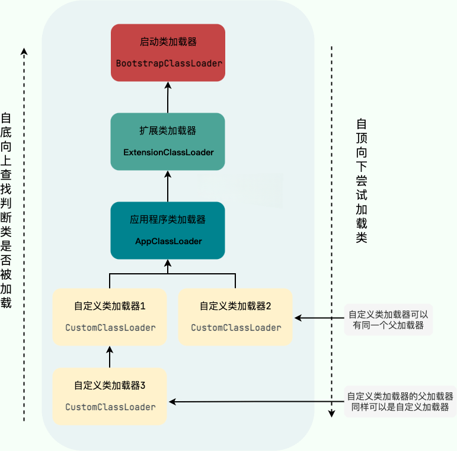

# JVM

我们写的代码称为源代码，它是人类可读的，而计算机只能识别机器指令，所以源代码必须经过编译，转换为机器指令后，计算机才能执行。

刚认识 Java 语言时，都听说过**一次编写，到处运行**这句话，指的是编写好的 Java 程序可以直接放在不同的操作系统上运行，像 C/C++ 语言则需要针对不同的操作系统进行编译，才能运行。

那么 Java 是如何实现跨平台的呢？大家肯定看到过类似如下的图片：


众所周知运行 Java 程序，只需要安装 JRE 就可以了，它里面有个叫做`JVM（Java Virtual Machine，Java 虚拟机）`的东西，就是负责运行程序的。Java **对每种操作系统都实现了对应的 JVM**，从而实现跨平台。

## 1.工作原理

1. 在开发时，我们会编写一个个以`.java`为后缀名的**源代码**文件。
2. 当开发好后，使用 JDK 提供的`javac`命令对源代码进行编译，生成以`.class`为后缀名的**字节码**文件，这些文件并**不是可执行文件**，它们是一种**中间态**。
3. 当运行程序时，使用 JRE 提供的`java`命令进行运行，这时 JVM 就登场了，它会读取`.class`字节码文件，并将其**转换为对应操作系统的机器指令**，然后交给操作系统去执行。
   
   可以将`JVM`理解为一个**翻译官**，运行在什么样的操作系统上，就需要什么样的翻译官（JVM）。

接下来我们从这几个方面来深入了解 JVM：

- [类加载](./#_2-类加载)
- [内存结构](./#_3-内存结构)
- [垃圾回收](./#_4-垃圾回收)
- [调优](./#_5-调优)
- [其他 JVM](./other-jvm.md)

## 2.类加载

### 2.1.定义

Java 程序是由一个个类组成的，其中有一个类是程序的入口类，里面包含一个`main`方法，JVM 会从这个`main`方法开始执行，这些类是以`.class`字节码文件的形式存储在磁盘上的，当运行时，总不能去读取磁盘上的文件来执行吧，那样太慢了，所以 JVM 会将这些字节码文件加载到内存中，然后再执行。这个**将字节码文件加载到内存中**的过程，就叫做**类加载**。

### 2.2.加载流程


1. **加载（Loading）**：把字节码文件读入内存，创建一个`java.lang.Class`类型的实例，作为该类在内存中的表现形式。
   
   类的加载是按需进行的，只有在第一次使用该类时，才会触发类加载过程。 

2. **连接（Linking）**：
   - **验证（Verification）**：确保被加载类的正确性，不会危害虚拟机的安全。
     
     开发时，如果有语法错误，编译器会报错，无法生成字节码文件；如果没有语法错误，编译器会生成字节码文件，但字节码文件可能会被恶意篡改，导致不符合 JVM 规范，所以在类加载时，JVM 会对字节码文件进行验证，确保其正确性。

   - **准备（Preparation）**：为类的静态变量分配内存，并设置默认初始值。

        ```java
        public class Test {
            static int a = 10;
        }
        ```

        `a`变量在准备阶段会被分配内存，并设置默认初始值`0`，而不是`10`，只有在初始化阶段，才会被赋值为`10`。

   - **解析（Resolution）**：将常量池中的符号引用替换为直接引用，提高访问速度。
     
        ```java
        public class Hello {
            public static void main(String[] args) {
                Message.printMessage();
            }
        }

        class Message {
            static void printMessage() {
                System.out.println("Hello JVM Resolution!");
            }
        }
        ```

        当`Hello`类被加载时，常量池中对`Message`类的引用是符号引用，JVM 会在解析阶段将其替换为直接引用，比如替换成`0x7ff... 的 printMessage() 方法地址`，这样在调用时就不需要再去查找`Message`类了，提高了访问速度。


3. **初始化（Initialization）**： 对类的静态变量赋予正确的初始值，并执行静态代码块。

    ```java
    public class Test {
        static int a = 10;

        static {
            System.out.println("Static block executed");
        }
    }
    ```

    在初始化阶段，`a`变量会被赋值为`10`，并且静态代码块会被执行，输出`Static block executed`。

### 2.3.类的声明周期


在类加载完成后，该类还会经历以下几个阶段：

4. **使用（Using）**：程序运行过程中，对类的各种操作，如创建对象、调用方法等。
   
5. **卸载（Unloading）**：该类的 Class 对象被回收时，类被卸载，释放内存。卸载类需要满足以下条件：
    
    - 该类的 Class 对象没有任何引用。
    - 该类的所有实例对象都已经被回收。
    - 该类的 ClassLoader 对象没有任何引用。

### 2.4.类加载器

类加载器（`ClassLoader`）是负责加载类的对象，每个 Java 类都有一个引用指向加载它的类加载器。

> 注意：数组不是通过`ClassLoader`加载的，而是由 JVM 自动生成的，数组也是有`Class`实例。

JVM 中有以下几种类加载器：

1. **引导类加载器（Bootstrap ClassLoader）**：负责加载 JRE 中的核心类库，如`java.lang.*`、`java.util.*`等，使用 C++ 实现，无法被 Java 程序直接引用。
2. **扩展类加载器（Extension ClassLoader）**：负责加载 JRE 中`lib/ext`目录下的类库，使用 Java 实现，可以被 Java 程序直接引用。
3. **应用类加载器（Application ClassLoader）**：负责加载用户类路径（classpath）下的类库，使用 Java 实现，可以被 Java 程序直接引用。如果应用程序中没有自定义过类加载器，这个就是程序中默认的类加载器。

除了这三种类加载器外，用户还可以自定义类加载器，继承`java.lang.ClassLoader`类，实现自己的类加载逻辑。

实际上`Extension ClassLoader`和`Application ClassLoader`就是通过继承`ClassLoader`类实现的，但是`Bootstrap ClassLoader`不是，它使用 C++ 实现的。

> **注意**：类加载器除了加载类之外，还可以加载所需的资源如文本、图片、视频等文件。

### 2.5.类加载规则

1. **按需加载**：JVM 启动的时候，不会一次性加载所有类，而是采用**按需加载**的方式，只有在第一次使用某个类时，才会触发该类的加载过程。
2. **缓存机制**：加载某个类时判断该类是否已经被加载过，如果已经加载过，则不会重复加载。
3. **全盘负责**：当一个类负责加载某个类时，它有责任确保该类的所有依赖类都已经被加载，如果依赖类没有被加载，则需要先加载依赖类，才能继续加载该类。
4. **双亲委派**：如果一个类加载器收到类加载请求时，它不会自己去加载该类，而是将该请求委派给它的父类加载器去完成，父类加载器再将请求继续委派给它的父类加载器，直到委派到`Bootstrap ClassLoader`，如果`Bootstrap ClassLoader`无法完成该类的加载请求，才会由子类加载器来完成。
   
   这样做的好处是可以避免重复加载类，确保核心类库的安全性。
   
   > 注意：双亲委派模型并不是强制的，用户可以通过自定义类加载器来打破双亲委派模型。



## 3.内存结构

JVM 在运行时，会将内存划分为多个不同的区域，每个区域负责不同的功能，主要包括以下几个部分：

::: code-group

```md:img [Java 1.8]

```

```md:img [Java 1.7]

```

:::

> 在 Java 1.7 中，方法区在**JVM 规范**中属于**堆外**区域，但是在**HotSpot JVM**中，它将方法区实现为堆的一部分。

### 3.1.堆（Heap）

讲解堆之前，要浅说一下**垃圾回收**（Garbage Collection，简称 GC）：当创建一个对象时，JVM 肯定要为其分配内存，那当对象不再被使用时，这块内存就变得无用，为了避免越积越多导致内存耗尽，JVM 就定期地清理这些无用的对象，释放内存，不需要程序员手动去管理内存。

#### 定义

JVM 管理的最大一块内存区域，此区域唯一的目的就是**存放对象实例**，几乎所有的对象实例都在这里分配内存。

> 随着`JIT`编译器的出现，一些对象可能会被直接分配在栈上，以提高性能，这种技术称为**逃逸分析**，这里不做过多介绍。

从 Java 1.8 后堆分为如下几个区域：

- **新生代**（Young Generation）：用于存放**新创建的对象**，它又被划分为如下区域：
  - **Eden 区**：新创建的对象首先会被分配到 Eden 区。
  - **Survivor 区**：又分为 2 个，分别称为 **S0 或者 from** 和 **S1 或者 to**，用于存放从 Eden 区和另一个 Survivor 区中存活下来的对象。
- **老年代**（Old Generation）：用于存放**经过多次垃圾回收后仍然存活的对象**，又或者是一些大对象直接分配到老年代中。
- **字符串常量池**：用于存放字符串常量。
- **永久代**（Permanent Generation）：由于 Java 1.8 及以后的版本中，永久代被移除，这里就不再介绍，后面会讲到元空间再提及。
  
  > 方法区是**JVM 规范**中的一个概念，永久代是 HotSpot JVM 对方法区的具体实现，前文我们说到 HotSpot JVM 将方法区实现为堆的一部分，所以它也在堆内存中。
  
JVM 将堆内存划分为新生代和老年代，主要是为了优化垃圾回收的效率，因为很多对象创建后很快就不再被引用，那么将它们放在某个特定的区域，是不是可以更快地识别和回收，就用不着到处找了。

#### 分配比例

在堆中，新生代和老年代区域的大小不是相同的，默认的比例见下图（也可以通过 JVM 参数进行调整）：


#### 对象的分配与回收流程

1. 当我们通过 **new** 关键字创建一个对象时，JVM 会先在 **Eden 区**为其分配内存。
2. 随着程序的运行，**Eden 区会逐渐被填满**，填满后就会触发一次 **Minor GC（又称 Young GC）**，**回收 Eden 区**中不再被引用的对象，另外存活下来的对象会被移动到 **S0 区**。
3. 那么 **S0 区肯定也会被填满**，又会触发一次 Minor GC，这次会**回收 Eden 区和 S0 区**中不再被引用的对象，存活下来的对象会被移动到 **S1 区**。
4. 以此类推，当 **S1 区被填满**后，也会触发一次 Minor GC，**回收 Eden 区和 S1 区**中不再被引用的对象，存活下来的对象又被移动到 **S0 区**。
5. 经过多次 GC 后，仍然存活下来的对象，就会被移动到**老年代**中。
   
   > 在 JVM 中，每个对象都有一个**年龄**的概念，每经过一次 Minor GC，存活下来的对象年龄就会**加 1**，当对象的年龄达到一定值（默认是 **15**），就会被直接移动到老年代中。
   > 
   > 思考：为什么是 15 呢？`15 = 16 - 1 = 2^4 - 1`，因为年龄这个属性是用**4 位二进制**来表示的，最大值就是 15。

6. 当老年代被填满后，就会触发一次**Full GC**，它会回收整个堆中的不再被引用的对象。

#### 字符串常量池

字符串常量池是 JVM 为了提升性能和减少内存消耗针对字符串对象专门设计的一个内存区域，主要是为了避免创建重复的字符串对象。

```java
// 在字符串常量池中创建字符串对象 "ab"，将字符串对象 "ab" 的引用赋值给给 aa
String aa = "ab";

// 直接返回字符串常量池中字符串对象 "ab"，赋值给引用 bb
String bb = "ab";
System.out.println(aa == bb); // true

// new 出来的对象在新生代或者老年代中，不在字符串常量池中
String cc = new String("ab"); 
System.out.println(aa == cc); // false

// 将字符串对象 cc 放入字符串常量池中，如果字符串常量池中已经存在相同内容的字符串对象，则返回该对象的引用
String dd = cc.intern();
System.out.println(aa == dd); // true
```

HotSpot JVM 中对**字符串常量池的实现**是使用了**固定大小的哈希表**来存储字符串对象的引用，保存的是字符串（键）和字符串对象的引用（值），字符串对象的引用指向堆内存中的字符串对象。

> 源码在`src/hotspot/share/classfile/stringTable.cpp`文件中，可以通过 JVM 参数`-XX:StringTableSize=xxx`来设置哈希表的大小，默认值是`997`。

在 Java 1.7 之前字符串常量池是存放在**永久代**中的，而从 Java 1.7 开始，字符串常量池被移到了**堆内存**中。

### 3.2.方法区（Method Area）

方法区是 **JVM 规范**中的一个概念，HotSpot JVM 在 Java 1.7及以前的版本中，将方法区实现为**永久代**，并将作为堆的一部分进行管理；而在 Java 1.8 及以后的版本中，永久代被移除，取而代之的是**元空间（Metaspace）**，它不再是堆的一部分，而是使用本地内存进行管理。


方法区用于存储已被虚拟机加载的如下数据：

- **类元数据**：包括类的名称、访问修饰符、父类、接口、字段、方法、静态变量等信息。
- **运行时常量池**：每个类都有一个运行时常量池，存放编译期生成的各种字面量和符号引用。
  
  > 字面量：源代码中直接写出的固定值，如`"Hello, World!"`、`100`等。不要和字符串常量池混淆了，可以简单理解为字面量中的字符串是对字符串常量池中的字符串地址引用。
  > 
  > 符号引用：类、方法、字段等在编译期并不直接指向内存地址，而是通过符号来表示，如类名、方法名等。

- **静态变量**：类的静态字段在方法区中分配内存。
- **JIT 编译后的代码**：即时编译器将热点代码编译为机器码后，存放在方法区中。

### 3.3.程序计数器（Program Counter）

程序计数器是一块较小的内存区域，它可以看作是当前线程所执行的字节码的行号指示器。JVM 在运行时通过改变这个计数器的值来选取下一条需要执行的字节码指令。

每个线程都有一个独立的程序计数器，互不影响，因此程序计数器是线程私有的，并且生命周期与线程相同。

那么可以分析出它的作用主要有两个：

- 实现代码的流程控制，如顺序执行、分支、跳转、循环等。
- 在多线程并发执行时，某个线程暂停后，保存该线程的执行位置，以便恢复执行。

### 3.4.虚拟机栈（JVM Stack）

虚拟机栈（后文简称栈）也是线程私有的，生命周期同样与线程相同。除了`Native`方法外，所有的方法调用都在栈中进行。

方法调用的数据需要通过栈来进行传递，每一次方法调用都会创建一个栈帧（Stack Frame）并压入栈中，方法调用完成后，栈帧会被弹出。


每个栈帧存储的信息主要包括：

- **局部变量表**：存放方法的参数和局部变量。
- **操作数栈**：用于存放方法执行过程中产生的中间结果。
- **动态链接**：当前方法调用另一个方法时，需要进行链接，动态链接信息就存放在这里。
- **方法出口**：用于存储方法执行完成后的返回地址。

### 3.5.本地方法栈（Native Method Stack）

和虚拟机栈类似，本地方法栈也是线程私有的，生命周期与线程相同。它主要用于支持`Native`方法的调用。

在 HotSpot JVM 中，本地方法栈实际上和虚拟机栈是合二为一的，统一称为**Java 栈**。

### 3.6.直接内存（Direct Memory）

直接内存并不是 JVM 规范中定义的内存区域，而是通过`Native`方法直接向操作系统申请的一块内存区域，比如`java.nio.ByteBuffer`类就可以使用直接内存来提高 I/O 操作的效率。

## 4.垃圾回收

见[垃圾回收机制](../gc/)

## 5.调优

JVM 通过提供大量的参数，允许用户根据实际需求对 JVM 进行调优，调优的核心目标包括：

1. **提高吞吐量（Throughput）**：单位时间内执行更多任务。

2. **降低延迟（Latency）**：减少 GC 暂停时间，提升响应速度。

3. **保证稳定性（Stability）**：高负载下依然可控、可预测。

### 5.1.常用调优方式分类

1. **内存区域大小调优**

| 参数 | 作用 |
|------|------|
| `-Xms` | 初始堆大小，默认值为 1/4 物理内存 |
| `-Xmx` | 最大堆大小，默认值为 1/4 物理内存 |
| `-Xmn` | 年轻代大小（控制 Minor GC 频率） |
| `-XX:MetaspaceSize` | 元空间初始大小 |
| `-XX:MaxMetaspaceSize` | 元空间最大值 |
| `-XX:SurvivorRatio` | Eden:S0:S1 比例，默认值为 8，即 8:1:1 |
| `-XX:NewRatio` | 老年代:年轻代 比例，默认值为 2，即 2:1 |

**调优建议：**

- Minor GC 过于频繁 → 增大 `-Xmn`
- Full GC 频繁 → 增大老年代（`-Xmx`）
- 类加载溢出 → 增大 `-XX:MaxMetaspaceSize`

---

2. **垃圾收集器（GC）选择与参数优化**

| GC 类型 | 参数启用 | 适用场景 |
|----------|-----------|-----------|
| **Serial GC** | `-XX:+UseSerialGC` | 单核、小内存 |
| **Parallel GC** | `-XX:+UseParallelGC` | 吞吐量优先 |
| **CMS GC** | `-XX:+UseConcMarkSweepGC` | 响应速度优先（JDK 8 及以前） |
| **G1 GC** | `-XX:+UseG1GC` | 通用平衡型（JDK 9+ 默认） |
| **ZGC / Shenandoah** | `-XX:+UseZGC` / `-XX:+UseShenandoahGC` | 超低延迟（JDK 11+） |

**CMS GC 常用参数：**

```bash
-XX:+UseConcMarkSweepGC
-XX:CMSInitiatingOccupancyFraction=70  # 老年代使用率达到 70% 时触发 CMS
-XX:+UseCMSInitiatingOccupancyOnly      # 只根据使用率触发 CMS
-XX:+CMSParallelRemarkEnabled           # 并行标记阶段
-XX:+CMSScavengeBeforeRemark            # 在重新标记前进行一次 Minor GC
-XX:+CMSClassUnloadingEnabled           # 允许卸载类
```

---

3. **GC 日志分析**

| 参数 | 说明 |
| :-- | :-- |
| `-Xlog:gc*` | (Java 9+) 打印 GC 日志 |
| `-verbose:gc` | (Java 8) 简要 GC 日志 |
| `-XX:+PrintGCDetails` | 详细 GC 信息 |
| `-XX:+PrintGCDateStamps` | 输出时间戳 |
| `-Xloggc:/path/gc.log` | 日志输出文件 |

---

**分析工具：**

- GCViewer
- GCeasy.io
- JDK Mission Control (JMC)
- VisualVM

4. **栈与线程调优**
   
| 参数 | 作用 |
|------|------|
| `-Xss` | 每个线程的栈大小（默认 1M） |
| `-XX:+UseCompressedOops` | 压缩对象指针，节省内存 |

**调整建议：**

- 栈溢出（`StackOverflowError`） → 增大 `-Xss`
- 线程过多内存不足 → 减小 `-Xss`

---

5. **JIT 编译优化**

| 参数 | 说明 |
|------|------|
| `-XX:+TieredCompilation` | 混合 C1/C2 编译 |
| `-XX:CompileThreshold=10000` | 热点编译阈值 |
| `-XX:+PrintCompilation` | 打印编译日志 |
| `-XX:+AggressiveOpts` | 激进优化（谨慎） |

---

6. **OOM 与诊断调优**

| 参数 | 说明 |
|------|------|
| `-XX:+HeapDumpOnOutOfMemoryError` | OOM 时自动 dump |
| `-XX:HeapDumpPath=/path/heap.hprof` | 指定 dump 路径 |
| `-XX:+CrashOnOutOfMemoryError` | OOM 时直接退出 |
| `-XX:+PrintClassHistogramBeforeFullGC` | Full GC 前打印类统计 |

**分析工具：**

- Eclipse MAT
- VisualVM
- JMC

---

### 5.2.调优流程建议

1. **监控现状**：使用 `jstat`、`jmap`、`jvisualvm` 查看内存、GC 状态  
2. **定位瓶颈**：判断是 GC 频繁、堆溢出还是类加载过多  
3. **调整参数**：优先调堆，再选 GC，再细调参数  
4. **验证结果**：对比吞吐量、响应时间、GC 时间  

### 5.3.常见调优场景

| 场景 | 问题 | 调优建议 |
|------|------|----------|
| GC 频繁 | 年轻代太小 | 增大 `-Xmn` |
| Full GC 时间长 | 老年代太大 | 使用 G1 / 减少老年代 |
| Metaspace OOM | 类加载太多 | 增大 `-XX:MaxMetaspaceSize` |
| 内存泄漏 | 堆增长不回收 | `jmap` + MAT 分析 |
| 延迟高 | GC 停顿长 | 使用 G1 / ZGC |
| 启动慢 | JIT 延迟 | 启用 `-XX:+TieredCompilation` |

### 5.4.推荐监控工具

| 工具 | 用途 |
|------|------|
| `jstat` | 监控 GC 与内存 |
| `jmap` | 导出堆快照 |
| `jstack` | 线程分析 |
| `jcmd` | 综合管理命令 |
| VisualVM | 图形化分析 |
| JConsole | 实时监控 |
| Java Mission Control (JMC) | 专业性能分析 |
| GCeasy.io | GC 日志可视化分析 |

## 6.JVM 版本

JVM（Java Virtual Machine，Java 虚拟机）实际上是 Java 定义的一种**规范**，不同的厂商可以根据这个规范来实现自己的 JVM，就跟不同厂商可以基于 OpenJDK 来构建自己的 JDK 发行版一样，因此市场上存在多种不同的 JVM 实现，并且针对不同的操作系统进行了编译与适配，那么我们常用的 JVM 有哪些呢？

| JVM 实现 | 提供方 | 特点 |
|-----------|----------|------|
| **HotSpot** | Oracle / OpenJDK | 最广泛使用，默认随 JDK 分发 |
| **OpenJ9** | IBM / Eclipse | 启动快、内存占用低 |
| **GraalVM** | Oracle Labs | 支持多语言、原生镜像编译（Native Image） |
| **Azul Zing / Prime** | Azul Systems | 超低延迟 GC、高吞吐 |
| **Dragonwell** | 阿里巴巴 | 针对云场景优化的 OpenJDK 分支 |
| **Corretto** | Amazon | AWS 优化的免费长期支持版 |
| **Liberica / Zulu** | BellSoft / Azul | 提供多平台二进制发行版 |

