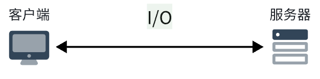
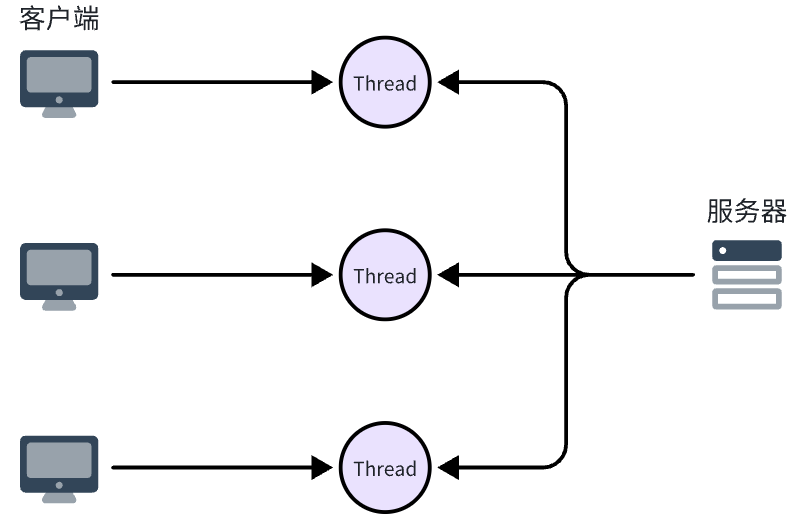
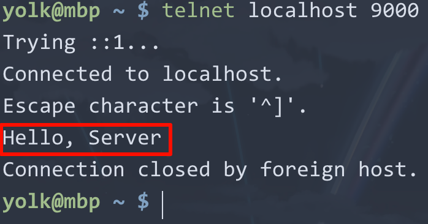
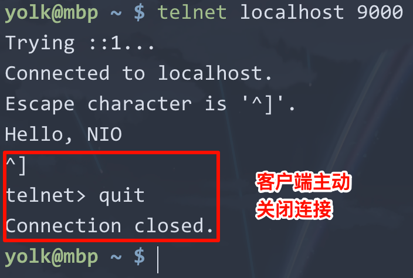
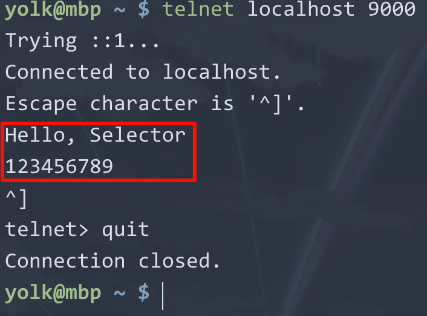
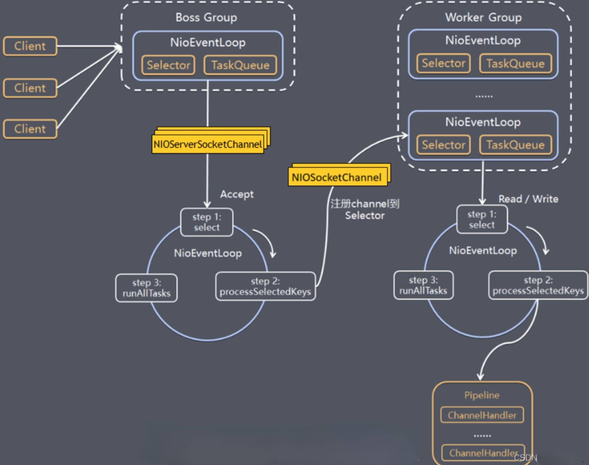

# Netty

思考：什么是**I/O 通信**？

**I/O 通信**是指计算机之间通过网络进行数据交换的过程。在这个过程中，数据的输入和输出被抽象为`I/O`操作。



## 1.Java 中的 I/O 模型

注意：这里的 I/O 模型指的是**网络 I/O**模型，并不是文件 I/O 模型。

### 1.1. 阻塞式 I/O（BIO）

`BIO`：Blocking I/O，即阻塞式输入输出，是指服务端阻塞等待客户端连接，每个连接分配一个线程处理，该线程又会阻塞等待数据读写。



#### 示例代码
  
```java
import java.io.IOException;
import java.net.ServerSocket;
import java.net.Socket;

/**
 * 演示 BIO
 *
 * @author yolk
 * @since 2025/10/21 01:50
 */
public class BIOServer {

    public static void main(String[] args) throws IOException {
        /*
        使用 TCP 协议，创建服务器端 Socket，监听 9000 端口
        如果要使用 UDP 协议，使用 DatagramSocket 类
        */
        ServerSocket serverSocket = new ServerSocket(9000);

        // 使用死循环监听客户端连接
        while (true) {
            /*
            阻塞等待客户端连接
            */
            Socket clientSocket = serverSocket.accept();
            System.out.println("一个客户端连接了服务器");

            // 开启一个线程，处理该客户端连接
            new Thread(() -> {
                try {
                    handler(clientSocket);
                } catch (IOException e) {
                    e.printStackTrace();
                }
            }).start();
        }
    }

    private static void handler(Socket clientSocket) throws IOException {
        byte[] bytes = new byte[1024];
        // 获取输入流，读取客户端发送的数据
        int read = clientSocket.getInputStream().read(bytes);
        if (read != -1) {
            System.out.println("收到客户端数据: " + new String(bytes, 0, read));
        }
        // 不知道客户端什么时候会关闭连接，这里服务端主动关闭连接
        clientSocket.close();
    }

}
```

#### 测试

使用`telnet`命令模拟客户端连接，并发送`Hello, Server`：



> 终端中：Connection closed by foreign host. 表示服务器关闭了连接。

终端输出：

```plaintext
一个客户端连接了服务器
收到客户端数据: Hello, Server
```

#### 分析

这种阻塞式 I/O 模型简单易用，但在高并发场景下性能较差（难以解决`C10K`、`C10M`问题）因为每个连接都需要一个线程，线程切换和资源消耗较大。

> `C10K`问题：指的是如何处理 1 万（10K）个并发连接的问题。
> 
> `C10M`问题：指的是如何处理 1 百万（10M）个并发连接的问题。

可能会想到**使用线程池来复用线程**，但是线程池的线程数量也是有限的，仍然无法解决高并发连接的问题。

### 1.2. 传统的非阻塞式 I/O（NIO）

在 JDK 1.4 引入了 NIO（Non-blocking I/O）库，提供了非阻塞式 I/O 模型。它实现了一个线程通过**轮询机制**管理多个连接，当某个连接有数据时才会处理，没有数据的连接会被跳过，线程不会阻塞等待。

#### 示例代码

```java
import java.io.IOException;
import java.net.InetSocketAddress;
import java.nio.ByteBuffer;
import java.nio.channels.ServerSocketChannel;
import java.nio.channels.SocketChannel;
import java.util.Iterator;
import java.util.LinkedList;
import java.util.List;

/**
 * 演示 NIO
 *
 * @author yolk
 * @since 2025/10/21 02:38
 */
public class NIOServer {

    private static final List<SocketChannel> CHANNEL_LIST = new LinkedList<>();

    public static void main(String[] args) throws IOException {
        // 创建服务器端 SocketChannel（和 BIO 的 ServerSocket 类似）
        ServerSocketChannel serverSocket = ServerSocketChannel.open();
        // 监听 9000 端口
        serverSocket.socket().bind(new InetSocketAddress(9000));

        // 设置为非阻塞模式，默认是阻塞模式
        serverSocket.configureBlocking(false);
        System.out.println("服务器启动，监听端口 9000");

        while (true) {
            /*
            非阻塞等待客户端连接，即每调用一次 accept() 方法，立即返回
            如果没有客户端连接，返回 null
             */
            SocketChannel socketChannel = serverSocket.accept();
            if (socketChannel != null) {
                // 如果有客户端连接
                System.out.println("一个客户端连接了服务器");
                // 设置该客户端连接为非阻塞模式，那么读取数据时也不会阻塞，默认是阻塞模式
                socketChannel.configureBlocking(false);
                // 将该客户端连接加入列表
                CHANNEL_LIST.add(socketChannel);
            }

            // 遍历所有已连接的客户端，读取数据，使用迭代器避免并发修改异常
            Iterator<SocketChannel> iterator = CHANNEL_LIST.iterator();
            while (iterator.hasNext()) {
                // 取出一个客户端连接
                SocketChannel channel = iterator.next();

                // 非阻塞读取客户端数据，每次只读取 1 KB 数据
                byte[] bytes = new byte[1024];
                // 这里不会阻塞，另外如果没有数据可读，read 方法立即返回 0
                int read = channel.read(ByteBuffer.wrap(bytes));
                
                if (read > 0) {
                    System.out.println("收到客户端数据: " + new String(bytes, 0, read));
                } else if (read == -1) {
                    // 客户端关闭连接，移除该连接
                    iterator.remove();
                    System.out.println("客户端关闭了连接");
                    channel.close();
                }
            }
        }
    }

}
```


#### 测试



终端输出：

```plaintext
服务器启动，监听端口 9000
一个客户端连接了服务器

收到客户端数据: Hello, Server
客户端关闭了连接
```

#### 分析

上述代码中并没有使用新的线程去处理每个客户端连接，而是通过一个线程轮询所有连接，并且读取数据。

但是存在**CPU 空转**的问题，即没有连接或连接没有数据时，线程仍然在不停地轮询，浪费 CPU 资源。

可能会想到这样一个方法：分离`accept()`和`read()`两个操作到不同的线程来缓解这个问题，并且通过让线程休眠一段时间来减少 CPU 空转。

实际上 NIO 有一个**多路复用器（Selector）**机制，可以让一个线程同时监听多个连接的`accept`和`read`事件，从而避免 CPU 空转的问题。

#### 多路复用器（Selector）机制

```java
import java.io.IOException;
import java.net.InetSocketAddress;
import java.nio.ByteBuffer;
import java.nio.channels.SelectionKey;
import java.nio.channels.Selector;
import java.nio.channels.ServerSocketChannel;
import java.nio.channels.SocketChannel;
import java.util.Iterator;
import java.util.Set;

/**
 * 演示 NIO 多路复用器机制-Selector
 *
 * @author yolk
 * @since 2025/10/21 03:23
 */
public class NIOSelectorServer {

    public static void main(String[] args) throws IOException {
        ServerSocketChannel serverSocket = ServerSocketChannel.open();
        serverSocket.socket().bind(new InetSocketAddress(9000));
        serverSocket.configureBlocking(false);

        // 创建多路复用器 Selector，即创建 epoll
        Selector selector = Selector.open();

        /*
        将服务器端 SocketChannel 注册到多路复用器上
        并且监听"有客户端需要进行连接"的事件（OP_ACCEPT）
         */
        serverSocket.register(selector, SelectionKey.OP_ACCEPT);
        System.out.println("服务器启动，监听端口 9000");

        while (true) {
            // 如果有需要处理的事件发生（比如前面的 OP_ACCEPT）则返回，否则阻塞等待
            selector.select();

            // 获取所有发生的事件
            Set<SelectionKey> selectionKeys = selector.selectedKeys();

            // 使用迭代器遍历所有事件进行处理
            Iterator<SelectionKey> iterator = selectionKeys.iterator();
            while (iterator.hasNext()) {
                SelectionKey key = iterator.next();

                if (key.isAcceptable()) {
                    // 如果是 OP_ACCEPT 事件，即有新的客户端需要进行连接

                    // 在前面注册该事件时，关联的 channel 就是服务器端的 ServerSocketChannel
                    ServerSocketChannel server = (ServerSocketChannel) key.channel();

                    // 接受该客户端连接
                    SocketChannel socketChannel = server.accept();
                    // 设置为非阻塞模式
                    socketChannel.configureBlocking(false);

                    // 将该客户端连接注册到多路复用器上，监听读事件（OP_READ），即读取数据
                    socketChannel.register(selector, SelectionKey.OP_READ);

                    System.out.println("一个客户端连接了服务器");
                } else if (key.isReadable()) {
                    // 如果是 OP_READ 事件，即有客户端发送数据需要读取
                    SocketChannel client = (SocketChannel) key.channel();
                    byte[] bytes = new byte[1024];
                    int read = client.read(ByteBuffer.wrap(bytes));
                    if (read > 0) {
                        System.out.println("收到客户端数据: " + new String(bytes, 0, read));
                    } else if (read == -1) {
                        // 客户端关闭连接，
                        // 先取消该 key，释放资源
                        key.cancel();
                        // 再关闭该客户端连接
                        client.close();
                        System.out.println("一个客户端关闭了连接");
                    }
                }
                // 处理完该事件后，从事件集中移除该事件，避免重复处理
                iterator.remove();
            }
        }
    }

}
```

上述代码没有使用多个线程，而是通过`Selector`多路复用器机制，让一个线程同时监听多个连接的`accept`和`read`事件，如果没有事件发生则阻塞等待，会释放 CPU 资源，避免空转。

测试：



控制台输出：

```plaintext
服务器启动，监听端口 9000
一个客户端连接了服务器

收到客户端数据: Hello, Server
一个客户端关闭了连接
```

可以模拟两个客户端连接并发送数据，观察`selector.selectedKeys()`返回的事件个数，可以看到只会对发生的事件进行处理，在前面的 NIO 示例中没有使用多路复用器时，所以它会对所有连接进行轮询。

但是这样的代码写起来比较繁琐，而且实际上也不能支撑非常高的并发（虽然比 BIO 好很多），这时候就需要使用`Netty`框架了。Netty 提供了更高层次的抽象，简化了网络编程的复杂性，并且具有非常好的性能。

## 2.Netty 简介

Netty 是一个基于 Java NIO 的高性能网络通信框架（单机就能支持百万级别的并发连接），它封装了底层的网络 I/O 操作，提供了丰富的功能和灵活的编程模型，使得开发网络应用变得更加简单和高效。

在 Java 的生态系统中，Netty 被广泛应用于各种网络应用场景，如：

- 高性能的 HTTP 服务器和客户端
- 实时通信系统（如聊天应用、在线游戏）
- 分布式系统中的 RPC 框架
- 大数据传输和处理系统

像著名的分布式 RPC 框架`gRPC`和`Dubbo`都使用了 Netty 作为其底层的网络通信组件，另外 Spring Framework 也提供了对 Netty 的集成支持，用于构建响应式 Web 应用。

它的核心特性包括：

- **高性能**：基于 NIO 实现，支持异步非阻塞 I/O 操作，能够处理大量并发连接。
- **事件驱动架构**：采用事件驱动模型，使用事件循环（Event Loop）来处理 I/O 事件，提高了资源利用率。
- **丰富的协议支持**：内置对多种协议的支持（如 HTTP、WebSocket、FTP 等），并且可以轻松扩展以支持自定义协议。
- **灵活的编程模型**：提供了丰富的 API 和工具，支持多种编程范式（如回调、Future、Reactive 等）。

它有以下几个重要的组件：

- **Channel**：表示一个网络连接，可以是 TCP 连接、UDP 连接等。Channel 是数据传输的基本单位。
- **Event Loop**：负责处理 I/O 事件的线程，通常一个 Event Loop 会管理多个 Channel。
- **Pipeline**：Channel 的数据处理链，由多个 Handler 组成，用于处理入站和出站的数据。
- **Handler**：用于处理具体的业务逻辑，可以是数据的编解码、业务处理等。
- **Bootstrap**：用于配置和启动客户端或服务器端的引导类。
- **Future 和 Promise**：用于处理异步操作的结果，支持回调和链式调用。

### 2.1.使用示例

#### 引入依赖

```xml
<dependency>
    <groupId>io.netty</groupId>
    <artifactId>netty-all</artifactId>
    <version>4.1.94.Final</version>
</dependency>
```

#### 示例代码

::: code-group

```java [服务端]
import io.netty.bootstrap.ServerBootstrap;
import io.netty.channel.Channel;
import io.netty.channel.ChannelFuture;
import io.netty.channel.ChannelInitializer;
import io.netty.channel.ChannelOption;
import io.netty.channel.EventLoopGroup;
import io.netty.channel.nio.NioEventLoopGroup;
import io.netty.channel.socket.nio.NioServerSocketChannel;

/**
 * Netty 服务器示例
 * <p>演示如何使用 Netty 框架创建一个基本的 TCP 服务器</p>
 *
 * @author yolk
 * @since 2025/10/22 01:50
 */
public class NettyServer {

    public static void main(String[] args) {
        /*
         * 创建两个 EventLoopGroup 线程组：
         * - bossGroup：负责接收客户端的连接请求（Accept 操作），通常设置为 1 个线程即可
         * - workerGroup：负责处理已建立连接的 I/O 读写操作，线程数视具体业务需求而定
         *
         * NioEventLoopGroup 默认线程数为 CPU 核心数的 2 倍。
         */
        EventLoopGroup bossGroup = new NioEventLoopGroup(1);
        EventLoopGroup workerGroup = new NioEventLoopGroup(10);

        try {
            // 创建服务器端的启动引导类
            ServerBootstrap bootstrap = new ServerBootstrap();

            bootstrap.group(bossGroup, workerGroup) // 绑定两个线程组
                    // 指定服务器通道类型（基于 NIO 的 ServerSocketChannel 实现）
                    .channel(NioServerSocketChannel.class)
                    /*
                     * SO_BACKLOG：是 TCP 协议中用于完成三次握手后服务端存放已完成连接的队列长度参数，
                     * 默认值根据操作系统不同而不同，Linux 下通常是 128。
                     *
                     * 如果队列满了，新的连接请求可能会被丢弃或延迟处理（取决于系统配置）。
                     */
                    .option(ChannelOption.SO_BACKLOG, 1024)
                    /*
                     * 配置每个新建立的连接的业务处理逻辑
                     * ChannelInitializer 会在 Channel（客户端）注册到 EventLoop 后被调用一次，用于初始化 pipeline
                     */
                    .childHandler(new ChannelInitializer<>() {
                        @Override
                        protected void initChannel(Channel channel) throws Exception {
                            // 向 Channel 的 pipeline 添加自定义的业务处理器，如果有多个处理器，可以多次调用 addLast()
                            channel.pipeline().addLast(new NettyServerHandler());
                        }
                    });

            System.out.println("服务器启动，监听端口 9000");

            /*
             * 绑定端口并启动服务器
             * bind() 方法是异步的，返回 ChannelFuture 对象
             * sync() 方法会阻塞当前线程，直到端口绑定完成
             *
             * 如果不调用 sync()，可以通过 ChannelFuture 的监听器或 isDone() 方法判断是否完成
             */
            ChannelFuture cf = bootstrap.bind(9000).sync();

            /*
             * 等待服务器 Channel 关闭
             * closeFuture() 返回的 ChannelFuture 会在 Channel 关闭时得到通知
             * sync() 阻塞主线程，使服务器保持运行状态
             *
             * 这行代码实际上让主线程一直等待，除非有其他线程调用 channel.close() 关闭服务器
             */
            cf.channel().closeFuture().sync();
        } catch (Exception e) {
            e.printStackTrace();
        } finally {
            /*
             * 优雅关闭线程组，释放所有资源
             * shutdownGracefully() 会在执行完所有已提交的任务后再关闭线程池，
             * 从而避免强制中断正在执行的任务，确保资源安全释放。
             */
            bossGroup.shutdownGracefully();
            workerGroup.shutdownGracefully();
        }
    }

}
```

```java [服务端处理器]
import io.netty.buffer.ByteBuf;
import io.netty.buffer.Unpooled;
import io.netty.channel.ChannelHandlerContext;
import io.netty.channel.ChannelInboundHandlerAdapter;
import io.netty.util.CharsetUtil;

/**
 * Netty 服务器端入站事件处理器。
 * 该类负责处理客户端的连接建立、断开、消息读取、异常处理等入站事件。
 *
 * ChannelInboundHandlerAdapter 是 ChannelInboundHandler 的一个适配器类，提供了默认的空实现，方便我们只重写需要的方法。
 * ChannelInboundHandler 是 Netty 的核心接口之一，定义了「入站事件」的回调方法。
 *
 * @author yolk
 * @since 2025/10/22
 */
public class NettyServerHandler extends ChannelInboundHandlerAdapter {

    /**
     * 当客户端连接建立时触发。
     * 表示通道已处于活跃状态，可进行 I/O 操作。
     */
    @Override
    public void channelActive(ChannelHandlerContext ctx) throws Exception {
        System.out.println("客户端连接：" + ctx.channel().remoteAddress());
        ByteBuf welcome = Unpooled.copiedBuffer("Welcome to Netty Server!\n", CharsetUtil.UTF_8);
        ctx.writeAndFlush(welcome);
    }

    /**
     * 当通道处于非活跃状态时触发。
     * 表示客户端断开连接。
     */
    @Override
    public void channelInactive(ChannelHandlerContext ctx) throws Exception {
        System.out.println("客户端断开连接：" + ctx.channel().remoteAddress());
    }

    /**
     * 读取客户端发送的数据。
     */
    @Override
    public void channelRead(ChannelHandlerContext ctx, Object msg) throws Exception {
        ByteBuf buf = (ByteBuf) msg;
        String content = buf.toString(CharsetUtil.UTF_8);
        System.out.println("收到客户端消息：" + content);

        // 回复客户端
        ByteBuf response = Unpooled.copiedBuffer("Hello Client, I received your message.", CharsetUtil.UTF_8);
        ctx.write(response);
    }

    /**
     * 每次读取完成后调用。
     * 通常用于刷新缓冲区，将消息真正写入网络。
     */
    @Override
    public void channelReadComplete(ChannelHandlerContext ctx) throws Exception {
        ctx.flush();
        System.out.println("已完成本次数据读取与响应发送。");
    }

    /**
     * 发生异常时调用。
     * 一般记录日志并关闭连接，避免资源泄漏。
     */
    @Override
    public void exceptionCaught(ChannelHandlerContext ctx, Throwable cause) throws Exception {
        System.err.println("通道异常：" + cause.getMessage());
        cause.printStackTrace();
        ctx.close();
    }
}
```

```java [客户端]
import io.netty.bootstrap.Bootstrap;
import io.netty.channel.ChannelFuture;
import io.netty.channel.ChannelInitializer;
import io.netty.channel.EventLoopGroup;
import io.netty.channel.nio.NioEventLoopGroup;
import io.netty.channel.socket.SocketChannel;
import io.netty.channel.socket.nio.NioSocketChannel;

/**
 * Netty 客户端示例
 * <p>演示如何使用 Netty 框架创建一个基本的 TCP 客户端</p>
 *
 * @author yolk
 * @since 2025/10/22 03:52
 */
public class NettyClient {

    public static void main(String[] args) {
        /*
         * 创建客户端事件循环组：
         * - 客户端只需要一个 EventLoopGroup，用于处理连接建立和 I/O 读写操作
         * - 对于简单的客户端应用，通常使用默认线程数即可
         */
        EventLoopGroup group = new NioEventLoopGroup();

        try {
            /*
             * 创建客户端启动引导类
             * 注意：客户端使用 Bootstrap，而服务端使用 ServerBootstrap
             */
            Bootstrap bootstrap = new Bootstrap();

            // 配置客户端启动参数
            bootstrap.group(group) // 设置线程组
                    /*
                     * 指定客户端通道类型（基于 NIO 的 SocketChannel 实现）
                     * 与服务端的 NioServerSocketChannel 对应
                     */
                    .channel(NioSocketChannel.class)
                    // 配置连接建立后的业务处理逻辑
                    .handler(new ChannelInitializer<SocketChannel>() {
                        @Override
                        protected void initChannel(SocketChannel ch) throws Exception {
                            // 向 Channel 的 pipeline 添加自定义的业务处理器
                            ch.pipeline().addLast(new NettyClientHandler());
                        }
                    });

            System.out.println("客户端准备就绪，准备连接服务器...");

            // 连接到服务器
            ChannelFuture cf = bootstrap.connect("localhost", 9000).sync();

            // 等待客户端 Channel 关闭
            cf.channel().closeFuture().sync();
        } catch (Exception e) {
            e.printStackTrace();
        } finally {
            // 关闭线程组，释放所有资源
            group.shutdownGracefully();
        }
    }

}
```

```java [客户端处理器]
import io.netty.buffer.ByteBuf;
import io.netty.buffer.Unpooled;
import io.netty.channel.ChannelHandlerContext;
import io.netty.channel.ChannelInboundHandlerAdapter;
import io.netty.util.CharsetUtil;

/**
 * Netty 客户端入站事件处理器。
 *
 * @author yolk
 * @since 2025/10/22
 */
public class NettyClientHandler extends ChannelInboundHandlerAdapter {

    @Override
    public void channelActive(ChannelHandlerContext ctx) throws Exception {
        System.out.println("已成功连接到服务器：" + ctx.channel().remoteAddress());

        // 连接成功后，向服务器发送消息
        ByteBuf message = Unpooled.copiedBuffer("Hello Server, I'm Netty Client!", CharsetUtil.UTF_8);
        ctx.writeAndFlush(message);
    }

    @Override
    public void channelInactive(ChannelHandlerContext ctx) throws Exception {
        System.out.println("与服务器断开连接：" + ctx.channel().remoteAddress());
    }

    @Override
    public void channelRead(ChannelHandlerContext ctx, Object msg) throws Exception {
        ByteBuf buf = (ByteBuf) msg;
        String content = buf.toString(CharsetUtil.UTF_8);
        System.out.println("收到服务器消息：" + content);

        // 可选：根据业务需求，向服务器回复消息
        // ByteBuf response = Unpooled.copiedBuffer("Got it!\n", CharsetUtil.UTF_8);
        // ctx.write(response);
    }

    @Override
    public void channelReadComplete(ChannelHandlerContext ctx) throws Exception {
        ctx.flush();
        System.out.println("已完成本次数据读取。");
    }

    @Override
    public void exceptionCaught(ChannelHandlerContext ctx, Throwable cause) throws Exception {
        System.err.println("客户端通道异常：" + cause.getMessage());
        cause.printStackTrace();
        ctx.close();
    }
}
```


:::

#### 测试

先启动`NettyServer`，然后启动`NettyClient`，再接着关闭客户端，观察控制台输出：

::: code-group

```plaintext [服务器端输出]
服务器启动，监听端口 9000
客户端连接：/127.0.0.1:51277
收到客户端消息：Hello Server, I'm Netty Client!
已完成本次数据读取与响应发送。
已完成本次数据读取与响应发送。
客户端断开连接：/127.0.0.1:51277
```

```plaintext [客户端输出]
客户端准备就绪，准备连接服务器...
已成功连接到服务器：localhost/127.0.0.1:9000
收到服务器消息：Welcome to Netty Server!

已完成本次数据读取。
收到服务器消息：Hello Client, I received your message.
已完成本次数据读取。
```

:::

## 3.线程模型

Netty 的线程模型旨在高效地处理大量并发连接和 I/O 操作，同时简化开发者的编程复杂性。其线程模型包括了多种优化技术，例如：**Reactor 线程模型**、`事件循环（Event Loop）`、**线程池**等，用于在高负载下保持良好的性能表现。

### 3.1.概述



Netty 的线程模型是基于**Reactor 模式**设计的，主要包括以下几种类型的线程：

- **Boss 线程**
  - 职责：主要负责监听客户端连接请求，并将这些连接分发给 Worker 线程进行处理。
  - 数量：通常只有一个 Boss 线程，足以处理大量的连接请求。
- **Worker 线程**
  - 职责：主要处理 I/O 读写操作和业务逻辑处理。Worker 线程从 Boss 线程接收连接后，负责与客户端进行数据交互。
  - 数量：Worker 线程的数量通常根据服务器的 CPU 核心数进行配置，一般为 CPU 核心数的 2 倍。
- **自定义线程**
  - 职责：用户可以根据需要创建自定义线程，用于处理特定的业务逻辑或任务。这些线程通常在`Handler`中异步执行耗时操作，避免阻塞 Worker 线程。

> 什么是 Reactor 模式？
>
> Reactor 模式是一种事件驱动的设计模式，主要用于处理 I/O 事件。它通过一个或多个线程（Reactor）监听多个 I/O 事件，当事件发生时，Reactor 将事件分发给相应的处理器（`Handler`）进行处理，从而实现高效的 I/O 操作。

### 3.2.提高线程模型性能

Netty 通过以下关键技术来提高其线程模型的性能：

- **非阻塞 I/O 和事件驱动**
  
  Netty 基于 Java NIO 实现，采用非阻塞 I/O 模型，通过事件驱动的方式来高效处理 I/O 事件。每个线程可以同时处理多个连接，避免了传统阻塞 I/O 模型中线程数量与连接数量一一对应的问题。

  线程不会因为等待 I/O 操作而阻塞，而是通过事件循环机制（`Event Loop`）不断轮询和处理就绪的 I/O 事件，从而提高了资源利用率。

- **事件循环（Event Loop）**
  
  Netty 的事件循环由一个或多个线程组成，当事件循环线程处理某一个连接时，不会被其他连接的 I/O 操作所阻塞。

  每个事件循环线程会维护一个任务队列，通过不断循环检查事件队列中的任务，并执行相应的 I/O 操作和业务逻辑处理，最大化地利用 CPU 资源。

- **线程与通道的绑定**
  
  Netty 将每个`Channel`（连接）绑定到一个特定的`Event Loop`线程上，这样可以避免多线程竞争，简化了并发控制，降低了锁的使用，从而提高了性能。

- **线程池**
  
  通过线程池复用线程，减少了线程创建和销毁的开销。Netty 使用`NioEventLoopGroup`来管理线程池，自动调整线程数量以适应负载变化。

- **工作线程分离**
  
  Netty 允许将 I/O 操作和业务逻辑处理分离到不同的线程中，避免了长时间的业务处理阻塞 I/O 线程，避免单一线程称为系统瓶颈。

## 4.内存池机制

Netty 通过**内存池机制**来优化内存分配和回收过程，使得性能更高效，它的内存池主要依赖于`PooledByteBufAllocator`类，结合了一些策略来管理内存的分配和回收。

### 4.1.内存池设计原则

- **内存重用**：通过重用内存，减少频繁的内存分配和垃圾回收，降低内存碎片化。
- **分级分配**：内存块按大小分级进行管理，较小的内存请求从小块池中分配，较大的请求从大块池中分配，提高内存利用率。
- **线程局部缓存**：每个线程维护自己的内存缓存（利用`ThreadLocal`），减少线程间的竞争，提高分配效率。

### 4.2.核心组件

- **Arena**
  
  `Arena`是内存池的核心组件，负责管理内存的分配和回收。每个 Arena 维护多个`Chunk`（内存块），并根据请求的大小选择合适的 Chunk 进行分配。

- **Chunk**
  
  `Chunk`是内存池中的基本单元，负责实际的内存分配。每个 Chunk 维护一个固定大小的内存区域，可以满足多个小内存请求。Chunk 的管理策略包括：分配、回收、合并等操作，以提高内存利用率。

- **PoolThreadCache**
  
  `PoolThreadCache`是每个线程私有的内存缓存，用于快速分配和回收小块内存。通过将小内存请求缓存在 PoolThreadCache 中，可以减少对 Arena 的频繁访问，提高内存分配的效率。

- `ByteBufAllocator`
  
  `ByteBufAllocator`是内存分配器的接口，Netty 提供了两种实现：`PooledByteBufAllocator`（池化内存分配器）和`UnpooledByteBufAllocator`（非池化内存分配器，可以直接在堆内存或直接内存中分配））。

### 4.3.内存分配流程

1. **内存请求**：当应用程序请求分配内存时，首先会检查请求的大小是否在内存池的管理范围内。
2. **线程缓存检查**：检查`PoolThreadCache`中是否有可用的内存块，如果有则直接从缓存中分配。
3. **Arena 分配**：如果线程缓存中没有可用内存块，则从对应的`Arena`中分配内存块，根据请求大小选择合适的`Chunk`进行分配。
4. **返回内存块**：将分配的内存块（ByteBuf，封装了实际的内存地址和操作接口）返回给应用程序，供其使用。

### 4.4.内存回收

当内存不在使用时，Netty 提供了几种方式来回收内存：

- **自动回收**：当`ByteBuf`对象被垃圾回收时（引用计数器为 0 时），Netty 会自动将其内存块返回给内存池。
- **手动回收**：开发者可以通过调用`ByteBuf.release()`方法手动释放内存块，将其返回给内存池。

## 5.ByteBuf

`io.netty.buffer.ByteBuf`是 Netty 提供的一个用于字节数据操作的缓冲区。它解决了`java.nio.ByteBuffer`的一些不足，提供了更加灵活、高效的内存管理功能，并且支持多种操作方式，适用于复杂的网络编程场景。

### 5.1.ByteBuf 的优势

1. **读写指针分离**
   
   `ByteBuffer`只有一个指针，当从写模式切换到读模式时，需要显式调用`flip()`方法。而`ByteBuf`有独立的`readerIndex`和`writerIndex`，不用显式转换读写模式，读取和写入的操作可以并行进行。

   ```java
   // 创建一个 ByteBuf，初始容量为 256 字节，Unpooled 是一个工厂类，它可以创建各种类型的 ByteBuf
   ByteBuf byteBuf = Unpooled.buffer(256);
   // 写入数据
   byteBuf.writeInt(42);
   byteBuf.writeBytes(new byte[]{1, 2, 3, 4});
   byteBuf.writeBytes("Hello".getBytes(StandardCharsets.UTF_8));
   // 读取数据，无需 flip()，读取顺序与写入顺序一致，所以 value=42
   int value = byteBuf.readInt();
   ```

2. **容量自动扩展**
   
   `ByteBuffer`的容量是固定的，超出容量时需要手动创建新的缓冲区并迁移数据。而`ByteBuf`的容量可以自动扩展，便于处理未知大小的数据流。

   ```java
   ByteBuf byteBuf = Unpooled.buffer(256);
   for (int i = 0; i < 300; i++) {
       // 超出初始容量时，ByteBuf 会自动扩展
       byteBuf.writeByte(i); 
   }

   ByteBuffer byteBuffer = ByteBuffer.allocate(256);
   for (int i = 0; i < 300; i++) {
       // 超出初始容量时，ByteBuffer 会抛出异常
       byteBuffer.put((byte) i);
   }
   ```

3. **池化机制**
   
   `ByteBuf`支持内存池化，即复用已分配的内存，减少频繁的内存分配和垃圾回收，提高性能，这对于性能要求高的应用非常重要。Netty 提供了`PooledByteBufAllocator`用于创建池化的`ByteBuf`。

   ```java
   // 获取池化的 ByteBuf 分配器
   ByteBufAllocator allocator = PooledByteBufAllocator.DEFAULT;
   // 从池中分配一个 ByteBuf
   ByteBuf byteBuf = allocator.buffer(256);
   ```

4. **多种内存类型支持**
   
    `ByteBuf`支持堆内存（Heap Buffer）和直接内存（Direct Buffer），可以根据性能需求选择合适的内存类型。直接内存通常用于 I/O 操作，避免了 JVM 堆与操作系统内核之间的内存拷贝。
    
    ```java
    // 创建堆内存 ByteBuf
    ByteBuf heapBuf = Unpooled.buffer(256);
    // 创建直接内存 ByteBuf
    ByteBuf directBuf = Unpooled.directBuffer(256);
    ```

5. **丰富的 API 支持**
   
   `ByteBuf`提供了丰富的 API，比如：多种数据类型的读写方法、随机访问、切片（slice）、复制（copy）、搜索（search）等，方便开发者进行各种复杂的字节操作。

   ```java
   ByteBuf byteBuf = Unpooled.buffer(256);
   byteBuf.writeInt(42);
   byteBuf.writeBytes(new byte[]{1, 2, 3, 4});
    // 随机访问，读取索引 0 处的整数，值为 42
    int randomValue = byteBuf.getInt(0);
    // 切片：从索引 4 开始，长度为 4 的切片
    ByteBuf sliceBuf = byteBuf.slice(4, 4);
    
    // 复制整个 ByteBuf
    ByteBuf copyBuf = byteBuf.copy();

    // 标记当前的 readerIndex
    byteBuf.markReaderIndex(); 
    // 重置 readerIndex 到之前标记的位置
    byteBuf.resetReaderIndex(); 
    ```

### 5.2.对比示例代码

```java
import io.netty.buffer.ByteBuf;
import io.netty.buffer.Unpooled;
import java.nio.ByteBuffer;
import java.nio.charset.StandardCharsets;
import java.util.Arrays;
/**
 * 演示 ByteBuf 和 ByteBuffer 的对比
 *
 * @author yolk
 * @since 2025/10/22 05:10
 */
public class ByteBufVsByteBuffer {

    public static void main(String[] args) {
        // 使用 ByteBuf
        ByteBuf byteBuf = Unpooled.buffer(256);
        byteBuf.writeInt(42);
        byteBuf.writeBytes(new byte[]{1, 2, 3, 4});
        byteBuf.writeBytes("Hello".getBytes(StandardCharsets.UTF_8));

        System.out.println("ByteBuf 内容：");
        while (byteBuf.isReadable()) {
            System.out.print(byteBuf.readByte() + " ");
        }
        System.out.println();

        // 使用 ByteBuffer
        ByteBuffer byteBuffer = ByteBuffer.allocate(256);
        byteBuffer.putInt(42);
        byteBuffer.put(new byte[]{1, 2, 3, 4});
        byteBuffer.put("Hello".getBytes(StandardCharsets.UTF_8));
        // 切换到读模式
        byteBuffer.flip();

        System.out.println("ByteBuffer 内容：");
        while (byteBuffer.hasRemaining()) {
            System.out.print(byteBuffer.get() + " ");
        }
    }
}
```

## 6.处理闲置连接

在 Netty 中，如果一个客户端连接长时间没有发送数据，这种闲置连接（idle connection）就需要被处理，以释放服务器资源，那么该如何监测并处理呢？

Netty 提供了`IdleStateHandler`，它是一个 ChannelHandler，可以监控连接的读写空闲状态，当连接在指定时间内没有读写操作时，会触发`IdleStateEvent`事件。通过处理这些事件，可以实现对闲置连接的管理，例如发送心跳消息或关闭连接。

### 6.1.使用 IdleStateHandler 处理闲置连接

1. 添加`IdleStateHandler`到 Channel 的`Pipeline`中，配置读空闲时间、写空闲时间和读写空闲时间。
   
   `IdleStateHandler`的构造函数参数如下：

   - 读空闲时间（readerIdleTime）：如果在指定时间内没有读操作，就会触发读空闲事件。
   - 写空闲时间（writerIdleTime）：如果在指定时间内没有写操作，就会触发写空闲事件。
   - 读写空闲时间（allIdleTime）：如果在指定时间内既没有读也没有写操作，就会触发读写空闲事件。
   - 时间单位（TimeUnit）：指定时间的单位，如秒、毫秒等。

    ```java
    // 读空闲60秒，写空闲30秒，读写空闲0秒即不检测读写空闲
    channel.pipeline().addLast(new IdleStateHandler(60, 30, 0, TimeUnit.SECONDS)); 
    ```

2. 实现一个自定义的`ChannelInboundHandler`，重写`userEventTriggered`方法来处理`IdleStateEvent`事件。
   
    ```java
    import io.netty.buffer.ByteBuf;
    import io.netty.buffer.Unpooled;
    import io.netty.channel.ChannelHandlerContext;
    import io.netty.channel.ChannelInboundHandlerAdapter;
    import io.netty.handler.timeout.IdleState;
    import io.netty.handler.timeout.IdleStateEvent;
    import io.netty.util.CharsetUtil;

    /**
     * 自定义闲置连接处理器
     *
     * @author yolk
     * @since 2025/10/22 07:20
     */
    public class IdleConnectionHandler extends ChannelInboundHandlerAdapter {

        @Override
        public void userEventTriggered(ChannelHandlerContext ctx, Object evt) throws Exception {
            if (evt instanceof IdleStateEvent) {
                IdleStateEvent event = (IdleStateEvent) evt;
                if (event.state() == IdleState.READER_IDLE) {
                    System.out.println("读空闲事件触发，关闭连接：" + ctx.channel().remoteAddress());
                    ctx.close(); // 关闭闲置连接
                } else if (event.state() == IdleState.WRITER_IDLE) {
                    System.out.println("写空闲事件触发，发送心跳消息给客户端：" + ctx.channel().remoteAddress());
                    ByteBuf heartbeatMsg = Unpooled.copiedBuffer("Heartbeat\n", CharsetUtil.UTF_8);
                    ctx.writeAndFlush(heartbeatMsg); // 发送心跳消息
                } else if (event.state() == IdleState.ALL_IDLE) {
                    System.out.println("读写空闲事件触发，关闭连接：" + ctx.channel().remoteAddress());
                    ctx.close(); // 关闭闲置连接
                }
            } else {
                super.userEventTriggered(ctx, evt);
            }
        }

        @Override
        public void exceptionCaught(ChannelHandlerContext ctx, Throwable cause) throws Exception {
            System.err.println("通道异常：" + cause.getMessage());
            cause.printStackTrace();
            ctx.close();
        }

    }
    ```

### 6.2.心跳机制

我们可以基于`IdleStateHandler`实现检测和维护客户端与服务器之间的连接状态，简单来说就是在一定时间间隔内发送**心跳**消息，以确保连接的活跃性，及时发现和处理断开的连接。心跳机制通常用于长连接场景，如即时通信、在线游戏等，Netty 也提供了一些工具类来简化心跳机制的实现。

#### 步骤

1. **添加 IdleStateHandler**
   
   Netty 提供了`IdleStateHandler`，它是一个 ChannelHandler，可以监控连接的读写空闲状态。当连接在指定时间内没有读写操作时，会触发相应的事件。

2. **实现处理心跳事件的 Handler**
   
   通过继承`ChannelInboundHandlerAdapter`或者`ChannelDuplexHandler`，处理`IdleStateEvent`事件（重写`userEventTriggered`方法）来实现心跳逻辑。

   `ChannelInboundHandlerAdapter`和`ChannelDuplexHandler`的区别在于：
   - `ChannelInboundHandlerAdapter`：只处理入站事件（如读取数据、连接建立等）。
   - `ChannelDuplexHandler`：同时处理入站和出站事件（如写入数据、连接关闭等），适用于需要同时处理读写操作的

3. **在 Pipeline 中添加 Handler**
   
   将`IdleStateHandler`和自定义的心跳处理器添加到 Channel 的 Pipeline 中。

#### 示例代码

::: code-group

```java [服务端]
import io.netty.bootstrap.ServerBootstrap;
import io.netty.channel.Channel;
import io.netty.channel.ChannelInitializer;
import io.netty.channel.ChannelOption;
import io.netty.channel.EventLoopGroup;
import io.netty.channel.nio.NioEventLoopGroup;
import io.netty.channel.socket.nio.NioServerSocketChannel;
import io.netty.handler.timeout.IdleStateHandler;

import java.util.concurrent.TimeUnit;

/**
 * 演示 Netty 心跳机制
 *
 * @author yolk
 * @since 2025/10/22 06:30
 */
public class NettyHeartbeatServer {

    public static void main(String[] args) throws InterruptedException {
        EventLoopGroup bossGroup = new NioEventLoopGroup(1);
        EventLoopGroup workerGroup = new NioEventLoopGroup(10); 

        try {
            ServerBootstrap bootstrap = new ServerBootstrap();
            bootstrap.group(bossGroup, workerGroup)
                    .channel(NioServerSocketChannel.class)
                    .option(ChannelOption.SO_BACKLOG, 1024)
                    .childHandler(new ChannelInitializer<>() {
                        @Override
                        protected void initChannel(Channel channel) throws Exception {
                            /* 添加 IdleStateHandler，这里的参数依次是：读空闲时间、写空闲时间、读写空闲时间、时间单位
                             *
                             * 读空闲时间为 n 秒：如果 n 秒内没有收到客户端的数据，就会触发一个读空闲事件（IdleStateEvent）。
                             * 写空闲时间为 n 秒：如果 n 秒内没有向客户端发送数据，就会触发一个写空闲事件。
                             * 读写空闲时间为 n 秒：如果 n 秒内既没有读也没有写操作，就会触发一个读写空闲事件。
                             * 时间 为 0 则表示不监控该类型的空闲事件。
                             */
                            channel.pipeline().addLast(new IdleStateHandler(5, 0, 0, TimeUnit.SECONDS));
                            // 添加自定义的心跳处理器
                            channel.pipeline().addLast(new HeartbeatServerHandler());
                        }
                    });

            System.out.println("服务器启动，监听端口 9000");
            Channel ch = bootstrap.bind(9000).sync().channel();
            ch.closeFuture().sync();
        } finally {
            bossGroup.shutdownGracefully();
            workerGroup.shutdownGracefully();
        }
    }
}
```

```java [服务端心跳处理器]
package com.yolk.netty.heartbeat;

import io.netty.buffer.ByteBuf;
import io.netty.buffer.Unpooled;
import io.netty.channel.ChannelHandlerContext;
import io.netty.channel.ChannelInboundHandlerAdapter;
import io.netty.handler.timeout.IdleState;
import io.netty.handler.timeout.IdleStateEvent;
import io.netty.util.CharsetUtil;

/**
 * 心跳处理器
 *
 * @author yolk
 * @since 2025/10/22 06:45
 */
public class HeartbeatServerHandler extends ChannelInboundHandlerAdapter {

    @Override
    public void userEventTriggered(ChannelHandlerContext ctx, Object evt) throws Exception {
        if (evt instanceof IdleStateEvent) {
            IdleStateEvent event = (IdleStateEvent) evt;
            if (event.state() == IdleState.READER_IDLE) {
                System.out.println("读空闲事件触发，客户端：" + ctx.channel().remoteAddress());
                // 发送心跳消息
                ByteBuf heartbeatMsg = Unpooled.copiedBuffer("Heartbeat\n", CharsetUtil.UTF_8);
                ctx.writeAndFlush(heartbeatMsg);
            }
        } else {
            super.userEventTriggered(ctx, evt);
        }
    }

    @Override
    public void exceptionCaught(ChannelHandlerContext ctx, Throwable cause) throws Exception {
        System.err.println("通道异常：" + cause.getMessage());
        cause.printStackTrace();
        ctx.close();
    }
}
```

```java [客户端]
package com.yolk.netty.heartbeat;

import io.netty.bootstrap.Bootstrap;
import io.netty.channel.ChannelFuture;
import io.netty.channel.ChannelInitializer;
import io.netty.channel.EventLoopGroup;
import io.netty.channel.nio.NioEventLoopGroup;
import io.netty.channel.socket.SocketChannel;
import io.netty.channel.socket.nio.NioSocketChannel;
import io.netty.handler.timeout.IdleStateHandler;

import java.util.concurrent.TimeUnit;

/**
 * 演示 Netty 心跳机制客户端
 *
 * @author yolk
 * @since 2025/10/22 06:50
 */
public class NettyHeartbeatClient {

    public static void main(String[] args) throws InterruptedException {
        EventLoopGroup group = new NioEventLoopGroup();

        try {
            Bootstrap bootstrap = new Bootstrap();
            bootstrap.group(group)
                    .channel(NioSocketChannel.class)
                    .handler(new ChannelInitializer<SocketChannel>() {
                        @Override
                        protected void initChannel(SocketChannel ch) throws Exception {
                            /*
                             * 添加 IdleStateHandler，设置写空闲时间为 8 秒
                             * 即：如果 8 秒内没有给服务端发送数据，就会触发写空闲事件
                             */
                            ch.pipeline().addLast(new IdleStateHandler(0, 8, 0, TimeUnit.SECONDS));
                            ch.pipeline().addLast(new HeartbeatClientHandler());
                        }
                    });

            System.out.println("客户端准备就绪，准备连接服务器...");
            ChannelFuture cf = bootstrap.connect("localhost", 9000).sync();
            cf.channel().closeFuture().sync();
        } finally {
            group.shutdownGracefully();
        }
    }
}
```

```java [客户端心跳处理器]
package com.yolk.netty.heartbeat;

import io.netty.channel.ChannelHandlerContext;
import io.netty.channel.ChannelInboundHandlerAdapter;
import io.netty.buffer.ByteBuf;
import io.netty.handler.timeout.IdleState;
import io.netty.handler.timeout.IdleStateEvent;
import io.netty.util.CharsetUtil;

/**
 * 心跳客户端处理器
 *
 * @author yolk
 * @since 2025/10/22 06:55
 */
public class HeartbeatClientHandler extends ChannelInboundHandlerAdapter {

    @Override
    public void channelRead(ChannelHandlerContext ctx, Object msg) throws Exception {
        ByteBuf buf = (ByteBuf) msg;
        String content = buf.toString(CharsetUtil.UTF_8);
        System.out.println("收到服务器消息：" + content);
    }

    @Override
    public void userEventTriggered(ChannelHandlerContext ctx, Object evt) throws Exception {
        // 检查是否为 IdleStateEvent
        if (evt instanceof IdleStateEvent) {
            IdleStateEvent event = (IdleStateEvent) evt;
            if (event.state() == IdleState.WRITER_IDLE) {
                System.out.println("没有写操作，关闭客户端");
                ctx.close();
            }
        }
    }

    @Override
    public void exceptionCaught(ChannelHandlerContext ctx, Throwable cause) throws Exception {
        System.err.println("客户端通道异常：" + cause.getMessage());
        cause.printStackTrace();
        ctx.close();
    }
}
```

:::

## 7.处理粘包和拆包

在网络编程中，粘包和拆包是常见的问题，特别是在使用 TCP 协议进行通讯时。Netty 作为一个高性能的网络框架，提供了多种解决粘包和拆包问题的机制。

### 7.1.什么是粘包和拆包

- **粘包**：指的是发送方将几段数据连续发送到网络中，接收方将若干段数据粘合在一起作为一次接收到的数据。
- **拆包**：指的是发送方一次性发送的数据由于某种原因被分成了多次发送，接收方在接收时将这些数据分成若干次接收。

### 7.2.处理粘包和拆包

Netty 提供了一系列的`ByteToMessageDecoder`和`MessageToByteEncoder`，用于处理粘包和拆包问题。常用的解决方案包括但不限于以下几种：

1. **定长解码器（FixedLengthFrameDecoder）**
   
   这种方法适用于消息长度固定的场景。解码器会按照指定的长度来截取数据，从而避免粘包和拆包问题。

   ```java
   // 每条消息固定为 20 字节
   channel.pipeline().addLast(new FixedLengthFrameDecoder(20)); 
   ```

2. **行分隔符解码器（LineBasedFrameDecoder）**
   
   这种方法适用于以**换行符**（`\n` 或 `\r\n`）作为消息结束标志的场景。解码器会根据行分隔符来截取数据。

   ```java
   // 设置单行最大长度为 1024 字节，如果没有找到分隔符，则抛出 TooLongFrameException异常
   channel.pipeline().addLast(new LineBasedFrameDecoder(1024)); 
   ```

3. **分隔符解码器（DelimiterBasedFrameDecoder）**
   
   这种方法适用于**自定义分隔符**的场景。解码器会根据指定的分隔符来截取数据。

   ```java
   ByteBuf delimiter = Unpooled.copiedBuffer("$_".getBytes());
   channel.pipeline().addLast(new DelimiterBasedFrameDecoder(1024, delimiter));
   ```

4. **基于长度的帧解码器（LengthFieldBasedFrameDecoder）**
   
   这种方法适用于消息中包含长度字段的场景。解码器会根据长度字段来截取数据，适用于复杂协议。

    ```java
    /*
    * maxFrameLength：最大帧长度。如果接收的消息长度超过该值，则抛出 TooLongFrameException 异常
    * lengthFieldOffset：长度字段的偏移量。即长度字段在消息中的起始位置
    * lengthFieldLength：长度字段的字节数。常见的有 1、2、4、8 字节
    * lengthAdjustment：长度调整值，用于修正长度字段的值。如果长度字段包含了消息头的长度，则需要设置为负值，以减去消息头的长度
    * initialBytesToStrip：跳过的初始字节数，通常用于跳过消息头。
    */
    channel.pipeline().addLast(new LengthFieldBasedFrameDecoder(65535, 0, 4, 0, 4));
    ```

   > **消息头**通常包含消息的元数据，如长度字段、消息类型等，用于描述消息的结构和内容。


### 7.3.示例代码

::: code-group

```java [自定义解码器]
import io.netty.buffer.ByteBuf;
import io.netty.channel.ChannelHandlerContext;
import io.netty.handler.codec.ByteToMessageDecoder;

import java.nio.charset.StandardCharsets;
import java.util.List;

/**
 * 自定义解码器，处理粘包和拆包问题
 *
 * @author yolk
 * @since 2025/10/22 08:10
 */
public class CustomDecoder extends ByteToMessageDecoder {
    @Override
    protected void decode(ChannelHandlerContext ctx, ByteBuf in, List<Object> out) throws Exception {
        // 检查是否有足够的字节读取长度字段
        if (in.readableBytes() < 4) {
            return; // 长度字段还没接收到
        }

        in.markReaderIndex();
        // 读取长度字段，int 类型，占 4 字节
        int length = in.readInt(); 

        // length 就是消息体的长度
        byte[] bytes = new byte[length];
        // 读取消息内容
        in.readBytes(bytes);

        String message = new String(bytes, StandardCharsets.UTF_8);
        // 解码后的消息添加到输出列表
        out.add(message); 
    }
}
```

```java [自定义编码器]
import io.netty.buffer.ByteBuf;
import io.netty.channel.ChannelHandlerContext;
import io.netty.handler.codec.MessageToByteEncoder;

import java.nio.charset.StandardCharsets;

/**
 * 自定义编码器，处理粘包和拆包问题
 *
 * @author yolk
 * @since 2025/10/22 08:15
 */
public class CustomEncoder extends MessageToByteEncoder<String> {
    @Override
    protected void encode(ChannelHandlerContext ctx, String msg, ByteBuf out) throws Exception {
        byte[] bytes = msg.getBytes(StandardCharsets.UTF_8);
        int length = bytes.length;

        out.writeInt(length); // 写入长度字段
        out.writeBytes(bytes); // 写入内容
    }
}
```

```java [设置 Pipeline]
public class MyChannelInitializer extends ChannelInitializer<SocketChannel> {
    @Override
    protected void initChannel(SocketChannel ch) throws Exception {
        // ch.pipeline().addLast(new LengthFieldBasedFrameDecoder(1024, 0, 4, 0, 4)); // 基于长度的帧解码器

        ch.pipeline().addLast(new CustomDecoder()); // 添加自定义解码器
        ch.pipeline().addLast(new CustomEncoder()); // 添加自定义编码器
        ch.pipeline().addLast(new MyBusinessHandler()); // 添加业务处理器
    }
}
```

:::

## 8.Netty 无锁串行化

Netty 的**无锁串行化**机制是高性能和高并发网络编程的关键。它的设计主要思想是每条连接（Channel）对应一个 ChannelPipeline，而每个 ChannelPipeline 又在一个特定的 EventLoop 上运行。这样，所有针对同一连接的 I/O 操作和事件处理都在同一个线程中执行，从而避免了多线程竞争和锁的使用。

### 8.1.工作原理

1. **Channel 与 EventLoop 绑定**
   
   事件循环负责处理该 Channel 的所有事件（如读写操作、连接建立等），确保同一个 Channel 的所有操作总是在同一个线程中执行。

2. **事件队列**
   
   EventLoop 维护一个事件队列，所有针对该 Channel 的事件都会被放入这个队列中，按顺序处理。这样可以保证事件的顺序性，避免了并发访问带来的问题。

3. **任务调度**
   
   EventLoop 会不断轮询事件队列，处理其中的事件和任务。由于所有操作都在同一个线程中执行，因此不需要使用锁来保护共享资源，从而提高了性能。

这种模式下，每个 Channel 的事件处理都是串行化的，避免了多线程竞争和锁的开销，提高了系统的吞吐量和响应速度。

## 8.Netty 使用的设计模式

Netty 采用了多种设计模式来实现其高性能和可扩展的网络编程框架。以下是 Netty 使用的一些主要设计模式：

1. **责任链模式（Chain of Responsibility）**
   
   Netty 的 ChannelPipeline 就是责任链模式的一个典型应用。ChannelPipeline 由多个 ChannelHandler 组成，每个 Handler 负责处理特定类型的事件或数据。当一个事件发生时，它会沿着责任链传递，直到被某个 Handler 处理。

   ```java
   channel.pipeline().addLast(new LoggingHandler(LogLevel.INFO));
   channel.pipeline().addLast(new HttpRequestDecoder());
   channel.pipeline().addLast(new HttpResponseEncoder());
   channel.pipeline().addLast(new MyBusinessLogicHandler());
   ```

2. **观察者模式（Observer Pattern）**
   
   Netty 的事件驱动模型采用了观察者模式。ChannelHandlerContext 和 ChannelHandler 之间的关系类似于观察者和被观察者。当某个事件发生时，ChannelHandlerContext 会通知相应的 ChannelHandler 进行处理。

   另外，Netty 的 Future 和 ChannelFutureListener 也采用了观察者模式，当异步操作完成时， Future 会通知注册的监听器。

    ```java
    ChannelFuture future = channel.writeAndFlush(msg);
    future.addListener(new ChannelFutureListener() {
        @Override
        public void operationComplete(ChannelFuture future) throws Exception {
            if (future.isSuccess()) {
                System.out.println("消息发送成功");
            } else {
                System.err.println("消息发送失败：" + future.cause());
                // 打印堆栈信息
                future.cause().printStackTrace();
            }
        }
    });
    ```

3. **Reactor 模式**
   
   Netty 的线程模型基于 Reactor 模式设计。Reactor 模式通过一个或多个线程（Reactor）监听多个 I/O 事件，当事件发生时，Reactor 将事件分发给相应的处理器（Handler）进行处理，从而实现高效的 I/O 操作。


4. **工厂模式（Factory Pattern）**
   
   Netty 使用工厂模式来创建各种对象，例如 Channel、ByteBuf 等。通过工厂方法，Netty 可以灵活地创建不同类型的对象，满足不同的需求。

   ```java
   ByteBufAllocator allocator = PooledByteBufAllocator.DEFAULT;
   ByteBuf byteBuf = allocator.buffer(256);
   ```

5. **模版方法模式（Template Method Pattern）**
   
   Netty 的 ChannelHandlerAdapter 类采用了模板方法模式。ChannelHandlerAdapter 提供了一些默认的处理方法，子类可以选择性地重写这些方法来实现特定的逻辑，而不需要实现所有的方法。

   ```java
   public class MyHandler extends ChannelInboundHandlerAdapter {
       @Override
       public void channelRead(ChannelHandlerContext ctx, Object msg) throws Exception {
           // 处理读取到的数据
       }
   }
   ```

6. **单例模式（Singleton Pattern）**
   
   Netty 中的一些组件，如`PooledByteBufAllocator`，采用了单例模式，以确保在整个应用程序中只有一个实例，从而节省资源并提高性能。

   ```java
   ByteBufAllocator allocator = PooledByteBufAllocator.DEFAULT;
   ByteBuf byteBuf = allocator.buffer(256);
   ```

7. **装饰器模式（Decorator Pattern）**
   
   Netty 的 ChannelHandler 可以看作是装饰器模式的应用。通过在 ChannelPipeline 中添加多个 ChannelHandler，可以动态地为 Channel 添加功能，而不需要修改原有的 Handler。

   ```java
   channel.pipeline().addLast(new MyDecoder());
   channel.pipeline().addLast(new MyEncoder());
   channel.pipeline().addLast(new MyBusinessLogicHandler());
   ```

8. **适配器模式（Adapter Pattern）**
   
   Netty 提供了一些适配器类，如 ChannelInboundHandlerAdapter 和 ChannelOutboundHandlerAdapter，简化了 Handler 的实现。开发者可以继承这些适配器类，只需重写感兴趣的方法，而不必实现所有的方法。

   ```java
   public class MyHandler extends ChannelInboundHandlerAdapter {
       @Override
       public void channelRead(ChannelHandlerContext ctx, Object msg) throws Exception {
           // 处理读取到的数据
       }
   }
   ```

9. **策略模式（Strategy Pattern）**
    
    Netty 允许通过配置不同的策略来改变其行为，例如选择不同的内存分配策略（池化或非池化）、选择不同的传输协议（NIO、EPOLL 等）。这种灵活性使得 Netty 可以适应各种不同的应用场景。
    
    ```java
    EventLoopGroup group = new NioEventLoopGroup(); // NIO 传输
    // 或者使用 EpollEventLoopGroup 进行 EPOLL 传输
    // EventLoopGroup group = new EpollEventLoopGroup();
    ```

    > EpollEventLoopGroup：应用代码 → Netty Native Code → epoll 系统调用
    > 
    > NioEventLoopGroup：应用代码 → JVM NIO API → JNI 调用 → epoll 系统调用

## 9.性能调优

进行 Netty 程序性能调优时，可以从多个方面入手，包括：线程模式、内存管理、数据压缩和连接管理等，以下是常见的策略：

1. **选择合适的线程模型**
   
   - 根据应用场景选择合适的`EventLoopGroup`类型（NIO、EPOLL、KQUEUE 等）。
   - 调整线程池大小，确保有足够的线程处理 I/O 操作和业务逻辑，但避免过多线程导致上下文切换开销。

2. **优化内存管理**
    
    - 使用`PooledByteBufAllocator`进行内存池化，减少频繁的内存分配和垃圾回收。
    - 调整内存池参数，如`maxOrder`、`pageSize`等，以适应应用的内存使用模式。

3. **使用压缩和编码**
    
    - 对传输的数据进行压缩，减少网络带宽占用。
      
      ```java
      pipeline.addLast("compressor", new JdkZlibEncoder(ZlibWrapper.GZIP));
      pipeline.addLast("decompressor", new JdkZlibDecoder(ZlibWrapper.GZIP));
      ```

    - 使用高效的编码格式（如 Protobuf、Thrift）替代传统的文本格式（如 JSON、XML）。

4. **连接管理**
   - 使用连接池管理客户端连接，减少连接建立和关闭的开销。
   - 设置合理的闲置连接超时时间，及时关闭不活跃的连接，释放资源。

5. **调整 TCP 参数**
   
    - 根据网络带宽和延迟，适当调整 TCP 缓冲区大小（`SO_RCVBUF`、`SO_SNDBUF`）。
    - 启用`TCP_NODELAY`以减少延迟，特别是在需要低延迟通信的场景中（比如实时聊天，金融交易）。

    ```java
    // SO_RCVBUF 是接收缓冲区大小，SO_SNDBUF 是发送缓冲区大小
    bootstrap.childOption(ChannelOption.SO_RCVBUF, 1024 * 1024);
    bootstrap.childOption(ChannelOption.SO_SNDBUF, 1024 * 1024);
    bootstrap.childOption(ChannelOption.TCP_NODELAY, true);
    ```  

      > 启用`TCP_NODELAY`会禁用 Nagle 算法（该算法会导致小数据包被缓存，直到缓存区到达一定大小后才发送），从而减少延迟。

6. **监控和分析**
   
   - 使用 Netty 提供的`LoggingHandler`进行日志记录，监控网络
   - 借助性能分析工具（如 VisualVM、YourKit）分析应用的性能瓶颈，进行针对性优化。