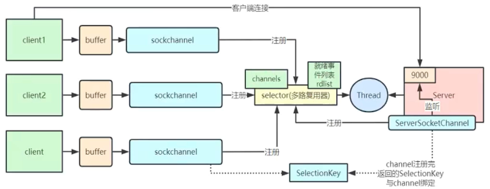
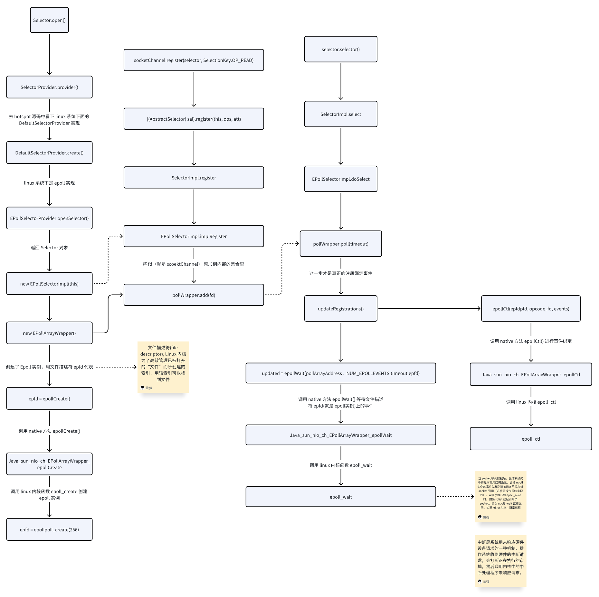
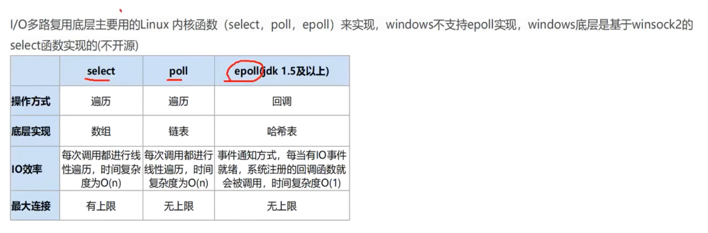

# NIO

[点击查看 NIO 的源码分析](https://www.bilibili.com/video/BV1QD5Nz9EXB?spm_id_from=333.788.player.switch&vd_source=d044e5cf4ad97cd97410607c3e1eb064&p=4)

通过追溯`Selector.open()`方法的调用栈，可以发现 Selector 底层创建了一个`epoll`实例（Linux 平台），并且通过`epoll_ctl`注册了监听的文件描述符和事件类型。

`epoll_create`：创建一个 epoll 实例，返回一个文件描述符。
`epoll_ctl`：向 epoll 实例注册、修改或删除监听的文件描述符和事件类型。
`epoll_wait`：等待事件的发生，并返回就绪的文件描述符列表。

epoll 实例是操作系统内核中的一个数据结构，它维护了一个监听的文件描述符集合。当我们通过`epoll_ctl`注册一个文件描述符时，实际上是将该文件描述符添加到 epoll 实例的监听集合中，并指定我们感兴趣的事件类型（如可读、可写等）。

当客户端连接到服务器某个端口时，硬件发起中断请求（让操作系统停止当前正在运行的进程），然后操作系统会将此连接的事件放入放入`rdlist`（就绪队列）中，表示该文件描述符已经就绪，可以进行读写操作。这时，程序进程会被唤醒，调用`epoll_wait`函数，发现`rdlist`中有新的事件，就会处理这些事件，如果没有事件，就会继续阻塞等待。

面试题：select、poll、epoll 有什么区别？

我们常说 redis 是单线程的（`只是处理命令的逻辑是单线程的，多线程是在处理网络 I/O`），但是 redis 能够支持高并发连接（**每秒数十万的请求**），这就是因为 redis 使用了`epoll`这种高效的 I/O 多路复用技术。

