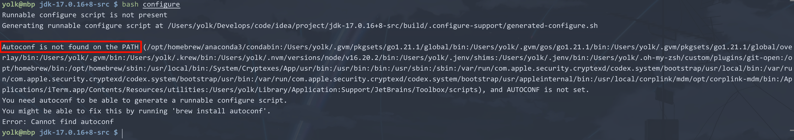
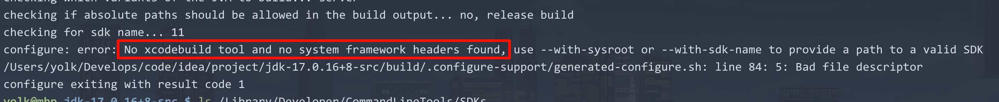
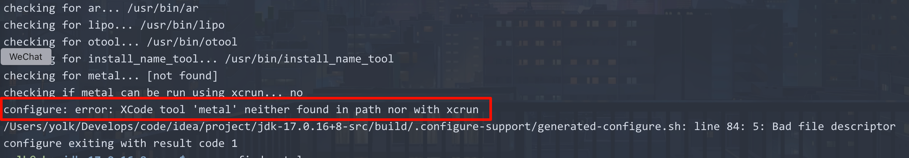
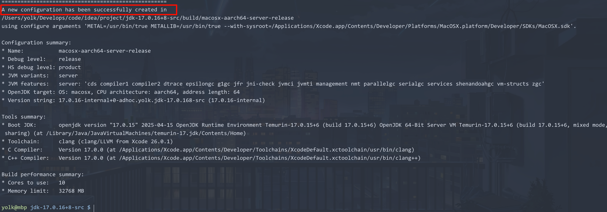
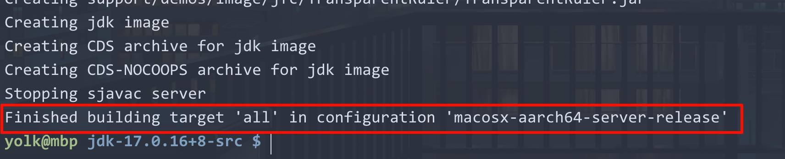
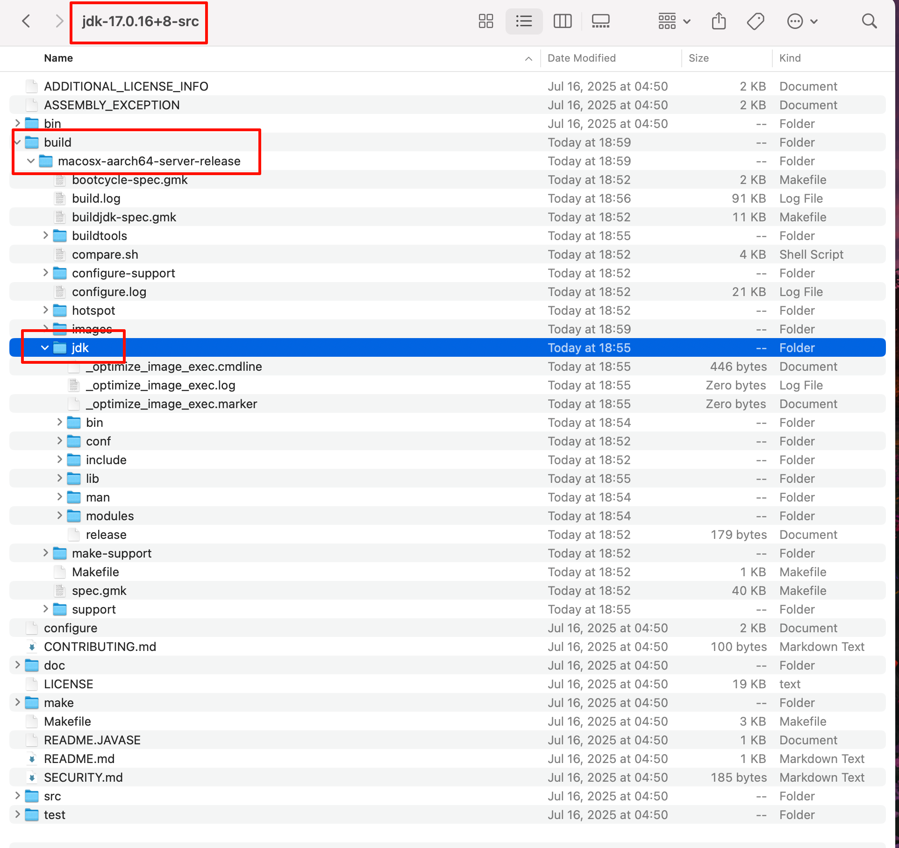
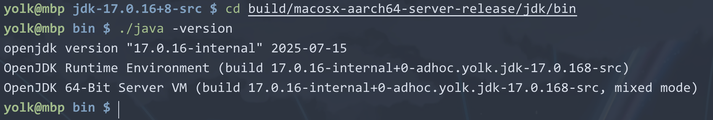
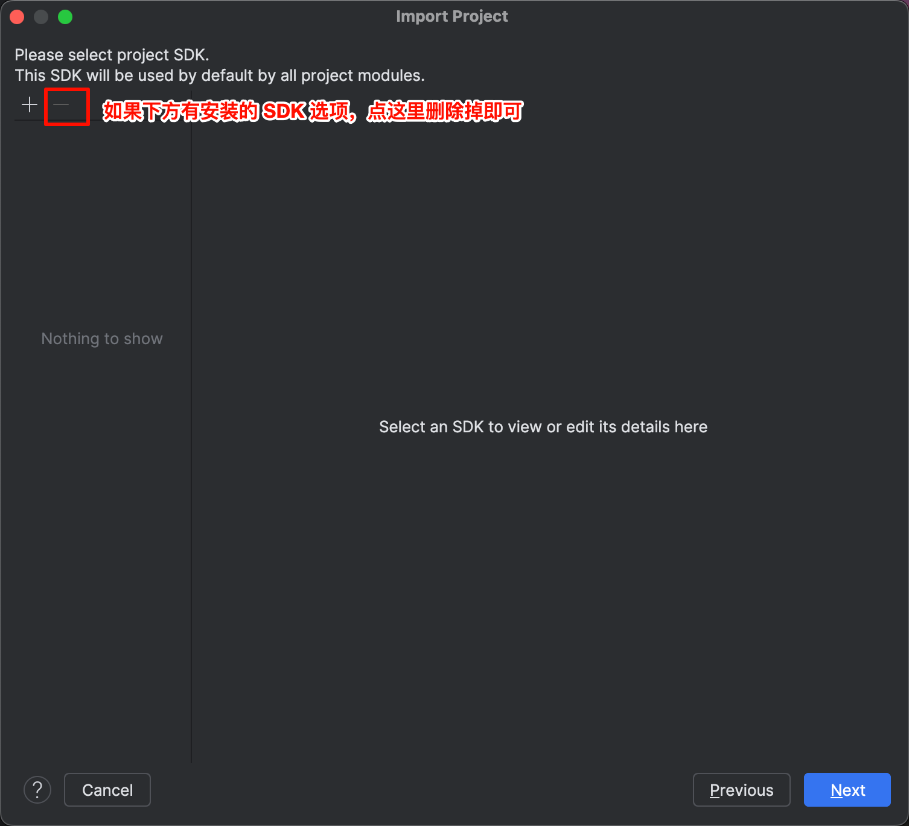
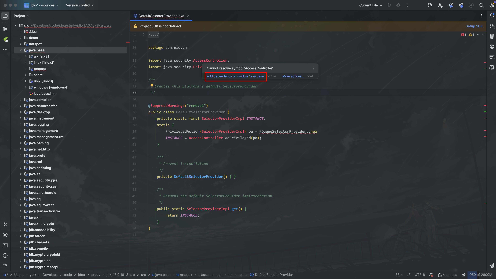

# 编译 JDK

我们做 Java 开发，第一件事就是要安装 JDK，因为它包含了编译和运行 Java 程序所需的工具和库。下载的 JDK 是由源码编译成可执行的二进制文件，那么我们也可以对源码进行修改，然后编译成我们自己的 JDK。说干就干。

## 1. 获取 JDK 源码

[OpenJDK](https://openjdk.org/) 是 Java 官方开源版本，另外各大厂商和社区基于开源的代码进行二次开发，形成了很多**下游发行版**，比如：`Azul Zulu`、`Amazon Corretto`、`Eclipse Temurin`等。

其中，`Eclipse Temurin`是由`Eclipse 基金会`下的`Adoptium`社区维护的开源 JDK 发行版，它完全免费，提供不输于商业 JDK 的性能和稳定性，被业界广泛认可与采用，我们这里就使用它的源码进行编译。[官方网站](https://adoptium.net/zh-CN/)


## 2. 编译 JDK

假如想编译`JDK 8`，那本机必须最起码得有一个`JDK 7`或者更新一点的版本（Boot JDK）；你想编译`JDK 11`，那就要求本机必须装有`JDK 10`或者`11`。

我现在下载的是`JDK 17`的源码包，并且我们本地也安装了`JDK 17`，所以可以直接编译`JDK 17`。

下载后解压，进入解压目录，执行以下命令：

```bash
bash configure
```

这条命令是用来检查你的系统环境，生成适合本机编译的 Makefile 和编译选项。可能会报错，提示缺少依赖项：`autoconf`、`make`、`gcc`等，按照提示安装缺少的依赖项：



```bash
brew install autoconf
```

再次执行`bash configure`命令，可能还会提示如下错误：



这是因为我当前的系统是`MacOS`，而在`MacOS`上编译 JDK 需要 Apple 的 SDK（头文件 + 系统框架）与`xcodebuild`工具，这就需要安装`Xcode`，可以从`App Store`下载安装：


注意：可能已经安装了`Xcode Command Line Tools`（轻量版），这也是不行的，必须安装完整的`Xcode`。

安装完成后，“激活”安装的`Xcode`，执行以下命令：

```bash
# 接受 Xcode 许可协议，执行后需要回车一次和输入`agree`
sudo xcodebuild -license
# 告诉系统当前要使用哪个 Xcode（开发环境）
sudo xcode-select --switch /Applications/Xcode.app/Contents/Developer

# 验证命令
xcodebuild -version

# 输出示例
Xcode 26.0.1
Build version 17A400
```

再次执行`bash configure`命令，不过这次需要加上`--with-sysroot`参数，指定 Apple SDK 的路径：

```bashbash
bash configure --with-sysroot=$(xcrun --show-sdk-path)
```

又可能提示错误：



这是因为 JDK 内部的 Java 2D、OpenGL、Metal Pipeline 需要链接一些 Metal 头文件或工具，这里我们直接跳过，顺便加上`--disable-warnings-as-errors`参数，表示禁止把警告当作错误：

```bash
bash configure \
  METAL=/usr/bin/true \
  METALLIB=/usr/bin/true \
  --with-sysroot=$(xcrun --show-sdk-path) \
  --disable-warnings-as-errors
```

执行后，输出如下内容，则表示配置成功：



接下来，才是真正的编译，执行以下命令：

```bash
make all
```



编译后的 JDK 会生成在`build/macosx-x64-server-release/jdk`目录下：



这不就是我们平时下载的 JDK 目录结构嘛，我们可以进入`bin`目录，执行`java -version`命令，查看编译后的 JDK 版本：



## 3.IDEA 导入源码

打开IDEA，选择`File -> New -> Project from Existing Sources...`，选择源码目录，后面的步骤中会提示选择 SDK，也不要选择，把可选的 SDK 删除掉，点击`Next`即可：



目前就导入成功了，可以愉快地阅读和修改源码了，如果发现某些类有红色报错，可能是模块没有关联，鼠标悬浮上去，点击`Add Module Dependency`即可：

