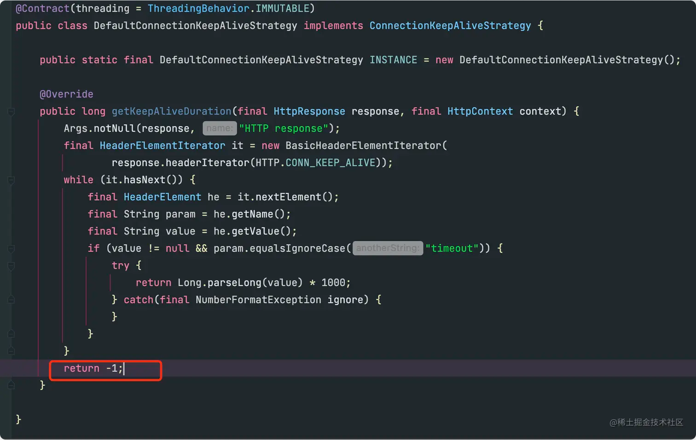

## 异常信息

```java
org.springframework.dao.DataAccessResourceFailureException: Connection reset by peer; nested exception is java.lang.RuntimeException: Connection reset by peer
  at org.springframework.data.elasticsearch.core.ElasticsearchExceptionTranslator.translateExceptionIfPossible(ElasticsearchExceptionTranslator.java:76)
  at org.springframework.data.elasticsearch.core.ElasticsearchRestTemplate.translateException(ElasticsearchRestTemplate.java:378)
......
Caused by: java.io.IOException: Connection reset by peer
  at org.elasticsearch.client.RestClient.extractAndWrapCause(RestClient.java:828)
  at org.elasticsearch.client.RestClient.performRequest(RestClient.java:248)
  at org.elasticsearch.client.RestClient.performRequest(RestClient.java:235)
  at org.elasticsearch.client.RestHighLevelClient.internalPerformRequest(RestHighLevelClient.java:1514)
......
Caused by: java.io.IOException: Connection reset by peer
  at sun.nio.ch.FileDispatcherImpl.read0(Native Method)
  at sun.nio.ch.SocketDispatcher.read(SocketDispatcher.java:39)
  at sun.nio.ch.IOUtil.readIntoNativeBuffer(IOUtil.java:223)
......
```

## 问题定位

`Caused by: Connection reset by peer`根据日志可以知道，socket 连接被中断，连接中断的原因有很多，比如：

服务端或者客户端异常。
客户端连接超时中断。

查看日志，这段时间内也没啥异常信息，服务端也没异常重启，也没出现流量陡量的情况。想到之前在mysql遇到过的问题，mysql的连接如果超过8个小时(默认的时间)不连接，服务端为了节约资源，会主动把长时间没连接的客户端给中断掉，按照这个思路去排查问题，果然发现原因如出一辙。导致这个问题的原因有两个：

客户端采用长连接的方式连接服务端。
长时间不连ES，服务端会关闭连接。

### 1.客户端采用长连接的方式连接服务端, 一直持有连接

「ES High Level Rest Client」客户端和服务端的连接采用的是长连接，查阅源码发现客户端创建了client 连接池，每个client持有一个http连接，并且开启http的keep-alive策略复用连接, 策略默认是 -1 ，也就是不过期。



### 2.长时间不连ES，服务端会关闭连接

服务器会有TCP的Keepalive 经过一段时间如果没有操作就会自动断开连接功能，而ES默认就是取服务器的时长配置linux查看超时时间默认为两小时：

```bash
# 查看超时时间（单位秒）
[root@VM ~]# cat /proc/sys/net/ipv4/tcp_keepalive_time
7200
```

也就是说如果客户端超过两个小时没有连接服务端，服务端会清除掉连接。

## 解决方案

修改客户端的keepalive时间，以单机的ES为例，代码如下：

```java
@Override
public RestHighLevelClient elasticsearchClient() {
    List<HttpHost> httpHostsList = new ArrayList<>();
    httpHostsList.add(new HttpHost(uris, Integer.parseInt(port)));
    HttpHost[] httpHostsArray = new HttpHost[httpHostsList.size()];
    httpHostsArray = httpHostsList.toArray(httpHostsArray);
    RestClientBuilder builder = RestClient.builder(httpHostsArray);
    builder.setHttpClientConfigCallback(httpClientBuilder -> httpClientBuilder.setKeepAliveStrategy((httpResponse, httpContext) -> 1000 * 60));
    return new RestHighLevelClient(builder);
}
```

