# WebSocket

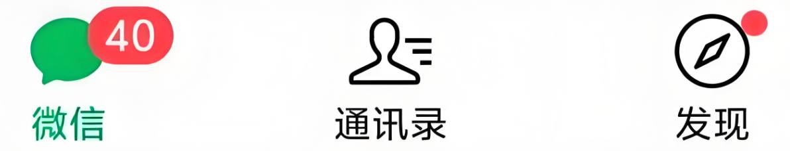

过一段时间才打开微信，发现有很多消息未读，好友将消息发送给自己时，它们不是直接发送到自己的设备上，而是先发送到微信的服务器，然后再由服务器发送到自己的设备，那么服务端主动向客户端发送消息的功能是如何实现的呢？

## 1.消息推送常见的方式

- **轮询**（Polling）：客户端定期向服务器发送请求，检查是否有新消息。这种方式简单但效率低下，因为即使没有新消息，客户端也会频繁发送请求，给服务器带来不必要的负担。
  
  <center>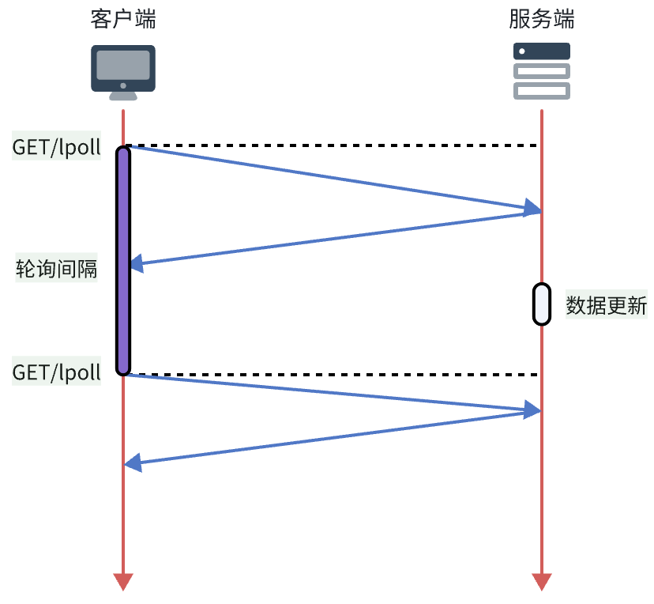</center>

- 长轮询（Long Polling）：客户端发送请求后，服务器**保持连接**直到有新消息或超时，然后服务器响应客户端。客户端接收到响应后，会立即发送新的请求以继续监听新消息。这样可以减少请求的频率，提高实时性，不过服务器需要维护更多的连接，增加了资源消耗。
  
  <center>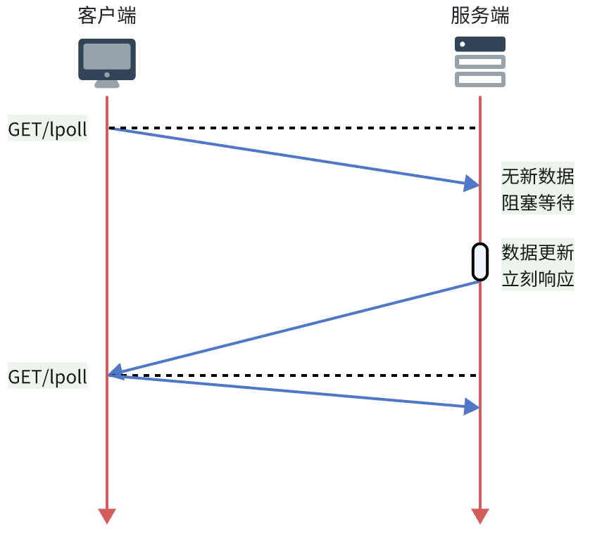</center>

  > `HTTP/1.0`默认是短连接，每次请求后连接都会关闭。
  >
  > `HTTP/1.1`引入了持久连接（Persistent Connection），允许在同一连接上发送多个请求和响应，从而减少了连接建立和关闭的开销，长轮询就是利用了这一特性。

- `SSE`（Server-Sent Events）：服务器和客户端建立一个单向的持久连接，服务器可以通过这个连接向客户端推送消息。SSE 基于`HTTP`协议，数据的格式不在是一次性的数据包，而是`text/event-stream`类型的数据流信息，易于实现，但只支持服务器向客户端发送数据，不能实现双向通信。
  
  <center>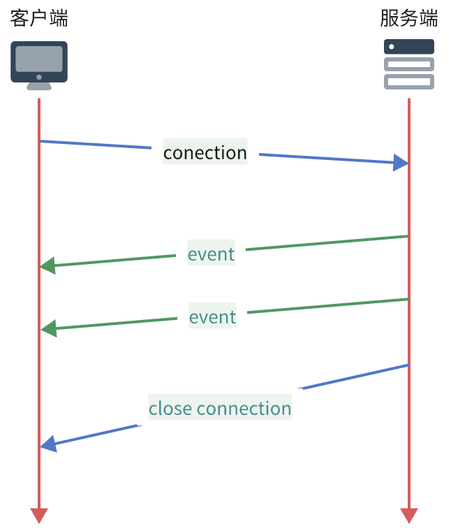</center>

以上三种方式都存在一定的局限性，无法满足实时性和双向通信的需求。为了解决这些问题，`WebSocket`协议应运而生。

## 2.概述

WebSocket 是一种`基于 TCP 的全双工通信`协议，能够在客户端和服务器之间建立持久连接。该协议由 IETF 于 2011 年发布为 RFC 6455 标准，广泛应用于在线游戏、聊天应用、实时数据流等需要实时交互的场景中。

 > - **全双工通信**（Full Duplex）：指通信双方可以同时发送和接收数据，就像电话一样，双方可以同时说话和听对方说话。
 > 
 > - **半双工通信**（Half Duplex）：指通信双方不能同时发送和接收数据，就像对讲机一样，必须轮流说话和听对方说话。
 > 
 > - **单工通信**（Simplex）：指通信双方只能单向发送和接收数据，就像广播一样，只有发送方可以发送信息，接收方只能被动接收。

## 3.工作原理

如何进行 WebSocket 通信呢？

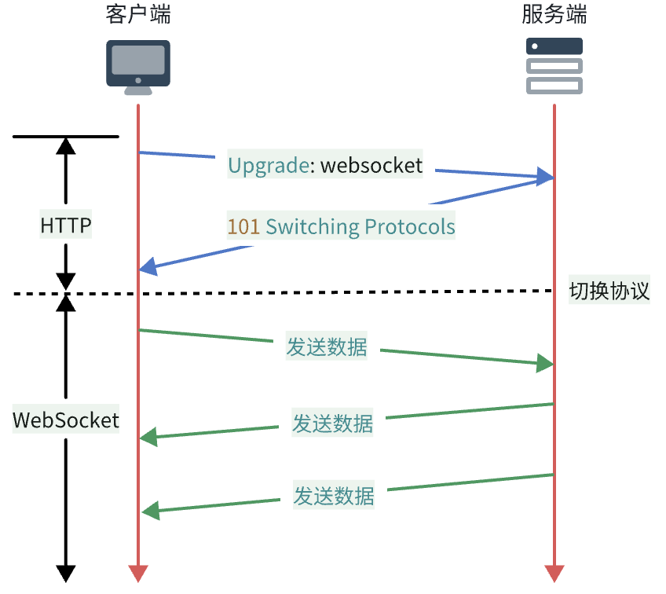

WebSocket 通信分为两个阶段：

1. **握手阶段**（handshake）：客户端通过发送一个特殊的 HTTP 请求来发起 WebSocket 连接请求，服务器收到请求后，如果支持 WebSocket 协议，会返回一个特殊的 HTTP 响应，表示同意建立 WebSocket 连接。握手完成后，HTTP 连接升级为 WebSocket 连接。
   
   ::: code-group 

    ```http [请求示例]
    GET /chat HTTP/1.1
    Host: example.com:8080
    # 请求升级到 WebSocket 协议
    Upgrade: websocket
    # 表示该请求要升级协议
    Connection: Upgrade
    # 客户端随机生成的 Base64 编码字符串，用于安全验证
    Sec-WebSocket-Key: x3JJHMbDL1EzLkh9GBhXDw==
    # WebSocket 协议版本，目前通常为 13
    Sec-WebSocket-Version: 13
    Origin: http://example.com
    ```

    ```http [响应示例]
    # 服务器同意升级到 WebSocket 协议
    HTTP/1.1 101 Switching Protocols
    # 表示协议已切换
    Upgrade: websocket
    # 保持一致，表示连接升级
    Connection: Upgrade
    # 服务器根据客户端的 Sec-WebSocket-Key 生成的签名，用于校验合法性
    Sec-WebSocket-Accept: fFBooB7FAkLlXgRSz0BT3v4hq5s=
    ```

    :::

2. **数据传输阶段**（data transfer）：连接建立后，客户端和服务器可以通过这个连接进行**双向**的数据传输，数据以**帧**（Frame）的形式发送，可以是文本帧或二进制帧。
   
   > **帧**是 WebSocket 协议中传输数据的**基本单位**，每个帧包含一个**头部**和一个**负载**（Payload）。头部包含控制信息，如帧的类型、长度等，负载则包含实际传输的数据。
   > 
   > 比如：客户端发送了一条消息，WebSocket 会将这条消息创建一个帧进行传输给服务器，服务器收到后再将其解析出来。
   > 
   > 如果**消息较大**，WebSocket 还可以将其**拆分成多个帧**进行传输，那么服务器收到后再将这些帧**重新组装**成完整的消息。

另外需要注意的是：

- Websocket 使用`ws://`或`wss://`（加密的 WebSocket）作为 URL 协议头，类似于 HTTP 的`http://`和`https://`。
- WebSocket 和 HTTP 一样，默认使用`80`端口，如果是加密连接，则使用`443`端口。

## 4.在 JS 中使用 WebSocket

很多编程语言和开发框架都提供了对 WebSocket 的支持，因为后文会实现一个**网页版在线聊天室**的应用，会用到 JavaScript 和 Java 语言，所以这里主要介绍这两种语言如何使用 WebSocket。

对于 Web 端，可以使用浏览器内置的 WebSocket API 来创建和管理 WebSocket 连接，但是浏览器为了安全和简化开发，对底层协议做了封装，有些偏底层的功能无法直接使用，如果需要使用的话，可以使用第三方库（`Socket.IO、SockJS`等）来实现，下文也只是介绍内置的 WebSocket API 的基本用法。

### 4.1.创建 WebSocket 实例
   
```javascript
// `/socket` 是服务器端 WebSocket 监听的路径，可以根据实际情况进行修改
const ws = new WebSocket('ws://example.com/socket');
// 加密的 WebSocket 连接
const wss = new WebSocket('wss://example.com/socket');
```

### 4.2.WebSocket 事件处理

<table>
<thead>
    <tr>
    <th>事件</th><th>事件处理程序</th><th>描述</th>
    </tr>
</thead>
<tbody>
    <tr><td><code>open</code></td><td><code>ws.onopen</code></td><td>连接建立时触发</td></tr>
    <tr><td><code>message</code></td><td><code>ws.onmessage</code></td><td>客户端接收到服务端发送的数据时触发</td></tr>
    <tr><td><code>close</code></td><td><code>ws.onclose</code></td><td>连接关闭时触发</td></tr>
    <tr><td><code>error</code></td><td><code>ws.onerror</code></td><td>发生错误时触发，比如连接失败</td></tr>
    <tr><td colspan="3">ps: <code>ws</code> 是创建的 WebSocket 实例名称</td></tr>
</tbody>
</table>

代码示例：
   
```javascript
// 连接建立时触发
ws.onopen = function(event) {
    console.log('WebSocket connection opened:', event);
};

// 接收到消息时触发
ws.onmessage = function(event) {
    console.log('Message received from server:', event.data);
};

// 连接关闭时触发
ws.onclose = function(event) {
    console.log('WebSocket connection closed:', event);
};

// 发生错误时触发
ws.onerror = function(error) {
    console.error('WebSocket error:', error);
};
```

### 4.3.发送和接收消息

```javascript
// 发送完整性消息到服务器
ws.send('Hello, Server!');

// 发送分段消息到服务器


// 接收消息时在 onmessage 事件处理程序中处理
ws.onmessage = function(event) {
    console.log('Message from server:', event.data);
};
```

## 5.在 Java 中使用 WebSocket

`JSR 356`是 Java 官方定义的 WebSocket API 规范，提供了一套标准的接口和注解，用于在 Java 应用程序中创建和管理 WebSocket 连接。

在 JSR 356 规范中，主要有以下几个核心概念：

- `Endpoint`
  - Java WebSocket 应用由一组`Endpoint`组成，每个`Endpoint`定义了一个 WebSocket 端点，负责处理来自客户端的连接，并在此过程中管理会话生命周期与消息交互。
  - Endpoint 实例在 WebSocket **握手**（handshake）时被**创建**，在连接关闭时被**销毁**。
  - 注意：Endpoint 是**多实例**的，每次有新的客户端连接时，都会创建一个新的 Endpoint 实例来处理该连接。
- `Session`
  - 表示客户端与服务端之间的一个 WebSocket 连接会话，负责管理连接的状态和属性。
  - 每个`Session`都有一个唯一的标识符，可以通过它来区分不同的连接。
  - 不难发现 Session 实例个数 = Endpoint 实例个数，也就是说`每个 Endpoint 实例都对应一个 Session 实例`。虽然是这样，但它们的含义是不同的，不要混淆。
- `MessageHandler`
  - 用于处理接收到的消息，可以是文本消息或二进制消息。它分为两种类型：
    - `Whole`：一次性接收完整消息。
    - `Partial`：分段接收消息。在前文介绍 WebSocket [工作原理](./#_3-工作原理)中提到过当消息较大时，可以将其拆分成**多个帧**进行传输，那么在接收消息时就可以使用`Partial`类型。
- `RemoteEndpoint`
  - 用于发送消息到客户端。它也分为两种类型：
    - `Basic`：提供基本的消息发送功能。
    - `Async`：提供异步消息发送功能。

### 5.1.引入依赖 

- 如果是运行在`Java EE`容器（比如 Tomcat）的项目，容器基本都实现了 JSR 356 规范，那么引入 API 依赖即可：
  
  ```xml
  <dependency>
    <groupId>jakarta.websocket</groupId>
    <artifactId>jakarta.websocket-api</artifactId>
    <version>2.1.0</version>
    <scope>provided</scope>
  </dependency>
  ```
  
  > **注意：**
  > 1. Tomcat 是从 `7.0.5`版本开始支持 JSR 356 规范。
  > 2. `jakarta` 是 Java EE 规范的最新命名空间，从 Java EE 9 开始，所有相关的包名都从`javax.*`更改为`jakarta.*`，所以如果使用的是较早版本的 Java EE 规范（如 Java EE 8 及更早版本），则需要使用`javax.websocket`包。

- 如果是`Spring Boot`项目，由于它内嵌了 Tomcat/Jetty/Undertow 容器，所以同样支持 JSR 356 规范，那么引入 API 依赖即可：
  
  ```xml
  <dependency>
    <groupId>org.springframework.boot</groupId>
    <artifactId>spring-boot-starter-websocket</artifactId>
   </dependency>
  ```
  
  > **注意：**Spring 框架对 WebSocket 也有自己的支持方式，可以参考 [Spring 集成 WebSocket](/programming/java/spring-websocket/)。

后文是以在`Spring Boot 项目`中使用 JSR 356 规范实现 WebSocket 功能，而非 Spring 自身对 WebSocket 支持的方式。

### 5.2.定义端点
   
在`jakarta.websocket.Endpoint`抽象类中明确定义了与其生命周期相关的方法，规范实现者在生命周期内各个阶段可以执行特定的逻辑，它有如下方法：

<table>
<thead>
    <tr>
    <th>方法</th><th>描述</th><th>对应的注解</th>
    </tr>
</thead>
<tbody>
    <tr><td><code>onOpen(Session session, EndpointConfig config)</code></td><td>当开启一个新的会话时调用，该方法时客户端与服务端握手成功后调用的方法</td><td><code>@OnOpen</code></td></tr>
    <tr><td><code>onClose(Session session, CloseReason closeReason)</code></td><td>当会话关闭时调用</td><td><code>@OnClose</code></td></tr>
    <tr><td><code>onError(Session session, Throwable throwable)</code></td><td>当连接过程中发生异常时调用</td><td><code>@OnError</code></td></tr>
</tbody>
</table>

那么实现方式有两种：
    
- 编程式：通过继承`Endpoint`类并重写其方法来创建端点。
  
  另外还需要创建`ServerEndpointConfig`类的实例来配置此端点的路径映射，如果有多个端点，可以创建多个此类配置实例。

- 注解式：使用`@ServerEndpoint`注解直接在类上定义端点。
  
  这种方式，不需要额外创建`ServerEndpointConfig`配置类，但是必须将此类交给 Spring 容器管理（比如添加`@Component`注解），否则无法被扫描到。

  > `@Component`修饰的类默认是单例的，而 WebSocket 端点又是多实例的，看起来有些矛盾，实际没有影响，因为 Spring 是在容器内扫描被`@ServerEndpoint`注解修饰的 Bean，然后交给 WebSocket 容器进行注册的，所以需要使用`@Component`将其交给 Spring 容器管理。

不管使用哪种方式，都需要添加一个`ServerEndpointExporter`类型的 Bean，它用于扫描所有端点，并在 WebSocket 容器内进行注册：

```java
/**
 * ServerEndpointExporter 用于扫描并注册所有的 WebSocket 端点
 * 不管哪种方式定义端点，都需要此 Bean 来启用 WebSocket 支持
 */
@Bean
public ServerEndpointExporter serverEndpointExporter() {
    return new ServerEndpointExporter();
}
```

<center>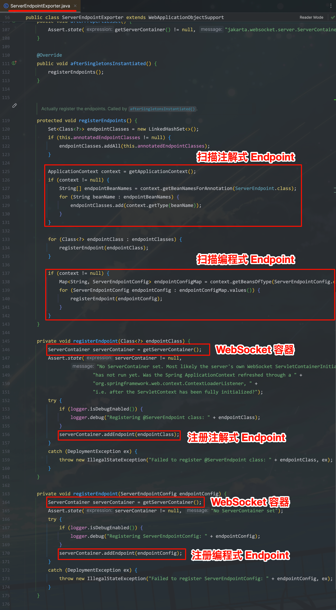</center>

#### 使用示例

:::code-group

```java [编程式]
import jakarta.websocket.CloseReason;
import jakarta.websocket.Endpoint;
import jakarta.websocket.EndpointConfig;
import jakarta.websocket.Session;

import java.util.Collections;
import java.util.HashSet;
import java.util.Set;

/**
 * 用于聊天的 WebSocket 端点
 * 通过继承 Endpoint 类来处理 WebSocket 连接的生命周期事件
 *
 * @author yolk
 * @since 2024/6/18 23:15
 */
public class ChatEndpoint1 extends Endpoint {

    /**
     * 存储所有活跃的会话，因为 Endpoint 是多实例的，所以需要使用静态变量以供所有的实例进行使用，
     * 这样就会有线程安全问题，由于 Session 的添加和移除相对较少，所以使用 CopyOnWriteArraySet 来保证线程安全
     */
    private static final Set<Session> SESSIONS = new CopyOnWriteArraySet<>();

    @Override
    public void onOpen(Session session, EndpointConfig endpointConfig) {
        // 存储新会话
        SESSIONS.add(session);
        System.out.println("【chat1】新客户端连接`: " + session.getId());
    }

    @Override
    public void onClose(Session session, CloseReason closeReason) {
        // 移除关闭的会话
        SESSIONS.remove(session);
        System.out.println("【chat1】客户端断开连接: " + session.getId() + ", 原因: " + closeReason.getReasonPhrase());
    }

    @Override
    public void onError(Session session, Throwable throwable) {
        System.err.println("【chat1】WebSocket 错误: " + session.getId());
        throwable.printStackTrace();
    }

}
```

```java [注解式]
import jakarta.websocket.CloseReason;
import jakarta.websocket.EndpointConfig;
import jakarta.websocket.OnClose;
import jakarta.websocket.OnError;
import jakarta.websocket.OnOpen;
import jakarta.websocket.Session;
import jakarta.websocket.server.ServerEndpoint;
import org.springframework.stereotype.Component;

import java.util.Collections;
import java.util.HashSet;
import java.util.Set;

/**
 * 用于聊天的 WebSocket 端点
 * 通过注解方式来处理 WebSocket 连接的生命周期事件
 *
 * @author yolk
 * @since 2024/6/18 23:15
 */
@Component // 必须将其交给 Spring 容器管理
@ServerEndpoint("/chat2")
public class ChatEndpoint2 {

    private static final Set<Session> SESSIONS = new CopyOnWriteArraySet<>();

    @OnOpen
    public void onOpen(Session session, EndpointConfig endpointConfig) {
        SESSIONS.add(session);
        System.out.println("【chat2】新客户端连接: " + session.getId());
    }

    @OnClose
    public void onClose(Session session, CloseReason closeReason) {
        SESSIONS.remove(session);
        System.out.println("【chat2】客户端断开连接: " + session.getId() + ", 原因: " + closeReason.getReasonPhrase());
    }

    @OnError
    public void onError(Session session, Throwable throwable) {
        System.err.println("【chat2】WebSocket 错误: " + session.getId());
        throwable.printStackTrace();
    }

}
```

```java [配置类]
import jakarta.websocket.server.ServerEndpointConfig;
import org.springframework.context.annotation.Bean;
import org.springframework.context.annotation.Configuration;
import org.springframework.web.socket.server.standard.ServerEndpointExporter;

@Configuration
public class WebSocketConfig {

    /**
     * ServerEndpointExporter 用于扫描并注册所有的 WebSocket 端点
     * 不管哪种方式定义端点，都需要此 Bean 来启用 WebSocket 支持
     */
    @Bean
    public ServerEndpointExporter serverEndpointExporter() {
        return new ServerEndpointExporter();
    }

    /**
     * 为 ChatEndpoint1 创建 ServerEndpointConfig 配置，进行路径映射
     * 如果有多个端点，可以创建多个此类配置实例
     * <p>
     * 注意：如果使用注解方式定义端点，则不需要此配置
     */
    @Bean
    public ServerEndpointConfig myEndpointConfig() {
        // 配置 ChatEndpoint 负责处理 /chat1 路径的 WebSocket 连接
        return ServerEndpointConfig.Builder
                .create(ChatEndpoint1.class, "/chat1")
                .build();
    }

}
```

:::

#### 测试

现在启动项目，打开浏览器控制台，执行以下代码：

```javascript
const ws1 = new WebSocket('ws://localhost:8080/chat1');
ws1.onopen = function() {
    console.log('Connected to /chat1');
};

const ws2 = new WebSocket('ws://localhost:8080/chat2');
ws2.onopen = function() {
    console.log('Connected to /chat2');
};
```

返回结果如下：

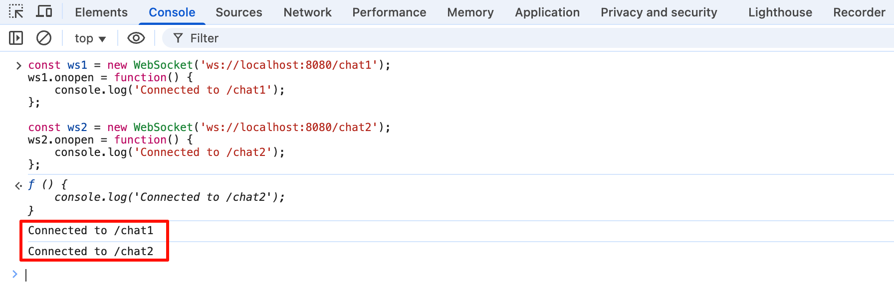

查看后端控制台输出：

```text
【chat1】新客户端连接: 0
【chat2】新客户端连接: 1
```

### 5.3.接收消息

同样也是分为两种方式：

- 编程式：在`Endpoint`的`onOpen()`方法中通过给`Session`添加`MessageHandler`消息处理器来接收的消息。
  
  MessageHandler 有`Whole`和`Partial`两种类型，分别用于接收完整消息和分段消息，并且使用了泛型来指定接收的消息类型。

- 注解式：在`Endpoint`中使用`@OnMessage`注解指定接收消息的方法，并通过方法参数来指定接收的消息类型，同样也支持接收完整消息和分段消息。

#### 注意

- **每种消息类型只能有一个处理器**，即使是`Whole`和`Partial`一样一个也不行，如果需要处理多种类型的消息，可以添加多个不同类型的消息处理器。
- 当只注册了`Whole`类型的处理器时，客户端发送的却是**分段**消息，`WebSocket 会自动进行组装`，以确保消息能够被正确处理，`Partial`同理。

#### 使用示例

::: code-group

```java [编程式]
@Override
public void onOpen(Session session, EndpointConfig endpointConfig) {
    SESSIONS.add(session);

    // 添加接收完整文本类型的消息处理器
    session.addMessageHandler(new MessageHandler.Whole<String>() {
        @Override
        public void onMessage(String message) {
            System.out.println("【chat1】收到消息: " + message);
        }
    });
    
    /*
    不能再添加 String 类型的处理器，否则会抛异常，即使是 Partial 也不行，比如：
    session.addMessageHandler(new MessageHandler.Whole<String>() {});
    session.addMessageHandler(new MessageHandler.Partial<String>() {});
     */

    // 添加接收分段二进制类型的消息处理器
    session.addMessageHandler(new MessageHandler.Partial<ByteBuffer>() {
        @Override
        public void onMessage(ByteBuffer byteBuffer, boolean isLast) {
            // isLast 表示是否为最后一部分
            System.out.println("【chat1】收到二进制消息，长度: " + byteBuffer.remaining() + ", isLast: " + isLast);
        }
    });

    System.out.println("【chat1】新客户端连接: " + session.getId());
}
```

```java [注解式]
/**
 * 添加完整接收文本类型的消息处理器
 *
 * @param message 消息内容
 * @param session 会话对象
 */
@OnMessage
public void onMessage(String message, Session session) {
    System.out.println("【chat2】收到消息: " + message);
}

/**
 * 添加分段接收二进制消息的处理器
 *
 * @param partialMessage 分段二进制消息内容
 * @param last           是否为最后一部分
 * @param session        会话对象
 */
@OnMessage
public void onPartialBinary(ByteBuffer partialMessage, boolean last, Session session) {
    System.out.println("【chat2】收到分段二进制消息，长度: " + partialMessage.remaining() + ", isLast: " + last);
}
```

:::

#### 测试

在浏览器控制台，执行以下代码：

```javascript
const ws1 = new WebSocket('ws://localhost:8080/chat1');
// 发送文本消息
ws1.send('Hello from chat1');
/**
发送二进制消息，由于浏览器不支持分段发送，所以也是一次性发送完整消息。
注意：服务端对二进制类型的消息是分段接收的，但是依然可以接收到。
 */
const binaryData1 = new Uint8Array([1, 2, 3, 4, 5]);
ws1.send(binaryData1);

const ws2 = new WebSocket('ws://localhost:8080/chat2');
// 发送文本消息
ws2.send('Hello from chat2');
// 发送二进制消息
const binaryData2 = new Uint8Array([6, 7, 8]);
ws2.send(binaryData2);
```

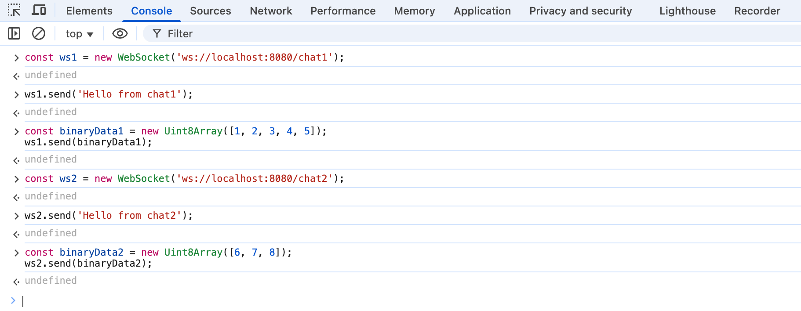

查看后端控制台输出：

```text
【chat1】新客户端连接: 0
【chat1】收到消息: Hello from chat1
【chat1】收到二进制消息，长度: 5, isLast: true
【chat2】新客户端连接: 1
【chat2】收到消息: Hello from chat2
【chat2】收到分段二进制消息，长度: 3, isLast: true
```

### 5.4.发送消息

发送消息由`RemoteEndpoint`接口负责，它有两个子接口：

- `Basic`：提供基本的消息发送功能，适合简单的文本或二进制消息发送。
  
  通过`Session.getBasicRemote()`方法获取其实例。

- `Async`：提供异步消息发送功能，适合需要高并发或大规模消息发送的场景。
  
  通过`Session.getAsyncRemote()`方法获取其示例。

由于前面定义`Enpoint`时已经存储了所有活跃的`Session`，这里实现消息广播功能，即将某个客户端发送的消息广播给所有客户端，代码如下：

::: code-group

```java [编程式]
@Override
public void onOpen(Session session, EndpointConfig endpointConfig) {
    SESSIONS.add(session);

    // 当接收到文本消息时，将消息广播给所有连接的客户端
    session.addMessageHandler(new MessageHandler.Whole<String>() {
        @Override
        public void onMessage(String message) {
            System.out.println("【chat1】收到消息: " + message + " 来自客户端: " + session.getId());
            // 遍历所有会话，发送消息
            for (Session item : SESSIONS) {
                if (item.isOpen()) {
                    // 确保连接是打开的
                    try {
                        // 发送消息
                        item.getBasicRemote().sendText(message);
                    } catch (IOException e) {
                        throw new RuntimeException(e);
                    }
                }
            }
            System.out.println("【chat1】消息已广播");
        }
    });

    System.out.println("【chat1】新客户端连接: " + session.getId());
}
```

```java [注解式]
@OnMessage
public void onMessage(String message, Session session) {
    System.out.println("【chat2】收到消息: " + message + " 来自客户端: " + session.getId());
    for (Session item : SESSIONS) {
        if (item.isOpen()) {
            try {
                item.getBasicRemote().sendText(message);
            } catch (IOException e) {
                throw new RuntimeException(e);
            }
        }
    }
    System.out.println("【chat2】消息已广播");
}
```

:::

#### 测试

注解式和编程式，我们选择其中一个进行测试，在浏览器控制台，执行以下代码：

```javascript
// 创建两个 WebSocket 连接，并设置消息接收处理函数
const ws1 = new WebSocket('ws://localhost:8080/chat1');
ws1.onmessage = function(event) {
    console.log('ws1 receive message from server:', event.data);
};
const ws2 = new WebSocket('ws://localhost:8080/chat1');
ws2.onmessage = function(event) {
    console.log('ws2 receive message from server:', event.data);
};


// ws1 发送消息，观察 ws2 是否能接收到
ws1.send('hello from ws1');
```

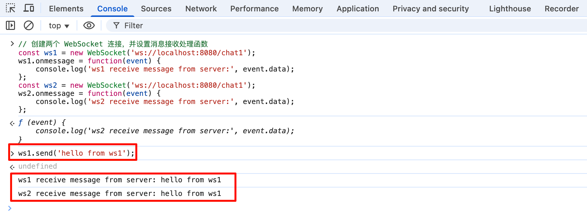

查看后端控制台输出：

```text
【chat1】新客户端连接: 0
【chat1】新客户端连接: 1
【chat1】收到消息: hello from ws1 来自客户端: 0
【chat1】消息已广播
```

## 6.实现在线聊天室

现在我们已经掌握了 WebSocket 的基本使用方法，接下来我们将实现一个简单的在线聊天室应用，允许多个用户连接到服务器并进行实时聊天，先看看效果：

::: code-group

```md:img [登录页面]
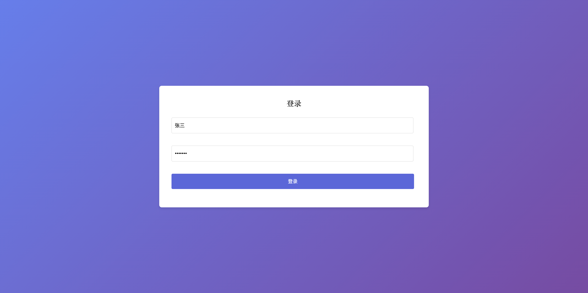
```

```md:img [张三上线]
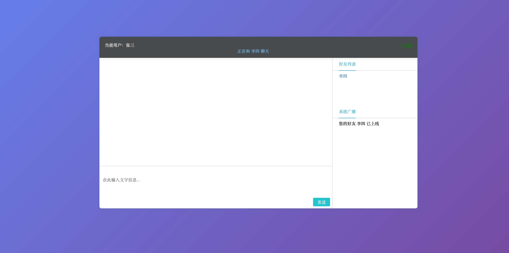
```

```md:img [李四上线]
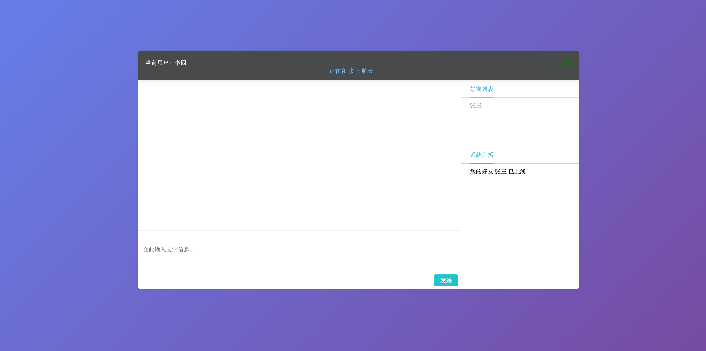
```

```md:img [张三给李四发送消息]
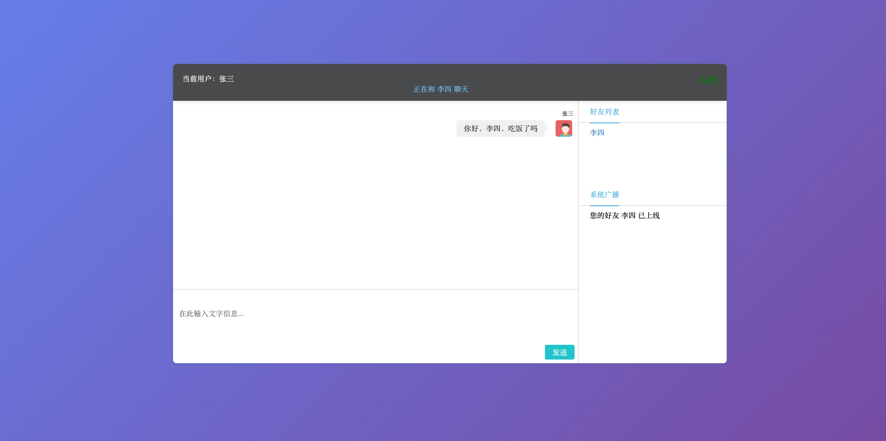
```

```md:img [李四收到并回复张三]
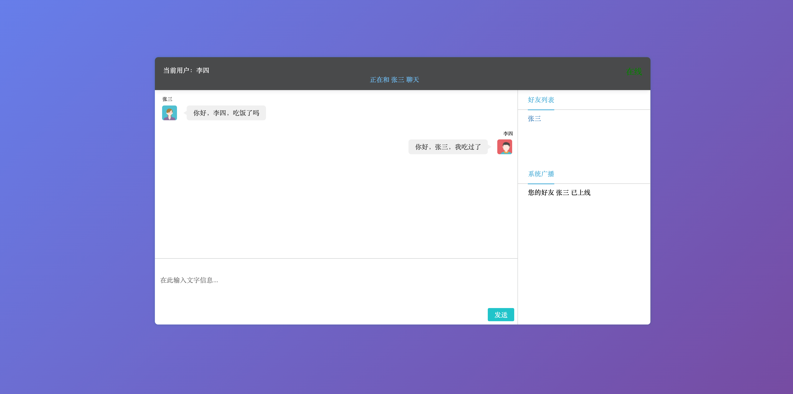
```

```md:img [张三收到回复]
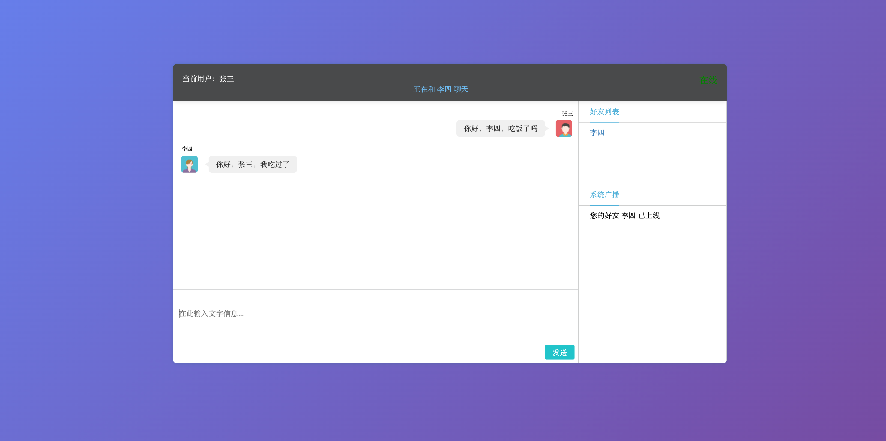
```

:::

现在分析下整个流程，画出时序图如下：

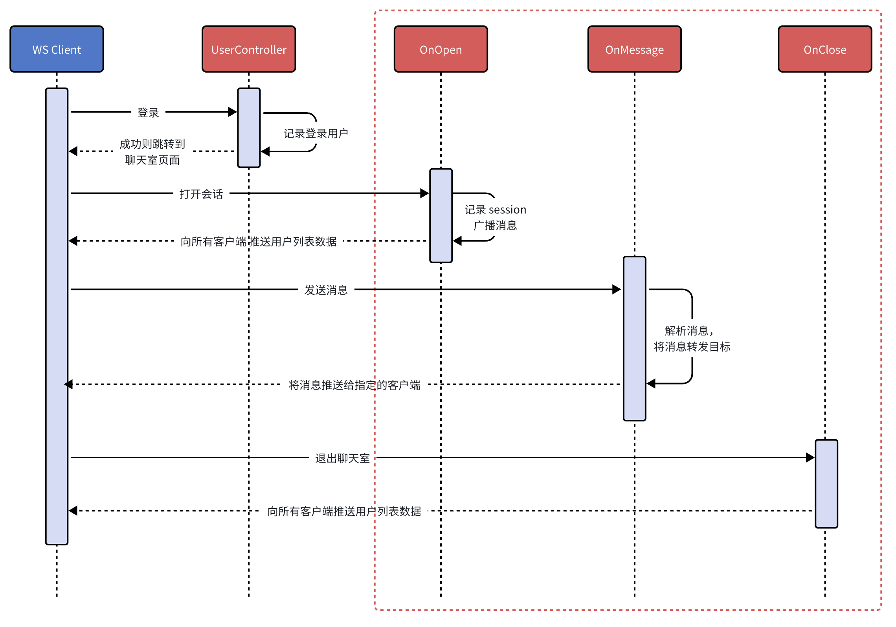

红色虚线框内，就是需要着重关注的使用 WebSocket 实现的功能，下面开始实现。

### 6.1.代码说明

#### 客户端代码

[点击下载](/attachments/online-chat-room.zip)

下载后解压，执行命令：

```bash
npm install
npm run dev
```

然后打开浏览器访问`http://localhost:5173`，即可看到在线聊天室的界面。后文将主要介绍`服务端的 WebSocket 实现`，客户端代码就不做介绍了，WebSocket 实现部分也就和前面介绍的差不多。

#### 服务端代码

[点击下载](/attachments/online-chat-server.zip)，使用的 Java 版本是`17`，打开后可以看到就只有几个类，代码都很简单，后文主要介绍`WebSocket`相关的实现。

### 6.1.定义消息格式

在前面的示例中，发送和接收的消息都是简单的字符串，在实际应用中，通常需要定义一个**消息格式**，以便携带更多的信息，比如发送者、接收者、消息内容等。

在这里我们使用`JSON`格式来表示消息，根据来源不同分为两种类型：

- 客户端 -> 服务器
  
  ```json
  {
    // 表示此消息发送给哪个用户
    "toUser": "李四",
    // 消息内容
    "content": "你好，李四！"
  }
  ```

- 服务器 -> 客户端，在当前业务中，服务端需要发送两种类型的消息：

  - 系统消息：用于通知用户上线、下线等信息
  
    ```json
    {
        // 标记此消息为系统消息
        "system": true,
        // 当前在线用户列表
        "content": ["张三", "李四"]
    }
    ```
 
  - 转发消息：用于将用户发送的消息转发给指定的接收者
  
    ```json
    {
        "system": false,
        // 表示此消息是来源于哪个用户
        "fromUser": "李四",
        "content": "你好，李四！"
    }
    ```

那么一条消息的完整 JSON 格式如下：

```json
{
    // 是否为系统消息，true 表示系统消息，false 表示转发消息
    "system": false,
    // 发送者用户名，仅在转发消息中使用
    "fromUser": "张三",
    // 接收者用户名，仅在客户端发送给服务器时使用
    "toUser": "李四",
    // 消息内容，字符串或者是数组
    "content": "你好，李四！"
}
```

### 6.2.引入 WebSocket 依赖

在`pom.xml`中引入`WebSocket`依赖

```xml
<dependency>
    <groupId>org.springframework.boot</groupId>
    <artifactId>spring-boot-starter-websocket</artifactId>
</dependency>
```

### 6.3.添加 WebSocket 配置

新建`config`包，并创建 WebSocket 配置类，定义一个`ServerEndpointExporter`Bean，用于扫描并注册所有的 WebSocket 端点。

```java
import org.springframework.context.annotation.Bean;
import org.springframework.context.annotation.Configuration;
import org.springframework.web.socket.server.standard.ServerEndpointExporter;

/**
 * WebSocket 配置类
 */
@Configuration
public class WebSocketConfig {

    /**
     * 用于扫描并注册所有 WebSocket 端点
     */
    @Bean
    public ServerEndpointExporter serverEndpointExporter() {
        return new ServerEndpointExporter();
    }

}
```

### 6.4.定义 WebSocket 端点

新建`websocket`包，定义`ChatEndpoint`端点，路径映射为`/chat`，这里使用注解的方式。
   
简单起见，`OnError`方法就不定义了，另外因为约定了消息是 JSON 格式的，所以接收的消息类型是`String`。

```java
import jakarta.websocket.CloseReason;
import jakarta.websocket.EndpointConfig;
import jakarta.websocket.OnClose;
import jakarta.websocket.OnMessage;
import jakarta.websocket.OnOpen;
import jakarta.websocket.Session;
import jakarta.websocket.server.ServerEndpoint;

/**
 * 聊天 WebSocket 端点
 *
 * @author yolk
 * @since 2025/10/20 03:09
 */
@Component
@ServerEndpoint("/chat")
public class ChatEndpoint {

    /**
     * 服务端需要主动发送消息给客户端，那么就需要知道每个用户对应的`Session`，需要维护一个`Map<String, Session>`。
     * 又因为 Endpoint 是多实例的，所以需要使用静态变量以供所有的实例进行使用，这样就会有线程安全问题，所以使用 ConcurrentHashMap 来保证线程安全。
     * key: username; value: session
     */
    private static final Map<String, Session> ONLINE_USERS = new ConcurrentHashMap<>();

    @OnOpen
    public void onOpen(Session session, EndpointConfig endpointConfig) {
    }

    @OnMessage
    public void onMessage(String message) {
    }

    @OnClose
    public void close(Session session, CloseReason closeReason) {

    }

}
```

### 6.5.WebSocket 如何获取 HttpSession

在`UserController`中，当用户登录成功后，会将用户名存储在`HttpSession`中，那么当客户端建立 WebSocket 连接时，如果想要知道此客户端是哪个用户，就需要获取到`HttpSession`，从而获取用户名。
   
这里介绍下`ServerEndpointConfig.Configurator`类，它可以用于配置 WebSocket 端点的自定义行为，可以通过重写其`modifyHandshake()`方法来修改握手请求和响应。由于 WebSocket 握手是基于 HTTP 的，所以获取到`HttpSession`。

在`config`包中新建`GetHttpSessionConfig`类，它继承自`ServerEndpointConfig.Configurator`，并重写`modifyHandshake()`方法，代码如下：

```java
import jakarta.servlet.http.HttpSession;
import jakarta.websocket.HandshakeResponse;
import jakarta.websocket.server.HandshakeRequest;
import jakarta.websocket.server.ServerEndpointConfig;

/**
 * 通过继承 ServerEndpointConfig.Configurator 类实现配置 WebSocket 端点的自定义行为
 * <p>
 * 这里主要修改握手过程，以便在 WebSocket 会话中访问 HTTP 会话
 *
 * @author yolk
 * @since 2025/10/20 14:43
 */
public class GetHttpSessionConfig extends ServerEndpointConfig.Configurator {

    /**
     * 修改握手过程
     *
     * @param sec      端点配置
     * @param request  握手请求
     * @param response 握手响应
     */
    @Override
    public void modifyHandshake(ServerEndpointConfig sec, HandshakeRequest request, HandshakeResponse response) {
        // 获取 HTTP 会话
        HttpSession session = (HttpSession) request.getHttpSession();
        // 将 http session 存储到 WebSocket 的用户属性中，以便后续使用
        sec.getUserProperties().put("HttpSession", session);

        super.modifyHandshake(sec, request, response);
    }
}
```

上述代码中，我们将`HttpSession`存储到了`ServerEndpointConfig`的用户属性中，这个属性专门是用来存储自定义数据的，后续可以在`onOpen(Session session, EndpointConfig endpointConfig)`方法的`EndpointConfig`参数中获取到。

我们还需要将这个配置类应用到`ChatEndpoint`端点中，修改`ChatEndpoint`类的`@ServerEndpoint`注解，代码如下：

```java
@Component
// configurator 属性指定当前端点使用的配置类，要求必须继承自 ServerEndpointConfig.Configurator
@ServerEndpoint(value = "/chat", configurator = GetHttpSessionConfig.class)
public class ChatEndpoint {
    ...
}
```

在前文介绍的`编程式`定义端点的方式中，也可以通过`ServerEndpointConfig.Builder`的`configurator()`方法来指定配置类，如下：

```java
@Bean
public ServerEndpointConfig myEndpointConfig() {
    return ServerEndpointConfig.Builder
            .create(ChatEndpoint1.class, "/chat1")
            .configurator(new GetHttpSessionConfig()) // 指定配置类
            .build();
}
```

### 6.6.实现`onOpen()`方法
   
```java
/**
 * 一个 Endpoint 实例对应一个客户端连接，所以可以将 HttpSession 作为成员变量存储，以便其他方法使用
 */
private HttpSession httpSession;

@OnOpen
public void onOpen(Session session, EndpointConfig endpointConfig) {
    // 1.获取 HttpSession 并赋值给成员变量，以便其他方法使用
    this.httpSession = (HttpSession) endpointConfig.getUserProperties().get("HttpSession");
    String username = (String) this.httpSession.getAttribute("username");

    // 2.将当前用户的 WebSocket 会话存储到在线用户集合中
    ONLINE_USERS.put(username, session);

    // 2.广播消息，需要将登陆的所有用户推送给所有的客户端
    Message message = Message.of(ONLINE_USERS.keySet());
    // 转成字符串
    String messageStr = JsonUtil.toJson(message);
    broadcastOnlineUsers(messageStr);
}

/**
 * 广播给所有客户端当前在线用户列表
    *
    * @param message 广播的消息内容（系统消息）
    */
private void broadcastOnlineUsers(String message) {
    // 广播给所有客户端
    for (Session session : ONLINE_USERS.values()) {
        try {
            // 发送消息
            session.getBasicRemote().sendText(message);
        } catch (IOException e) {
            // 记录日志，这里就简单打印堆栈信息
            e.printStackTrace();
        }
    }
}
```

### 6.7.实现`onClose()`方法
   
```java
@OnClose
public void close(Session session, CloseReason closeReason) {
    // 1.从在线用户集合中移除当前用户
    String username = (String) this.httpSession.getAttribute("username");
    ONLINE_USERS.remove(username);

    // 2.广播消息，将最新的在线用户列表推送给所有客户端
    Message message = Message.of(ONLINE_USERS.keySet());
    String messageStr = JsonUtil.toJson(message);
    broadcastOnlineUsers(messageStr);
}
```

### 6.8.实现`onMessage()`方法
   
```java
@OnMessage
public void onMessage(String message) {
    // 1.解析客户端发送的消息
    Message messageObj = JsonUtil.fromJsonNoThrow(message, Message.class);
    // 消息合格不合规则不做处理
    if (messageObj == null) {
        return;
    }

    // 2.获取接收消息的用户会话
    String toUser = messageObj.getToUser();
    Session session = ONLINE_USERS.get(toUser);

    // 3.如果接收用户在线，则发送消息
    if (session != null) {
        // 构建发送的消息
        String username = (String) this.httpSession.getAttribute("username");
        Message sendMessage = Message.of(username, toUser, messageObj.getContent());
        String sendMessageStr = JsonUtil.toJson(sendMessage);
        
        // 发送消息
        try {
            session.getBasicRemote().sendText(sendMessageStr);
        } catch (IOException e) {
            e.printStackTrace();
        }
    }
}
```

### 6.9.测试

1. 启动前后端项目。
2. 打开两个浏览器窗口，分别登录不同的用户。
3. 两个用户互相选择对方进行发送消息，观察是否能够正常接收。

## 7.总结

以上只是 WebSocket 入门级的内容，实际应用中可能还会涉及到更多的功能和细节，比如：

- STOMP企业级集成方案
- 集群环境部署和消息同步
- 心跳检测和断线重连机制
- JWT 安全认证
- 性能优化和监控方案
- 生产问题排查经验
- 完整的企业级项目案例

后续会陆续补充相关内容，敬请期待！💪